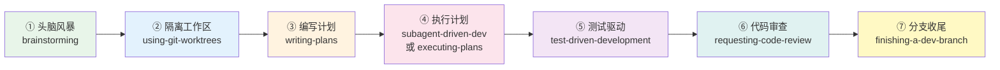
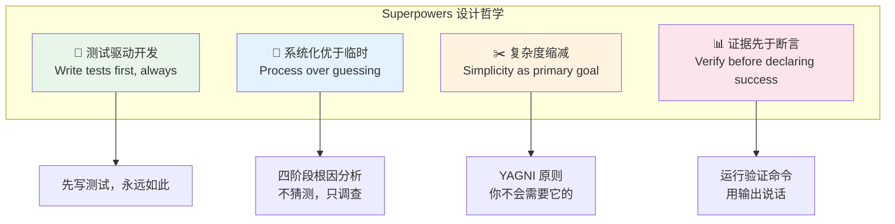
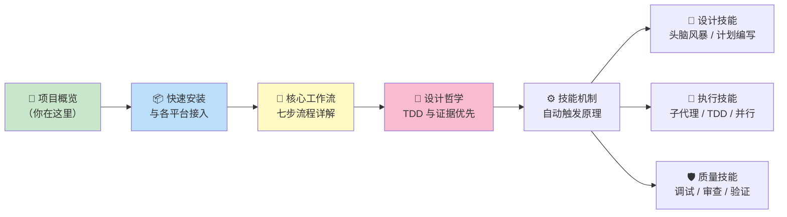

本页为你提供 **Superpowers** 项目的全局视角——它是什么、如何工作、为何如此设计。无论你是第一次接触 AI 辅助开发，还是希望理解这套方法论的底层逻辑，这里都是起点。

---

## 一句话定义

**Superpowers 是一套面向 AI 编码代理的完整软件开发方法论。** 它不是代码库、不是框架，而是一组**可组合的技能文件（Skills）**加上**会话启动时的引导注入**，让 AI 代理在帮你写代码时自动遵循经过验证的工程实践——而不是凭直觉蛮干。

> "Superpowers is a complete software development methodology for your coding agents, built on top of a set of composable skills and some initial instructions that make sure your agent uses them."
> — [README.md](README.md#L1-L3)

当前版本为 **v6.2.0**，采用 MIT 许可证，由 Jesse Vincent 和 [Prime Radiant](https://primeradiant.com) 团队维护。

Sources: [package.json](package.json#L1-L23), [.claude-plugin/plugin.json](.claude-plugin/plugin.json#L1-L21), [LICENSE](LICENSE#L1-L5)

---

## 它解决什么问题？

当你让 AI 编码代理（如 Claude Code、Cursor、Codex 等）帮你构建软件时，它们通常会**直接跳入写代码**的模式。这导致几个常见问题：

| 问题 | 表现 | Superpowers 的解法 |
|------|------|-------------------|
| **跳过设计** | 代理立刻开始编码，忽略隐含需求 | `brainstorming` 技能强制先做苏格拉底式设计对话 |
| **无测试编码** | 先写代码再补测试（或根本不写） | `test-driven-development` 技能执行 RED-GREEN-REFACTOR 铁律 |
| **上下文污染** | 长会话中代理丢失方向、重复工作 | `subagent-driven-development` 为每个任务分派全新子代理 |
| **虚假完成** | 代理声称"搞定了"但未验证 | `verification-before-completion` 要求证据先于断言 |
| **猜测式调试** | 遇到 bug 就随机尝试修复 | `systematic-debugging` 强制四阶段根因分析 |

核心洞察是：**技能不是散文——它们是塑造代理行为的代码。**

> "Skills are not prose — they are code that shapes agent behavior."
> — [CLAUDE.md](CLAUDE.md#L95-L96)

Sources: [README.md](README.md#L10-L20), [CLAUDE.md](CLAUDE.md#L95-L101)

---

## 核心架构：三层模型

Superpowers 能在 10+ 个不同平台上运行，靠的是一套精心设计的三层分离架构。理解这个模型是理解整个项目的关键。

```mermaid
graph TB
    subgraph "第一层：技能（平台无关）"
        A["skills/brainstorming/SKILL.md"]
        B["skills/test-driven-development/SKILL.md"]
        C["skills/systematic-debugging/SKILL.md"]
        D["... 共 14 个技能"]
    end

    subgraph "第二层：工具映射（每平台一份）"
        E["references/codex-tools.md"]
        F["references/gemini-tools.md"]
        G["references/pi-tools.md"]
        H["references/antigravity-tools.md"]
    end

    subgraph "第三层：引导注入（每平台实现）"
        I["hooks/session-start<br/>(Claude Code / Cursor)"]
        J[".opencode/plugins/superpowers.js<br/>(OpenCode)"]
        K[".pi/extensions/superpowers.ts<br/>(Pi)"]
        L["GEMINI.md<br/>(Gemini CLI)"]
    end

    A --> M["代理在会话中<br/>自动遵循技能"]
    E --> M
    F --> M
    I --> M
    J --> M
    K --> M
    L --> M

    style A fill:#e8f5e9
    style B fill:#e8f5e9
    style C fill:#e8f5e9
    style D fill:#e8f5e9
    style E fill:#fff3e0
    style F fill:#fff3e0
    style G fill:#fff3e0
    style H fill:#fff3e0
    style I fill:#e3f2fd
    style J fill:#e3f2fd
    style K fill:#e3f2fd
    style L fill:#e3f2fd
```



### 第一层：技能（Skills）— 平台无关的行为规范

`skills/` 目录下的所有文件是**唯一的事实来源**，被所有平台共享。技能描述的是**动作**（"分派一个子代理"、"读取一个文件"），而非特定工具名称。这确保同一套技能可以在 Claude Code、Codex、Gemini 等平台上无修改运行。

Sources: [docs/porting-to-a-new-harness.md](docs/porting-to-a-new-harness.md#L37-L42)

### 第二层：工具映射（Tool Mapping）— 每平台翻译层

每个平台有自己的工具名称。`skills/using-superpowers/references/` 下的文件负责将技能中的抽象动作翻译为具体平台的工具调用。例如，"分派子代理"在 Codex 上是 `task` + `subagent_type: "general"`，在 Pi 上则可能是 `subagent`  companion 包。

Sources: [docs/porting-to-a-new-harness.md](docs/porting-to-a-new-harness.md#L43-L48), [skills/using-superpowers/references](skills/using-superpowers/references)

### 第三层：引导注入（Bootstrap）— 会话启动引擎

**这是整个集成的核心。** 在每个会话开始时，`using-superpowers` 技能的完整内容被注入到代理的上下文中，包裹在 `<EXTREMELY_IMPORTANT>` 标签内。没有这一步，技能文件只是磁盘上的死文件——永远不会被调用。

不同平台的注入机制各异：

| 平台 | 注入机制 | 关键文件 |
|------|---------|---------|
| Claude Code | SessionStart Hook → shell 脚本输出 JSON | [hooks/session-start](hooks/session-start#L1-L50) |
| Cursor | 同 Claude Code，但使用 `additional_context` 字段 | [hooks/session-start](hooks/session-start#L38-L40) |
| OpenCode | 插件 JS 模块，消息变换注入 | [.opencode/plugins/superpowers.js](.opencode/plugins/superpowers.js#L55-L80) |
| Pi | TypeScript 扩展，`context` 事件钩子 | [.pi/extensions/superpowers.ts](.pi/extensions/superpowers.ts#L35-L56) |
| Gemini CLI | `contextFileName` 声明式加载 | [gemini-extension.json](gemini-extension.json#L1-L7), [GEMINI.md](GEMINI.md#L1-L3) |

Sources: [docs/porting-to-a-new-harness.md](docs/porting-to-a-new-harness.md#L49-L56), [hooks/hooks.json](hooks/hooks.json#L1-L18)

---

## 基本工作流：从构思到交付

Superpowers 的核心价值在于它定义了一条**端到端的开发流水线**。当代理检测到你在构建东西时，它不会直接写代码，而是按以下七个步骤推进：



### 各步骤简述

**① 头脑风暴（brainstorming）** — 在任何代码编写之前激活。通过苏格拉底式提问精炼想法，探索替代方案，分段展示设计供你确认。最终将设计文档保存到 `docs/superpowers/specs/`。

Sources: [skills/brainstorming/SKILL.md](skills/brainstorming/SKILL.md#L1-L152)

**② Git Worktree 隔离（using-git-worktrees）** — 设计获批后激活。创建隔离的工作分支，运行项目设置，验证测试基线干净。

Sources: [skills/using-git-worktrees/SKILL.md](skills/using-git-worktrees/SKILL.md#L1-L80)

**③ 编写计划（writing-plans）** — 将设计分解为 2-5 分钟的小任务。每个任务包含精确的文件路径、完整代码和验证步骤。计划面向"零上下文的工程师"编写。

Sources: [skills/writing-plans/SKILL.md](skills/writing-plans/SKILL.md#L1-L100)

**④ 执行计划** — 两种模式可选：
- **子代理驱动开发（subagent-driven-development）**：为每个任务分派全新子代理，配合两阶段审查（规格合规 + 代码质量），适合支持子代理的平台。
- **计划执行（executing-plans）**：批量执行配合人工检查点，适合无子代理能力的平台。

Sources: [skills/subagent-driven-development/SKILL.md](skills/subagent-driven-development/SKILL.md#L1-L200), [skills/executing-plans/SKILL.md](skills/executing-plans/SKILL.md#L1-L65)

**⑤ 测试驱动开发（test-driven-development）** — 实现期间持续激活。强制执行 RED-GREEN-REFACTOR 循环：先写失败测试 → 看它失败 → 写最少代码 → 看它通过 → 提交。**先写的代码？删掉。从头来过。**

Sources: [skills/test-driven-development/SKILL.md](skills/test-driven-development/SKILL.md#L1-L200)

**⑥ 代码审查（requesting-code-review）** — 任务间激活。分派审查子代理对照计划检查，按严重程度报告问题。关键问题阻止进度。

Sources: [skills/requesting-code-review/SKILL.md](skills/requesting-code-review/SKILL.md#L1-L96)

**⑦ 分支收尾（finishing-a-development-branch）** — 所有任务完成后激活。验证测试通过，提供选项（合并/PR/保留），清理工作区。

Sources: [skills/finishing-a-development-branch/SKILL.md](skills/finishing-a-development-branch/SKILL.md#L1-L80)

---

## 设计哲学：四条铁律

Superpowers 的每个技能都围绕四条核心哲学构建。它们不是建议，而是**强制约束**：



这些哲学在技能中通过**反合理化表格（Rationalization Tables）**来强制执行。代理被训练识别自己的"借口思维"并拒绝它：

| 代理的想法 | 现实 |
|-----------|------|
| "这只是个简单问题" | 问题也是任务。检查技能。 |
| "我需要先了解更多上下文" | 技能检查在澄清问题之前。 |
| "这个技能大材小用了" | 简单的事会变复杂。用它。 |
| "应该可以了" | 运行验证命令。 |
| "我很自信" | 自信 ≠ 证据。 |

Sources: [skills/using-superpowers/SKILL.md](skills/using-superpowers/SKILL.md#L33-L51), [README.md](README.md#L240-L247), [skills/verification-before-completion/SKILL.md](skills/verification-before-completion/SKILL.md#L60-L73)

---

## 技能全景图

项目包含 **14 个核心技能**，分为五大类别：

| 类别 | 技能名称 | 触发时机 | 核心作用 |
|------|---------|---------|---------|
| **设计规划** | `brainstorming` | 任何创造性工作之前 | 苏格拉底式设计精炼 |
| | `writing-plans` | 规格/需求确认后 | 编写零上下文工程师可执行的实现计划 |
| **执行开发** | `subagent-driven-development` | 有实现计划且任务独立时 | 每任务分派子代理 + 两阶段审查 |
| | `executing-plans` | 有实现计划但无子代理时 | 批量执行 + 人工检查点 |
| | `dispatching-parallel-agents` | 面对 2+ 个独立任务时 | 独立问题域的并发处理 |
| | `test-driven-development` | 实现任何功能或修复前 | RED-GREEN-REFACTOR 铁律 |
| **质量保障** | `systematic-debugging` | 遇到任何 bug 或测试失败时 | 四阶段根因分析 |
| | `verification-before-completion` | 声称工作完成之前 | 证据先于断言 |
| | `requesting-code-review` | 完成任务或主要功能后 | 分派审查子代理 |
| | `receiving-code-review` | 收到代码审查反馈时 | 技术评估优于情感表演 |
| **分支管理** | `using-git-worktrees` | 开始需要隔离的功能工作时 | 检测/创建/管理隔离工作区 |
| | `finishing-a-development-branch` | 实现完成、测试通过后 | 合并/PR/保留决策流 |
| **元技能** | `using-superpowers` | 每次会话开始时（自动注入） | 建立技能发现与使用规则 |
| | `writing-skills` | 创建或编辑技能时 | 将 TDD 应用于过程文档 |

Sources: [README.md](README.md#L214-L238), [skills/](skills/)

---

## 多平台支持矩阵

Superpowers 当前支持以下 AI 编码平台，每个平台通过各自的安装机制接入：

| 平台 | 安装方式 | 引导注入机制 | 子代理支持 |
|------|---------|-------------|-----------|
| **Claude Code** | 官方插件市场 | SessionStart Hook | ✅ 原生 |
| **Cursor** | Agent 聊天 `/add-plugin` | SessionStart Hook | ✅ 原生 |
| **Codex App/CLI** | 官方插件市场 | 原生技能发现 | ✅ 原生 |
| **Gemini CLI** | `gemini extensions install` | `contextFileName` 声明式 | ✅ 原生 |
| **OpenCode** | 插件安装脚本 | JS 消息变换 | ✅ 原生 |
| **Pi** | `pi install` | TypeScript 扩展 `context` 事件 | ⚠️ 可选伴侣包 |
| **Antigravity** | `agy plugin install` | SessionStart Hook | ✅ 原生 |
| **Factory Droid** | `droid plugin install` | SessionStart Hook | ✅ 原生 |
| **GitHub Copilot CLI** | `copilot plugin install` | SessionStart Hook | ✅ 原生 |
| **Kimi Code** | 插件市场 / 仓库安装 | 平台原生机制 | ✅ 原生 |

Sources: [README.md](README.md#L28-L195), [.cursor-plugin/plugin.json](.cursor-plugin/plugin.json#L1-L24), [gemini-extension.json](gemini-extension.json#L1-L7)

---

## 项目目录结构

以下是项目的核心目录结构及其职责：

```
superpowers/
├── skills/                          # 🧠 核心技能库（平台无关）
│   ├── brainstorming/               #    设计阶段：苏格拉底式协作
│   ├── writing-plans/               #    规划阶段：实现计划编写
│   ├── subagent-driven-development/ #    执行阶段：子代理任务分派
│   ├── executing-plans/             #    执行阶段：批量计划执行
│   ├── dispatching-parallel-agents/ #    执行阶段：并行代理调度
│   ├── test-driven-development/     #    开发规范：TDD 铁律
│   ├── systematic-debugging/        #    调试方法：四阶段根因分析
│   ├── verification-before-completion/ # 质量门禁：证据先于断言
│   ├── requesting-code-review/      #    审查流程：发起代码审查
│   ├── receiving-code-review/       #    审查流程：接收审查反馈
│   ├── using-git-worktrees/         #    工作区管理：Git Worktree
│   ├── finishing-a-development-branch/ # 收尾流程：合并/PR/清理
│   ├── using-superpowers/           #    引导技能：会话启动规则
│   │   └── references/              #    各平台工具映射文件
│   └── writing-skills/              #    元技能：编写新技能
│
├── hooks/                           # 🔌 会话启动钩子
│   ├── hooks.json                   #    Claude Code 钩子配置
│   ├── hooks-cursor.json            #    Cursor 钩子配置
│   ├── session-start                #    引导注入 shell 脚本
│   └── run-hook.cmd                 #    Windows 兼容入口
│
├── .claude-plugin/                  # 📦 Claude Code 插件清单
├── .cursor-plugin/                  # 📦 Cursor 插件清单
├── .codex-plugin/                   # 📦 Codex 插件清单
├── .kimi-plugin/                    # 📦 Kimi Code 插件清单
├── .opencode/plugins/               # 📦 OpenCode 插件（JS 模块）
├── .pi/extensions/                  # 📦 Pi 扩展（TypeScript）
├── gemini-extension.json            # 📦 Gemini CLI 扩展清单
│
├── tests/                           # 🧪 测试套件
├── docs/                            # 📄 设计文档与移植指南
├── scripts/                         # 🔧 维护脚本
├── CLAUDE.md                        # 📋 贡献者指南（代理必读）
└── README.md                        # 📋 项目主文档
```

Sources: [README.md](README.md#L1-L282), [package.json](package.json#L1-L24)

---

## 质量门槛：94% PR 拒绝率

Superpowers 维护着极高的贡献标准。项目贡献者指南（[CLAUDE.md](CLAUDE.md)）以直白的语言警告 AI 代理：

> "This repo has a 94% PR rejection rate. Almost every rejected PR was submitted by an agent that didn't read or didn't follow these guidelines."

关键拒绝原因包括：

| 拒绝类型 | 说明 |
|---------|------|
| **第三方依赖** | 项目设计为零依赖插件，不允许添加 |
| **技能"合规"修改** | 技能内容经过大量实测调优，不接受仅为了"符合文档风格"的改动 |
| **项目特定配置** | 只惠及特定项目的改动应作为独立插件发布 |
| **批量 PR** | 不允许扫描 issue 列表后批量提交 |
| **虚构内容** | 包含编造声明或幻觉功能的 PR 立即关闭 |

Sources: [CLAUDE.md](CLAUDE.md#L1-L67)

---

## 推荐阅读路径

这是你进入 Superpowers 知识体系的最佳路线：



**建议按以下顺序深入：**

1. **当前位置** → [项目概览：AI 编码代理的完整开发方法论](1-xiang-mu-gai-lan-ai-bian-ma-dai-li-de-wan-zheng-kai-fa-fang-fa-lun)（你在这里）
2. **下一步** → [快速安装与各平台接入指南](2-kuai-su-an-zhuang-yu-ge-ping-tai-jie-ru-zhi-nan) — 在你的 AI 编码工具中安装 Superpowers
3. **理解流程** → [核心工作流：从构思到交付的七步流程](3-he-xin-gong-zuo-liu-cong-gou-si-dao-jiao-fu-de-qi-bu-liu-cheng) — 深入每个步骤的细节
4. **理解哲学** → [设计哲学：TDD、系统化与证据优先](4-she-ji-zhe-xue-tdd-xi-tong-hua-yu-zheng-ju-you-xian) — 掌握四条铁律的深层逻辑
5. **理解机制** → [技能（Skill）机制：自动触发与行为塑造原理](5-ji-neng-skill-ji-zhi-zi-dong-hong-fa-yu-xing-wei-su-zao-yuan-li) — 了解技能如何被自动发现和触发
6. **深入各技能** → 按类别选读设计、执行、质量保障各技能详解页面

---

## 关键概念速查表

| 概念 | 含义 | 首次出现 |
|------|------|---------|
| **Skill（技能）** | 塑造代理行为的 Markdown 文件，不是普通文档 | [skills/](skills/) |
| **Bootstrap（引导）** | 会话开始时注入的 `using-superpowers` 内容，激活技能系统 | [hooks/session-start](hooks/session-start#L26-L27) |
| **Tool Mapping（工具映射）** | 将技能的抽象动作翻译为平台特定工具调用 | [skills/using-superpowers/references/](skills/using-superpowers/references) |
| **Human Partner（人类伙伴）** | Superpowers 对用户的称呼——你是代理的协作伙伴 | [skills/using-superpowers/SKILL.md](skills/using-superpowers/SKILL.md#L62) |
| **Subagent（子代理）** | 为特定任务分派的独立代理，拥有隔离的上下文 | [skills/subagent-driven-development/SKILL.md](skills/subagent-driven-development/SKILL.md#L10-L12) |
| **RED-GREEN-REFACTOR** | TDD 三步循环：写失败测试→写最少代码→重构 | [skills/test-driven-development/SKILL.md](skills/test-driven-development/SKILL.md#L47-L69) |
| **Rationalization Table** | 防止代理自我合理化的对照表 | [skills/using-superpowers/SKILL.md](skills/using-superpowers/SKILL.md#L36-L51) |
| **Ledger（账本）** | SDD 进度追踪文件，防止上下文压缩后丢失进度 | [skills/subagent-driven-development/SKILL.md](skills/subagent-driven-development/SKILL.md#L119-L138) |
| **Harness（载体）** | 运行 Superpowers 的 AI 编码平台（Claude Code、Cursor 等） | [docs/porting-to-a-new-harness.md](docs/porting-to-a-new-harness.md#L1-L18) |

---

## 总结

Superpowers 的本质是一个**行为工程系统**：它不修改 AI 模型本身，而是通过精心编写的过程文档（技能）和会话启动时的上下文注入（引导），让通用 AI 代理表现出专业软件工程师的行为模式——先设计后编码、先测试后实现、先调查后修复、先验证后声称完成。

这套方法论的核心信念是：**AI 代理的问题不在于能力不足，而在于缺乏纪律。** Superpowers 就是那套纪律。

> 下一步：[快速安装与各平台接入指南](2-kuai-su-an-zhuang-yu-ge-ping-tai-jie-ru-zhi-nan) →