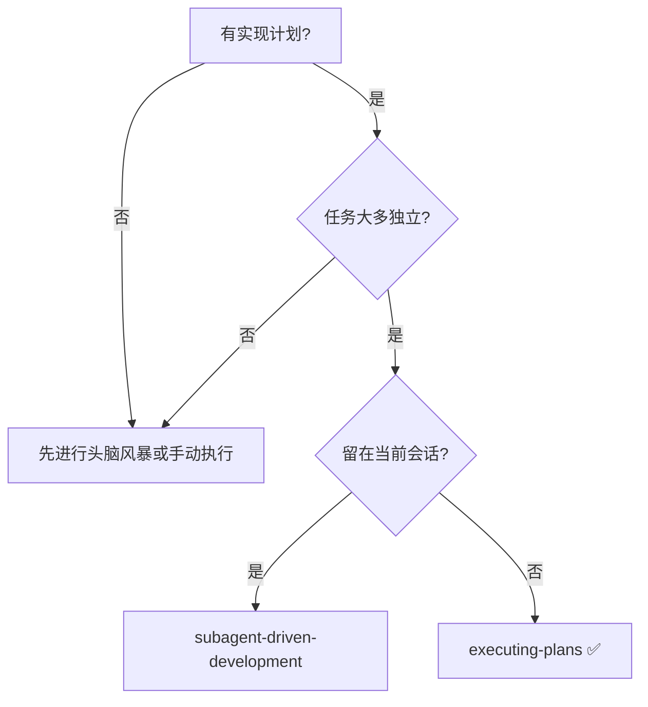
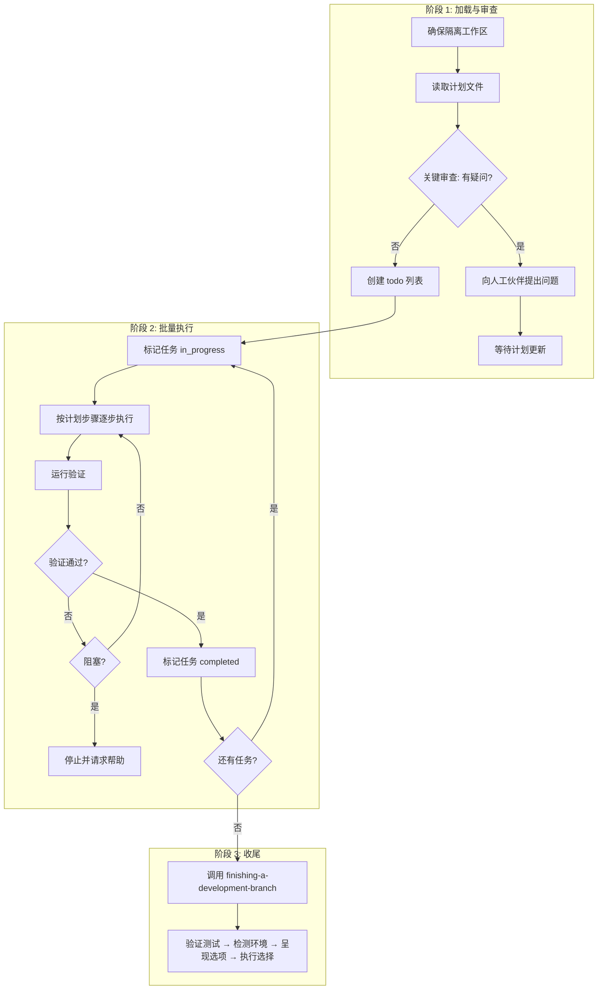
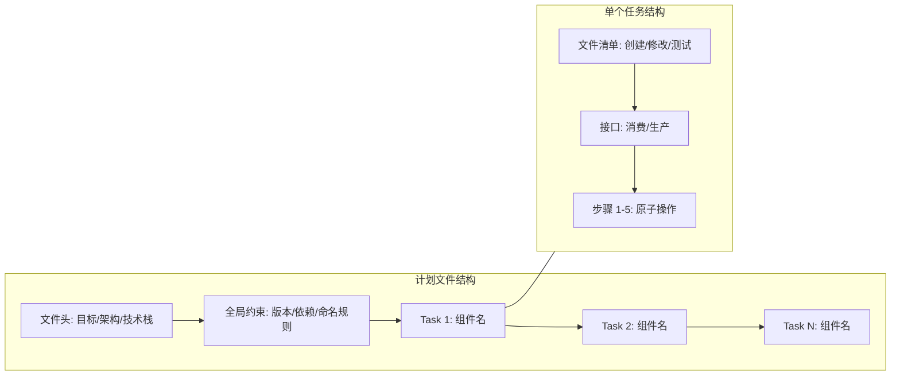
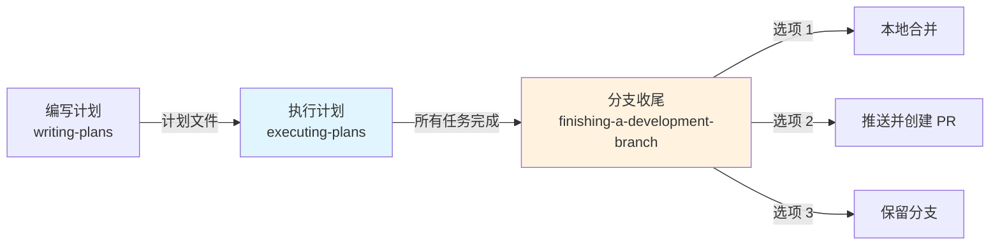

当一份实现计划（Implementation Plan）已经编写完成并通过审查后，下一步就是将其转化为可运行的代码。Superpowers 提供了两条执行路径——**内联批量执行**（`executing-plans`）与**子代理驱动开发**（`subagent-driven-development`）——它们共享相同的计划格式和验收标准，但在上下文隔离、审查粒度和人工介入频率上有本质差异。本文聚焦于 `executing-plans` 技能的完整工作机制，同时对比其在执行管线中的定位。

## 执行路径选择：何时使用本技能

`executing-plans` 是为**当前会话内批量执行**设计的技能。它与 `subagent-driven-development` 共享同一个上游（[编写实现计划](7-bian-xie-shi-xian-ji-hua-ling-shang-xia-wen-gong-cheng-shi-zhi-nan)）和同一个下游（[开发分支收尾](17-kai-fa-fen-zhi-shou-wei-he-bing-pr-yu-qing-li-jue-ce-liu)），区别在于执行模型：

| 维度 | executing-plans（内联执行） | subagent-driven-development（子代理驱动） |
|------|---------------------------|------------------------------------------|
| 上下文模型 | 当前会话连续执行 | 每个任务分派独立子代理 |
| 审查机制 | 人工检查点（批次间暂停） | 自动化两阶段审查（规格合规 + 代码质量） |
| 修复循环 | 人工决策 | 最多 5 轮自动修复 + 断路器 |
| 适用场景 | 任务紧密耦合、需要人工判断 | 任务相对独立、追求快速迭代 |
| 子代理需求 | 无 | 需要平台支持子代理分派 |
| 进度恢复 | 依赖会话上下文 | 依赖 ledger 文件（抗压缩） |

选择决策流如下：

Sources: [SKILL.md](skills/subagent-driven-development/SKILL.md#L30-L50), [SKILL.md](skills/executing-plans/SKILL.md#L1-L65)

## 三阶段执行流程

`executing-plans` 的核心流程分为三个阶段，每个阶段都有明确的进入条件和退出标准：

### 阶段 1：加载与审查

进入执行前，技能要求代理完成三件前置工作：

1. **隔离工作区**：通过 `superpowers:using-git-worktrees` 创建或验证隔离工作区，确保不在 `main`/`master` 分支上直接开始实现
2. **批判性审查**：不是被动接受计划，而是主动识别潜在问题——缺失的依赖、模糊的指令、矛盾的约束
3. **决策门控**：发现问题时**必须先向人工伙伴提出**，而不是猜测着继续

这个阶段的设计哲学是：**在投入实现成本之前修正计划的成本最低**。计划中的每个歧义在执行后都会放大为调试成本。

Sources: [SKILL.md](skills/executing-plans/SKILL.md#L15-L25)

### 阶段 2：批量执行

执行阶段的核心纪律是**严格遵循计划步骤**。计划文件中的每个步骤被设计为 2-5 分钟的原子操作（例如"编写失败测试"、"运行测试确认失败"、"编写最小实现"），代理不应跳过或合并这些步骤。

关键约束：

- **不跳过验证**：每个步骤指定的验证命令必须执行，不能凭推断跳过
- **引用其他技能**：当计划文本要求使用特定技能时（如 `superpowers:test-driven-development`），必须调用该技能
- **阻塞即停止**：遇到阻塞时立即停止并请求帮助，而不是猜测着继续

Sources: [SKILL.md](skills/executing-plans/SKILL.md#L27-L40), [SKILL.md](skills/writing-plans/SKILL.md#L62-L70)

### 阶段 3：收尾

所有任务完成并通过验证后，技能自动衔接 `finishing-a-development-branch`，进入分支收尾流程——验证完整测试套件、检测工作区类型、呈现合并/PR/保留选项。这个衔接是**强制性的子技能调用**，不是可选步骤。

Sources: [SKILL.md](skills/executing-plans/SKILL.md#L42-L48), [SKILL.md](skills/finishing-a-development-branch/SKILL.md#L1-L50)

## 人工检查点：停止与升级机制

`executing-plans` 区别于子代理驱动模式的核心特征是**人工检查点**。技能定义了四类必须立即停止的场景：

| 停止条件 | 具体表现 | 预期行为 |
|----------|---------|---------|
| 阻塞 | 缺失依赖、测试失败、指令不清 | 停止执行，向人工伙伴报告 |
| 计划缺口 | 关键信息缺失导致无法开始 | 停止执行，请求计划补充 |
| 理解障碍 | 无法理解某条指令的含义 | 请求澄清而非猜测 |
| 重复失败 | 验证反复失败 | 停止执行，升级问题 |

这些检查点的设计遵循一个原则：**宁可暂停等待，也不产出错误代码**。错误的实现不仅浪费实现时间，还会污染后续任务所依赖的接口和状态。

Sources: [SKILL.md](skills/executing-plans/SKILL.md#L42-L55)

## 验证铁律：证据先于断言

贯穿整个执行流程的底层约束来自 `verification-before-completion` 技能。它定义了一条不可违反的铁律：

> **没有新鲜的验证证据，就不能做出任何完成声明。**

这意味着：

| 声明类型 | 所需证据 | 不可接受的替代 |
|----------|---------|--------------|
| "测试通过" | 测试命令输出：0 失败 | "之前通过了"、"应该通过" |
| "构建成功" | 构建命令：exit 0 | "Linter 通过了" |
| "Bug 已修复" | 原始症状测试通过 | "代码已修改，假设已修复" |
| "需求已满足" | 逐条核对清单 | "测试通过了" |

在执行计划的上下文中，这条铁律确保了每个任务的完成标记都有可追溯的证据支撑，而不是代理的乐观推断。

Sources: [SKILL.md](skills/verification-before-completion/SKILL.md#L1-L50)

## 计划文件格式：执行者的视角

`executing-plans` 消费的计划文件由 `writing-plans` 技能生成，具有严格的结构约束。理解这些约束有助于执行者正确解读计划：

对执行者最关键的三个部分：

1. **文件清单（Files）**：精确到行号的文件路径，告诉执行者要创建、修改和测试哪些文件
2. **接口声明（Interfaces）**：定义当前任务消费的前置任务产出和当前任务为后续任务提供的接口签名——这是任务间的契约
3. **原子步骤（Steps）**：每个步骤是一个 2-5 分钟的操作，包含具体的代码和命令

计划文件的"零占位符"原则确保了执行者不会遇到"TBD"、"添加适当的错误处理"或"类似于 Task N"这类模糊指令。每个步骤都包含执行所需的完整信息。

Sources: [SKILL.md](skills/writing-plans/SKILL.md#L72-L130), [SKILL.md](skills/writing-plans/SKILL.md#L132-L150)

## 与子代理驱动开发的对比：共享基础设施

虽然 `executing-plans` 本身不使用子代理，但它与 `subagent-driven-development` 共享同一套基础设施脚本和工件管理策略：

| 脚本 | 用途 | 执行路径使用 |
|------|------|-------------|
| `scripts/sdd-workspace` | 解析并创建计划专属工作目录 | 子代理路径使用 |
| `scripts/task-brief` | 从计划中提取单个任务的完整文本 | 子代理路径使用 |
| `scripts/review-package` | 生成包含 commit 列表、文件统计和完整 diff 的审查包 | 子代理路径使用 |

这些脚本位于 `skills/subagent-driven-development/scripts/` 目录下，是子代理驱动模式的专用工具。`executing-plans` 的执行者在当前会话中直接读取计划文件，不需要提取 brief 或生成 review package。

两者的工作区隔离策略也不同：子代理驱动模式使用 `.superpowers/sdd/<plan-basename>/` 目录存储 ledger、brief 和 review 工件；内联执行模式依赖会话上下文和 todo 列表跟踪进度。

Sources: [sdd-workspace](skills/subagent-driven-development/scripts/sdd-workspace#L1-L41), [task-brief](skills/subagent-driven-development/scripts/task-brief#L1-L42), [review-package](skills/subagent-driven-development/scripts/review-package#L1-L47)

## 执行完成后的衔接管线

当所有任务执行完毕，`executing-plans` 将控制权移交给 `finishing-a-development-branch`。这个衔接点是整个开发管线的关键枢纽：

收尾技能会执行以下决策流：

1. **验证测试**：运行完整测试套件，失败则停止
2. **检测环境**：判断当前是普通仓库、命名分支 worktree 还是 detached HEAD
3. **确定基础分支**：确认合并目标
4. **呈现选项**：严格按照预定义菜单呈现，不添加"丢弃"选项（除非人工明确要求）
5. **执行选择**：根据人工伙伴的选择执行合并、推送或保留
6. **清理工作区**：仅清理 Superpowers 创建的 worktree（位于 `.worktrees/` 或 `worktrees/` 下）

Sources: [SKILL.md](skills/finishing-a-development-branch/SKILL.md#L50-L130)

## 常见反模式与防御机制

`executing-plans` 和相关技能文档中记录了一系列"常见合理化借口"，这些是代理在执行过程中可能产生的错误推理：

| 借口 | 现实 |
|------|------|
| "测试之前这次会话已经通过了" | 在即将集成的代码树上重新运行。绿色的运行只证明它运行时的那棵树 |
| "他们显然想合并" | 集成是人工伙伴的决定。呈现菜单并等待 |
| "这个指令应该是那个意思" | 请求澄清而非猜测 |
| "验证太慢了，跳过这一步" | 跳过验证 = 谎言，不是验证 |
| "应该可以了" | "应该"不是证据 |

这些防御机制的共同主题是：**将决策权保留在人工手中，将验证责任绑定在可观察证据上**。

Sources: [SKILL.md](skills/executing-plans/SKILL.md#L55-L65), [SKILL.md](skills/finishing-a-development-branch/SKILL.md#L160-L202), [SKILL.md](skills/verification-before-completion/SKILL.md#L50-L121)

## 阅读路径建议

本文档描述的是计划执行管线中的**内联批量执行路径**。建议的阅读顺序：

1. **前置知识**：[编写实现计划](7-bian-xie-shi-xian-ji-hua-ling-shang-xia-wen-gong-cheng-shi-zhi-nan) — 理解计划文件的结构和约束
2. **当前页面**：计划执行的批量模式与人工检查点
3. **对比阅读**：[子代理驱动开发](9-zi-dai-li-qu-dong-kai-fa-ren-wu-fen-pai-liang-jie-duan-shen-cha-yu-xiu-fu-xun-huan) — 理解自动化审查与修复循环
4. **下游衔接**：[开发分支收尾](17-kai-fa-fen-zhi-shou-wei-he-bing-pr-yu-qing-li-jue-ce-liu) — 执行完成后的集成决策
5. **底层约束**：[完成前验证](15-wan-cheng-qian-yan-zheng-zheng-ju-xian-yu-duan-yan) — 贯穿所有执行路径的证据铁律