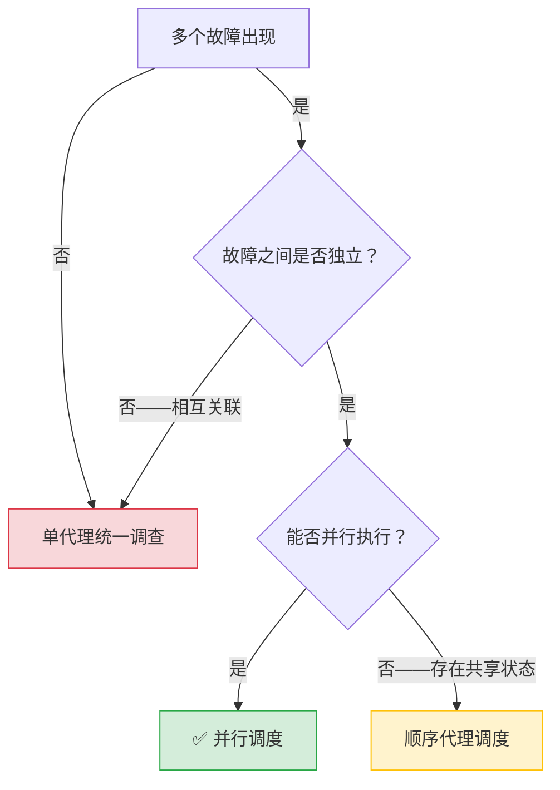
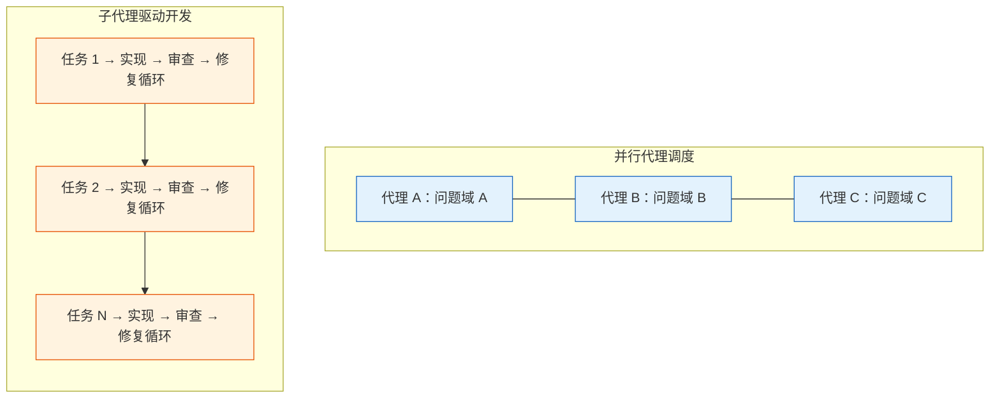
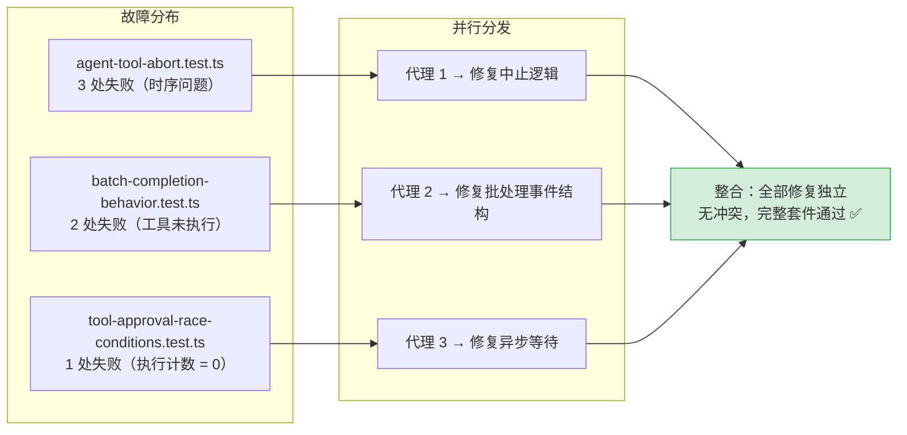
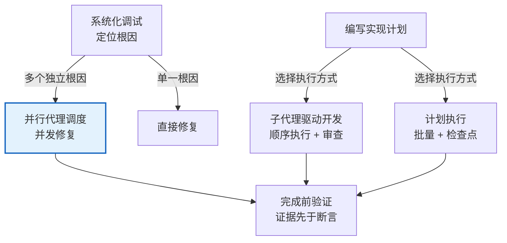

当系统同时出现多个互不关联的故障——不同的测试文件、不同的子系统、不同的缺陷根因——串行逐个调查是对时间的浪费。并行代理调度（Dispatching Parallel Agents）提供了一套将**独立问题域分解为并发子代理任务**的方法论，使每个代理在隔离的上下文中专注于单一问题，最终由调度者整合结果。

本页深入解析这一技能的触发条件、执行模式、提示词构造原则，以及它与顺序执行的[子代理驱动开发](9-zi-dai-li-qu-dong-kai-fa-ren-wu-fen-pai-liang-jie-duan-shen-cha-yu-xiu-fu-xun-huan)之间的边界划分。

## 核心原则：一个问题域，一个代理

并行调度的设计哲学建立在一个基本判断之上：**上下文隔离产生专注力**。调度者向子代理传递的不应是自身会话的完整历史，而是精确构造的任务上下文——恰好足够完成任务，不多一字。

```text
Core principle: Dispatch one agent per independent problem domain.
Let them work concurrently.
```

这一原则包含两层含义：

- **隔离性**：每个代理仅接收与其问题域相关的信息，避免无关上下文干扰判断
- **并发性**：多个调度指令在**同一响应**中发出，平台将其作为并行任务执行

Sources: [SKILL.md](skills/dispatching-parallel-agents/SKILL.md#L10-L14)

## 触发条件：何时启动并行调度

并非所有多任务场景都适合并行处理。技能定义了一组明确的判断标准，其决策逻辑可用下图表示：



**适用场景**（四个条件同时满足）：

| 条件 | 说明 | 示例 |
|------|------|------|
| 3+ 测试文件失败 | 多个文件各自报错 | `abort.test.ts`、`batch.test.ts`、`approval.test.ts` 各自失败 |
| 根因各不相同 | 每个文件的失败原因互不影响 | 时序问题 vs 事件结构错误 vs 异步等待缺失 |
| 问题可独立理解 | 修复一个不需要了解另一个的上下文 | 修复工具中止逻辑不影响批处理完成行为 |
| 无共享状态 | 代理之间不会编辑相同文件或竞争相同资源 | 各自修改不同模块的代码 |

**禁止使用的场景**：

| 场景 | 原因 |
|------|------|
| 故障相互关联 | 修复一个可能连带修复其他——应先联合调查 |
| 需要全局系统状态 | 理解问题需要看到完整系统 |
| 代理会相互干扰 | 编辑相同文件或使用相同资源 |
| 探索性调试 | 尚不清楚什么坏了——应先由[系统化调试](13-xi-tong-hua-diao-shi-si-jie-duan-gen-yin-fen-xi-fa)定位 |

Sources: [SKILL.md](skills/dispatching-parallel-agents/SKILL.md#L16-L46)

## 执行模式：四步调度流程

并行调度的执行遵循一个清晰的四阶段流程。理解每个阶段的职责边界是正确实施的关键。


### 阶段一：识别独立域

将故障按**问题域**分组，而非按表面症状。判断标准是：修复域 A 的代码是否会影响域 B 的测试结果？如果答案是否定的，它们就是独立的。

```text
分组示例：
  File A tests → 工具审批流程
  File B tests → 批处理完成行为
  File C tests → 中止功能

每个域相互独立——修复工具审批不会影响中止测试。
```

Sources: [SKILL.md](skills/dispatching-parallel-agents/SKILL.md#L49-L56)

### 阶段二：构造聚焦的代理任务

每个代理接收的任务描述必须包含四个要素：

| 要素 | 作用 | 反面示例 |
|------|------|----------|
| **具体范围** | 限定一个测试文件或子系统 | ❌ "修复所有测试"——代理迷失方向 |
| **明确目标** | 说明期望的最终状态 | ❌ "看看怎么回事"——没有成功标准 |
| **约束条件** | 划定不可触碰的边界 | ❌ 无约束——代理可能重构一切 |
| **期望输出** | 定义返回内容的格式 | ❌ "修好就行"——你不知道改了什么 |

Sources: [SKILL.md](skills/dispatching-parallel-agents/SKILL.md#L58-L75)

### 阶段三：并行分发

这是整个机制的技术核心。并发的实现依赖于平台对子代理调度的处理方式：

> **同一响应中的多个分发调用 = 并行执行。每个响应一个调用 = 顺序执行。**

```text
Subagent (general-purpose): "Fix agent-tool-abort.test.ts failures"
Subagent (general-purpose): "Fix batch-completion-behavior.test.ts failures"
Subagent (general-purpose): "Fix tool-approval-race-conditions.test.ts failures"
# 三个代理同时运行
```

这一机制的关键在于**响应边界**——并行性不是通过特殊语法声明的，而是通过在同一消息中放置多个子代理调度指令来实现的。

Sources: [SKILL.md](skills/dispatching-parallel-agents/SKILL.md#L66-L77)

### 阶段四：审查与整合

代理返回后，调度者执行四个整合步骤：

1. **逐一阅读摘要**——理解每个代理做了什么改变
2. **检查冲突**——多个代理是否编辑了同一段代码？
3. **运行完整测试套件**——验证所有修复在一起是否仍然有效
4. **抽查关键点**——代理可能犯系统性错误，不能完全盲信

这一阶段与[完成前验证](15-wan-cheng-qian-yan-zheng-zheng-ju-xian-yu-duan-yan)技能的原则一致：**证据先于断言**。

Sources: [SKILL.md](skills/dispatching-parallel-agents/SKILL.md#L79-L86)

## 代理提示词构造：精确上下文工程

并行调度的质量完全取决于提示词的质量。技能文档给出了一个完整的提示词范例，从中可以提炼出三条构造原则。

### 原则一：问题具象化

不要在提示词中抽象地描述问题。将**具体的测试名称、期望值、实际错误信息**直接粘贴到提示词中：

```markdown
Fix the 3 failing tests in src/agents/agent-tool-abort.test.ts:

1. "should abort tool with partial output capture" 
   → expects 'interrupted at' in message
2. "should handle mixed completed and aborted tools" 
   → fast tool aborted instead of completed
3. "should properly track pendingToolCount" 
   → expects 3 results but gets 0
```

### 原则二：方法引导而非方法指定

提示词应引导代理的思考方向，但不替代其判断。示例中的措辞是：

```text
These are timing/race condition issues. Your task:
1. Read the test file and understand what each test verifies
2. Identify root cause — timing issues or actual bugs?
3. Fix by:
   - Replacing arbitrary timeouts with event-based waiting
   - Fixing bugs in abort implementation if found
   - Adjusting test expectations if testing changed behavior

Do NOT just increase timeouts — find the real issue.
```

这里给出了排查方向（时序/竞态）和修复策略（事件驱动等待），但保留了代理自主判断根因的空间。

### 原则三：输出契约

明确指定代理返回内容的格式，使调度者能快速整合：

```text
Return: Summary of what you found and what you fixed.
```

Sources: [SKILL.md](skills/dispatching-parallel-agents/SKILL.md#L87-L113)

## 与子代理驱动开发的边界划分

并行代理调度与[子代理驱动开发](9-zi-dai-li-qu-dong-kai-fa-ren-wu-fen-pai-liang-jie-duan-shen-cha-yu-xiu-fu-xun-huan)（SDD）共享同一套底层子代理分发机制，但两者在**执行模型**和**适用场景**上截然不同。理解它们的边界是正确使用两者的前提。



| 维度 | 并行代理调度 | 子代理驱动开发 |
|------|-------------|---------------|
| **触发场景** | 多个独立故障同时出现 | 存在已编写的实现计划 |
| **执行模型** | 并发——所有代理同时运行 | 顺序——每任务完成后才启动下一个 |
| **审查机制** | 无内建审查循环；整合后统一验证 | 每任务两阶段审查（规格合规 + 代码质量） |
| **修复循环** | 无——代理返回后由调度者判断 | 最多 5 轮修复循环，含模型升级策略 |
| **进度追踪** | 无——任务轻量，即时完成 | 进度账本（ledger）持久化，抗上下文压缩 |
| **上下文隔离** | 代理仅接收问题域相关信息 | 代理接收任务简报、接口约定、全局约束 |
| **并行限制** | 鼓励并行 | **明确禁止并行实现**（避免冲突） |

SDD 在其任务循环中明确写道：

> Never dispatch multiple implementation subagents in parallel (conflicts).

这一禁令的原因在于：SDD 的任务之间存在**接口依赖**——后续任务消费前序任务的产出。并行执行会破坏这种依赖链。而并行代理调度的前提恰恰是任务之间**不存在**此类依赖。

Sources: [SKILL.md](skills/dispatching-parallel-agents/SKILL.md#L14) — [SKILL.md](skills/subagent-driven-development/SKILL.md#L230)

## 真实案例：六故障三文件场景

技能文档记录了一个来自实际会话的完整案例，展示了并行调度从决策到整合的全过程。

**场景**：大规模重构后，3 个测试文件出现 6 处失败。



**决策过程**：中止逻辑、批处理完成、竞态条件——三个域互不影响，满足并行调度的全部条件。

**各代理的修复策略**：

| 代理 | 根因 | 修复方法 |
|------|------|----------|
| 代理 1 | 使用任意超时而非事件等待 | 替换为基于事件的等待机制 |
| 代理 2 | 事件结构中 threadId 位置错误 | 修正事件结构 |
| 代理 3 | 异步工具执行完成前即断言 | 添加异步完成等待 |

**整合结果**：三个修复完全独立，无冲突，完整测试套件通过。

Sources: [SKILL.md](skills/dispatching-parallel-agents/SKILL.md#L136-L159)

## 常见错误与反模式

技能文档以对比形式列出了四类典型错误，每一类都对应提示词构造的一条核心原则：

| 错误类型 | ❌ 反模式 | ✅ 正确做法 | 违反的原则 |
|----------|----------|------------|-----------|
| 范围过宽 | "修复所有测试" | "修复 agent-tool-abort.test.ts" | 一个代理一个域 |
| 缺少上下文 | "修复竞态条件" | 粘贴错误信息和测试名称 | 自包含上下文 |
| 缺少约束 | 代理可能重构一切 | "不要修改生产代码" 或 "仅修复测试" | 划定边界 |
| 输出模糊 | "修好它" | "返回根因摘要和变更内容" | 明确输出契约 |

Sources: [SKILL.md](skills/dispatching-parallel-agents/SKILL.md#L115-L127)

## 上下文隔离：贯穿所有委派技能的元原则

并行代理调度并非孤立存在。上下文隔离原则——**子代理不应继承调度者的会话上下文或历史**——贯穿了项目中所有涉及代理委派的技能。这一原则在[子代理驱动开发](9-zi-dai-li-qu-dong-kai-fa-ren-wu-fen-pai-liang-jie-duan-shen-cha-yu-xiu-fu-xun-huan)中同样被明确表述：

> You delegate tasks to specialized agents with isolated context. By precisely crafting their instructions and context, you ensure they stay focused and succeed at their task. They should never inherit your session's context or history — you construct exactly what they need.

这一设计决策的技术动机在于：

1. **防止上下文污染**：会话历史包含大量与当前任务无关的信息，会分散代理的注意力
2. **控制成本**：更多的上下文 token 意味着更高的 API 调用成本
3. **可复现性**：精确构造的提示词可以被记录、复现和改进
4. **抗压缩损失**：会话记忆在上下文压缩后可能丢失，但文件化的任务简报不会

Sources: [SKILL.md](skills/dispatching-parallel-agents/SKILL.md#L10-L11) — [SKILL.md](skills/subagent-driven-development/SKILL.md#L10-L11)

## 技能定位：在技能体系中的坐标

并行代理调度在整个技能体系中占据一个特定的位置——它是**故障响应链**中的一个加速环节，而非独立的开发方法论。



| 上游技能 | 关系 | 下游技能 |
|----------|------|----------|
| [系统化调试](13-xi-tong-hua-diao-shi-si-jie-duan-gen-yin-fen-xi-fa) | 提供根因分析结果，判断是否可并行 | [完成前验证](15-wan-cheng-qian-yan-zheng-zheng-ju-xian-yu-duan-yan) |
| [头脑风暴](6-tou-nao-feng-bao-su-ge-la-di-shi-xie-zuo-she-ji) → [编写计划](7-bian-xie-shi-xian-ji-hua-ling-shang-xia-wen-gong-cheng-shi-zhi-nan) | 计划产出后选择 SDD 而非并行调度 | [开发分支收尾](17-kai-fa-fen-zhi-shou-wei-he-bing-pr-yu-qing-li-jue-ce-liu) |

并行调度是一个**轻量级**技能——没有脚本、没有账本、没有修复循环。它的价值在于提供了一个清晰的决策框架：**什么时候并行是值得的，什么时候不是**。