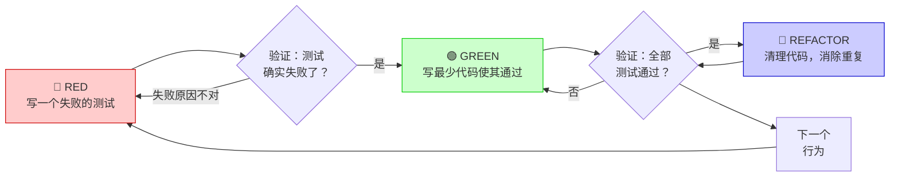
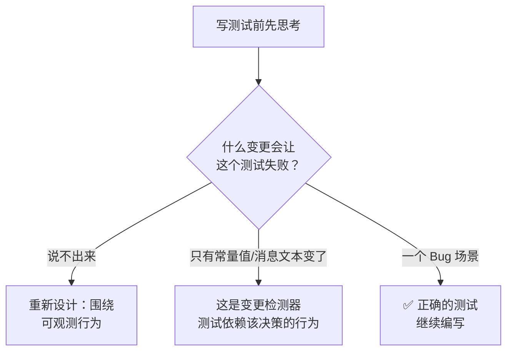
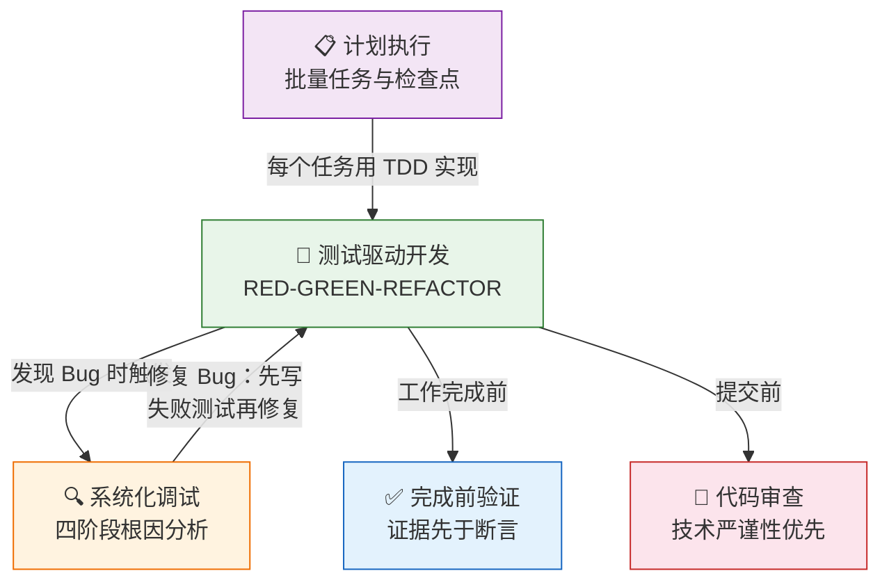

本文档是 Superpowers 方法论中**测试驱动开发（TDD）** 技能的完整解读。你将理解这套"先写测试、再写代码"的工作流为何被称为**铁律**，掌握 RED-GREEN-REFACTOR 三阶段的精确操作步骤，并学会辨别好测试与坏测试的本质区别。

适用场景：**任何**新功能开发、缺陷修复、重构和行为变更——没有例外。

---

## 核心理念：一条不可违反的铁律

TDD 的全部哲学可以浓缩为一句话：

```
没有失败的测试，就不能写生产代码
```

这条铁律看似极端，但它背后有一个朴素的逻辑：**如果你没有亲眼看到测试失败，你就不知道它是否真的在测试正确的事情。** 一个从未失败过的测试，和一个不存在的测试，在证明代码正确性这件事上——没有任何区别。

这条规则没有灰色地带。违反字面规则，就是违反规则的精神。

Sources: [SKILL.md](skills/test-driven-development/SKILL.md#L12-L18)

---

## RED-GREEN-REFACTOR 循环：三阶段工作流

TDD 的核心是一个不断重复的三阶段循环。每个阶段有严格的顺序约束，**不可跳步、不可合并**。



上图展示了完整的 TDD 循环。注意两个**验证节点**（菱形）——它们是强制性的门禁，绝不可跳过。

Sources: [SKILL.md](skills/test-driven-development/SKILL.md#L34-L52)

---

## 🔴 第一阶段：RED — 写一个失败的测试

### 你要做什么

写**一个**最小的测试，描述你期望的**一个**行为。这个测试此刻必须失败，因为实现代码还不存在。

### 关键要求

| 要求 | 说明 |
|------|------|
| **一个行为** | 测试名称中出现"and"？拆分成多个测试 |
| **清晰的名称** | 名称描述行为，而非编号或模糊词汇 |
| **真实代码** | 不使用 Mock，除非确实不可避免 |

### 好测试 vs 坏测试

**✅ 好的测试**——名称清晰，测试真实行为，只测一件事：

```typescript
test('retries failed operations 3 times', async () => {
  let attempts = 0;
  const operation = () => {
    attempts++;
    if (attempts < 3) throw new Error('fail');
    return 'success';
  };

  const result = await retryOperation(operation);

  expect(result).toBe('success');
  expect(attempts).toBe(3);
});
```

**❌ 坏的测试**——名称模糊，测试的是 Mock 而非真实代码：

```typescript
test('retry works', async () => {
  const mock = jest.fn()
    .mockRejectedValueOnce(new Error())
    .mockRejectedValueOnce(new Error())
    .mockResolvedValueOnce('success');
  await retryOperation(mock);
  expect(mock).toHaveBeenCalledTimes(3);
});
```

Sources: [SKILL.md](skills/test-driven-development/SKILL.md#L54-L90)

### 强制验证：亲眼看到它失败

写完测试后，**必须立即运行它**：

```bash
npm test path/to/test.test.ts
```

你需要确认三件事：

1. **测试确实失败了**（不是报错，是断言失败）
2. **失败信息符合预期**（因为功能缺失而失败，不是因为拼写错误）
3. **测试通过了？** 说明你在测试已有的行为——修改测试
4. **测试报错了？** 修复错误后重新运行，直到它正确地失败

> ⚠️ **这一步绝不可跳过。** 没有看到测试失败，整个 TDD 循环就失去了意义。

Sources: [SKILL.md](skills/test-driven-development/SKILL.md#L92-L104)

---

## 🟢 第二阶段：GREEN — 写最少代码使其通过

### 你要做什么

写**最简单的代码**让刚才失败的测试通过。不多不少。

### 核心约束

- **不添加额外功能**
- **不重构其他代码**
- **不做超出测试范围的"改进"**

### 好实现 vs 坏实现

**✅ 好的实现**——刚好让测试通过：

```typescript
async function retryOperation<T>(fn: () => Promise<T>): Promise<T> {
  for (let i = 0; i < 3; i++) {
    try {
      return await fn();
    } catch (e) {
      if (i === 2) throw e;
    }
  }
  throw new Error('unreachable');
}
```

**❌ 坏的实现**——过度工程化，添加了测试没有要求的东西：

```typescript
async function retryOperation<T>(
  fn: () => Promise<T>,
  options?: {
    maxRetries?: number;
    backoff?: 'linear' | 'exponential';
    onRetry?: (attempt: number) => void;
  }
): Promise<T> {
  // YAGNI — 你不需要这些
}
```

### 强制验证：确认全部通过

```bash
npm test path/to/test.test.ts
```

确认：
- 新测试通过 ✅
- **其他已有测试仍然通过** ✅
- 输出干净（无错误、无警告）✅

**测试失败了？** 修改代码，而不是修改测试。

Sources: [SKILL.md](skills/test-driven-development/SKILL.md#L106-L140)

---

## 🔵 第三阶段：REFACTOR — 清理代码

### 你要做什么

在测试全部通过**之后**，你才可以清理代码：

- 消除重复
- 改善命名
- 提取辅助函数

### 核心约束

- **保持测试始终通过**
- **不添加新行为**

重构完成后，再次运行测试确认一切仍然绿色。然后回到 🔴 RED 阶段，为下一个行为写新的失败测试。

Sources: [SKILL.md](skills/test-driven-development/SKILL.md#L142-L150)

---

## 好测试的两条黄金法则

Superpowers 的 TDD 技能附带了一份详细的参考文档 [writing-good-tests.md](skills/test-driven-development/writing-good-tests.md)，定义了好测试的两条核心原则。

### 原则一：命名它会捕获的故障

在写测试之前，先回答一个问题：**什么样的代码变更会让这个测试失败？这个变更是一个 Bug 还是一个设计决策？**



**关键要点**：期望值必须**独立推导**——用手算的常量值或人工验证的固定数据，绝不能用被测代码自身来计算期望值。

```typescript
// ❌ 镜像断言：两边用同一个函数计算——永远通过
const expected = buildSearchQuery({ tag: 'urgent' });
expect(buildSearchQuery({ tag: 'urgent' })).toBe(expected);

// ✅ 手工推导的字面量
expect(buildSearchQuery({ tag: 'urgent' })).toBe('tag:"urgent"');
```

Sources: [writing-good-tests.md](skills/test-driven-development/writing-good-tests.md#L12-L42)

### 原则二：测试真实的东西

**Mock 断言什么都证明不了。** 一个 Mock 断言在 Mock 存在时通过、在 Mock 缺席时失败——它说的是 Mock 的事，不是被测组件的事。

```typescript
// ✅ 测试真实行为
expect(screen.getByRole('navigation')).toBeInTheDocument();

// ❌ 测试 Mock 的存在
expect(screen.getByTestId('sidebar-mock')).toBeInTheDocument();
```

**正确的 Mock 策略**：

| 场景 | 做法 |
|------|------|
| 依赖项很慢或是外部服务 | Mock 掉慢的部分，保留真实行为 |
| 不确定该不该 Mock | 先用真实实现跑测试，观察实际需要什么 |
| Mock 设置比测试逻辑还长 | 切换到集成测试，使用真实组件 |
| 需要清理方法但只有测试用到 | 放入测试工具类，不要加到生产类上 |

Sources: [writing-good-tests.md](skills/test-driven-development/writing-good-tests.md#L44-L100)

### 变异检查：完成前的最终验证

写完测试后，在脑中"变异"生产代码，检查以下场景是否至少有一个测试会失败：

| 变异类型 | 示例 |
|----------|------|
| 错误的常量或参数 | 把 `3` 改成 `5` |
| 错误的分支处理 | 交换 `if/else` 分支 |
| 缺失的状态变更 | 注释掉副作用代码 |
| 空返回值 | 直接 `return null` |
| 缺失的边界校验 | 去掉对空值、零值、未授权的检查 |

如果某种变异没有任何测试能捕获，说明该行为未被保护——或者你的测试是同义反复。

Sources: [writing-good-tests.md](skills/test-driven-development/writing-good-tests.md#L130-L150)

---

## 常见借口与现实对照

每一个跳过 TDD 的理由，都已经被实践证伪。以下是最高频的借口及其现实：

| 借口 | 现实 |
|------|------|
| "太简单了不用测" | 简单代码也会出 Bug。写测试只要 30 秒 |
| "我之后再补测试" | 后补的测试立刻通过——这什么都证明不了。你从未看到它失败，就从未证明它能捕获 Bug |
| "后补测试也能达到同样目的" | 先写测试回答"应该做什么"；后补测试回答"做了什么"。后补测试受已有代码偏见影响——你验证的是你想到的场景，不是你会发现的场景 |
| "删掉 X 小时的工作太浪费" | 沉没成本谬误。真正的问题是：用 TDD 重写（高信心）vs 保留不可信的代码（低信心）。保留不可信的代码才是浪费 |
| "留作参考，然后先写测试" | 你会去适配它。那就是后补测试。删除就是删除 |
| "TDD 会拖慢我" | TDD **就是**务实的路径：在提交前捕获 Bug，防止回归，让你无所畏惧地重构。"务实"的捷径意味着在生产环境调试——更慢，不是更快 |
| "测试太难 = 设计不清" | 倾听测试的声音。难测试 = 难使用 |

Sources: [SKILL.md](skills/test-driven-development/SKILL.md#L200-L220)

---

## 实战演练：一次完整的缺陷修复

让我们通过一个具体例子走一遍完整的 TDD 流程。

**缺陷**：空邮箱地址被接受了。

### 🔴 RED — 写失败测试

```typescript
test('rejects empty email', async () => {
  const result = await submitForm({ email: '' });
  expect(result.error).toBe('Email required');
});
```

运行测试，确认失败：

```bash
$ npm test
FAIL: expected 'Email required', got undefined
```

✅ 测试因功能缺失而失败——符合预期。

### 🟢 GREEN — 写最少代码

```typescript
function submitForm(data: FormData) {
  if (!data.email?.trim()) {
    return { error: 'Email required' };
  }
  // ...
}
```

运行测试，确认通过：

```bash
$ npm test
PASS
```

### 🔵 REFACTOR — 清理

如果有多个字段需要类似校验，提取通用验证函数。保持测试绿色。

Sources: [SKILL.md](skills/test-driven-development/SKILL.md#L260-L295)

---

## 完成前验证清单

在声称工作完成之前，逐项检查：

| `#` | 检查项 | 含义 |
|---|--------|------|
| 1 | ✅ 每个新函数/方法都有测试 | 无测试 = 不存在 |
| 2 | ✅ 实现前看过每个测试失败 | 没看过失败 = 没证明它能捕获 Bug |
| 3 | ✅ 每个测试因预期原因失败 | 功能缺失，而非拼写错误 |
| 4 | ✅ 为每个测试写了最少代码 | 不多不少 |
| 5 | ✅ 所有测试通过 | 包括新旧测试 |
| 6 | ✅ 输出干净 | 无错误、无警告 |
| 7 | ✅ 测试使用真实代码 | Mock 仅在不可避免时使用 |
| 8 | ✅ 边界情况和错误路径已覆盖 | 正常路径之外的场景 |

**无法勾选全部？** 你跳过了 TDD。从头来过。

Sources: [SKILL.md](skills/test-driven-development/SKILL.md#L297-L310)

---

## 卡住了怎么办？

| 问题 | 解决方案 |
|------|----------|
| 不知道怎么测试 | 写出你期望的 API。先写断言。向你的搭档求助 |
| 测试太复杂 | 设计太复杂。简化接口 |
| 必须 Mock 一切 | 代码耦合太紧。使用依赖注入 |
| 测试设置代码巨大 | 提取辅助函数。仍然复杂？简化设计 |

Sources: [SKILL.md](skills/test-driven-development/SKILL.md#L312-L320)

---

## 与其他技能的协作关系

TDD 不是孤立存在的——它与 Superpowers 中的多个技能形成紧密配合：



**关键交互点**：

- **与系统化调试的关系**：发现 Bug？先写一个复现该 Bug 的失败测试，然后遵循 TDD 循环修复。永远不要在没有测试的情况下修复 Bug。这确保了修复有效且防止回归。

- **与完成前验证的关系**：TDD 的"验证 GREEN"步骤是完成前验证的子集。后者要求**任何完成声明**都必须有新鲜的验证证据支撑。

- **与计划执行的关系**：执行计划中的每个任务时，都应遵循 TDD 循环——先写失败测试，再写实现。

Sources: [SKILL.md](skills/test-driven-development/SKILL.md#L305-L321), [systematic-debugging/SKILL.md](skills/systematic-debugging/SKILL.md#L1-L20), [verification-before-completion/SKILL.md](skills/verification-before-completion/SKILL.md#L1-L30)

---

## 停止信号：何时必须从头来过

以下任何一条出现时，意味着你已经偏离了 TDD——**删除代码，从头开始**：

- 先写了代码再写测试
- 测试在实现之后才写
- 测试一写就通过（从未失败过）
- 无法解释测试为什么失败
- 打算"之后"再补测试
- 在心里为"就这一次不写测试"找理由
- 想"保留现有代码作参考"
- 认为"TDD 太教条，我在走务实路线"

**以上所有情况的答案都是同一个：删除代码，用 TDD 从头开始。**

Sources: [SKILL.md](skills/test-driven-development/SKILL.md#L230-L258)

---

## 延伸阅读

本页覆盖了 TDD 技能的核心循环与测试质量标准。以下是建议的阅读路径：

**前置知识**（建议先阅读）：
- [设计哲学：TDD、系统化与证据优先](4-she-ji-zhe-xue-tdd-xi-tong-hua-yu-zheng-ju-you-xian) — 理解 TDD 在整个方法论中的定位

**后续技能**（掌握 TDD 后继续阅读）：
- [系统化调试：四阶段根因分析法](13-xi-tong-hua-diao-shi-si-jie-duan-gen-yin-fen-xi-fa) — 当测试失败时，如何系统性地定位根因
- [完成前验证：证据先于断言](15-wan-cheng-qian-yan-zheng-zheng-ju-xian-yu-duan-yan) — TDD 循环的"验证"步骤如何扩展为全局工作原则
- [代码审查请求与接收：技术严谨性优先](14-dai-ma-shen-cha-qing-qiu-yu-jie-shou-ji-zhu-yan-jin-xing-you-xian) — 提交前如何通过审查确保 TDD 产出的质量