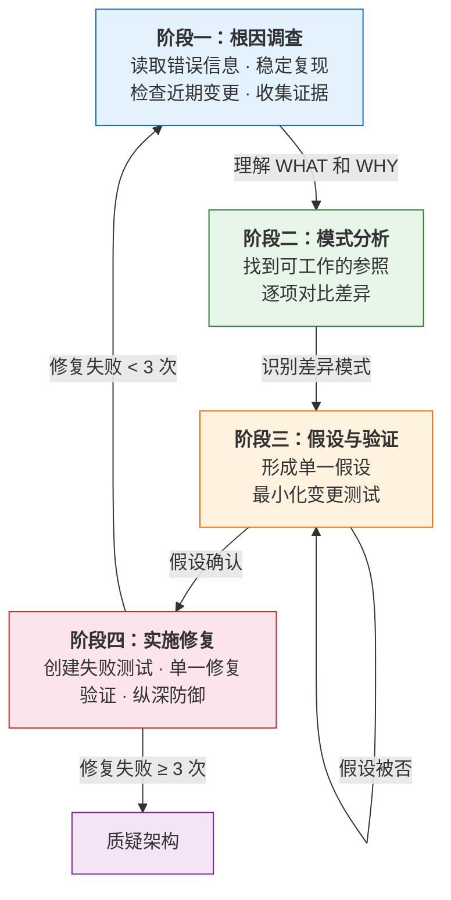
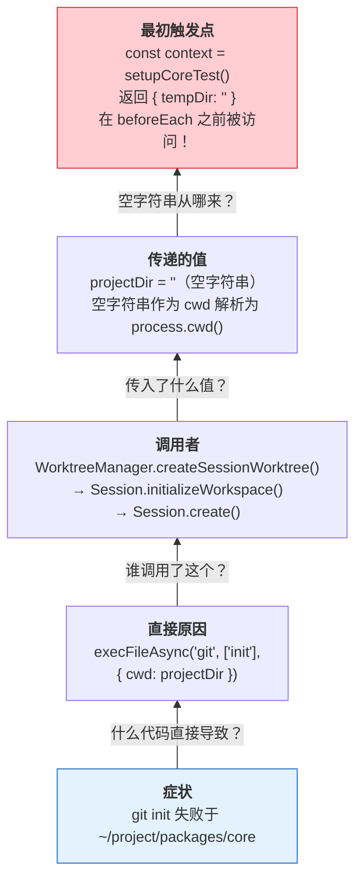
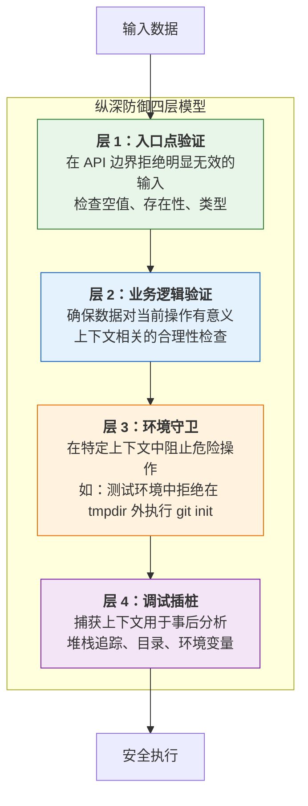
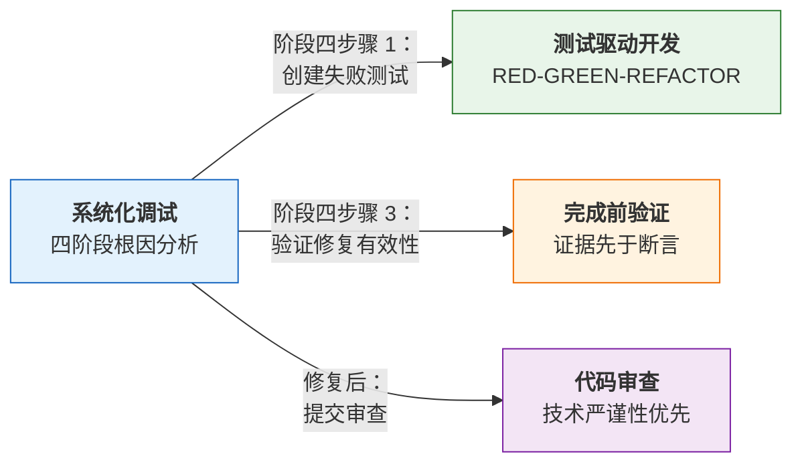

本页深入解析 superpowers 项目中 `systematic-debugging` 技能的完整方法论。该技能定义了一套强制性的调试协议——**在完成根因调查之前，禁止提出任何修复方案**。这不仅是一个技术流程，更是一套对抗认知偏误的决策框架，旨在帮助开发者在时间压力、疲劳和权威影响下依然保持调试纪律。

## 铁律：根因先于修复

整个技能体系围绕一条不可违反的铁律构建：

> **NO FIXES WITHOUT ROOT CAUSE INVESTIGATION FIRST**
>
> 未完成阶段一，不得提出修复方案。

这条铁律的存在源于一个核心洞察：**症状修复是失败的代名词**。开发者在面对 bug 时的本能反应——"看起来像是 X 的问题，改一下试试"——恰恰是低效调试的根源。技能文档用 "ALWAYS" 和 "NEVER" 这类绝对性措辞而非 "should" 或 "try to"，刻意构建语言层面的认知摩擦力，阻止在压力下合理化走捷径的行为。

触发条件覆盖所有技术异常场景：测试失败、生产 bug、意外行为、性能问题、构建失败和集成问题。**尤其在以下情境中不可跳过**：时间紧迫时（"紧急"让猜测变得诱人）、"只需一个快速修复"看起来显而易见时、已经尝试了多次修复但均未生效时。

Sources: [SKILL.md](skills/systematic-debugging/SKILL.md#L1-L50)

## 四阶段流程总览

四阶段流程构成一个严格的线性管道——每个阶段必须完成后才能进入下一个。这种设计的核心目的是**强制认知顺序**：先理解问题，再分析模式，然后形成假设，最后才实施修复。



| 阶段 | 核心活动 | 完成标准 |
|------|---------|---------|
| **阶段一：根因调查** | 读取错误信息、稳定复现、检查变更、收集多组件证据 | 理解 WHAT 和 WHY |
| **阶段二：模式分析** | 找到可工作的参照实现、逐项对比差异 | 识别所有差异点 |
| **阶段三：假设与验证** | 形成单一假设、最小化变更测试 | 假设被确认或提出新假设 |
| **阶段四：实施修复** | 创建失败测试、实施单一修复、验证、添加纵深防御 | bug 解决，测试通过 |

Sources: [SKILL.md](skills/systematic-debugging/SKILL.md#L52-L165), [SKILL.md](skills/systematic-debugging/SKILL.md#L258-L270)

## 阶段一：根因调查

阶段一是整个流程的基石，包含五个递进式步骤。

### 1.1 仔细阅读错误信息

不跳过任何错误或警告。错误信息通常包含精确的解决方案——完整阅读堆栈跟踪，记录行号、文件路径和错误代码。这一步看似基础，但在实践中，开发者经常在看到错误的第一行后就开始猜测原因。

### 1.2 稳定复现

能否可靠地触发问题？精确的复现步骤是什么？是否每次都会出现？**如果无法稳定复现，应收集更多数据而非猜测**。这是从"猜测模式"切换到"证据模式"的关键分界线。

### 1.3 检查近期变更

什么变更可能导致了这个问题？通过 `git diff`、近期提交记录、新依赖项、配置变更和环境差异来缩小范围。

### 1.4 多组件系统的证据收集

当系统包含多个组件（如 CI → 构建 → 签名，或 API → 服务 → 数据库）时，在提出修复方案之前，需要在**每个组件边界**添加诊断插桩：

```bash
# 对每个组件边界：
# - 记录进入组件的数据
# - 记录离开组件的数据
# - 验证环境/配置的传播
# - 检查每一层的状态

# 示例：四层系统的诊断
# Layer 1: 工作流层
echo "=== Secrets available in workflow: ==="
echo "IDENTITY: ${IDENTITY:+SET}${IDENTITY:-UNSET}"

# Layer 2: 构建脚本层
echo "=== Env vars in build script: ==="
env | grep IDENTITY || echo "IDENTITY not in environment"

# Layer 3: 签名脚本层
echo "=== Keychain state: ==="
security list-keychains
security find-identity -v

# Layer 4: 实际签名
codesign --sign "$IDENTITY" --verbose=4 "$APP"
```

运行一次以收集证据，显示**在哪里断裂**，然后分析证据定位故障组件，再针对该组件深入调查。

### 1.5 追踪数据流

当错误深藏于调用栈中时，需要反向追踪数据流。详见下文[根因追踪技术](#根因追踪技术root-cause-tracing)部分。

Sources: [SKILL.md](skills/systematic-debugging/SKILL.md#L60-L130)

## 阶段二：模式分析

在理解问题之后、提出假设之前，需要建立模式参照。

**找到可工作的范例**——在同一代码库中定位类似的正常工作的代码。**完整阅读参考实现**——不是略读，而是逐行阅读每一行代码，在应用模式之前完全理解它。**逐项列出差异**——不放过任何差异，无论看起来多么微不足道，不做"这不重要"的假设。**理解依赖关系**——该功能需要哪些组件、设置、配置和环境假设？

这一阶段的认知价值在于：它将调试从"凭空猜测"转变为"有据对比"，用已知的正确行为作为锚点来定位偏差。

Sources: [SKILL.md](skills/systematic-debugging/SKILL.md#L132-L150)

## 阶段三：假设与验证

这是科学方法在调试中的直接应用。

**形成单一假设**：明确陈述"我认为 X 是根因，因为 Y"，并将其写下来。**最小化测试**：做出最小可能的变更来验证假设，一次只改变一个变量，不要同时修复多个问题。**验证后再继续**：如果有效，进入阶段四；如果无效，形成**新的假设**——不要在失败的修复上叠加更多修复。

关键规则：当你不理解某些东西时，说"我不理解 X"，不要假装知道。

Sources: [SKILL.md](skills/systematic-debugging/SKILL.md#L152-L175)

## 阶段四：实施修复

修复根因，而非症状。

**创建失败测试用例**——最简单的复现方式，优先使用自动化测试，修复前必须拥有失败测试。可结合 [测试驱动开发技能](12-ce-shi-qu-dong-kai-fa-red-green-refactor-tie-lu) 编写规范的失败测试。**实施单一修复**——针对已识别的根因，一次一个变更，不做"顺便"改进。**验证修复**——测试通过、无其他测试被破坏、问题确实解决。建议使用 [完成前验证技能](15-wan-cheng-qian-yan-zheng-zheng-ju-xian-yu-duan-yan) 确认修复有效性。

### 三次修复失败规则

这是一个关键的架构预警机制：

| 已尝试修复次数 | 应采取的行动 |
|--------------|------------|
| < 3 次 | 返回阶段一，用新信息重新分析 |
| ≥ 3 次 | **停止！质疑架构**——不要尝试第 4 次修复 |

当每次修复都揭示新的共享状态/耦合/不同位置的问题，当修复需要"大规模重构"才能实施，当每次修复都在其他地方产生新症状时——这表明**架构本身存在问题**，而非某个局部 bug。此时必须与人类伙伴讨论，而不是继续尝试修复。

Sources: [SKILL.md](skills/systematic-debugging/SKILL.md#L177-L225)

## 辅助技术一：根因追踪（Root Cause Tracing）

Bug 经常在调用栈深处暴露（如 `git init` 在错误目录执行、文件创建在错误位置）。直觉是在错误出现的地方修复，但那是治疗症状。

**核心原则**：沿调用链反向追踪，直到找到最初的触发点，然后在源头修复。

### 追踪过程

以一个真实案例说明五层反向追踪：



**修复**：将 `tempDir` 改为 getter，在 `beforeEach` 之前被访问时抛出异常。**同时添加纵深防御**（见下文）。

### 堆栈追踪插桩技术

当无法手动追踪时，添加 instrumentation：

```typescript
// 在问题操作之前
async function gitInit(directory: string) {
  const stack = new Error().stack;
  console.error('DEBUG git init:', {
    directory,
    cwd: process.cwd(),
    nodeEnv: process.env.NODE_ENV,
    stack,
  });
  await execFileAsync('git', ['init'], { cwd: directory });
}
```

关键细节：在测试中使用 `console.error()` 而非 logger——logger 可能被抑制。在危险操作**之前**记录日志，而非失败之后。使用 `new Error().stack` 捕获完整调用链。

Sources: [root-cause-tracing.md](skills/systematic-debugging/root-cause-tracing.md#L1-L170)

## 辅助技术二：纵深防御（Defense in Depth）

找到根因并修复后，仅在单一位置添加验证是不够的——不同的代码路径、重构或 mock 可能绕过该检查。

**核心原则**：在数据流经的每一层都添加验证，使 bug **在结构上不可能发生**。

### 四层防御模型



以空 `projectDir` 导致的 `git init` 在源代码目录中执行为例，四层防御的具体实现：

| 防御层 | 验证位置 | 验证内容 | 捕获场景 |
|-------|---------|---------|---------|
| 层 1 | `Project.create()` | 目录非空、存在、可写、是目录 | 直接传入无效路径 |
| 层 2 | `WorkspaceManager` | `projectDir` 非空 | 绕过入口验证的其他代码路径 |
| 层 3 | `WorktreeManager` | 测试环境中拒绝在 tmpdir 外执行 git init | Mock 绕过业务逻辑检查 |
| 层 4 | `gitInit()` 函数 | 操作前记录堆栈追踪、目录、cwd | 结构性误用的事后分析 |

真实验证结果：在 1847 个测试中，每一层都捕获了其他层遗漏的 bug——不同代码路径绕过入口验证、Mock 绕过业务逻辑检查、不同平台的边界情况需要环境守卫。

Sources: [defense-in-depth.md](skills/systematic-debugging/defense-in-depth.md#L1-L123)

## 辅助技术三：条件等待（Condition-Based Waiting）

不稳定的测试（flaky tests）通常用任意延迟来猜测时序，这会制造竞态条件——测试在快速机器上通过，在负载下或 CI 中失败。

**核心原则**：等待你真正关心的条件，而非猜测它需要多长时间。

### 前后对比

| 方面 | 修复前（猜测时序） | 修复后（条件等待） |
|-----|------------------|------------------|
| 等待方式 | `setTimeout(r, 300)` — 期望工具在 300ms 内启动 | `waitForEventCount(... 'TOOL_CALL', 2)` — 等待条件满足 |
| 可靠性 | 60% 通过率 | 100% 通过率 |
| 执行速度 | 固定等待，偏保守 | 条件满足即继续，快 40% |
| 竞态条件 | 存在 | 消除 |

### 通用轮询实现

```typescript
async function waitFor<T>(
  condition: () => T | undefined | null | false,
  description: string,
  timeoutMs = 5000
): Promise<T> {
  const startTime = Date.now();
  while (true) {
    const result = condition();
    if (result) return result;
    if (Date.now() - startTime > timeoutMs) {
      throw new Error(`Timeout waiting for ${description} after ${timeoutMs}ms`);
    }
    await new Promise(r => setTimeout(r, 10)); // 每 10ms 轮询
  }
}
```

常见场景的快速模式：

| 场景 | 模式 |
|-----|------|
| 等待事件 | `waitFor(() => events.find(e => e.type === 'DONE'))` |
| 等待状态 | `waitFor(() => machine.state === 'ready')` |
| 等待数量 | `waitFor(() => items.length >= 5)` |
| 等待文件 | `waitFor(() => fs.existsSync(path))` |
| 复合条件 | `waitFor(() => obj.ready && obj.value > 10)` |

三个常见错误：轮询过快（`setTimeout(check, 1)` 浪费 CPU，应使用 10ms 间隔）、无超时（条件永不满足时无限循环）、数据过期（在循环外缓存状态，应在循环内调用 getter 获取新鲜数据）。

Sources: [condition-based-waiting.md](skills/systematic-debugging/condition-based-waiting.md#L1-L116), [condition-based-waiting-example.ts](skills/systematic-debugging/condition-based-waiting-example.ts#L1-L159)

## 辅助工具：测试污染查找器

`find-polluter.sh` 是一个二分查找脚本，用于定位哪个测试创建了不期望的文件或状态。当某些东西在测试期间出现但你不知道是哪个测试导致时，该工具逐个运行测试文件，在第一个污染者出现时停止。

```bash
# 用法
./find-polluter.sh <要检查的文件或目录> <测试模式>

# 示例：查找哪个测试创建了 .git 目录
./find-polluter.sh '.git' 'src/**/*.test.ts'
```

脚本支持 `./` 前缀和非前缀的模式写法，对不匹配的模式如实报告零结果。其测试套件验证了嵌套测试文件发现、顶层测试文件匹配和空结果处理等场景。

Sources: [find-polluter.sh](skills/systematic-debugging/find-polluter.sh#L1-L73), [test-find-polluter.sh](tests/systematic-debugging/test-find-polluter.sh#L1-L91)

## 反模式与压力抵抗

该技能最独特的设计在于其**对抗认知偏误的防御机制**。文档明确列出了开发者在压力下常见的合理化借口及其现实对照：

| 借口 | 现实 |
|-----|------|
| "问题很简单，不需要流程" | 简单问题也有根因。流程对简单 bug 同样快速 |
| "紧急情况，没时间走流程" | 系统化调试比猜测-检查的反复折腾**更快** |
| "先试这个，之后再调查" | 第一次修复设定了模式。从一开始就做对 |
| "先确认修复有效再写测试" | 未经测试的修复不会持久。先写测试证明它 |
| "同时修复多个问题节省时间" | 无法隔离哪个生效，还会引入新 bug |
| "参考太长了，我改编一下模式" | 不完整的理解保证会引入 bug。完整阅读它 |
| "我看到问题了，让我修复" | 看到症状 ≠ 理解根因 |
| "再试一次修复"（已失败 2+ 次） | 3+ 次失败 = 架构问题。质疑模式，而非继续修复 |

### 红旗信号：何时必须停止

如果你发现自己在想以下任何一句话，意味着必须**立即停止，返回阶段一**：

- "先快速修复，之后再调查"
- "试试改一下 X 看看效果"
- "加多个变更一起跑测试"
- "跳过测试，我手动验证"
- "可能是 X 的问题，让我修一下"
- "我不完全理解但这也许能行"
- "再来一次修复尝试"（已尝试 2+ 次）

### 技能的压力测试验证

该技能经过四种对抗性场景测试，验证其在压力下的鲁棒性：

| 测试场景 | 压力类型 | 预期行为 | 结果 |
|---------|---------|---------|------|
| 学术测试 | 无压力 | 完美遵循流程 | ✅ 完全合规 |
| 生产紧急 | 每分钟 $15k 损失 + 经理催促 | 抵抗"快速修复"诱惑 | ✅ 遵循完整流程 |
| 沉没成本 | 4 小时无效尝试 + 疲惫 + 约会迟到 | 删除所有超时，返回阶段一 | ✅ 抵抗"差不多就行" |
| 权威压力 | 高级工程师 + 技术负责人 + 团队沉默 | 坚持调查根因 | ✅ 不盲从"专家" |

Sources: [SKILL.md](skills/systematic-debugging/SKILL.md#L226-L260), [CREATION-LOG.md](skills/systematic-debugging/CREATION-LOG.md#L1-L120), [test-pressure-1.md](skills/systematic-debugging/test-pressure-1.md#L1-L59), [test-pressure-2.md](skills/systematic-debugging/test-pressure-2.md#L1-L69), [test-pressure-3.md](skills/systematic-debugging/test-pressure-3.md#L1-L70)

## 技能设计洞察：防弹框架

该技能的创建过程本身就是一个方法论范例。其"防弹"设计体现在三个层面：

**语言选择**：使用 "ALWAYS" / "NEVER" 而非 "should" / "try to"；使用 "even if faster" / "even if I seem in a hurry" 封堵退路；"STOP and re-analyze" 创建显式暂停点。

**结构防御**：阶段一不可跳过——不能直接跳到实施；单一假设规则——强制思考，防止散弹式修复；显式失败模式——"如果你的第一次修复不起作用"附带强制性行动指令。

**冗余设计**：根因原则在概览、使用时机、阶段一和实施规则中重复出现四次。反模式部分展示在压力下感觉合理的每一个捷径的精确模式——当开发者想到"我就加这一个快速修复"时，看到这个精确模式被列为错误行为，会产生认知摩擦。

Sources: [CREATION-LOG.md](skills/systematic-debugging/CREATION-LOG.md#L38-L90)

## 与其他技能的协作关系



系统化调试在阶段四的实施步骤中显式引用了 [测试驱动开发技能](12-ce-shi-qu-dong-kai-fa-red-green-refactor-tie-lu)（编写规范的失败测试）和 [完成前验证技能](15-wan-cheng-qian-yan-zheng-zheng-ju-xian-yu-duan-yan)（在宣称成功前验证修复有效性），形成质量保障技能链的闭环。

## 阅读路径建议

本页属于[质量保障技能](13-xi-tong-hua-diao-shi-si-jie-duan-gen-yin-fen-xi-fa)模块的核心方法论。建议的阅读路径：

- **前置知识**：[测试驱动开发：RED-GREEN-REFACTOR 铁律](12-ce-shi-qu-dong-kai-fa-red-green-refactor-tie-lu) — 理解测试在开发流程中的基础地位
- **本页**：系统化调试四阶段方法论
- **后续阅读**：[完成前验证：证据先于断言](15-wan-cheng-qian-yan-zheng-zheng-ju-xian-yu-duan-yan) — 修复后的验证纪律
- **进阶**：[技能压力测试：对抗性场景与子代理验证](24-ji-neng-ya-li-ce-shi-dui-kang-xing-chang-jing-yu-zi-dai-li-yan-zheng) — 了解该技能如何通过四种压力场景验证