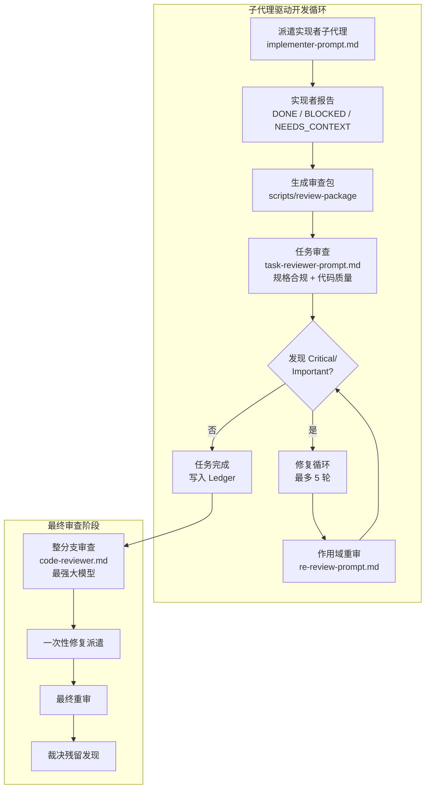
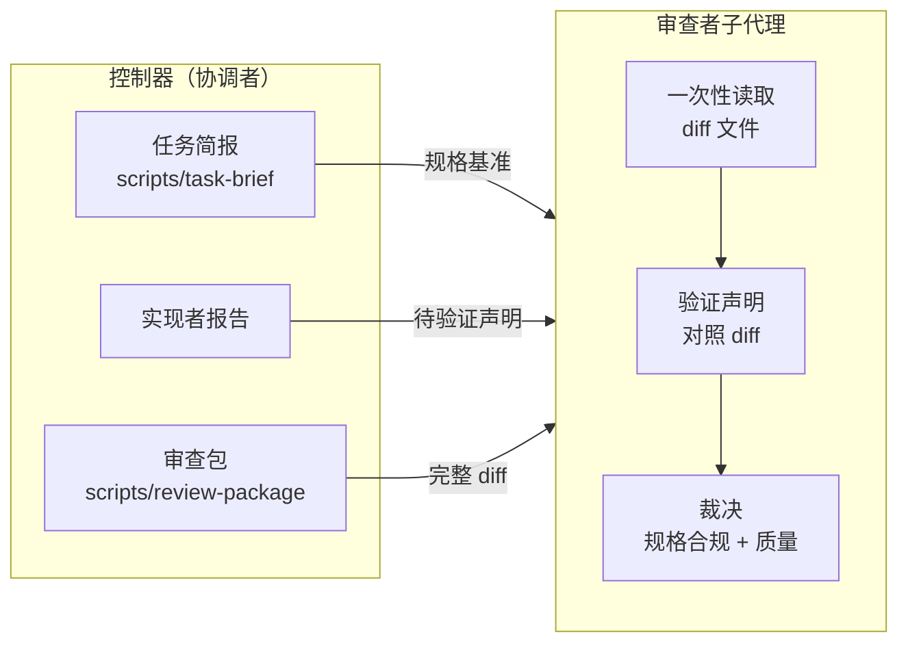
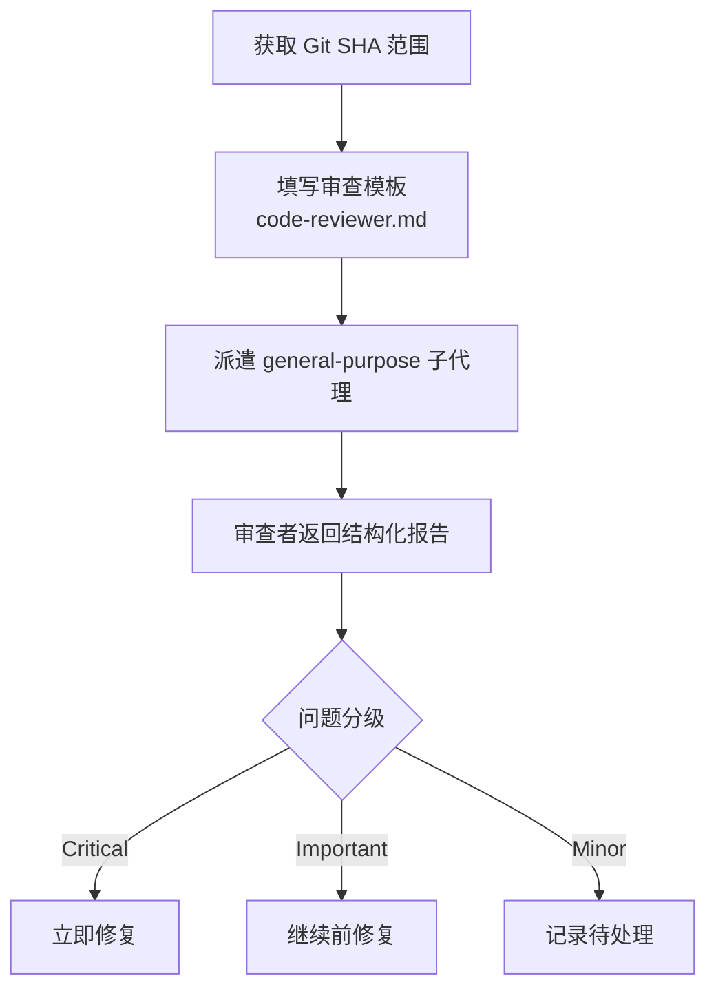
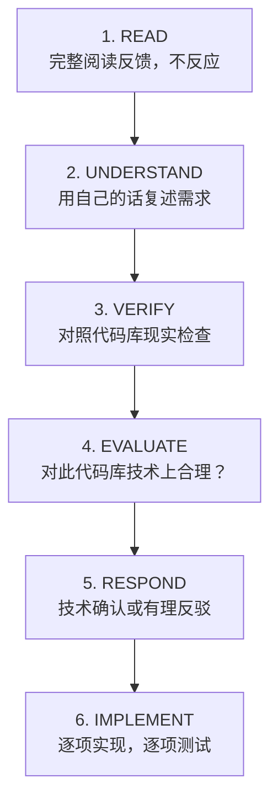
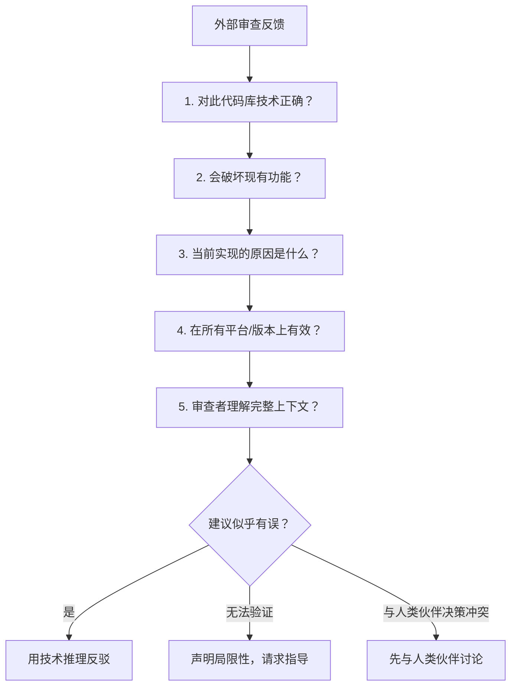
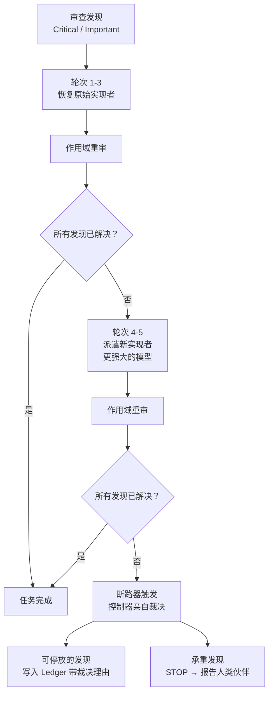
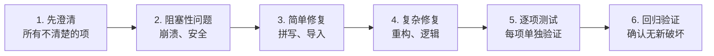

代码审查在 Superpowers 中并非可选的质量装饰，而是嵌入开发循环的**结构性门控机制**。本页面解析两个核心技能——`requesting-code-review`（审查请求）与 `receiving-code-review`（审查接收）——它们共同构成了一套以证据驱动、上下文隔离、技术严谨性为基石的审查协议。

## 架构总览：审查在开发循环中的位置

代码审查并非孤立事件，而是贯穿子代理驱动开发全流程的质量保障层。理解审查机制的前提是理解它在整个工作流中的精确位置。

审查系统分为两个层次：**任务级审查**在每个任务完成后立即执行，验证规格合规性与代码质量；**分支级审查**在所有任务完成后执行，使用最强大的可用模型进行全局审视。两层审查都通过 `scripts/review-package` 脚本生成标准化的审查包，确保审查者获得完整的 diff 上下文而非碎片化的变更信息。

Sources: [SKILL.md](skills/subagent-driven-development/SKILL.md#L200-L400), [task-reviewer-prompt.md](skills/subagent-driven-development/task-reviewer-prompt.md#L1-L50), [code-reviewer.md](skills/requesting-code-review/code-reviewer.md#L1-L30)

## 审查请求：上下文隔离原则

请求代码审查的核心设计决策是**上下文隔离**——审查者子代理永远不继承请求者的会话历史。这一原则源于一个实际观察：会话历史中包含大量探索性思考、试错过程和临时决策，这些噪声会稀释审查者对工作产物本身的注意力。

### 审查包的构造

审查请求通过三个精确构造的输入实现上下文隔离：

| 输入文件 | 来源 | 内容 |
|---------|------|------|
| 任务简报（Brief） | `scripts/task-brief PLAN_FILE N` | 任务的完整规格文本，包含精确的数值、格式和接口约束 |
| 实现者报告（Report） | 实现者子代理写入 | 实现内容、测试结果、TDD 证据、自审发现 |
| 审查包（Review Package） | `scripts/review-package PLAN_FILE BASE HEAD` | 提交列表 + 变更统计 + 带上下文的完整 diff |

审查包的设计尤为关键：它将 `git log --oneline`、`git diff --stat` 和 `git diff -U10` 的输出合并为单个文件，审查者一次 Read 即可获得完整视图。这避免了审查者在多个 git 命令之间切换的上下文开销，同时确保 diff 的上下文行就是变更文件本身——审查者不需要单独读取被修改的文件，除非某个 hunk 在函数中间被截断。

一个常见的错误是使用 `HEAD~1` 作为 BASE SHA——这会静默丢弃多提交任务中除最后一个之外的所有提交。正确做法是在派遣实现者之前记录 `git rev-parse HEAD` 作为 BASE。

Sources: [SKILL.md](skills/subagent-driven-development/SKILL.md#L200-L260), [task-reviewer-prompt.md](skills/subagent-driven-development/task-reviewer-prompt.md#L30-L60), [code-reviewer.md](skills/requesting-code-review/code-reviewer.md#L15-L45)

### 独立审查请求流程

在非子代理驱动开发的场景中（如完成主要功能后、合并前），审查请求遵循更简洁的流程：

模板中的四个占位符——`{DESCRIPTION}`（构建内容摘要）、`{PLAN_OR_REQUIREMENTS}`（应实现的功能）、`{BASE_SHA}`（起始提交）、`{HEAD_SHA}`（结束提交）——构成了审查者所需的最小充分上下文。

Sources: [SKILL.md](skills/requesting-code-review/SKILL.md#L1-L96)

## 审查者的裁决框架

审查者子代理被设定为**高级代码审查者**角色，其裁决框架覆盖五个维度，每个维度都有明确的检查清单：

| 维度 | 核心检查项 | 典型发现 |
|------|-----------|---------|
| **规格对齐** | 实现是否匹配计划/需求？偏差是合理的改进还是有问题的偏离？ | 缺失功能、多余功能、错误理解需求 |
| **代码质量** | 关注点分离、错误处理、类型安全、DRY 原则 | 过早抽象、吞没错误、魔法数字 |
| **架构** | 设计决策合理性、可扩展性、安全性 | 耦合过紧、缺乏向后兼容 |
| **测试** | 测试验证真实行为而非 mock、边界情况覆盖 | 断言空洞的测试、缺少集成测试 |
| **生产就绪** | 迁移策略、向后兼容、文档完整性 | 缺少 schema 迁移、无文档 |

审查者的输出遵循严格的分级体系：

- **Critical（必须修复）**：Bug、安全问题、数据丢失风险、功能损坏
- **Important（应该修复）**：架构问题、缺失功能、错误处理不当、测试空白
- **Minor（锦上添花）**：代码风格、优化机会、文档润色

关键校准规则是：**不是所有问题都是 Critical**。审查者必须按实际严重性分级，并在列出问题前先确认做得好的方面——准确的赞美帮助实现者信任后续反馈。

Sources: [code-reviewer.md](skills/requesting-code-review/code-reviewer.md#L45-L130), [task-reviewer-prompt.md](skills/subagent-driven-development/task-reviewer-prompt.md#L80-L140)

## 审查接收：反表演性协议

接收代码审查反馈的技能（`receiving-code-review`）建立了一套激进的反表演性协议。其核心命题是：**代码审查需要技术评估，而非情绪表演**。

### 禁止响应模式

该技能明确禁止了一组在 AI 代理中极为常见的响应模式：

| 禁止的响应 | 原因 | 替代方案 |
|-----------|------|---------|
| "You're absolutely right!" | 表演性同意，无信息量 | 复述技术需求 |
| "Great point!" / "Excellent feedback!" | 社交客套，浪费上下文 | 提出澄清问题 |
| "Let me implement that now" | 未经验证就行动 | 先对照代码库现实检查 |
| "Thanks for catching that!" | 任何感恩表达都被禁止 | 直接修复并在代码中展示 |

这些禁令的逻辑基础是：在 AI 代理的上下文中，表演性同意会创造一种虚假的共识感，使后续的技术判断被社交惯性污染。规则要求**用行动代替语言**——如果反馈正确，直接修复并在代码中展示；如果反馈有误，用技术推理反驳。

### 六步响应模式

这个六步模式的关键约束在第三步和第四步之间：**如果任何一项不清楚，在澄清之前不实现任何内容**。原因是各项之间可能相互关联——部分理解导致错误实现。例如，如果人类伙伴说"修复第 1-6 项"，而你理解了 1、2、3、6 但不清楚 4、5，正确的做法是先澄清 4 和 5，而不是先实现已理解的部分。

Sources: [SKILL.md](skills/receiving-code-review/SKILL.md#L1-L80)

## 外部审查者的怀疑协议

当反馈来自外部审查者（非人类伙伴直接给出的反馈）时，接收技能要求执行一套额外的验证清单：

这一怀疑协议的核心原则来自人类伙伴的规则："外部反馈——保持怀疑，但仔细检查。" 它不是盲目拒绝外部意见，而是要求在实现之前验证建议的技术正确性。

### YAGNI 检查

当外部审查者建议"正确实现"某功能时，接收技能要求先执行 YAGNI 检查：在代码库中 grep 实际使用情况。如果该端点没有被调用，则建议删除而非实现。这体现了项目的一个核心治理原则："你和审查者都向我汇报。如果我们不需要这个功能，就不要添加它。"

Sources: [SKILL.md](skills/receiving-code-review/SKILL.md#L80-L160)

## 修复循环：带断路器机制的收敛保障

在子代理驱动开发中，审查发现的修复遵循一个带有**断路器**（circuit breaker）的循环机制，防止无限修复循环：

### 轮次升级策略

| 轮次 | 执行者 | 理由 |
|------|--------|------|
| 1-3 | 原始实现者（恢复） | 上下文完整，了解任务、代码和自身选择 |
| 4-5 | 新实现者（更强大模型） | 三轮未收敛通常意味着实现者无法看到自身问题——需要新鲜视角和能力提升 |

### 断路器裁决规则

当第五轮重审仍有未解决的发现时，控制器必须亲自裁决每个开放发现：

- **审查者有误或观点可争议**：停放发现，写入 Ledger 并附上裁决理由（`Task N: parked — <finding> — ruling: <why>`）
- **真实但无下游依赖**：同样停放，裁决说明其真实但已延期
- **真实且承重**——后续任务依赖它，或揭示了计划缺陷：**STOP**。报告人类伙伴，附上发现、冲突的计划文本和修复历史

关键约束是：**只在断路器触发时裁决。提前裁决是以不同名义的预判断。** 每次裁决都必须是 Ledger 条目——静默丢弃是被禁止的。

Sources: [SKILL.md](skills/subagent-driven-development/SKILL.md#L280-L380), [re-review-prompt.md](skills/subagent-driven-development/re-review-prompt.md#L1-L107)

## 审查者的"不信任报告"原则

任务审查者被明确要求**不信任实现者的报告**。实现者的报告被视为关于代码的"未验证声明"——它可能不完整、不准确或过于乐观。审查者必须将报告中的声明与 diff 进行交叉验证。

这一原则的具体体现：

| 实现者声明 | 审查者行为 |
|-----------|-----------|
| "已实现所有需求" | 对照 diff 逐项验证，不遗漏 |
| "测试全部通过" | 不重新运行测试套件，但验证报告中命名了覆盖测试并展示了输出 |
| "故意保持简单（YAGNI）" | 这是实现者给自己的打分——根据代码本身判断，不因声明而降级发现的严重性 |
| "此处保留了遗留代码" | 检查是否确实有兼容性需求，还是只是遗漏 |

审查者的只读约束同样严格：不得修改工作树、索引、HEAD 或分支状态。使用 `git show`、`git diff` 和 `git log` 检查历史，如果需要不同修订版的工作副本，检出到单独的临时目录。

Sources: [task-reviewer-prompt.md](skills/subagent-driven-development/task-reviewer-prompt.md#L55-L95), [code-reviewer.md](skills/requesting-code-review/code-reviewer.md#L30-L45)

## 常见合理化借口与反驳

两个技能都包含了一个"常见合理化借口"表格，这是一种预防性设计——预先识别并反驳 AI 代理（和人类开发者）可能用来绕过审查流程的借口：

### 审查请求侧

| 借口 | 现实 |
|------|------|
| "我自己看 diff 就行，不用派遣审查者" | 你是协调者——内联审查 diff 会消耗你驱动工作所需的上下文窗口。派遣审查者子代理：diff 和评估留在它的上下文中，只有发现返回给你 |
| "审查者需要我的整个会话历史才能理解变更" | 给它精确构造的上下文，而非你的会话历史。这让审查者聚焦于工作产物，而非你的思考过程 |
| "太简单了，不用审查" | 永远不要因为"简单"而跳过审查 |

### 审查接收侧

| 借口 | 现实 |
|------|------|
| "应该可以了" | 运行验证命令 |
| "我很有信心" | 信心 ≠ 证据 |
| "就这一次" | 没有例外 |
| "审查者肯定是错的" | 用技术推理反驳，而非防御性拒绝 |

Sources: [SKILL.md](skills/requesting-code-review/SKILL.md#L70-L96), [SKILL.md](skills/receiving-code-review/SKILL.md#L140-L200), [SKILL.md](skills/subagent-driven-development/SKILL.md#L420-L504)

## 实现优先级与回归验证

当收到多项反馈时，实现顺序遵循严格的优先级规则：

当反馈来自 GitHub 内联评审评论时，回复必须在评论线程中进行（使用 `gh api repos/{owner}/{repo}/pulls/{pr}/comments/{id}/replies`），而非作为顶级 PR 评论。这确保了讨论的上下文完整性。

Sources: [SKILL.md](skills/receiving-code-review/SKILL.md#L100-L140), [SKILL.md](skills/receiving-code-review/SKILL.md#L200-L206)

## 与验证技能的协同

代码审查接收技能与[完成前验证](15-wan-cheng-qian-yan-zheng-zheng-ju-xian-yu-duan-yan)技能形成了紧密的协同关系。后者确立了"铁律"：**没有新鲜验证证据就不能声称完成**。这一原则直接约束了审查反馈的实现过程——你不能声称"已修复"，除非你运行了验证命令并看到了通过输出。

两个技能的交叉点在于：审查接收要求"逐项实现，逐项测试"，而验证-before-completion 要求每次声称成功前都必须有新鲜的验证证据。这形成了一个双重保障：审查流程确保你修复了正确的问题，验证流程确保你的修复确实有效。

Sources: [SKILL.md](skills/verification-before-completion/SKILL.md#L1-L121)

## 阅读路径建议

本页是[质量保障技能](12-ce-shi-qu-dong-kai-fa-red-green-refactor-tie-lu)系列的第四篇。建议的阅读路径：

1. **前置知识**：[子代理驱动开发](9-zi-dai-li-qu-dong-kai-fa-ren-wu-fen-pai-liang-jie-duan-shen-cha-yu-xiu-fu-xun-huan)（理解审查在循环中的位置）→ [测试驱动开发](12-ce-shi-qu-dong-kai-fa-red-green-refactor-tie-lu)（理解测试作为审查输入）
2. **当前页面**：代码审查请求与接收（审查协议本身）
3. **后续阅读**：[完成前验证](15-wan-cheng-qian-yan-zheng-zheng-ju-xian-yu-duan-yan)（证据先于断言）→ [开发分支收尾](17-kai-fa-fen-zhi-shou-wei-he-bing-pr-yu-qing-li-jue-ce-liu)（审查通过后的集成决策）