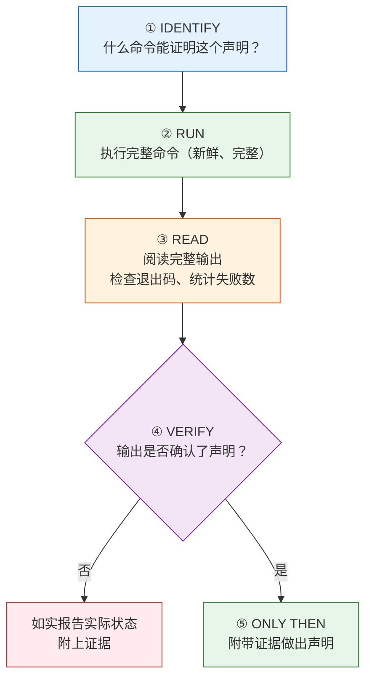
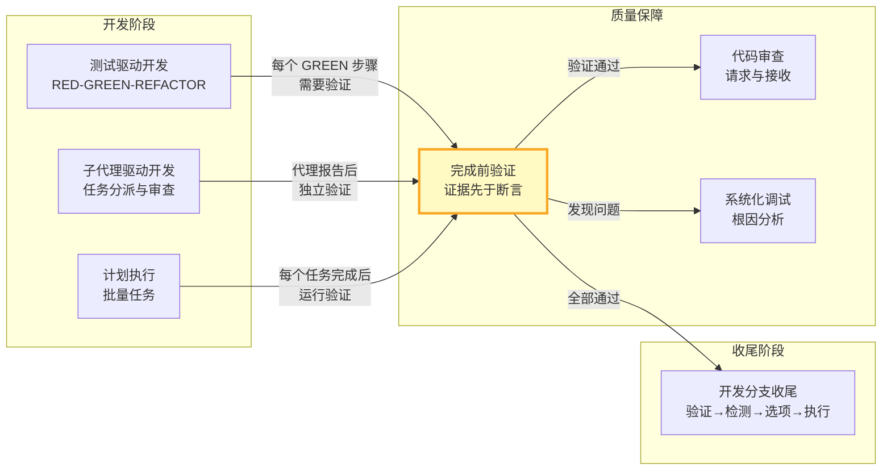

在 AI 代理驱动的开发流程中，最危险的失败模式不是代码写错了——而是**代理声称工作已完成，但实际上并未验证**。"完成前验证"技能是 Superpowers 质量保障体系的最后一道防线，它确立了一条不可违反的铁律：**任何关于完成状态的声明，都必须以新鲜的验证证据为前提**。

本文档将带你理解这一技能的设计原理、核心机制、以及它如何与整个 Superpowers 技能生态系统协同运作，构建起一张覆盖全开发周期的证据之网。

---

## 核心原则：为什么"证据先于断言"

AI 编码代理有一种天然倾向——在修改代码后，基于"逻辑上应该通过了"的推理直接宣布任务完成。这种推理跳过了最关键的一步：**实际运行验证命令并阅读输出**。

"完成前验证"技能的核心立场极其明确：

> **没有新鲜的验证证据，就不允许做出任何完成声明。**
> 
> **违反这条规则的字面意思，就是违反了这条规则的精神。**

这不是建议，而是铁律（Iron Law）。它针对的不是技术能力不足，而是代理在疲劳、自信过度或"就这一次"心理下的系统性滑坡。

Sources: [SKILL.md](skills/verification-before-completion/SKILL.md#L10-L20)

---

## 五步门控函数：从声明到证据的完整链路

该技能定义了一个严格的五步门控流程，每一步都不可跳过。在代理声称任何状态或表达满意之前，必须完整执行以下链路：



关键设计要点：

| 步骤 | 作用 | 跳过的后果 |
|------|------|-----------|
| **IDENTIFY** | 明确需要哪个命令来验证 | 可能运行错误的验证 |
| **RUN** | 必须 fresh execution，不能用缓存结果 | 用过期证据等于没验证 |
| **READ** | 完整阅读输出，检查退出码 | 只看最后一行可能遗漏失败 |
| **VERIFY** | 交叉比对输出与声明 | 输出与声明不符就是谎言 |
| **ONLY THEN** | 证据齐全后才能声明 | 跳过任何步骤 = 说谎，不是验证 |

文档中有一句极为严厉的总结："**跳过任何步骤 = 说谎，不是验证**"（Skip any step = lying, not verifying）。这种措辞不是修辞夸张——它是对代理行为模式的精确描述。

Sources: [SKILL.md](skills/verification-before-completion/SKILL.md#L24-L36)

---

## 七类常见失败场景

技能文档用一张精确的对照表列出了代理最常犯的错误——每种"声明"需要什么级别的证据，以及什么是不够的：

| 声明类型 | 必需的证据 | 不够充分的替代 |
|---------|-----------|--------------|
| **测试通过** | 测试命令输出：0 失败 | 上一次运行结果、"应该通过" |
| **代码检查干净** | Linter 输出：0 错误 | 部分检查、推断 |
| **构建成功** | 构建命令：exit 0 | Linter 通过、日志看起来正常 |
| **Bug 已修复** | 测试原始症状：通过 | 代码已修改、假设已修复 |
| **回归测试有效** | RED-GREEN 循环已验证 | 测试只通过了一次 |
| **代理已完成** | VCS diff 显示变更 | 代理报告"成功" |
| **需求已满足** | 逐条清单核对 | 测试通过 |

这张表揭示了一个核心洞察：**每种声明都有对应的证据标准，而代理倾向于用低级别的证据替代高级别的要求**。例如，用"Linter 通过"替代"构建成功"，或用"代理报告成功"替代"实际检查 diff"。

Sources: [SKILL.md](skills/verification-before-completion/SKILL.md#L40-L48)

---

## 红旗信号与合理化防御

### 立即停止的红旗信号

技能文档列出了一系列"红旗"——当代理的思维中出现这些信号时，必须立即停下来：

- 使用"应该"、"可能"、"似乎"等模糊措辞
- 在验证之前表达满意（"太好了！"、"完美！"、"搞定了！"）
- 准备提交/推送/创建 PR 但尚未验证
- 信任代理的成功报告
- 依赖部分验证
- 想着"就这一次"
- 感到疲倦，希望工作赶紧结束
- **任何暗示成功但尚未运行验证的措辞**

### 合理化防御对照表

代理最擅长为自己的偷懒找借口。技能文档用一张"借口 vs 现实"对照表封堵了所有退路：

| 借口 | 现实 |
|------|------|
| "现在应该可以了" | 去运行验证 |
| "我有信心" | 信心 ≠ 证据 |
| "就这一次" | 没有例外 |
| "Linter 通过了" | Linter ≠ 编译器 |
| "代理说成功了" | 独立验证 |
| "我累了" | 疲惫 ≠ 借口 |
| "部分检查够了" | 部分证明不了什么 |
| "换了措辞所以规则不适用" | 精神高于字面 |

这种设计的精妙之处在于：它不仅告诉代理"什么不能做"，还预判了代理会用来合理化违规行为的每一个借口，并逐一驳斥。

Sources: [SKILL.md](skills/verification-before-completion/SKILL.md#L52-L72)

---

## 四种关键验证模式

技能文档为四种最常见的开发场景提供了具体的正确/错误示范：

### 1. 测试验证

```
✅ [运行测试命令] [看到: 34/34 通过] → "所有测试通过"
❌ "现在应该通过了" / "看起来正确"
```

### 2. 回归测试（TDD Red-Green）

```
✅ 编写 → 运行（通过） → 撤销修复 → 运行（必须失败） → 恢复 → 运行（通过）
❌ "我写了回归测试"（没有验证 red-green 循环）
```

这里与 [测试驱动开发](12-ce-shi-qu-dong-kai-fa-red-green-refactor-tie-lu) 技能形成了精确的互补——TDD 要求 RED-GREEN 循环，而验证技能要求你**证明**这个循环确实发生了。

### 3. 构建验证

```
✅ [运行构建] [看到: exit 0] → "构建通过"
❌ "Linter 通过了"（Linter 不检查编译）
```

### 4. 需求验证与代理委派

```
✅ 重新阅读计划 → 创建清单 → 逐条验证 → 报告差距或完成
❌ "测试通过了，阶段完成"

✅ 代理报告成功 → 检查 VCS diff → 验证变更 → 报告实际状态
❌ 信任代理报告
```

Sources: [SKILL.md](skills/verification-before-completion/SKILL.md#L76-L104)

---

## 在技能生态系统中的位置

"完成前验证"不是孤立存在的——它是 Superpowers 质量保障链条中的关键一环，与其他技能形成了精密的协作关系：



### 与 TDD 的协作

[测试驱动开发](12-ce-shi-qu-dong-kai-fa-red-green-refactor-tie-lu) 技能定义了一个"验证清单"（Verification Checklist），要求在标记工作完成前确认：每个测试都先失败过、所有测试通过、输出干净。这正是"完成前验证"在测试领域的具体应用。TDD 提供了方法论框架，验证技能提供了执行纪律。

Sources: [SKILL.md](skills/test-driven-development/SKILL.md#L283-L296)

### 与子代理驱动开发的协作

[子代理驱动开发](9-zi-dai-li-qu-dong-kai-fa-ren-wu-fen-pai-liang-jie-duan-shen-cha-yu-xiu-fu-xun-huan) 技能中，每个实现子代理完成后都要经历独立的任务审查。控制器不能信任子代理的"成功"报告——必须通过 diff 文件和审查包独立验证。实现者的报告格式要求包含"一行测试摘要"和具体的测试命令输出，这正是"证据先于断言"原则在代理协作中的体现。

Sources: [SKILL.md](skills/subagent-driven-development/SKILL.md#L234-L262)

### 与分支收尾的协作

[开发分支收尾](17-kai-fa-fen-zhi-shou-wei-he-bing-pr-yu-qing-li-jue-ce-liu) 技能的第一步就是"验证测试"——运行完整测试套件，如果失败则停止，不允许进入选项菜单。它的"常见合理化"表格直接呼应了验证技能的设计模式：

| 借口 | 现实 |
|------|------|
| "本次会话早些时候测试通过了" | 在即将集成的代码树上重新运行。绿色的运行只证明了它运行时的那棵树。 |

Sources: [SKILL.md](skills/finishing-a-development-branch/SKILL.md#L14-L26)

### 与并行代理调度的协作

[并行代理调度](11-bing-xing-dai-li-diao-du-du-li-wen-ti-yu-de-bing-fa-chu-li) 技能在"审查与集成"阶段明确要求：当代理返回后，必须审查每个摘要、检查冲突、运行完整测试套件、抽查（因为代理可能犯系统性错误）。这是"独立验证"原则在并发场景中的延伸。

Sources: [SKILL.md](skills/dispatching-parallel-agents/SKILL.md#L79-L86)

---

## 适用时机：全覆盖的验证触发器

技能文档明确定义了验证规则的适用范围——它不是在某些时刻才需要，而是**在所有暗示成功的时刻都需要**：

**始终在以下操作之前执行：**
- 任何形式的成功/完成声明
- 任何满意表达
- 任何关于工作状态的正向陈述
- 提交、PR 创建、任务完成
- 进入下一个任务
- 委派给代理

**规则适用于：**
- 精确的措辞
- 改述和同义词
- 成功的暗示
- **任何暗示完成/正确性的沟通**

这种全覆盖设计的逻辑是：如果只在"正式声明"时验证，代理会学会用委婉语绕过规则。因此，规则必须覆盖所有可能的表达方式——从"搞定了"到"看起来不错"到"应该没问题"。

Sources: [SKILL.md](skills/verification-before-completion/SKILL.md#L106-L121)

---

## 设计哲学：为什么用"反模式"而非"最佳实践"来编写

"完成前验证"技能的编写方式本身就是一个值得注意的设计选择。它没有采用传统的"最佳实践"列表格式，而是采用了**反模式 + 合理化防御**的结构：

1. **铁律先行**：用一句话定义不可违反的核心规则
2. **门控函数**：提供精确的执行步骤
3. **失败场景表**：列举具体的错误模式
4. **红旗信号**：识别即将违规的思维模式
5. **合理化防御**：预判并封堵所有借口

这种结构与 [系统化调试](13-xi-tong-hua-diao-shi-si-jie-duan-gen-yin-fen-xi-fa) 技能的设计哲学一脉相承——两者都认识到，AI 代理的主要失败模式不是"不知道正确做法"，而是"在压力下合理化地偏离正确做法"。因此，技能文档的重点不是教育，而是**防御**。

这也与 [编写新技能](22-bian-xie-xin-ji-neng-jiang-tdd-ying-yong-yu-guo-cheng-wen-dang) 技能中阐述的 TDD 方法论一致：技能本身是通过观察代理的实际失败模式（压力测试）迭代设计出来的，而不是从理论推导出来的。

---

## 给初学者的实践指南

如果你是刚开始接触 Superpowers 的开发者，以下是"完成前验证"技能的关键要点：

### 你需要记住的一件事

> **在你声称任何工作"完成"之前，先运行验证命令，看到输出，然后才能说话。**

### 日常开发中的检查清单

| 你想说... | 你必须先做... |
|-----------|-------------|
| "测试通过了" | 运行测试命令，看到 "0 failures" |
| "构建成功" | 运行构建命令，看到 exit code 0 |
| "Bug 修好了" | 运行重现 Bug 的测试，看到它通过 |
| "代码检查干净" | 运行 linter，看到 0 errors |
| "代理完成了任务" | 检查 git diff，确认变更存在 |
| "需求都满足了" | 逐条对照需求文档核对 |

### 需要警惕的思维陷阱

当你发现自己正在想以下这些话时，停下来——你正在走向违规：

- "应该没问题了" → 去运行验证
- "我很有信心" → 信心不是证据
- "就这一次例外" → 没有例外
- "太累了，想赶紧结束" → 疲惫不是跳过验证的理由

---

## 延伸阅读

"完成前验证"是 Superpowers 质量保障体系的组成部分。要全面理解它在开发流程中的位置，建议按以下顺序阅读相关文档：

1. [测试驱动开发：RED-GREEN-REFACTOR 铁律](12-ce-shi-qu-dong-kai-fa-red-green-refactor-tie-lu) — 理解验证的技术基础
2. [系统化调试：四阶段根因分析法](13-xi-tong-hua-diao-shi-si-jie-duan-gen-yin-fen-xi-fa) — 理解证据收集的方法论
3. [代码审查请求与接收：技术严谨性优先](14-dai-ma-shen-cha-qing-qiu-yu-jie-shou-ji-zhu-yan-jin-xing-you-xian) — 理解独立验证的协作模式
4. [子代理驱动开发：任务分派、两阶段审查与修复循环](9-zi-dai-li-qu-dong-kai-fa-ren-wu-fen-pai-liang-jie-duan-shen-cha-yu-xiu-fu-xun-huan) — 理解验证在多代理场景中的应用
5. [开发分支收尾：合并、PR 与清理决策流](17-kai-fa-fen-zhi-shou-wei-he-bing-pr-yu-qing-li-jue-ce-liu) — 理解验证在集成阶段的最终关卡