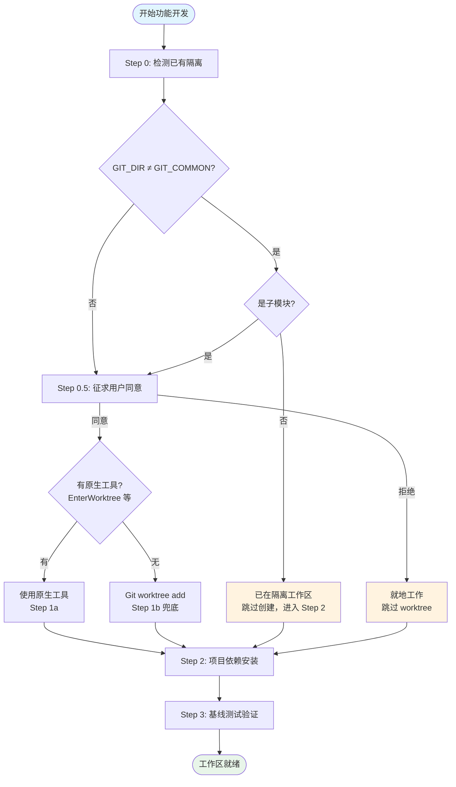
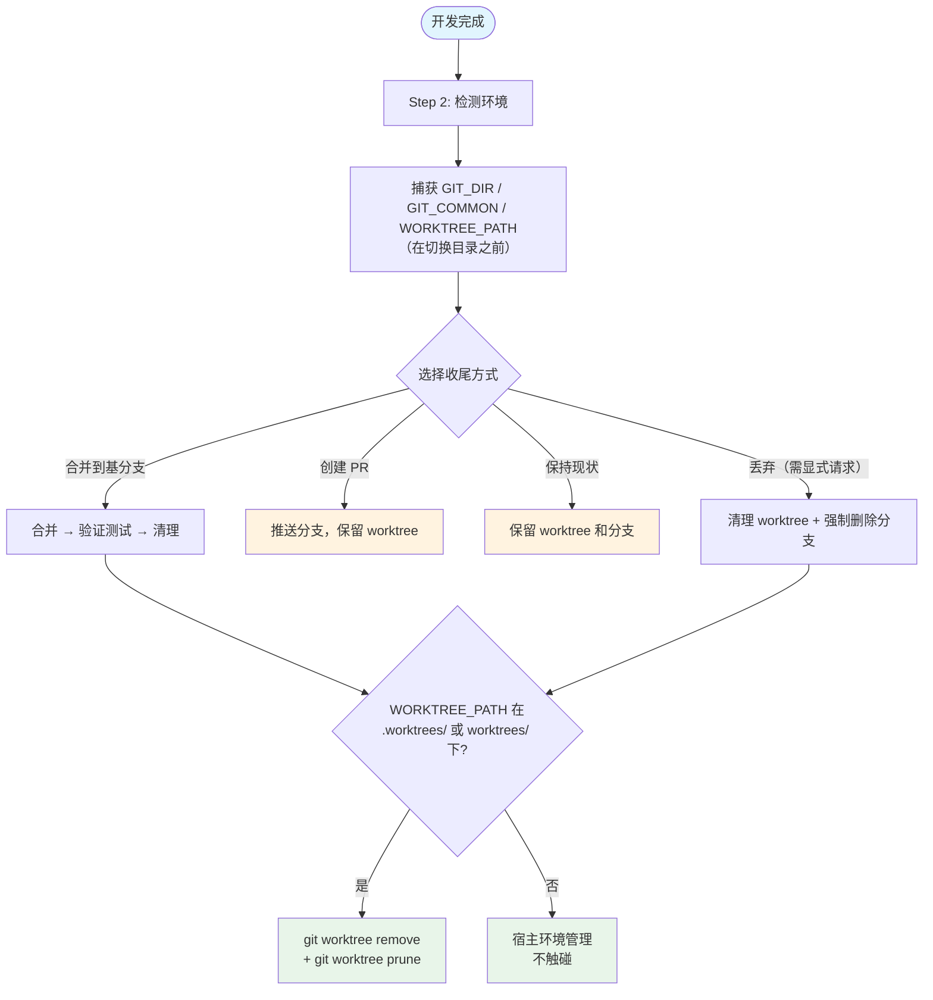

在并行开发中，直接在主工作区修改代码意味着对当前分支的污染风险。Git Worktree 机制通过创建共享同一 `.git` 数据库的独立工作目录来解决这一问题。Superpowers 项目将 worktree 管理封装为一个完整的技能（skill），覆盖**检测已有隔离 → 选择创建策略 → 项目初始化 → 基线验证 → 收尾清理**的全生命周期。本文档解析该技能的设计原理、决策流程与实现细节。

## 架构总览

Superpowers 的 worktree 管理遵循**检测优先、原生工具优先、Git 兜底**的三层决策模型。整个流程由两个技能协同完成：`using-git-worktrees` 负责工作区的检测与创建，`finishing-a-development-branch` 负责收尾时的清理与整合。



核心设计原则是**检测状态而非检测平台**——通过 `GIT_DIR` 与 `GIT_COMMON` 的路径比较来判断隔离状态，而非嗅探环境变量来识别宿主平台。这一方法基于 Git 2.5（2015 年）引入的稳定原语，跨所有平台通用，且无需随新平台出现而维护。

Sources: [SKILL.md](skills/using-git-worktrees/SKILL.md#L1-L16), [2026-04-06-worktree-rototill-design.md](docs/superpowers/specs/2026-04-06-worktree-rototill-design.md#L39-L41)

## Step 0：检测已有隔离

在任何创建操作之前，技能首先执行三步检测命令来确定当前环境状态：

```bash
GIT_DIR=$(cd "$(git rev-parse --git-dir)" 2>/dev/null && pwd -P)
GIT_COMMON=$(cd "$(git rev-parse --git-common-dir)" 2>/dev/null && pwd -P)
BRANCH=$(git branch --show-current)
```

**判定逻辑**基于 `GIT_DIR` 与 `GIT_COMMON` 的关系：

| 条件 | 含义 | 后续动作 |
|------|------|----------|
| `GIT_DIR == GIT_COMMON` | 普通仓库检出 | 进入同意步骤，可能需要创建 worktree |
| `GIT_DIR != GIT_COMMON`，有命名分支 | 已在链接 worktree 中 | 跳过创建，直接进入项目设置 |
| `GIT_DIR != GIT_COMMON`，detached HEAD | 外部管理的 worktree（如 Codex App 沙箱） | 跳过创建，报告外部管理状态 |

**子模块防护**是一个关键的边界条件。`GIT_DIR != GIT_COMMON` 在 Git 子模块中同样成立。技能通过额外的检测命令排除误判：

```bash
# 如果返回路径，说明在子模块中而非 worktree 中——视为普通仓库
git rev-parse --show-superproject-working-tree 2>/dev/null
```

这一防护确保子模块环境不会被错误识别为已隔离的 worktree，避免在子模块内嵌套创建 worktree 的灾难性后果。

Sources: [SKILL.md](skills/using-git-worktrees/SKILL.md#L16-L45), [2026-04-06-worktree-rototill-design.md](docs/superpowers/specs/2026-04-06-worktree-rototill-design.md#L57-L83)

## Step 1：创建隔离工作区的双通道策略

当 Step 0 确认当前不在隔离环境中且用户同意创建后，技能按优先级尝试两种创建机制。

### 1a. 原生工具优先

如果宿主平台提供了 worktree 或工作区隔离工具（如 Claude Code 的 `EnterWorktree`、`WorktreeCreate`、`/worktree` 命令或 `--worktree` 标志），**必须使用原生工具**。原生工具自动处理目录放置、分支创建和清理，而使用 `git worktree add` 绕过原生工具会产生宿主无法感知和管理的"幽灵状态"。

这一设计决策经过了严格的 TDD 验证。初始的抽象表述（"你了解自己的工具集"）在测试中失败率为 2/6——代理锚定在 Step 1b 的具体 Git 命令上而忽略抽象指导。最终通过三个关键修改达到 50/50 通过率：

1. **显式工具命名**——列出 `EnterWorktree`、`WorktreeCreate`、`/worktree`、`--worktree` 将决策从解释型（"我有原生工具吗？"）转化为事实查找型（"`EnterWorktree` 在我的工具列表中吗？"）
2. **同意桥接**——"用户同意创建 worktree 即授权你使用原生工具"直接解决了原生工具的工具级防护栏
3. **反模式命名**——在 Red Flags 中明确指出"当你有原生 worktree 工具时使用 `git worktree add` 是第 #1 错误"

Sources: [SKILL.md](skills/using-git-worktrees/SKILL.md#L47-L57), [2026-04-06-worktree-rototill-design.md](docs/superpowers/specs/2026-04-06-worktree-rototill-design.md#L94-L106), [test-worktree-native-preference.sh](tests/claude-code/test-worktree-native-preference.sh#L1-L19)

### 1b. Git Worktree 兜底

仅在无原生工具可用时使用。目录选择遵循严格的优先级链：

| 优先级 | 来源 | 说明 |
|--------|------|------|
| 1 | 用户指令文件中的声明 | 如 CLAUDE.md、GEMINI.md、AGENTS.md 中已指定路径，直接使用 |
| 2 | 已有项目本地目录 | `.worktrees/`（隐藏，优先）或 `worktrees/`（备选） |
| 3 | 默认值 | `.worktrees/` 位于项目根目录 |

**安全检查**是强制性的——在创建 worktree 之前必须验证目标目录已被 `.gitignore` 忽略：

```bash
git check-ignore -q .worktrees 2>/dev/null || git check-ignore -q worktrees 2>/dev/null
```

如果未忽略，必须先将目录添加到 `.gitignore` 并提交，然后才能继续。这一步防止 worktree 内容被意外提交到仓库中。

**沙箱降级**：如果 `git worktree add` 因权限错误失败（沙箱拒绝），技能会在当前目录就地工作，而非中断流程。

Sources: [SKILL.md](skills/using-git-worktrees/SKILL.md#L59-L101), [2026-04-06-worktree-rototill-design.md](docs/superpowers/specs/2026-04-06-worktree-rototill-design.md#L108-L147)

## 项目设置与基线验证

无论通过哪条路径获得工作区（Step 0 检测到已有隔离、Step 1a 原生工具、Step 1b Git 兜底、或无 worktree 就地工作），执行流在后续步骤中汇聚。

**自动依赖安装**根据项目类型检测并执行：

| 生态 | 检测文件 | 安装命令 |
|------|----------|----------|
| Node.js | `package.json` | `npm install` |
| Rust | `Cargo.toml` | `cargo build` |
| Python | `requirements.txt` / `pyproject.toml` | `pip install` / `poetry install` |
| Go | `go.mod` | `go mod download` |

**基线测试**确保工作区从干净状态开始。如果测试失败，技能报告失败并询问用户是继续还是调查——而非静默跳过。一个脏的基线会使后续所有失败变得模糊不清。

Sources: [SKILL.md](skills/using-git-worktrees/SKILL.md#L102-L141)

## 清理机制：基于来源的所有权模型

Worktree 的清理由 [finishing-a-development-branch](skills/finishing-a-development-branch/SKILL.md) 技能在开发分支收尾时执行。清理策略基于**来源所有权**原则：谁创建了 worktree，谁负责清理。



**关键设计决策**：

- **仅 Option 1（合并）和确认丢弃执行清理**。Option 2（PR）和 Option 3（保持）始终保留 worktree——PR 反馈需要在同一 worktree 中迭代修复
- **操作顺序至关重要**：合并 → 验证测试 → 移除 worktree → 删除分支。旧版本先删除分支再移除 worktree 会导致失败（worktree 仍引用该分支）
- **CWD 安全守卫**：`git worktree remove` 必须从 worktree 外部执行。技能在 Step 2 捕获 `WORKTREE_PATH`，在 Step 5 切换到主仓库根目录后再执行清理
- **自修复修剪**：每次 `git worktree remove` 后执行 `git worktree prune`，清理可能被外部删除的残留注册信息

Sources: [SKILL.md](skills/finishing-a-development-branch/SKILL.md#L28-L44), [SKILL.md](skills/finishing-a-development-branch/SKILL.md#L159-L178), [2026-04-06-worktree-rototill-design.md](docs/superpowers/specs/2026-04-06-worktree-rototill-design.md#L227-L247)

## 跨平台适配矩阵

不同宿主平台的 worktree 模型差异显著。技能的 detect-and-defer 架构通过统一的检测原语适配所有平台：

| 平台 | Worktree 模型 | 技能机制 | 验证状态 |
|------|---------------|----------|----------|
| Claude Code | 代理可调用的 `EnterWorktree` | Step 1a 原生工具 | 50/50 通过 |
| Codex CLI | 无原生工具（仅 shell） | Step 1b Git 兜底 | 6/6 通过 |
| Gemini CLI | 启动时 `--worktree` 标志，无代理工具 | Step 0 检测（如已启动）/ Step 1b（如未启动） | 已验证 |
| Cursor Agent | 用户面向的 `/worktree`，无代理工具 | Step 0 检测（如用户已激活）/ Step 1b | 已验证 |
| Codex App | 平台管理，detached HEAD，无代理工具 | Step 0 检测已有隔离 | 已验证 |
| OpenCode | 仅检测（`ctx.worktree`），无代理工具 | Step 1b Git 兜底 | 未测试 |

路径策略的回归测试确保技能不会引用已废弃的全局路径（`~/.config/superpowers/worktrees`），所有新建的手动 worktree 均为项目本地。

Sources: [2026-04-06-worktree-rototill-design.md](docs/superpowers/specs/2026-04-06-worktree-rototill-design.md#L305-L312), [test-worktree-path-policy.sh](tests/claude-code/test-worktree-path-policy.sh#L47-L61)

## 已修复的关键缺陷

Worktree 重构（rototill）同时修复了三个长期存在的缺陷：

| 缺陷编号 | 问题描述 | 修复方案 |
|----------|----------|----------|
| #940 | Option 2（创建 PR）的文档自相矛盾——正文说"清理 worktree"，快速参考表说"保留" | 从 Option 2 中移除清理步骤。清理仅在 Option 1 和确认丢弃时执行 |
| #999 | Option 1 先删除分支再移除 worktree，`git branch -d` 因 worktree 仍引用分支而失败 | 重排操作顺序：合并 → 验证 → 移除 worktree → 删除分支 |
| #238 | 当 CWD 在待移除的 worktree 内部时，`git worktree remove` 静默失败 | 添加 CWD 守卫：在 `git worktree remove` 之前 `cd` 到主仓库根目录 |

Sources: [2026-04-06-worktree-rototill-design.md](docs/superpowers/specs/2026-04-06-worktree-rototill-design.md#L271-L277)

## 常见反模式与纠正

技能文档中列出的"合理化借口"反映了实际测试中观察到的代理行为偏差：

| 借口 | 现实 |
|------|------|
| "我明显不在 worktree 中——不需要检查" | Step 0 必须执行。宿主创建的隔离和子模块都能通过目视检查蒙混过关，检测命令才能定论 |
| "`git worktree add` 比找原生工具更快" | 原生工具拥有放置、分支和清理的所有权。绕过它是第 #1 错误——产生宿主无法管理的幽灵状态 |
| "worktree 目录肯定已经被忽略了" | 执行 `git check-ignore`。未忽略的 worktree 目录会将整棵树提交到仓库 |
| "任何目录名都行" | 显式指令优先于已有项目本地目录，后者优先于 `.worktrees/` 默认值 |
| "工作区是全新的——基线测试可以等等" | 脏基线使后续每个失败都变得模糊。现在运行测试；越过失败继续是你的搭档的决定 |

Sources: [SKILL.md](skills/using-git-worktrees/SKILL.md#L159-L168)

## 测试验证体系

Worktree 技能的正确性通过三层测试保障：

**原生工具偏好测试**（[test-worktree-native-preference.sh](tests/claude-code/test-worktree-native-preference.sh)）采用 RED-GREEN-PRESSURE 三阶段验证：RED 阶段确认无 Step 1a 时代理使用 `git worktree add`；GREEN 阶段确认有 Step 1a 时代理使用 `EnterWorktree`；PRESSURE 阶段在时间压力和已有 `.worktrees/` 目录下确认代理仍抵抗回退诱惑。最终验证结果：50/50 运行零失败。

**路径策略回归测试**（[test-worktree-path-policy.sh](tests/claude-code/test-worktree-path-policy.sh)）确保技能文件不包含已废弃的全局路径引用，且默认指向项目本地的 `.worktrees/`。

**SDD 工作区隔离测试**（[test-sdd-workspace.sh](tests/claude-code/test-sdd-workspace.sh)）验证链接 worktree 能解析出自己独立的工作区目录，且工作区对 `git status` 不可见。

Sources: [test-worktree-native-preference.sh](tests/claude-code/test-worktree-native-preference.sh#L1-L182), [test-worktree-path-policy.sh](tests/claude-code/test-worktree-path-policy.sh#L1-L70), [test-sdd-workspace.sh](tests/claude-code/test-sdd-workspace.sh#L168-L191)

## 项目中的 Worktree 配置

本仓库自身的 `.gitignore` 已将 `.worktrees/` 列入忽略列表，这是使用 Git 兜底路径时的默认目录位置：

```
.worktrees/
```

这意味着当技能在本项目中使用 Step 1b 创建 worktree 时，安全检查（`git check-ignore`）会通过，无需额外修改 `.gitignore`。

Sources: [.gitignore](.gitignore#L1)

---

**阅读路径建议**：本页是分支管理与收尾序列的第二篇。如果你尚未了解技能系统的自动触发机制，建议先阅读 [技能（Skill）机制：自动触发与行为塑造原理](5-ji-neng-skill-ji-zhi-zi-dong-hong-fa-yu-xing-wei-su-zao-yuan-li)。完成本页后，继续阅读 [开发分支收尾：合并、PR 与清理决策流](17-kai-fa-fen-zhi-shou-wei-he-bing-pr-yu-qing-li-jue-ce-liu) 了解 worktree 清理在分支生命周期终点的完整决策流。如需理解 worktree 在并行开发中的角色，参见 [并行代理调度：独立问题域的并发处理](11-bing-xing-dai-li-diao-du-du-li-wen-ti-yu-de-bing-fa-chu-li)。