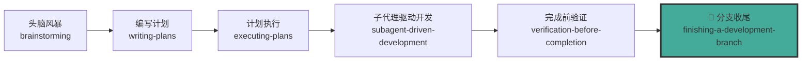
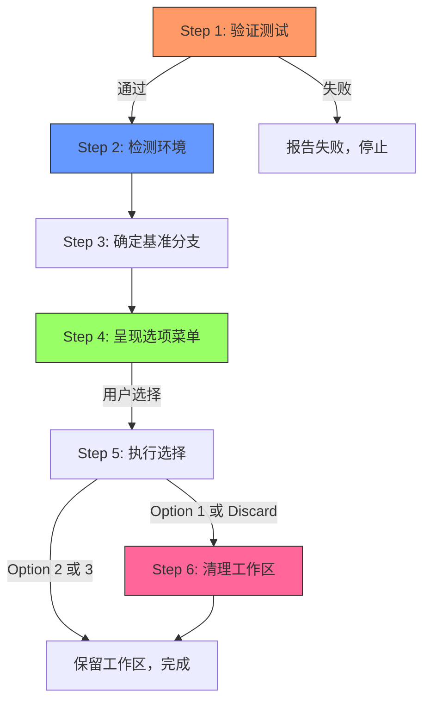
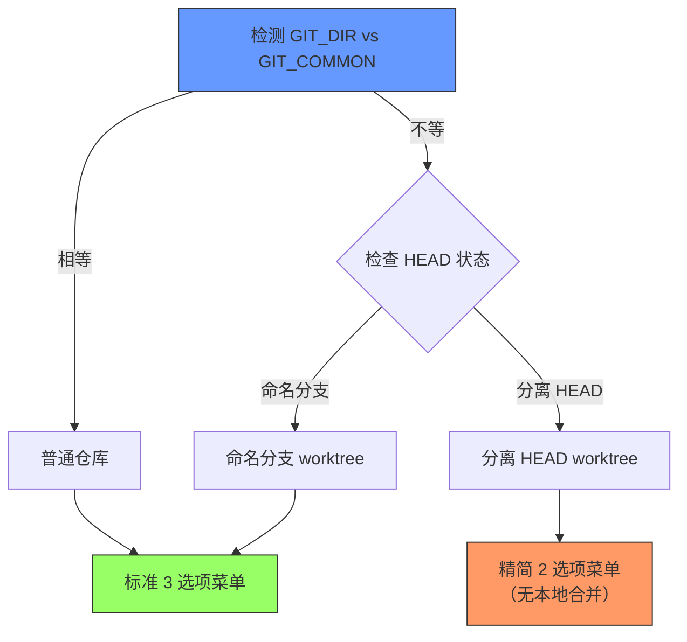
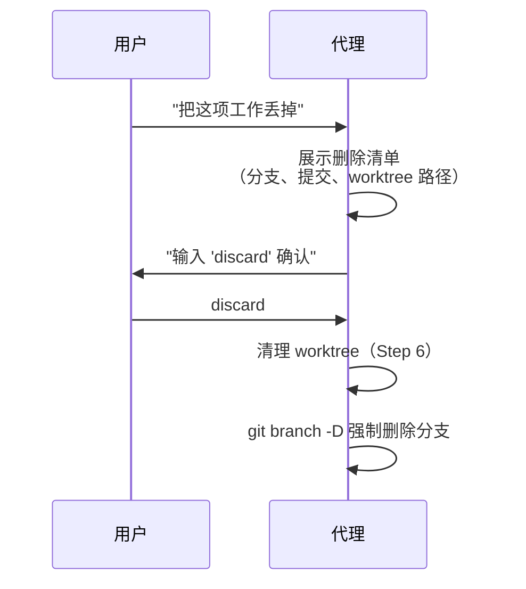
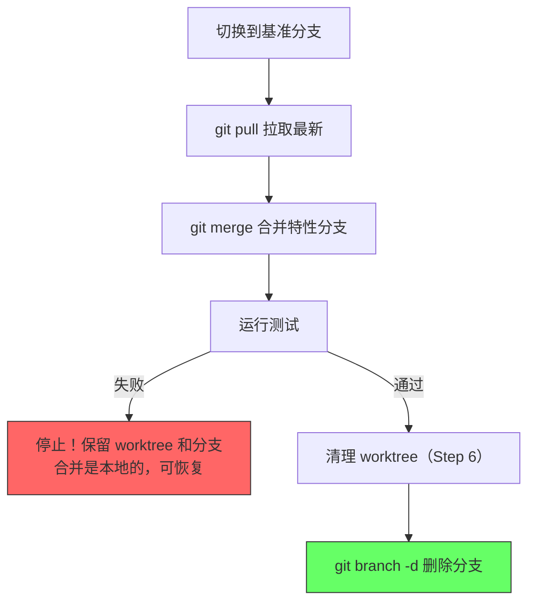
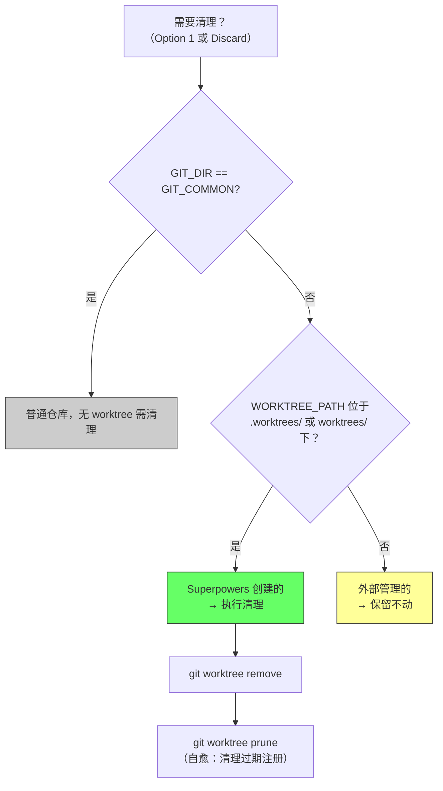
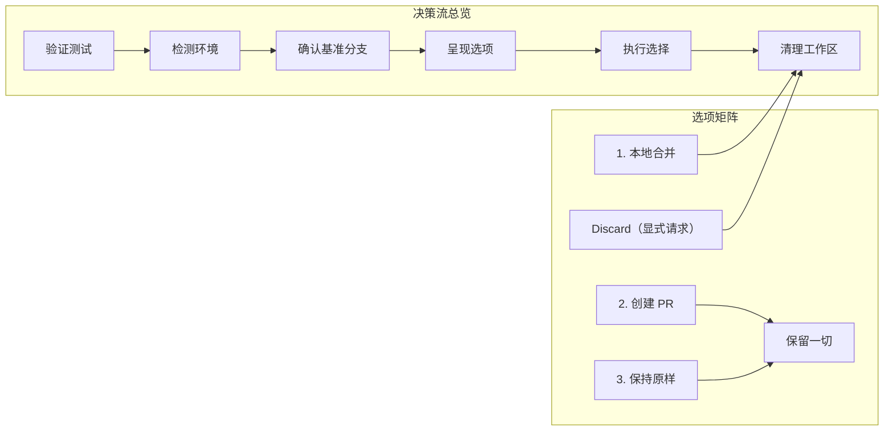

当实现计划的所有任务完成、测试全部通过后，开发工作进入最后阶段——**分支收尾**。这一阶段的核心挑战不是技术操作本身，而是**决策流的正确性**：在什么环境下提供什么选项、按什么顺序执行、何时清理资源。`finishing-a-development-branch` 技能将整个收尾过程编码为六步确定性流程，消除了代理在「完成」与「交付」之间的判断模糊地带。

本文档解析该技能的架构设计、决策逻辑与清理策略，帮助中级开发者理解并正确使用这一收尾机制。

---

## 在整体工作流中的定位

分支收尾技能不是一个孤立环节，而是整个开发流水线的**终点闸门**。它由上游技能显式调用，确保从实现到交付的无缝衔接。

在 [executing-plans](skills/executing-plans/SKILL.md#L47-L50) 中，Step 3 明确要求在所有任务完成后**必须**调用此技能：

> "Announce: 'I'm using the finishing-a-development-branch skill to complete this work.'"

在 [subagent-driven-development](skills/subagent-driven-development/SKILL.md#L396-L399) 中，最终全分支审查通过后，流程同样汇入此技能。这意味着无论走哪条执行路径，收尾决策流都是唯一的出口。

Sources: [SKILL.md](skills/finishing-a-development-branch/SKILL.md#L1-L8), [executing-plans/SKILL.md](skills/executing-plans/SKILL.md#L47-L50), [subagent-driven-development/SKILL.md](skills/subagent-driven-development/SKILL.md#L396-L399)

---

## 六步决策流架构

整个收尾流程遵循一条铁律：**验证 → 检测 → 确认 → 呈现 → 执行 → 清理**。每一步都有明确的前置条件和失败处理。

### Step 1：测试验证——不可跳过的门控

流程的第一步是运行完整测试套件。这里的设计哲学与 [verification-before-completion](skills/verification-before-completion/SKILL.md#L10-L12) 的铁律一致：**没有新鲜的验证证据，就不能声称完成**。

关键约束是「本次运行」——之前通过的测试不算数。技能文档在「常见合理化借口」表中明确反驳了「这个会话早些时候测试通过了」的借口：绿色运行只证明它运行时的那个代码树。

Sources: [SKILL.md](skills/finishing-a-development-branch/SKILL.md#L12-L22)

### Step 2：环境检测——决定菜单形态

环境检测是整个决策流的**分叉点**。通过比较 `GIT_DIR` 和 `GIT_COMMON` 两个路径，确定当前工作区的类型，进而决定呈现给用户的选项集合和清理策略。

一个容易忽略的细节：`WORKTREE_PATH` 必须在 Step 2 捕获，因为 Step 5 会切换目录，而 Step 6 的清理需要这个路径值。这是从提交 `0b47219` 修复的 bug——之前因为路径捕获时机错误导致清理失败。

Sources: [SKILL.md](skills/finishing-a-development-branch/SKILL.md#L24-L38)

### Step 3：基准分支确认——防止昂贵的错误

基准分支（base branch）是本次开发工作分叉出去的源头。技能要求：如果基准分支尚未明确，**必须向用户确认**，而不是猜测。

设计理由写在技能文档中：「合并到错误的基准分支，撤销代价极高。」这一约束在本项目的 PR 模板中也有呼应——所有 PR 必须指向 `dev` 分支而非 `main`。

Sources: [SKILL.md](skills/finishing-a-development-branch/SKILL.md#L40-L47), [PULL_REQUEST_TEMPLATE.md](.github/PULL_REQUEST_TEMPLATE.md#L5-L7)

---

## 选项菜单设计：三加一模型

技能呈现给用户的选项是**严格固定的**，不允许代理自行增减。

### 标准菜单（普通仓库 + 命名分支 worktree）

| 选项 | 操作 | 合并 | 推送 | 保留 Worktree | 清理分支 |
|------|------|:----:|:----:|:-------------:|:--------:|
| **1** | 本地合并到基准分支 | ✅ | — | — | ✅ |
| **2** | 推送并创建 Pull Request | — | ✅ | ✅ | — |
| **3** | 保持原样（稍后自行处理） | — | — | ✅ | — |

### 精简菜单（分离 HEAD）

分离 HEAD 状态下，本地合并不可用（因为没有命名分支可以合并），只提供两个选项：

| 选项 | 操作 | 推送 | 保留 Worktree |
|------|------|:----:|:-------------:|
| **1** | 推送为新分支并创建 PR | ✅ | ✅ |
| **2** | 保持原样 | — | ✅ |

### 「丢弃」路径：仅限显式请求

丢弃工作是一个**特殊路径**，它不出现在菜单中，只在用户明确要求时触发。触发后需要精确确认——用户必须输入 `discard` 一词，任何近义表达（如「删掉吧」「不需要了」）都不构成授权。

这一设计的核心思想是：**集成决策属于人类，代理不主动提供破坏性选项**。技能文档的「常见合理化借口」表中明确禁止代理推测用户意图后主动提供丢弃选项。

Sources: [SKILL.md](skills/finishing-a-development-branch/SKILL.md#L49-L80), [SKILL.md](skills/finishing-a-development-branch/SKILL.md#L82-L106)

---

## 执行逻辑详解

### Option 1：本地合并

本地合并的执行顺序经过精心设计，遵循「先验证、后清理」的原则：

合并后测试失败时的处理策略值得注意：**不推送、不删除、不强制**——因为合并是本地的，可以安全地回退调查。

### Option 2：推送并创建 PR

推送后**保留 worktree**，因为 PR 审查反馈的修复工作就在该工作区中进行。技能文档在「常见合理化借口」中反驳了「PR 已经提交了，worktree 就是垃圾了」的误解。

PR 创建遵循 forge-agnostic 原则——优先使用平台的 CLI 工具，否则使用 push 时打印的创建 URL。这确保了 GitHub、GitLab、Gitea 等平台的兼容性。

### Option 3：保持原样

最简单的路径——报告分支名和 worktree 路径，不做任何操作。

Sources: [SKILL.md](skills/finishing-a-development-branch/SKILL.md#L82-L106)

---

## 清理策略：基于来源的工作区管理

Step 6 的清理逻辑体现了「谁创建，谁负责」的设计原则。清理决策基于 worktree 的来源判定：

路径判定的关键逻辑：

| 路径模式 | 归属判定 | 清理动作 |
|----------|----------|----------|
| `GIT_DIR == GIT_COMMON` | 普通仓库 | 无需清理 |
| `.worktrees/<branch>` | Superpowers 创建 | `git worktree remove` + `prune` |
| `worktrees/<branch>` | Superpowers 创建 | `git worktree remove` + `prune` |
| 其他路径 | 宿主环境管理 | 保留，或使用平台退出工具 |

`git worktree prune` 的加入是自愈设计——它不仅清理当前 worktree，还顺带清理任何过期的注册记录。

Sources: [SKILL.md](skills/finishing-a-development-branch/SKILL.md#L108-L130)

---

## 反模式防护：常见合理化借口

技能文档包含一张精心设计的「合理化借口」对照表，这是 Superpowers 技能体系的标志性设计模式——**预见代理的自我欺骗并预先封堵**。

| 代理的借口 | 现实 |
|-----------|------|
| 「这个会话早些时候测试通过了」 | 在即将集成的代码树上重新运行。绿色运行只证明它运行时的那棵树 |
| 「他们显然想合并」 | 集成是人类的决定。呈现菜单，等待 |
| 「他们似乎不需要了——我来提供丢弃选项」 | 菜单已完整。丢弃只在人类明确要求时发生 |
| 「'删掉吧'算确认了」 | 只有精确输入 `discard` 才授权删除 |
| 「PR 提交了，worktree 就是累赘」 | PR 反馈在该 worktree 中修复。它保留到工作落地 |
| 「这个 worktree 看起来过期了——顺便清理」 | 只清理 `.worktrees/` 或 `worktrees/` 下的。其他属于宿主 |
| 「合并后失败可能是 flaky test」 | 失败的合并结果停止一切。分支和 worktree 保留以调查 |
| 「基准分支显然是 main」 | 确认分叉点或询问。合并到错误基准的撤销代价极高 |

这张表不是文档装饰——它是**行为约束代码**。每个「借口」都是实际会话中观察到的代理错误推理模式，每条「现实」都是对应的纠正逻辑。

Sources: [SKILL.md](skills/finishing-a-development-branch/SKILL.md#L140-L155)

---

## 与上游技能的协作接口

分支收尾技能与上游技能之间存在明确的调用契约：

| 上游技能 | 调用时机 | 传入状态 |
|----------|----------|----------|
| [executing-plans](skills/executing-plans/SKILL.md#L47-L50) | 所有计划任务完成后 | 命名分支、测试通过、worktree 存在 |
| [subagent-driven-development](skills/subagent-driven-development/SKILL.md#L396-L399) | 最终全分支审查通过后 | 命名分支或分离 HEAD、审查通过 |
| [verification-before-completion](skills/verification-before-completion/SKILL.md#L10-L12) | 隐含前置 | 测试证据已就绪 |

与 [using-git-worktrees](skills/using-git-worktrees/SKILL.md#L1-L168) 的关系是**对称的**：worktree 技能负责创建隔离工作区，收尾技能负责在完成后清理它。两者共享相同的环境检测逻辑（`GIT_DIR` vs `GIT_COMMON` 比较），但操作方向相反。

Sources: [SKILL.md](skills/finishing-a-development-branch/SKILL.md#L1-L8), [executing-plans/SKILL.md](skills/executing-plans/SKILL.md#L47-L50), [subagent-driven-development/SKILL.md](skills/subagent-driven-development/SKILL.md#L396-L399)

---

## 快速参考

| 场景 | 菜单类型 | 可用选项 | Worktree 清理 |
|------|----------|----------|---------------|
| 普通仓库 | 标准 3 选项 | 合并 / PR / 保持 | 无需清理 |
| Worktree + 命名分支 | 标准 3 选项 | 合并 / PR / 保持 | 来源判定后清理 |
| Worktree + 分离 HEAD | 精简 2 选项 | PR / 保持 | 外部管理，保留 |

---

## 延伸阅读

本页面是分支管理与收尾系列的第二篇。建议的阅读路径：

1. **前置知识**：[Git Worktree 隔离工作区：检测、创建与清理](16-git-worktree-ge-chi-gong-zuo-qu-jian-ce-chuang-jian-yu-qing-li) — 理解 worktree 的创建机制是理解清理逻辑的前提
2. **当前页面**：开发分支收尾的决策流与执行逻辑
3. **后续深入**：[核心工作流：从构思到交付的七步流程](3-he-xin-gong-zuo-liu-cong-gou-si-dao-jiao-fu-de-qi-bu-liu-cheng) — 在完整流程视角下理解收尾环节的上下游关系

如需了解收尾前的代码审查机制，参见 [代码审查请求与接收：技术严谨性优先](14-dai-ma-shen-cha-qing-qiu-yu-jie-shou-ji-zhu-yan-jin-xing-you-xian)。