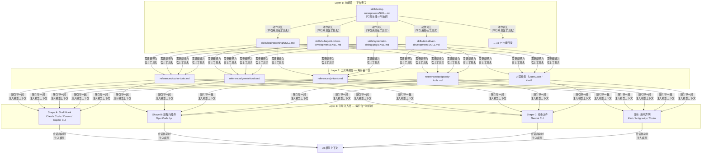
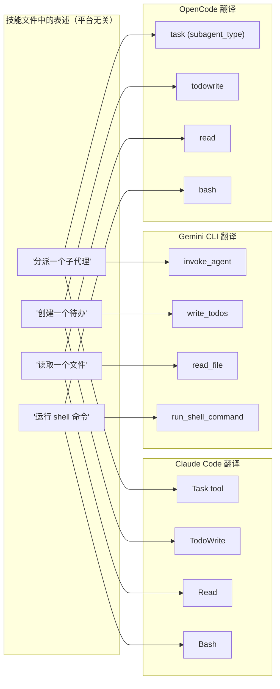
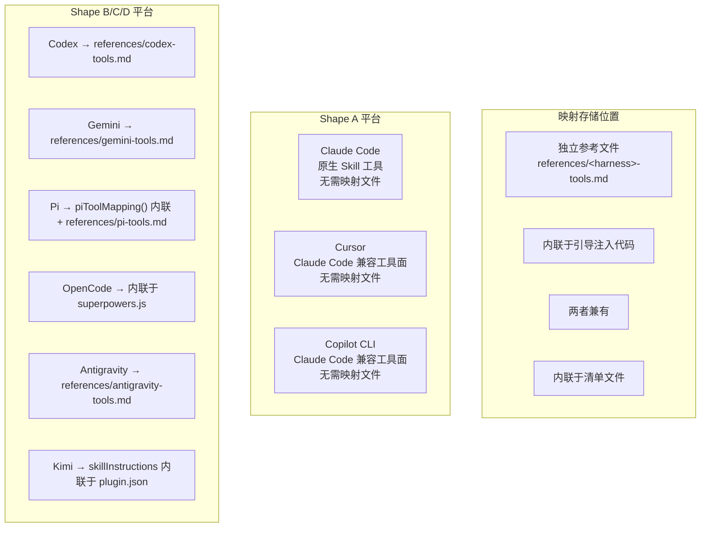
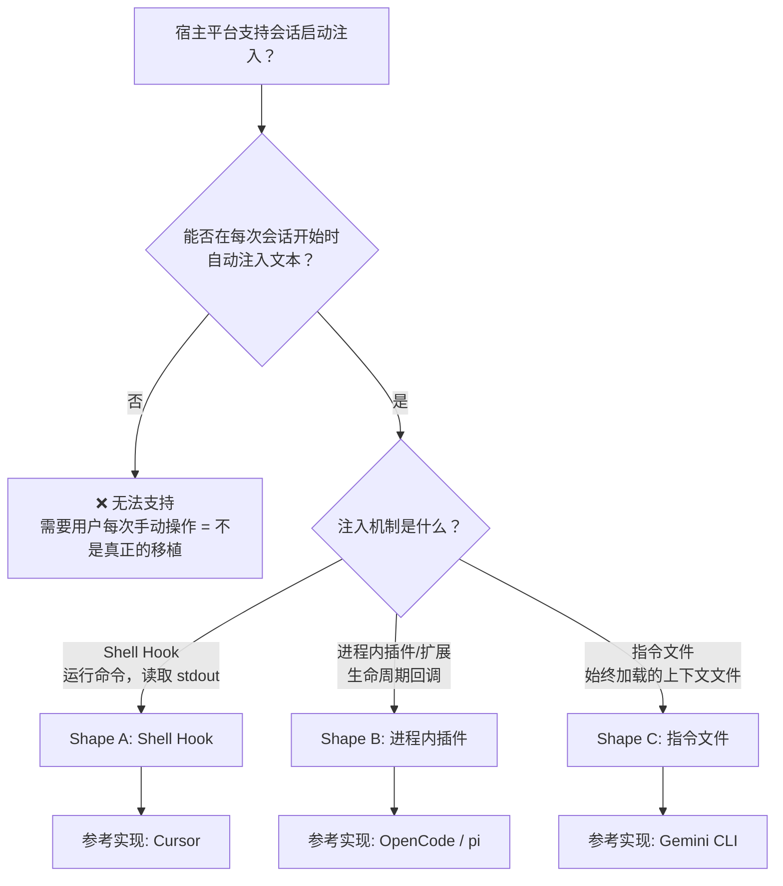
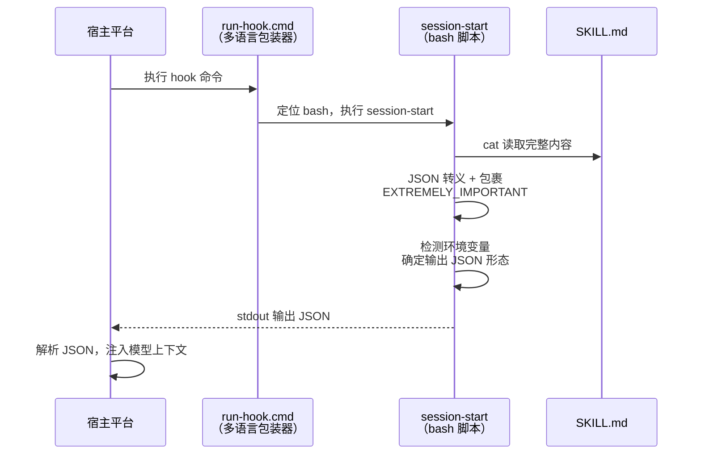
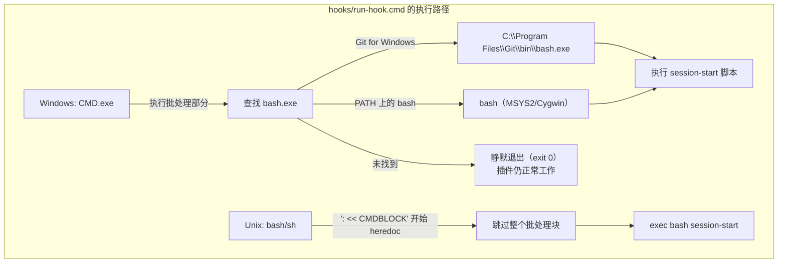

Superpowers 的核心设计命题是：**一套技能内容如何在八个完全不同的宿主平台上自动生效？** 答案是一个严格的三层分离架构——技能层（harness-agnostic）、工具映射层（per-harness）、引导注入层（per-harness）。这三层各自独立演化，通过明确的接口契约组合，使得新增一个宿主平台的成本被压缩到仅修改后两层，而核心技能文件永远不被触碰。

本文解构这三层模型的内部机制、层间交互协议，以及它们在八个已支持平台上的具体实现形态。

## 架构全景：三层分离模型



三层之间的数据流方向是单向的：**技能定义动作意图 → 映射翻译为工具名 → 注入机制将两者一起推入模型上下文**。任何一层的修改不会波及其他层——这是整个架构的核心不变量。

Sources: [porting-to-a-new-harness.md](docs/porting-to-a-new-harness.md#L29-L42), [SKILL.md](skills/using-superpowers/SKILL.md#L1-L63)

## 第一层：技能层 — 平台无关的行为塑造代码

### 设计原则：命名动作，不命名工具

`skills/` 目录下的 16 个技能目录是整个系统在所有平台上共享的**唯一真相源**。每个技能的 `SKILL.md` 文件描述的是**动作意图**（"分派一个子代理"、"读取一个文件"、"创建一个待办"），而从不引用任何特定平台的工具名称。

这一设计决策是跨平台可行性的根基。当技能说"分派一个子代理"时，它不需要知道在 Gemini 上这意味着 `invoke_agent`，在 OpenCode 上这意味着 `task` with `subagent_type: "general"`，在 Antigravity 上这意味着 `invoke_subagent`。翻译工作完全交给第二层。



### 元技能：using-superpowers

`skills/using-superpowers/SKILL.md` 是所有技能中的特殊存在——它不是一个具体的开发方法论，而是一个**元技能**（meta-skill），其职责是教会模型"技能系统的存在"以及"在任何行动之前必须先检查是否有适用的技能"。

这个文件的核心结构包含三个关键组件：

| 组件 | 位置 | 作用 |
|------|------|------|
| `<EXTREMELY-IMPORTANT>` 标签 | [L13-L19](skills/using-superpowers/SKILL.md#L13-L19) | 行为强制标记，告诉模型必须遵循技能优先规则 |
| **The Rule** 段落 | [L25-L30](skills/using-superpowers/SKILL.md#L25-L30) | 定义"先调用技能，再做任何响应"的铁律 |
| **Platform Adaptation** 段落 | [L53-L58](skills/using-superpowers/SKILL.md#L53-L58) | 指向各平台工具映射文件的指针列表 |

**Platform Adaptation** 段落是技能层与工具映射层之间的唯一显式连接点。它列出需要特殊工具映射的平台及其参考文件路径，使模型在引导注入后能定位到正确的映射文件。这是整个架构中**唯一允许因新增平台而修改 `SKILL.md` 的位置**——因为它只是一个指针列表，不是行为塑造内容。

Sources: [SKILL.md](skills/using-superpowers/SKILL.md#L53-L58), [porting-to-a-new-harness.md](docs/porting-to-a-new-harness.md#L29-L42)

## 第二层：工具映射层 — 动作词汇到宿主工具的翻译表

### 映射的语义结构

每个平台的工具映射本质上是一张**动作-工具对照表**，将技能层使用的抽象动作词汇翻译为宿主平台的具体工具调用。映射必须覆盖以下核心动作维度：

| 动作类别 | 必需性 | 降级策略 |
|----------|--------|----------|
| 文件读写编辑 | 必需 | 无降级方案，缺失则不可用 |
| Shell 命令执行 | 必需 | 无降级方案 |
| 子代理分派 | 可降级 | 技能内联执行或报告能力缺失 |
| 任务跟踪（Todo） | 可降级 | 回退到计划文件或 `TODO.md` |
| 技能调用 | 必需 | 回退到直接读取 `SKILL.md` |
| Web 搜索/获取 | 可降级 | 跳过相关功能 |

### 各平台映射实现对照



下表展示了各平台对核心动作的具体工具翻译：

| 动作 | Claude Code | Gemini CLI | OpenCode | Pi | Antigravity | Kimi Code |
|------|-------------|------------|----------|-----|-------------|-----------|
| 读取文件 | `Read` | `read_file` | `read` | `read` | 原生文件工具 | 原生 |
| 编辑文件 | `Edit` | `replace` | `apply_patch` | `edit` | 原生文件工具 | 原生 |
| 运行命令 | `Bash` | `run_shell_command` | `bash` | `bash` | 原生 | 原生 |
| 分派子代理 | `Task` | `invoke_agent` | `task` | `subagent`（可选） | `invoke_subagent` | 原生 |
| 任务跟踪 | `TodoWrite` | `write_todos` | `todowrite` | 外部扩展或 `TODO.md` | task artifact（`write_to_file`） | 原生 |
| 调用技能 | `Skill` | `activate_skill` | `skill` | 读取 `SKILL.md` | 读取 `SKILL.md` | 自动 |

Sources: [gemini-tools.md](skills/using-superpowers/references/gemini-tools.md#L1-L64), [pi-tools.md](skills/using-superpowers/references/pi-tools.md#L1-L17), [codex-tools.md](skills/using-superpowers/references/codex-tools.md#L1-L40), [antigravity-tools.md](skills/using-superpowers/references/antigravity-tools.md#L1-L24), [superpowers.js](.opencode/plugins/superpowers.js#L73-L84), [plugin.json](.kimi-plugin/plugin.json#L27-L38)

### 映射的双重存在陷阱

Pi 平台的实现揭示了一个架构陷阱：其工具映射同时存在于两个位置——`.pi/extensions/superpowers.ts` 中的 `piToolMapping()` 函数（内联于引导注入）和 `skills/using-superpowers/references/pi-tools.md`（独立参考文件）。OpenCode 则仅使用内联映射。当映射存在于两处时，维护者必须同步更新两者，否则"移植只做了一半"。

Sources: [superpowers.ts](.pi/extensions/superpowers.ts#L83-L97), [porting-to-a-new-harness.md](docs/porting-to-a-new-harness.md#L479-L484)

## 第三层：引导注入层 — 三种结构形态

引导注入是整个架构中**最关键的一层**。没有它，技能文件只是磁盘上的惰性存在，永远不会被模型看到。这一层的唯一使命是：**在每个会话启动时，将 `using-superpowers` 技能内容（包裹在 `<EXTREMELY_IMPORTANT>` 标签中）连同工具映射一起推入模型的上下文窗口**。

### 形态路由：如何确定你的宿主属于哪种形态



### Shape A：Shell Hook — 命令执行与 JSON 输出

**工作原理**：宿主在会话启动时执行一个 shell 命令，读取其 stdout 中的 JSON，将 JSON 中指定的文本注入模型上下文。

**数据流**：



**关键实现细节**：`hooks/session-start` 脚本通过环境变量检测当前宿主，输出三种不同的 JSON 形态之一：

| 宿主平台 | 检测条件 | JSON 字段 | 嵌套结构 |
|----------|----------|-----------|----------|
| Claude Code | `CLAUDE_PLUGIN_ROOT` 存在且 `COPILOT_CLI` 为空 | `hookSpecificOutput.additionalContext` | 嵌套 |
| Cursor | `CURSOR_PLUGIN_ROOT` 存在 | `additional_context` | 顶层，snake_case |
| Copilot CLI / SDK 标准 | 其他情况 | `additionalContext` | 顶层，camelCase |

这个分支逻辑是一个**高频陷阱**：Claude Code 会同时读取 `additional_context` 和 `hookSpecificOutput` 而不做去重，因此如果同时输出两个字段，引导内容会被**注入两次**。

Sources: [session-start](hooks/session-start#L1-L50), [hooks.json](hooks/hooks.json#L1-L18), [hooks-cursor.json](hooks/hooks-cursor.json#L1-L11)

### Shape B：进程内插件 — 生命周期回调与消息变换

**工作原理**：宿主加载一个 JS/TS 模块，该模块通过生命周期回调注册技能目录并在消息数组中注入引导内容。

**两个参考实现的架构对比**：

| 维度 | OpenCode (`superpowers.js`) | Pi (`superpowers.ts`) |
|------|---------------------------|----------------------|
| 技能注册 | `config` 钩子修改 `config.skills.paths` | `resources_discover` 事件返回 `skillPaths` |
| 引导注入 | `experimental.chat.messages.transform` 变换消息 | `context` 事件返回新消息数组 |
| 注入位置 | 第一条 user 消息的 parts 数组头部 | 第一条非 compaction-summary 消息之前 |
| 去重策略 | 检查 `EXTREMELY_IMPORTANT` 标签是否存在 | 检查自定义 `BOOTSTRAP_MARKER` 字符串 |
| 压缩恢复 | 每步重新注入 + 去重守卫 | `session_compact` 事件重置 `injectBootstrap` 标志 |
| 缓存 | 模块级 `_bootstrapCache` 变量 | 模块级 `cachedBootstrap` 变量 |
| 消息对象形态 | `message.info.role` + `message.parts[]` | `{ role, content: [{ type, text }], timestamp }` |

**设计决策：注入为用户消息而非系统消息**。两个实现都刻意将引导内容注入为 `user` 角色消息，而非 `system` 消息。原因有二：(1) 系统消息在每轮对话中重复发送会导致 token 膨胀（#750）；(2) 多个系统消息会破坏 Qwen 等模型的行为（#894）。

Sources: [superpowers.js](.opencode/plugins/superpowers.js#L57-L140), [superpowers.ts](.pi/extensions/superpowers.ts#L1-L122)

### Shape C：指令文件 — 零代码的被动加载

**工作原理**：宿主加载一个由扩展清单声明的上下文文件，文件内容通过 `@`-include 语法拉入引导技能和工具映射。

**Gemini CLI 的实现极简到极致**：

```
gemini-extension.json → { "contextFileName": "GEMINI.md" }
GEMINI.md → @./skills/using-superpowers/SKILL.md
           → @./skills/using-superpowers/references/gemini-tools.md
```

整个引导注入不需要任何代码——宿主在加载扩展时自动展开 `@`-include 引用，将技能内容和工具映射原样注入上下文。`SKILL.md` 内部自带的 `<EXTREMELY-IMPORTANT>` 标签提供了行为强制力。

**`@`-include 的可靠性陷阱**：Gemini 的某些衍生平台可能接受 `@./path` 语法，但将其视为"模型可以选择读取的提示"而非"保证的内联展开"。验证方法是**唯一标记测试**：注入一个无意义 token，启动新会话，确认 token 是否在没有工具调用的情况下出现在上下文中。如果不是，必须将内容内联到指令文件中。

Sources: [gemini-extension.json](gemini-extension.json#L1-L7), [GEMINI.md](GEMINI.md#L1-L3), [porting-to-a-new-harness.md](docs/porting-to-a-new-harness.md#L263-L275)

### 变体形态：清单声明式注入

部分平台采用了介于 Shape A/B/C 之间的变体：

| 平台 | 机制 | 特点 |
|------|------|------|
| **Kimi Code** | `plugin.json` 中的 `sessionStart.skill` 字段 | 宿主自动加载指定技能；工具映射内联于 `skillInstructions` 字段 |
| **Codex** | 原生技能发现，空 `hooks: {}` 抑制 hook | 无会话启动钩子；依赖宿主原生技能发现机制 |
| **Antigravity** | `agy plugin install` 生成上下文文件 | 安装器生成 `contextFileName` 声明的上下文文件，包含引导内容 |

Sources: [plugin.json](.kimi-plugin/plugin.json#L24-L26), [plugin.json](.codex-plugin/plugin.json#L22-L23), [porting-to-a-new-harness.md](docs/porting-to-a-new-harness.md#L640-L660)

## Windows 跨平台：多语言包装器模式

Shape A 的 shell hook 面临一个独特的跨平台挑战：hook 脚本需要在 Windows（CMD.exe / PowerShell）、macOS 和 Linux 上都能执行。`hooks/run-hook.cmd` 是一个**多语言（polyglot）文件**——同一个文件在 Windows 上被 CMD.exe 解释为批处理脚本，在 Unix 上被 bash 解释为 shell 脚本。



**关键设计决策**：

| 决策 | 原因 |
|------|------|
| Hook 脚本无扩展名（`session-start` 而非 `session-start.sh`） | Claude Code 的 Windows 处理会自动为包含 `.sh` 的命令前缀 `bash`，导致双重调用 |
| 不使用 `-l`（登录 shell） | Hook 脚本应自包含，不依赖登录 shell 的 PATH 配置 |
| 未找到 bash 时静默退出 | 避免在没有 Git for Windows 的用户机器上破坏插件功能 |

Sources: [run-hook.cmd](hooks/run-hook.cmd#L1-L47), [polyglot-hooks.md](docs/windows/polyglot-hooks.md#L1-L159)

## 平台全景：八种实现的架构对照

下表是八个已支持平台在三层模型中的完整定位：

| 平台 | 技能发现 | 引导机制 | 注入形态 | 工具映射位置 | 分发渠道 |
|------|----------|----------|----------|-------------|----------|
| **Claude Code** | 自动发现 `skills/` | Shell Hook → `session-start` | Shape A | 原生 `Skill` 工具，无需映射文件 | Marketplace |
| **Cursor** | 清单 `"skills": "./skills/"` | Shell Hook → `session-start` | Shape A | Claude Code 兼容，无需映射文件 | 手写打包 |
| **Copilot CLI** | 自动发现 | Shell Hook（`COPILOT_CLI` 环境变量分支） | Shape A | Claude Code 兼容，无需映射文件 | — |
| **Codex** | 原生技能发现 | 无 hook（`"hooks": {}` 抑制） | 变体 D | `references/codex-tools.md` | Fork 同步 |
| **Gemini CLI** | 自动发现 `skills/` | `contextFileName` → `GEMINI.md` | Shape C | `references/gemini-tools.md` | `gemini extensions install` |
| **Kimi Code** | 清单 `"skills": "./skills/"` | `sessionStart.skill` 字段 | 变体 D | 内联于 `skillInstructions` | Marketplace / URL |
| **OpenCode** | `config` 钩子注册路径 | 消息变换钩子 | Shape B | 内联于 `superpowers.js` | `opencode.json` git URL |
| **Pi** | `resources_discover` 事件 | `context` 事件注入消息 | Shape B | `piToolMapping()` + `references/pi-tools.md` | `package.json` 字段 |

Sources: [porting-to-a-new-harness.md](docs/porting-to-a-new-harness.md#L770-L790), [plugin.json](.claude-plugin/plugin.json#L1-L21), [plugin.json](.cursor-plugin/plugin.json#L1-L24), [plugin.json](.codex-plugin/plugin.json#L1-L49), [gemini-extension.json](gemini-extension.json#L1-L7), [plugin.json](.kimi-plugin/plugin.json#L1-L39), [superpowers.js](.opencode/plugins/superpowers.js#L57-L140), [superpowers.ts](.pi/extensions/superpowers.ts#L22-L122)

## 版本同步机制

多平台分发引入了版本一致性问题。`.version-bump.json` 跟踪所有需要版本同步的清单文件：

```json
{
  "files": [
    { "path": "package.json", "field": "version" },
    { "path": ".claude-plugin/plugin.json", "field": "version" },
    { "path": ".cursor-plugin/plugin.json", "field": "version" },
    { "path": ".codex-plugin/plugin.json", "field": "version" },
    { "path": ".kimi-plugin/plugin.json", "field": "version" },
    { "path": ".claude-plugin/marketplace.json", "field": "plugins.0.version" },
    { "path": "gemini-extension.json", "field": "version" }
  ]
}
```

`scripts/bump-version.sh` 在版本发布时统一更新所有这些文件。新增平台时，如果引入了新的版本化清单，必须将其注册到此文件中，否则将发布过时版本号。

Sources: [.version-bump.json](.version-bump.json#L1-L22), [porting-to-a-new-harness.md](docs/porting-to-a-new-harness.md#L690-L695)

## 架构不变量：两条铁律

整个三层模型的运作依赖两条不可违反的规则：

**铁律一：技能命名动作，不命名工具。** 永远不编辑 `skills/*/SKILL.md` 的内容来适配某个宿主平台。移植工作只添加工具映射和引导注入器，从不触及技能正文。项目的贡献者指南将技能内容视为经过精心调优的行为塑造代码，随意改写会被立即拒绝。

**铁律二：一切通过宿主的安装机制分发，永不编辑用户文件。** 引导、技能和工具映射全部作为宿主安装产物的一部分交付——插件、扩展、marketplace 条目。移植**绝不能**触及用户的全局或个人配置（`~/.gemini/config/AGENTS.md`、`settings.json`、`trustedFolders.json` 等）。如果安装机制确实无法承载引导，这是一个需要 surfaced 的限制，而不是手动编辑用户配置的许可证。

Sources: [porting-to-a-new-harness.md](docs/porting-to-a-new-harness.md#L36-L42)

## 阅读路径建议

本文档解构了跨平台三层架构的设计原理与实现机制。建议按以下顺序继续阅读以形成完整理解：

1. **深入引导注入细节** → [引导注入机制：SessionStart Hook 与消息变换](19-yin-dao-zhu-ru-ji-zhi-sessionstart-hook-yu-xiao-xi-bian-huan) — 聚焦第三层的数据流、去重策略和压缩恢复机制
2. **实践移植流程** → [移植到新平台：集成形状选择与验收测试](20-yi-zhi-dao-xin-ping-tai-ji-cheng-xing-zhuang-xuan-ze-yu-yan-shou-ce-shi) — 从 Shape 选择到验收测试的完整操作指南
3. **平台安装细节** → [各平台插件清单与安装机制对照](21-ge-ping-tai-cha-jian-qing-dan-yu-an-zhuang-ji-zhi-dui-zhao) — 每个平台的具体安装命令与清单字段解析