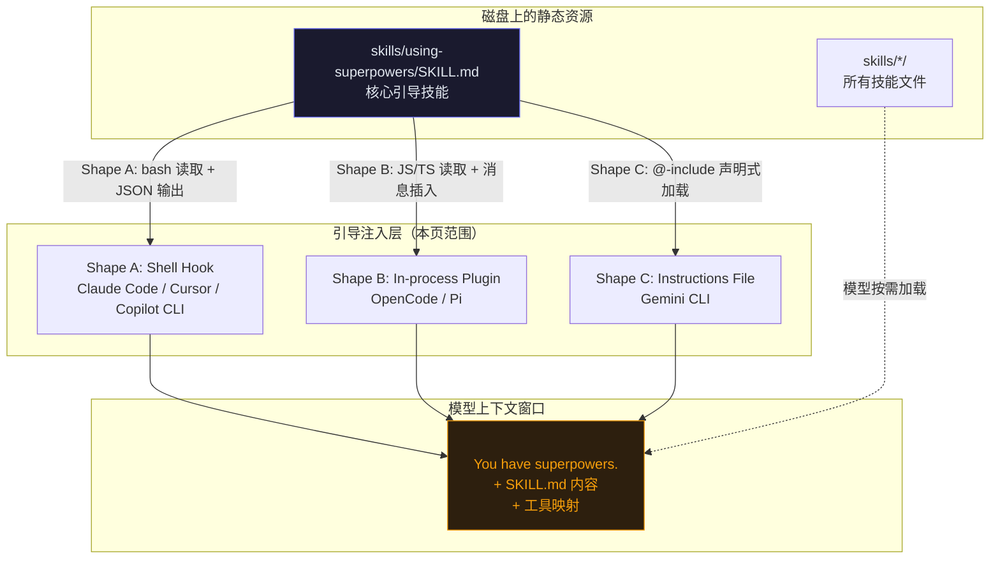
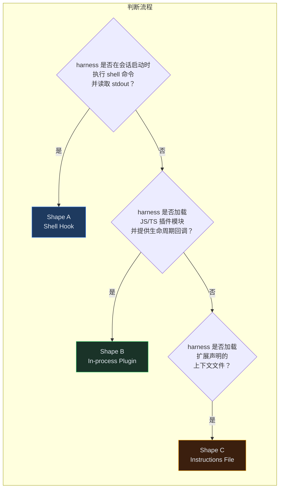
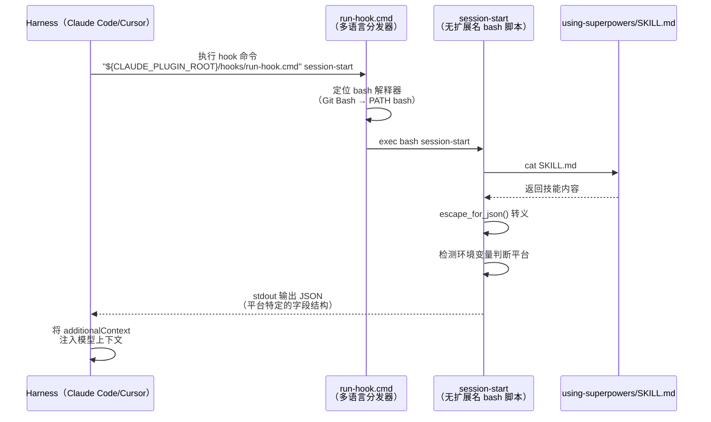
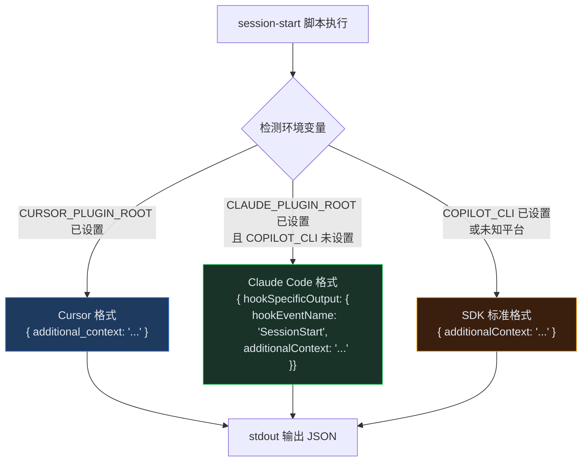
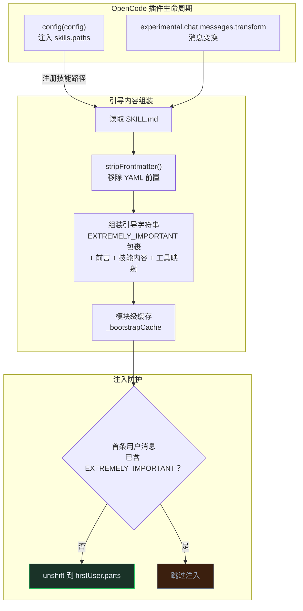
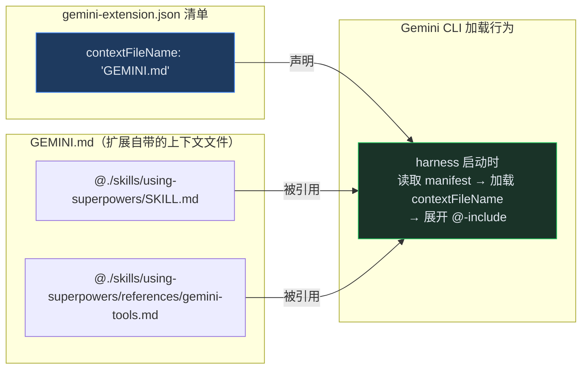
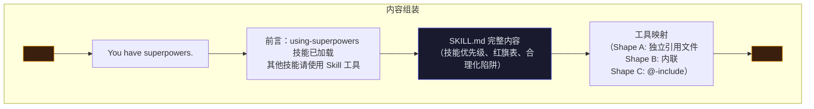

本页深入剖析 superpowers 如何在每次会话启动时将核心技能上下文注入 AI 编码代理。引导注入是整个多平台适配架构的**关键枢纽**——没有它，`skills/` 目录中的技能文件只是磁盘上的 inert 文本，永远不会被模型触发。本页聚焦三种注入形态的实现细节、跨平台兼容策略以及消息变换的精确协议。

---

## 核心概念：为什么需要引导注入

superpowers 的跨平台架构由三层组成：**技能内容**（harness-agnostic）、**工具映射**（per-harness）、**引导注入**（per-harness）。引导注入是第三层，也是决定集成成败的唯一层。



引导注入的核心目标只有一个：**在每次会话开始时，将 `using-superpowers` 技能的完整内容包裹在 `<EXTREMELY_IMPORTANT>` 标签中，连同工具映射一起推入模型的上下文窗口**。这条注入消息教会模型两件事：(1) 你拥有技能系统，(2) 在任何行动之前必须先检查是否有适用的技能。

Sources: [hooks/session-start](hooks/session-start#L28-L30), [docs/porting-to-a-new-harness.md](docs/porting-to-a-new-harness.md#L42-L50)

---

## 三种注入形态总览

不同 harness 提供的扩展机制截然不同，superpowers 据此设计了三种结构形态（Shape）。选择哪种形态完全取决于 harness 暴露的会话启动接口。

| 形态 | 注入机制 | 适用平台 | 参考实现 | 核心文件 |
|------|---------|---------|---------|---------|
| **Shape A** | Shell Hook：harness 在会话启动时执行 shell 命令并读取 stdout 的 JSON | Claude Code, Cursor, Copilot CLI | [hooks/session-start](hooks/session-start#L1-L50) | `hooks/hooks.json`, `hooks/run-hook.cmd` |
| **Shape B** | In-process Plugin：JS/TS 模块通过生命周期回调直接操作消息数组 | OpenCode, Pi | [.opencode/plugins/superpowers.js](.opencode/plugins/superpowers.js#L1-L140), [.pi/extensions/superpowers.ts](.pi/extensions/superpowers.ts#L1-L122) | `package.json` 的 `main` / `pi.extensions` |
| **Shape C** | Instructions File：harness 加载扩展声明的上下文文件 | Gemini CLI | [GEMINI.md](GEMINI.md#L1-L3) | `gemini-extension.json` |



三种形态可以组合——技能发现机制和引导注入机制不必是同一形态。但两者都必须通过 harness 的安装机制交付，绝不能手动编辑用户的全局配置文件。

Sources: [docs/porting-to-a-new-harness.md](docs/porting-to-a-new-harness.md#L145-L200)

---

## Shape A：Shell Hook 注入详解

Shape A 是最复杂的形态，因为它必须解决跨平台 shell 执行的根本差异。Claude Code 在不同操作系统上通过不同 shell 执行 hook 命令——macOS/Linux 使用 bash，Windows 使用 Git Bash（若可用）或 PowerShell/CMD。

### 整体执行链



### 多语言分发器：run-hook.cmd

[run-hook.cmd](hooks/run-hook.cmd#L1-L47) 是整个 Shape A 的枢纽。它是一个**多语言脚本**（polyglot script）：Windows CMD 将其解释为批处理命令，Unix bash 将前半部分视为 no-op heredoc 并跳过。

**Windows 路径（CMD.exe）的执行逻辑：**

1. 验证脚本名参数非空
2. 通过 `%~dp0` 解析分发器自身所在目录
3. 按优先级尝试三个 bash 位置：`C:\Program Files\Git\bin\bash.exe` → `C:\Program Files (x86)\Git\bin\bash.exe` → `PATH` 上的 `bash`
4. 找到 bash 后执行 `bash "%HOOK_DIR%%~1"` 分发到实际的 hook 脚本
5. 若未找到 bash，**静默退出**（`exit /b 0`）——插件继续工作，仅跳过上下文注入

**Unix 路径（bash/sh）的执行逻辑：**

1. `: << 'CMDBLOCK'` 开启一个 no-op 命令的 heredoc
2. 整个 CMD 批处理块被 heredoc 消费并忽略
3. `CMDBLOCK` 之后，bash 解析脚本目录并 `exec` 目标脚本

Sources: [hooks/run-hook.cmd](hooks/run-hook.cmd#L1-L47), [docs/windows/polyglot-hooks.md](docs/windows/polyglot-hooks.md#L40-L90)

### 关键设计决策：无扩展名脚本

Hook 脚本命名为 `session-start`（无 `.sh` 扩展名），这是**刻意为之**的设计。Claude Code 在 Windows 上会自动检测命令路径中是否包含 `.sh`，若包含则自动在前面添加 `bash` 前缀。如果分发器命令写成 `run-hook.cmd session-start.sh`，这个自动检测机制会干扰分发器的预期执行路径。

| 决策 | 原因 |
|------|------|
| 无扩展名脚本 | 防止 Claude Code Windows `.sh` 自动前缀干扰分发器 |
| 不使用 `-l`（login shell） | Hook 脚本应自包含，不依赖 login shell 的 PATH 配置 |
| 不使用 `cygpath` | bash 直接接收 Windows 路径即可正确处理 |
| 无 bash 时静默退出 | 避免破坏没有 Git for Windows 用户的插件体验 |

Sources: [docs/windows/polyglot-hooks.md](docs/windows/polyglot-hooks.md#L92-L110)

### 平台检测与 JSON 输出形态

[session-start](hooks/session-start#L32-L50) 脚本通过环境变量检测当前平台，并输出**严格匹配该平台期望**的 JSON 结构。这是一个极易出错的关键点——Claude Code 同时读取 `additional_context` 和 `hookSpecificOutput` 而**不做去重**，因此输出多余的字段会导致引导内容被注入两次。



三种 JSON 输出结构对比：

| 平台 | 环境变量条件 | JSON 字段路径 | hook 配置 matcher |
|------|------------|--------------|------------------|
| **Cursor** | `CURSOR_PLUGIN_ROOT` 已设置 | `additional_context`（顶层，snake_case） | `sessionStart`（小写驼峰） |
| **Claude Code** | `CLAUDE_PLUGIN_ROOT` 已设置 + `COPILOT_CLI` 未设置 | `hookSpecificOutput.additionalContext`（嵌套） | `startup\|clear\|compact` |
| **Copilot CLI / SDK** | `COPILOT_CLI` 已设置 或其他 | `additionalContext`（顶层，camelCase） | 平台特定 |

Sources: [hooks/session-start](hooks/session-start#L32-L50), [hooks/hooks.json](hooks/hooks.json#L1-L18), [hooks/hooks-cursor.json](hooks/hooks-cursor.json#L1-L11)

### JSON 转义与性能优化

脚本中的 `escape_for_json()` 函数使用 bash 参数替换（`${s//old/new}`）进行 JSON 转义，每次替换都是单个 C 级别操作——比逐字符循环快**数个数量级**。转义覆盖五类字符：反斜杠、双引号、换行符、回车符和制表符。

此外，脚本使用 `printf` 而非 heredoc 输出 JSON，这是为了规避 bash 5.3+ 中 heredoc 挂起的已知问题。

Sources: [hooks/session-start](hooks/session-start#L12-L26)

---

## Shape B：In-process Plugin 注入详解

Shape B 适用于提供 JS/TS 插件生命周期回调的 harness。引导内容在代码中组装，通过直接操作消息数组注入，无需 shell 执行。

### OpenCode 实现

[superpowers.js](.opencode/plugins/superpowers.js#L1-L140) 通过两个 hook 完成全部工作：

1. **`config` hook**：将 superpowers 的 `skills/` 目录注入 OpenCode 的实时配置单例，使技能发现无需手动符号链接
2. **`experimental.chat.messages.transform` hook**：在每条第一条用户消息前插入引导内容



**关键设计决策——使用用户消息而非系统消息：**

OpenCode 的实现刻意将引导内容作为**用户角色消息**注入，而非系统消息。原因有二：(1) 系统消息在每轮对话中重复发送会导致 token 膨胀（issue #750）；(2) 多个系统消息会破坏 Qwen 等模型的输出（issue #894）。

**去重防护：** transform hook 在**每个 agent step**（而非每轮对话）触发，因为 OpenCode 的 `prompt.ts` 每步都从数据库重新加载消息。注入前检查第一条用户消息是否已包含 `EXTREMELY_IMPORTANT` 标记，防止重复注入。

**模块级缓存：** `_bootstrapCache` 变量（`undefined` = 未加载，`null` = 文件缺失）确保 SKILL.md 只在首次调用时读取和解析一次，消除后续每步的冗余磁盘 I/O。

Sources: [.opencode/plugins/superpowers.js](.opencode/plugins/superpowers.js#L60-L140)

### Pi 实现

[superpowers.ts](.pi/extensions/superpowers.ts#L1-L122) 是 Pi 平台的 TypeScript 实现，与 OpenCode 有几个关键差异：

| 维度 | OpenCode | Pi |
|------|---------|-----|
| 语言 | JavaScript (ESM) | TypeScript |
| 注入事件 | `experimental.chat.messages.transform` | `context` |
| 去重标记 | `EXTREMELY_IMPORTANT` 标签 | 自定义 `BOOTSTRAP_MARKER` 字符串 |
| 压缩处理 | 依赖每步重新注入 + 去重 | 显式监听 `session_compact`，在压缩摘要消息之后插入 |
| 生命周期控制 | 无显式开关 | `injectBootstrap` 标志：`session_start`/`session_compact` 开启，`agent_end` 关闭 |
| 消息对象结构 | `message.info.role` + `message.parts[]` | `{ role, content: [{ type, text }], timestamp }` |

Pi 实现特别值得关注的是**压缩后重新注入**机制：当会话被压缩/摘要后，`session_compact` 事件触发 `injectBootstrap = true`，而 `firstNonCompactionSummaryIndex()` 函数确保引导消息插入在所有 `compactionSummary` 角色消息之后，保证模型在压缩后仍能接收技能指引。

Sources: [.pi/extensions/superpowers.ts](.pi/extensions/superpowers.ts#L28-L60), [.pi/extensions/superpowers.ts](.pi/extensions/superpowers.ts#L108-L122)

---

## Shape C：Instructions File 声明式加载

Shape C 是最简洁的形态——没有代码执行，没有 JSON 组装，完全依赖 harness 的声明式上下文文件加载机制。

### Gemini 实现



`gemini-extension.json` 的 `contextFileName` 字段指向 `GEMINI.md`，后者使用两行 `@`-include 指令拉入引导技能内容和工具映射。Gemini CLI 在每次会话启动时自动加载这个文件——因为它是**已安装扩展的一部分**，而非用户手动编辑的全局配置。

**与 Shape A/B 的关键差异：** Shape C 不组装 `<EXTREMELY_IMPORTANT>` 包裹字符串，不剥离 YAML frontmatter，不附加"技能已加载请勿重复调用"的前言。`SKILL.md` 自身内部的 `<EXTREMELY-IMPORTANT>` 块已经足够。

**风险警告：** `@`-include 并非在所有 Gemini 衍生 harness 中都被保证展开。某些衍生版本将其视为"模型可选择读取的提示"（发出文件读取工具调用），而非确定性的内联展开。必须通过**唯一标记测试**验证：如果标记在没有工具调用的情况下未出现在上下文中，则需要将内容直接内联到指令文件中。

Sources: [GEMINI.md](GEMINI.md#L1-L3), [gemini-extension.json](gemini-extension.json#L1-L7), [docs/porting-to-a-new-harness.md](docs/porting-to-a-new-harness.md#L185-L200)

---

## Kimi Code：声明式 sessionStart 形态

Kimi Code 采用了一种独特的声明式引导注入方式，不依赖 shell hook 也不依赖 in-process 插件代码：

```json
{
  "sessionStart": {
    "skill": "using-superpowers"
  },
  "skillInstructions": "..."
}
```

[.kimi-plugin/plugin.json](.kimi-plugin/plugin.json#L18-L23) 通过 `sessionStart.skill` 字段声明在会话启动时加载指定技能，通过 `skillInstructions` 字段提供 Kimi 特定的工具映射。harness 自身负责读取技能内容并注入上下文——插件无需编写任何注入逻辑。

Sources: [.kimi-plugin/plugin.json](.kimi-plugin/plugin.json#L1-L39), [docs/README.kimi.md](docs/README.kimi.md#L35-L45)

---

## Hook 配置差异对照

不同平台的 hook 配置 JSON 结构存在显著差异，不可互换：

| 字段 | Claude Code (`hooks.json`) | Cursor (`hooks-cursor.json`) |
|------|--------------------------|------------------------------|
| 顶层版本 | 无 | `"version": 1` |
| 事件名 | `"SessionStart"`（大写 S） | `"sessionStart"`（小写 s） |
| matcher | `"startup\|clear\|compact"` | 无（省略） |
| hook type | `"type": "command"` | 无（省略） |
| 命令路径 | `"${CLAUDE_PLUGIN_ROOT}/hooks/run-hook.cmd"` | `"./hooks/run-hook.cmd"` |
| shell 声明 | `"shell": "bash"` | 无（省略） |
| async | `"async": false` | 无（省略） |

Codex 的 `.codex-plugin/plugin.json` 则声明了**空的 `hooks` 对象** (`"hooks": {}`)，这是为了**抑制** Codex 对 `hooks/hooks.json` 的自动发现——因为 Codex 原生支持技能展示，不需要运行会话启动 hook。

Sources: [hooks/hooks.json](hooks/hooks.json#L1-L18), [hooks/hooks-cursor.json](hooks/hooks-cursor.json#L1-L11), [.codex-plugin/plugin.json](.codex-plugin/plugin.json#L25), [docs/porting-to-a-new-harness.md](docs/porting-to-a-new-harness.md#L220-L240)

---

## 引导内容组装流程

无论哪种形态，注入模型的核心内容结构是一致的：



各形态的内容组装差异：

| 维度 | Shape A | Shape B | Shape C |
|------|---------|---------|---------|
| SKILL.md 读取方式 | `cat` 命令 | `readFileSync` / `readFileSync` | `@`-include 声明 |
| YAML frontmatter | **保留**（原样输出） | **剥离**（`stripFrontmatter()`） | **保留**（harness 原样加载） |
| 工具映射位置 | `references/<harness>-tools.md`（独立文件） | 内联到引导字符串中 | `@`-include 引入 |
| "已加载"前言 | 有（"for all other skills, use the Skill tool"） | 有（"do NOT use the skill tool to load using-superpowers again"） | 无 |
| `<EXTREMELY_IMPORTANT>` 包裹 | 由脚本组装 | 由代码组装 | 由 SKILL.md 内部的 `<EXTREMELY-IMPORTANT>` 承担 |

Sources: [hooks/session-start](hooks/session-start#L10-L30), [.opencode/plugins/superpowers.js](.opencode/plugins/superpowers.js#L65-L95), [.pi/extensions/superpowers.ts](.pi/extensions/superpowers.ts#L65-L85), [GEMINI.md](GEMINI.md#L1-L3)

---

## 测试验证体系

[test-session-start.sh](tests/hooks/test-session-start.sh#L1-L226) 提供了全面的引导注入验证，覆盖以下维度：

| 测试用例 | 验证内容 |
|---------|---------|
| `hooks.json registers SessionStart with shell:bash dispatch` | hook 配置声明了 `shell: "bash"` 且命令指向 `run-hook.cmd` |
| `Claude Code emit nested SessionStart additionalContext` | `CLAUDE_PLUGIN_ROOT` 环境下输出嵌套的 `hookSpecificOutput` 结构 |
| `run-hook.cmd wrapper dispatches` | 分发器正确转发到 `session-start` 脚本 |
| `Cursor emit top-level additional_context only` | `CURSOR_PLUGIN_ROOT` 环境下输出 snake_case 顶层字段 |
| `Copilot CLI emit top-level additionalContext only` | `COPILOT_CLI` 环境下输出 camelCase 顶层字段 |
| `SessionStart omits obsolete legacy custom-skill warning` | 输出不包含已废弃的旧版警告文本 |

测试使用 `env -i` 清空环境后精确设置目标环境变量，通过 Node.js 脚本解析 JSON 输出并验证字段结构、互斥性和内容完整性。每个平台的 JSON 形态都验证了**排他性**——例如 Cursor 输出不能包含 `hookSpecificOutput`，Claude Code 输出不能包含顶层 `additional_context`。

Sources: [tests/hooks/test-session-start.sh](tests/hooks/test-session-start.sh#L1-L226)

---

## 常见陷阱与排障

| 症状 | 根因 | 修复 |
|------|------|------|
| Windows 上 hook 静默无输出 | 未找到 bash 解释器 | 安装 Git for Windows 到标准路径，或确保 `bash` 在 PATH 上 |
| hook 在 Unix 正常但 Windows 无效果 | 脚本使用了 `.sh` 扩展名 | 改为无扩展名，防止 Claude Code 的 `.sh` 自动前缀干扰 |
| 引导内容注入两次 | 输出了多个 JSON 字段（如同时输出 `additional_context` 和 `hookSpecificOutput`） | 确保平台检测分支互斥，每个平台只输出其期望的单一字段 |
| hook 完全不触发 | `matcher` 字符串与 harness 事件不匹配 | Claude Code 使用 `startup\|clear\|compact`，Cursor 使用 `sessionStart` |
| Shape B 每步重复注入 | 缺少去重防护 | 注入前检查消息中是否已存在引导标记 |
| 压缩后技能消失 | 未处理会话压缩事件 | 监听 compact 事件并重新注入（Pi 模式），或依赖每步重新注入 + 去重（OpenCode 模式） |

Sources: [docs/windows/polyglot-hooks.md](docs/windows/polyglot-hooks.md#L112-L159), [docs/porting-to-a-new-harness.md](docs/porting-to-a-new-harness.md#L320-L370)

---

## 页面导航

本页是[跨平台适配架构](18-kua-ping-tai-jia-gou-ji-neng-gong-ju-ying-she-yu-yin-dao-zhu-ru-san-ceng-mo-xing)三层模型的第三层详解。建议阅读路径：

- **前置知识**：[核心工作流：从构思到交付的七步流程](3-he-xin-gong-zuo-liu-cong-gou-si-dao-jiao-fu-de-qi-bu-liu-cheng) → [跨平台架构](18-kua-ping-tai-jia-gou-ji-neng-gong-ju-ying-she-yu-yin-dao-zhu-ru-san-ceng-mo-xing)
- **后续深入**：[移植到新平台](20-yi-zhi-dao-xin-ping-tai-ji-cheng-xing-zhuang-xuan-ze-yu-yan-shou-ce-shi) → [各平台插件清单](21-ge-ping-tai-cha-jian-qing-dan-yu-an-zhuang-ji-zhi-dui-zhao)
- **相关主题**：[技能机制原理](5-ji-neng-skill-ji-zhi-zi-dong-hong-fa-yu-xing-wei-su-zao-yuan-li) → [技能编写与测试](22-bian-xie-xin-ji-neng-jiang-tdd-ying-yong-yu-guo-cheng-wen-dang)