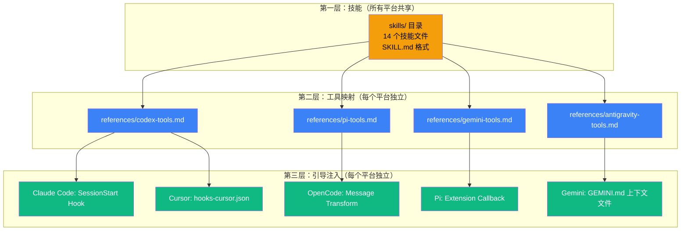
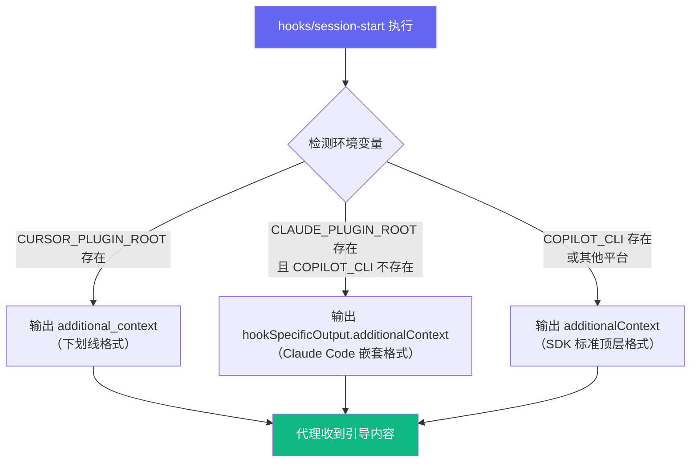

Superpowers 是一个面向 AI 编码代理的完整开发方法论框架，通过一组可组合的技能（Skills）和自动引导机制，让你的编码代理在会话开始时就具备结构化的工作流程能力。当前版本为 **v6.2.0**，支持 **10+ 个主流编码平台**的接入。

本文档将引导你完成 Superpowers 的安装，并根据你使用的编码平台提供对应的接入方法。

## 核心架构：三层模型

在开始安装之前，理解 Superpowers 的跨平台架构有助于你明白"安装到底做了什么"。整个系统由三个层次组成：



**技能层**是平台无关的核心内容——所有平台共享同一套 `skills/` 目录中的技能文件。**工具映射层**将技能中描述的抽象动作（如"读取文件"、"派发子代理"）翻译为各平台的原生工具名称。**引导注入层**确保每次会话开始时，代理自动加载 `using-superpowers` 技能，从而触发整个工作流。

Sources: [porting-to-a-new-harness.md](docs/porting-to-a-new-harness.md#L31-L77), [SKILL.md](skills/using-superpowers/SKILL.md#L1-L63)

## 支持平台一览

下表汇总了所有支持平台的安装方式、插件清单文件位置以及引导注入机制：

| 平台 | 安装方式 | 插件清单文件 | 引导注入机制 |
|------|---------|-------------|-------------|
| **Claude Code** | `/plugin install` 命令 | `.claude-plugin/plugin.json` | SessionStart Hook（bash 脚本） |
| **Antigravity** | `agy plugin install` URL | `.agents/plugins/marketplace.json` | SessionStart Hook（复用 Claude Code） |
| **Codex App** | UI 侧边栏点击安装 | `.codex-plugin/plugin.json` | 原生技能发现（无需 Hook） |
| **Codex CLI** | `/plugins` 搜索安装 | `.codex-plugin/plugin.json` | 原生技能发现（无需 Hook） |
| **Cursor** | `/add-plugin` 命令 | `.cursor-plugin/plugin.json` | `hooks-cursor.json` SessionStart |
| **Factory Droid** | `droid.plugin` 命令 | `.agents/plugins/marketplace.json` | SessionStart Hook（复用 Claude Code） |
| **Gemini CLI** | `gemini extensions install` | `gemini-extension.json` | `GEMINI.md` 上下文文件引用 |
| **GitHub Copilot CLI** | `copilot plugin` 命令 | 复用 Claude Code 清单 | SessionStart Hook（SDK 标准格式） |
| **Kimi Code** | `/plugins` 管理器 | `.kimi-plugin/plugin.json` | `sessionStart.skill` 声明式加载 |
| **OpenCode** | `opencode.json` 配置 | `.opencode/plugins/superpowers.js` | `chat.messages.transform` 钩子 |
| **Pi** | `pi install` 命令 | `package.json` 中 `pi` 字段 | Extension `context` 事件回调 |

Sources: [README.md](README.md#L26-L194), [.version-bump.json](.version-bump.json#L1-L21)

## 各平台安装步骤

### Claude Code

Claude Code 是 Superpowers 的原生支持平台，提供两种安装途径：

**方式一：官方插件市场（推荐）**

```bash
/plugin install superpowers@claude-plugins-official
```

**方式二：Superpowers 开发市场**

```bash
# 先注册市场源
/plugin marketplace add obra/superpowers-marketplace

# 再从该市场安装
/plugin install superpowers@superpowers-marketplace
```

安装完成后，Claude Code 通过 `hooks/hooks.json` 中定义的 **SessionStart Hook** 在每次会话启动时自动注入引导内容。该 Hook 调用 `hooks/session-start` 脚本，读取 `skills/using-superpowers/SKILL.md` 的内容并包装为 `<EXTREMELY_IMPORTANT>` 标记注入到代理上下文中。

Sources: [README.md](README.md#L30-L56), [hooks.json](hooks/hooks.json#L1-L17), [session-start](hooks/session-start#L1-L49)

### Antigravity

Antigravity 直接从此仓库安装插件：

```bash
agy plugin install https://github.com/obra/superpowers
```

Antigravity 会自动运行插件的 session-start Hook，因此 Superpowers 从第一条消息起即生效。使用相同命令重新执行即可更新。

Sources: [README.md](README.md#L58-L67), [marketplace.json](.agents/plugins/marketplace.json#L1-L20)

### Codex App（图形界面）

1. 在 Codex 应用中，点击侧边栏的 **Plugins**
2. 在 **Coding** 分类下找到 `Superpowers`
3. 点击 Superpowers 旁边的 `+` 按钮，按提示完成安装

Codex 使用**原生技能发现**机制——插件清单中的 `"skills": "./skills/"` 字段让 Codex 自动扫描并注册所有技能，无需额外的 Hook 脚本。

Sources: [README.md](README.md#L69-L75), [.codex-plugin/plugin.json](.codex-plugin/plugin.json#L1-L48)

### Codex CLI（命令行）

```bash
# 打开插件搜索界面
/plugins

# 搜索 Superpowers
superpowers

# 选择 "Install Plugin"
```

Codex CLI 与 Codex App 共享同一套插件清单（`.codex-plugin/plugin.json`），安装机制相同。

Sources: [README.md](README.md#L77-L93)

### Cursor

在 Cursor Agent 聊天中执行：

```text
/add-plugin superpowers
```

或者在插件市场中搜索 "superpowers"。

Cursor 使用独立的 Hook 配置文件 `hooks/hooks-cursor.json`，其格式与 Claude Code 略有不同——Cursor 的 Hook 输出使用 `additional_context`（下划线命名），而 Claude Code 使用 `hookSpecificOutput.additionalContext`（驼峰嵌套）。`hooks/session-start` 脚本通过检测 `CURSOR_PLUGIN_ROOT` 环境变量自动选择正确的输出格式。

Sources: [README.md](README.md#L95-L103), [hooks-cursor.json](hooks/hooks-cursor.json#L1-L10), [session-start](hooks/session-start#L38-L40)

### Factory Droid

```bash
# 注册市场源
droid.plugin marketplace add https://github.com/obra/superpowers

# 安装插件
droid.plugin install superpowers@superpowers
```

Factory Droid 复用 Claude Code 的插件清单和 Hook 机制，无需额外的平台适配文件。

Sources: [README.md](README.md#L105-L117)

### Gemini CLI

```bash
# 安装扩展
gemini extensions install https://github.com/obra/superpowers

# 后续更新
gemini extensions update superpowers
```

Gemini CLI 的引导注入方式独特：它通过 `gemini-extension.json` 中声明的 `contextFileName: "GEMINI.md"` 加载上下文文件。`GEMINI.md` 使用 `@` 引用语法指向 `skills/using-superpowers/SKILL.md` 和工具映射文件，让 Gemini 在会话开始时自动读取这些内容。

Sources: [README.md](README.md#L119-L131), [gemini-extension.json](gemini-extension.json#L1-L6), [GEMINI.md](GEMINI.md#L1-L3)

### GitHub Copilot CLI

```bash
# 注册市场源
copilot plugin marketplace add obra/superpowers-marketplace

# 安装插件
copilot plugin install superpowers@superpowers-marketplace
```

Copilot CLI 的 Hook 输出使用 SDK 标准格式 `additionalContext`（顶层字段）。`hooks/session-start` 脚本通过检测 `COPILOT_CLI` 环境变量区分 Copilot CLI 与 Claude Code，确保不会重复注入。

Sources: [README.md](README.md#L133-L145), [session-start](hooks/session-start#L41-L46)

### Kimi Code

**方式一：通过插件管理器（推荐）**

```text
/plugins
```

进入 `Marketplace` > `Superpowers` 并安装。

**方式二：从仓库直接安装**

```text
/plugins install https://github.com/obra/superpowers
```

Kimi Code 的插件清单通过 `"sessionStart": { "skill": "using-superpowers" }` 声明式地指定会话启动时加载的技能，同时通过 `skillInstructions` 字段提供 Kimi 专属的工具映射说明。安装或更新后，使用 `/new` 开启新会话使变更生效。

Sources: [README.md](README.md#L147-L165), [.kimi-plugin/plugin.json](.kimi-plugin/plugin.json#L1-L38), [README.kimi.md](docs/README.kimi.md#L1-L89)

### OpenCode

在 `opencode.json`（全局或项目级）中添加：

```json
{
  "plugin": ["superpowers@git+https://github.com/obra/superpowers.git"]
}
```

重启 OpenCode 即可。

OpenCode 使用 JavaScript 插件（`.opencode/plugins/superpowers.js`）实现两个功能：通过 `config` 钩子注册技能目录，通过 `experimental.chat.messages.transform` 钩子注入引导内容到第一条用户消息中。

**Windows 用户注意**：部分 Windows 版本的 OpenCode 存在 `git+https` 插件安装问题。备选方案是使用 npm 手动安装后指向本地路径：

```powershell
npm install superpowers@git+https://github.com/obra/superpowers.git --prefix "$HOME\.config\opencode"
```

然后在 `opencode.json` 中使用：

```json
{
  "plugin": ["~/.config/opencode/node_modules/superpowers"]
}
```

Sources: [README.md](README.md#L167-L178), [INSTALL.md](.opencode/INSTALL.md#L1-L116), [superpowers.js](.opencode/plugins/superpowers.js#L1-L139)

### Pi

```bash
pi install git:github.com/obra/superpowers
```

Pi 使用 TypeScript 扩展（`.pi/extensions/superpowers.ts`）实现引导注入。扩展监听 `resources_discover` 事件注册技能路径，监听 `session_start` 和 `session_compact` 事件触发引导注入，并在 `context` 事件中将 `using-superpowers` 技能内容作为用户消息插入到对话历史中。Pi 拥有原生技能系统，因此不需要兼容 `Skill` 工具。

Sources: [README.md](README.md#L180-L194), [superpowers.ts](.pi/extensions/superpowers.ts#L1-L122), [package.json](package.json#L15-L22)

## 跨平台 Hook 分发机制

对于使用 Shell Hook 的平台（Claude Code、Cursor、Copilot CLI），`hooks/session-start` 脚本需要输出不同格式的 JSON。该脚本通过环境变量检测当前运行平台，自动选择正确的输出格式：



在 Windows 上，`hooks/run-hook.cmd` 作为**多语言 polyglot 脚本**运行——它同时是有效的 cmd.exe 批处理和 bash 脚本。cmd.exe 执行批处理部分查找 Git Bash，bash 则直接执行 Unix 部分。如果找不到 bash，脚本静默退出而非报错，确保插件在无 bash 环境下仍可正常工作（仅缺少会话启动注入）。

Sources: [session-start](hooks/session-start#L30-L49), [run-hook.cmd](hooks/run-hook.cmd#L1-L47)

## 验证安装

安装完成后，可以通过以下方式验证 Superpowers 是否正常工作：

**通用验证方法**：在新的会话中输入以下消息：

> Let's make a react todo list

一个正确安装的 Superpowers 会在代理编写任何代码之前，自动触发 `brainstorming`（头脑风暴）技能。如果代理直接开始写代码而没有先进行设计讨论，说明引导注入未生效。

**各平台专属验证**：

| 平台 | 验证命令 |
|------|---------|
| Claude Code | 直接开始对话，观察是否自动触发技能 |
| OpenCode | `opencode run --print-logs "hello" 2>&1 \| grep -i superpowers` |
| Kimi Code | `/plugins info superpowers` 检查插件状态 |
| 所有平台 | 询问代理："Tell me about your superpowers" |

Sources: [porting-to-a-new-harness.md](docs/porting-to-a-new-harness.md#L134-L163), [INSTALL.md](.opencode/INSTALL.md#L66-L98), [README.kimi.md](docs/README.kimi.md#L69-L89)

## 项目文件结构总览

以下是与安装和平台适配相关的核心文件结构：

```
superpowers/
├── skills/                          ← 核心技能目录（所有平台共享）
│   ├── using-superpowers/
│   │   ├── SKILL.md                 ← 引导技能（每次会话自动加载）
│   │   └── references/              ← 各平台工具映射
│   │       ├── codex-tools.md
│   │       ├── pi-tools.md
│   │       ├── gemini-tools.md
│   │       └── antigravity-tools.md
│   ├── brainstorming/
│   ├── test-driven-development/
│   ├── systematic-debugging/
│   └── ... (共 14 个技能)
│
├── hooks/                           ← Shell Hook（Claude Code / Cursor / Copilot CLI）
│   ├── hooks.json                   ← Claude Code Hook 配置
│   ├── hooks-cursor.json            ← Cursor Hook 配置
│   ├── session-start                ← 引导注入脚本（bash）
│   └── run-hook.cmd                 ← Windows polyglot 桥接脚本
│
├── .claude-plugin/                  ← Claude Code 插件清单
│   ├── plugin.json
│   └── marketplace.json
├── .cursor-plugin/plugin.json       ← Cursor 插件清单
├── .codex-plugin/plugin.json        ← Codex 插件清单
├── .kimi-plugin/plugin.json         ← Kimi Code 插件清单
├── .agents/plugins/marketplace.json ← Antigravity / Factory Droid 清单
├── .opencode/
│   ├── INSTALL.md                   ← OpenCode 安装文档
│   └── plugins/superpowers.js       ← OpenCode JS 插件
├── .pi/extensions/superpowers.ts    ← Pi TypeScript 扩展
├── gemini-extension.json            ← Gemini CLI 扩展清单
├── GEMINI.md                        ← Gemini 上下文文件
└── package.json                     ← 项目元数据（v6.2.0）
```

## 更新策略

Superpowers 的更新机制因平台而异：

- **Claude Code / Cursor / Kimi Code**：通过各平台的插件管理器更新，通常在安装新版本后自动生效
- **OpenCode**：通过 git-backed 包规范安装，部分版本可能缓存旧版本——如遇更新不生效，清除 OpenCode 的包缓存或重新安装插件。可锁定特定版本：`"superpowers@git+https://github.com/obra/superpowers.git#v6.2.0"`
- **Gemini CLI**：运行 `gemini extensions update superpowers`
- **Pi**：重新执行 `pi install` 命令

Sources: [README.md](README.md#L263-L265), [INSTALL.md](.opencode/INSTALL.md#L52-L64), [README.kimi.md](docs/README.kimi.md#L58-L66)

## 继续阅读

完成安装后，建议按以下顺序深入理解 Superpowers：

1. **[核心工作流：从构思到交付的七步流程](3-he-xin-gong-zuo-liu-cong-gou-si-dao-jiao-fu-de-qi-bu-liu-cheng)** — 了解 Superpowers 的完整工作流如何在实际开发中运作
2. **[设计哲学：TDD、系统化与证据优先](4-she-ji-zhe-xue-tdd-xi-tong-hua-yu-zheng-ju-you-xian)** — 理解驱动整个框架的核心设计原则
3. **[技能（Skill）机制：自动触发与行为塑造原理](5-ji-neng-skill-ji-zhi-zi-dong-hong-fa-yu-xing-wei-su-zao-yuan-li)** — 深入技能系统的工作方式
4. **[跨平台架构：技能、工具映射与引导注入三层模型](18-kua-ping-tai-jia-gou-ji-neng-gong-ju-ying-she-yu-yin-dao-zhu-ru-san-ceng-mo-xing)** — 如果你想了解多平台适配的技术细节