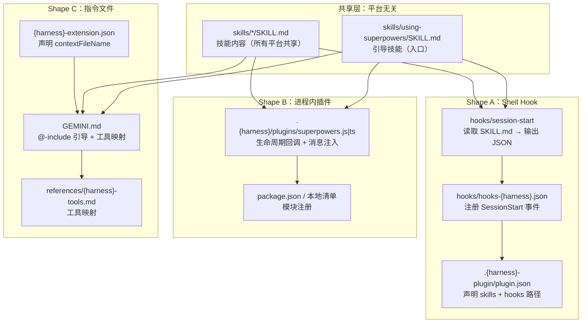
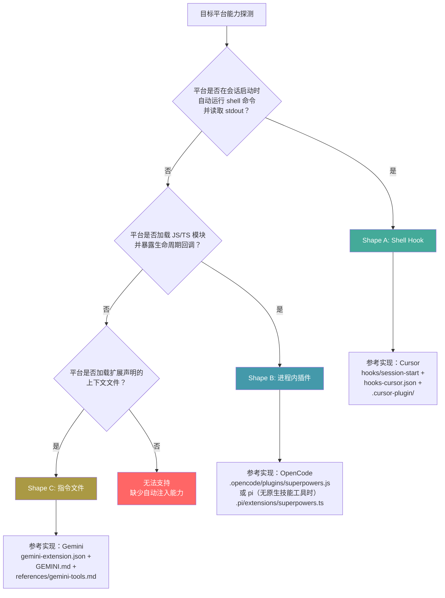
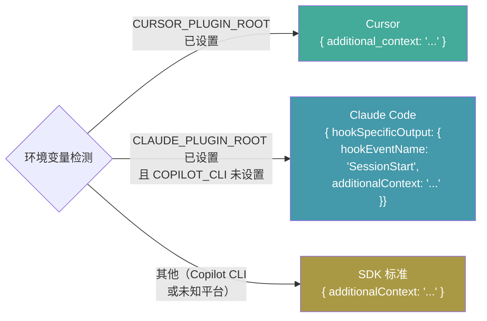
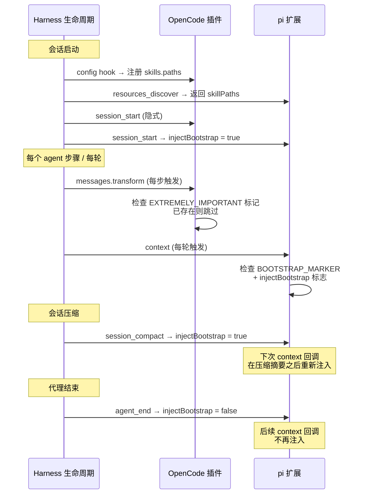
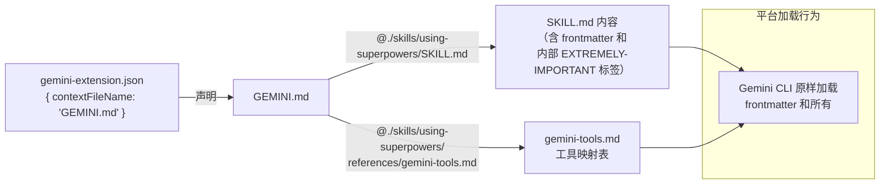
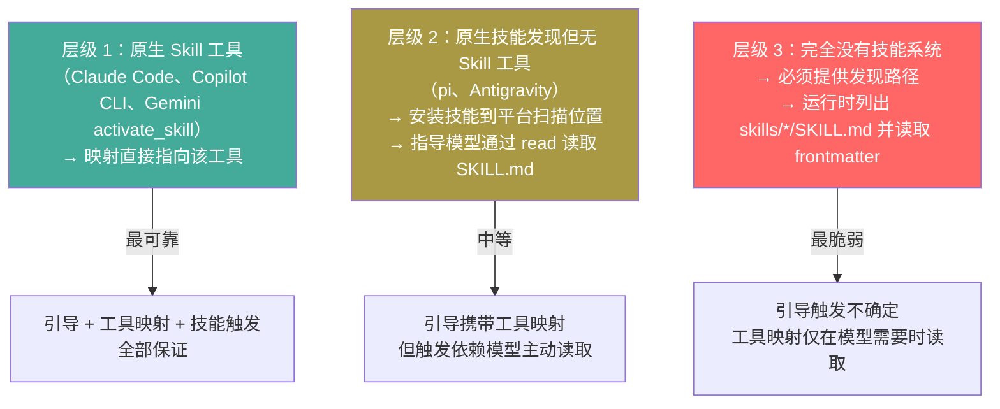
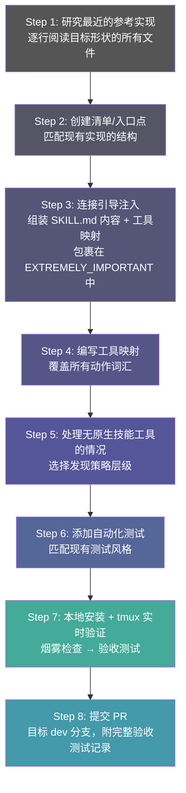

本文档解析 Superpowers 跨平台移植的核心架构决策——三种集成形状的选择逻辑、引导注入的实现差异，以及验收测试的严格定义。当你需要将 Superpowers 技能系统接入一个新的 IDE、CLI 或代理运行器时，这里是你的决策地图。

---

## 跨平台架构总览

Superpowers 的核心设计原则是**内容与传输层分离**：`skills/` 目录下的技能文件在所有平台上完全相同，差异仅存在于将技能内容交付给模型的薄层——即**引导注入机制**。这个薄层决定了集成形状（Integration Shape），也是移植工作的核心决策点。



三种形状并非互斥——技能发现机制与引导注入机制可以独立选择不同形状，但**两者都必须通过安装机制交付**，绝不能编辑用户的全局配置文件。

Sources: [porting-to-a-new-harness.md](docs/porting-to-a-new-harness.md#L1-L50), [porting-to-a-new-harness.md](docs/porting-to-a-new-harness.md#L220-L340)

---

## 三种集成形状详解

### 形状判定决策流

移植的第一步不是写代码，而是判定目标平台暴露了哪种会话启动注入表面。以下决策流覆盖所有已知情况：



**关键陷阱**：一个平台可能拥有 hook 系统但不暴露会话启动事件。某真实平台的二进制文件中包含 `SessionStart` 字符串，但那只是遥测标记——实际只暴露了 pre/post-tool 和 stop 事件。必须通过**唯一标记测试**验证：通过你认为有效的机制注入一个无意义令牌，启动新会话，确认令牌确实到达了模型上下文。

Sources: [porting-to-a-new-harness.md](docs/porting-to-a-new-harness.md#L220-L340)

### 形状对照表

| 维度 | Shape A：Shell Hook | Shape B：进程内插件 | Shape C：指令文件 |
|------|---------------------|---------------------|-------------------|
| **注入机制** | 会话启动时运行 shell 命令，stdout 被读取为 JSON | JS/TS 模块生命周期回调，代码中修改消息数组 | 扩展声明的上下文文件，平台原样加载 |
| **引导组装** | 脚本读取 `SKILL.md`，转义后嵌入平台特定 JSON 结构 | 代码读取 `SKILL.md`，剥离 frontmatter，拼接 `<EXTREMELY_IMPORTANT>` 包装 | 无需组装——上下文文件通过 `@`-include 或内联引用引导内容 |
| **工具映射位置** | `references/<harness>-tools.md`（独立文件） | 通常内联到引导字符串中（也可同时维护 `references/` 文件） | `references/<harness>-tools.md`，通过指令文件引用 |
| **去重保护** | 平台自身处理（每次会话只触发一次 hook） | 必须手动实现：检查标记是否已存在，跳过重复注入 | 不需要（文件只加载一次） |
| **压缩后重注入** | 平台通过 `compact` matcher 自动重触发 | 必须手动实现：监听压缩事件，重新注入 | 不需要（平台每次会话重新加载文件） |
| **消息角色** | 平台决定（通常作为系统上下文） | **必须是 user 角色**（系统消息导致 token 膨胀 #750、多系统消息破坏部分模型 #894） | 平台决定（作为指令文件加载） |
| **Windows 支持** | 需要 `run-hook.cmd` 多语言包装器 | 不需要（进程内执行） | 不需要 |
| **参考实现** | Cursor、Claude Code、Copilot CLI | OpenCode、pi | Gemini CLI |

Sources: [porting-to-a-new-harness.md](docs/porting-to-a-new-harness.md#L248-L340), [hooks/session-start](hooks/session-start#L1-L50), [.opencode/plugins/superpowers.js](.opencode/plugins/superpowers.js#L1-L140), [GEMINI.md](GEMINI.md#L1-L3)

---

## Shape A：Shell Hook 深度解析

Shell Hook 是最复杂的形状，因为 JSON 输出格式因平台而异，且 hook 配置模式本身也不统一。

### 环境变量路由

`hooks/session-start` 脚本通过环境变量识别当前平台，输出三种不同的 JSON 结构：



**致命陷阱**：Claude Code 同时读取 `additional_context` 和 `hookSpecificOutput` 且**不去重**。如果输出了错误的字段组合，引导要么永远不注入，要么注入两次。新增平台分支时，如果目标平台也设置了 `CLAUDE_PLUGIN_ROOT`，必须将新分支放在会被遮蔽的分支**之前**。

### Hook 配置模式差异

两个参考实现的 hook 配置结构完全不同：

| 字段 | Claude Code (`hooks.json`) | Cursor (`hooks-cursor.json`) |
|------|---------------------------|------------------------------|
| 版本声明 | 无 | `"version": 1` |
| 事件键名 | `"SessionStart"`（大写 S） | `"sessionStart"`（小写 s） |
| 命令路径 | `"${CLAUDE_PLUGIN_ROOT}/hooks/run-hook.cmd"` | `"./hooks/run-hook.cmd"`（相对路径） |
| matcher | `"startup\|clear\|compact"` | 无 |
| type/async | `"type": "command"`, `"async": false` | 无 |
| shell | `"shell": "bash"` | 无 |

**不要假设 Claude Code 的配置模式是通用的**。必须匹配目标平台最近的现有文件，而非某个"规范模板"。

Sources: [hooks/session-start](hooks/session-start#L30-L50), [hooks/hooks.json](hooks/hooks.json#L1-L18), [hooks/hooks-cursor.json](hooks/hooks-cursor.json#L1-L11), [porting-to-a-new-harness.md](docs/porting-to-a-new-harness.md#L340-L400)

---

## Shape B：进程内插件深度解析

进程内插件的核心挑战在于**生命周期管理**——回调触发频率、去重策略和压缩感知在不同平台间存在微妙但关键的差异。

### 两个参考实现的对比



| 维度 | OpenCode | pi |
|------|----------|-----|
| **回调频率** | 每个 agent 步骤（`messages.transform`） | 每轮对话（`context`） |
| **去重机制** | 检查消息中是否包含 `EXTREMELY_IMPORTANT` 文本 | 自定义 `BOOTSTRAP_MARKER` 字符串 + `injectBootstrap` 生命周期标志 |
| **压缩处理** | 依赖每步重注入 + 去重守卫 | 显式 `session_compact` 事件 → 设置标志 → 在 `compactionSummary` 消息之后插入 |
| **缓存策略** | 模块级 `_bootstrapCache`（undefined=未加载，null=文件缺失） | 模块级 `cachedBootstrap`（相同语义） |
| **消息对象形状** | `message.info.role` + `message.parts[]` | `{ role, content: [{ type, text }], timestamp }` |
| **技能注册** | `config` hook 修改 `config.skills.paths` | `resources_discover` 返回 `skillPaths` |

**核心教训**：不要将一个平台的去重策略复制到另一个平台。OpenCode 的每步触发允许简单的文本检查去重；pi 的每轮触发需要生命周期标志来防止 `agent_end` 后的多余注入。复制策略会导致注入失效或重复。

Sources: [.opencode/plugins/superpowers.js](.opencode/plugins/superpowers.js#L60-L140), [.pi/extensions/superpowers.ts](.pi/extensions/superpowers.ts#L1-L122), [porting-to-a-new-harness.md](docs/porting-to-a-new-harness.md#L440-L490)

---

## Shape C：指令文件深度解析

Shape C 是最简单的形状——没有注入器，没有代码，没有 frontmatter 剥离。但它的简单性附带严格约束。

### 工作原理



**关键约束**：
- `@`-include 是 Gemini 特有功能。如果目标平台没有 include 语法，必须将引导内容**内联**到指令文件中。
- **不要信任 `@`-include 一定会被展开**。某 Gemini 衍生平台接受 `@./path` 语法，但将其视为"模型可以选择读取的提示"（发出文件读取工具调用）而非保证的内联展开。通过唯一标记测试验证：如果标记在没有工具调用的情况下不在上下文中，**内联内容**而非 `@`-include。
- Gemini 不发送"已加载，不要重新调用"的前导说明——对于 `@`-include 平台，内容是活动的指令集，不是模型会重新加载的技能。

Sources: [GEMINI.md](GEMINI.md#L1-L3), [gemini-extension.json](gemini-extension.json#L1-L7), [porting-to-a-new-harness.md](docs/porting-to-a-new-harness.md#L310-L340)

---

## 工具映射：动作词汇翻译

所有形状都需要将技能中的动作词汇翻译为目标平台的真实工具名称。映射文件的位置取决于形状，但覆盖的动作集相同：

| 技能请求的动作 | 必需性 | 降级策略 |
|---------------|--------|----------|
| 读取文件 | **必需** | 无降级方案 |
| 创建/编辑/删除文件 | **必需** | 无降级方案 |
| 运行 shell 命令 | **必需** | 无降级方案 |
| 搜索文件内容 / 按名称查找文件 | **必需** | 无降级方案 |
| 调用技能 | **必需** | 无原生 Skill 工具时，使用文件读取工具读取 `SKILL.md`（这是合法路径，不是违规） |
| 分派子代理 | 可降级 | 技能已有降级措辞：在当前会话内完成工作或报告缺失能力，**绝不**发明 `Task` 调用 |
| 创建/更新待办事项 | 可降级 | 回退到计划文件或 `TODO.md` |
| 获取 URL / 网页搜索 | 可降级 | 部分技能受影响 |

**获取真实工具名称的权威方法**：在活跃会话中，要求模型"逐行列出你能调用的每个工具的精确机器名称"。这是获取工具名称的唯一可靠方式——不要从文档猜测，不要发明。

Sources: [porting-to-a-new-harness.md](docs/porting-to-a-new-harness.md#L490-L560), [skills/using-superpowers/references/gemini-tools.md](skills/using-superpowers/references/gemini-tools.md#L1-L64), [skills/using-superpowers/references/pi-tools.md](skills/using-superpowers/references/pi-tools.md#L1-L17)

---

## 技能发现：三种能力层级

当目标平台没有原生 `Skill` 工具时，技能发现策略分为三个层级，可靠性递减：



层级 2 和 3 的共同弱点：**没有结构性保证触发会生效**。没有 `<EXTREMELY_IMPORTANT>` 包装器，没有去重，没有压缩后重注入——触发完全依赖模型选择对它在索引中看到的描述做出响应。这正是验收测试在这些场景下成为**唯一保证**的原因。

Sources: [porting-to-a-new-harness.md](docs/porting-to-a-new-harness.md#L560-L640)

---

## 验收测试：完成的定义

一个移植在以下**全部条件**满足时才算完成：

### 自动化测试矩阵

| 形状 | 测试策略 | 参考实现 | 断言重点 |
|------|----------|----------|----------|
| Shape A | Shell 脚本验证 hook stdout 的 JSON 结构和内容 | `tests/hooks/test-session-start.sh` | JSON 字段/嵌套精确匹配、引导内容存在、不含多余字段、`shell: "bash"` 注册 |
| Shape B | 单元测试模拟平台插件 API | `tests/pi/test-pi-extension.mjs` | 生命周期处理器注册、引导注入一次、去重守卫生效、压缩后重注入、缓存行为 |
| Shape B（集成） | 隔离环境安装验证 | `tests/opencode/test-plugin-loading.sh` | 插件文件存在、语法有效、技能目录可发现、引导内容不含错误路径 |
| Shape C | 清单结构验证 | `tests/kimi/test-plugin-manifest.sh` | 必需字段存在、工具映射包含所有关键令牌、版本在 `.version-bump.json` 中注册 |

### 端到端验收测试（所有形状必须通过）

```
测试提示（精确文本）：
> Let's make a react todo list
```

**通过标准**：`brainstorming` 技能在**任何代码编写之前**自动触发。必须捕获完整会话记录并附在 PR 中。

**快速烟雾检查**：在会话中询问模型"你有什么 superpowers？"如果引导已注入，模型会知道自己拥有技能。这比完整验收测试更快，但不能替代它。

**tmux 驱动模式**：大多数平台是无法通过 stdin 管道驱动的交互式 TUI，必须在分离的 tmux 会话中运行。关键注意事项：
- 启动后等待足够时间（10s+）再进行首次捕获
- 提示文本和 `Enter` 作为**独立的** `send-keys` 调用发送，中间间隔 `sleep 0.4`
- 以轮询方式循环 `capture-pane`，而非单次捕获
- 先清除首次运行的信任/入门提示，否则 tmux 会静默阻塞

Sources: [porting-to-a-new-harness.md](docs/porting-to-a-new-harness.md#L130-L170), [porting-to-a-new-harness.md](docs/porting-to-a-new-harness.md#L650-L700), [tests/hooks/test-session-start.sh](tests/hooks/test-session-start.sh#L1-L226), [tests/pi/test-pi-extension.mjs](tests/pi/test-pi-extension.mjs#L1-L138)

---

## 分发与版本管理

### 分发渠道对照

| 渠道类型 | 代表平台 | 安装方式 | 特殊注意事项 |
|----------|----------|----------|--------------|
| 原生插件市场 | Claude Code | `.claude-plugin/marketplace.json` → `/plugin install` | 外部 `superpowers-marketplace` 仓库是用户安装的源 |
| 外部仓库同步 | Codex | `scripts/sync-to-codex-plugin.sh` rsync 到独立 fork | 注意 include/exclude 列表，避免泄露其他平台的 dotdir |
| Git URL 扩展安装 | Gemini、Kimi Code、OpenCode | `gemini extensions install <url>` 等 | 记录精确命令 |
| 包清单字段 | pi | 仓库根 `package.json` 的 `pi.*` 字段 | 已跟踪于 `.version-bump.json` |
| 本地安装器 | Antigravity | `install.sh` → `agy plugin install` | 安装器生成上下文文件，必须验证保留 |

### 版本同步

所有版本化的清单文件必须注册在 `.version-bump.json` 中，由 `scripts/bump-version.sh` 统一维护：

```json
{
  "files": [
    { "path": "package.json", "field": "version" },
    { "path": ".claude-plugin/plugin.json", "field": "version" },
    { "path": ".cursor-plugin/plugin.json", "field": "version" },
    { "path": ".codex-plugin/plugin.json", "field": "version" },
    { "path": ".kimi-plugin/plugin.json", "field": "version" },
    { "path": ".claude-plugin/marketplace.json", "field": "plugins.0.version" },
    { "path": "gemini-extension.json", "field": "version" }
  ]
}
```

**未注册的清单会发运过时版本号**——这是移植者最常遗漏的步骤之一。

Sources: [.version-bump.json](.version-bump.json#L1-L22), [porting-to-a-new-harness.md](docs/porting-to-a-new-harness.md#L700-L780)

---

## 常见陷阱速查表

以下是历史上真实导致移植失败的陷阱，按形状分类：

| 陷阱 | 形状 | 症状 | 修复 |
|------|------|------|------|
| JSON 字段错误 | A | 静默失败或双重注入 | 精确匹配目标平台的字段/嵌套 |
| Hook 配置模式不匹配 | A | Hook 静默不触发 | 匹配最近的现有配置文件，不假设通用模板 |
| 插件根环境变量不同 | A | 命令路径解析失败 | 使用目标平台导出的变量（`${CLAUDE_PLUGIN_ROOT}` 或相对路径） |
| 系统消息注入 | B | Token 膨胀、模型崩溃 | **必须**使用 user 角色消息 |
| 每步 vs 每轮回调混淆 | B | 去重失效或注入缺失 | 匹配目标平台的回调频率设计去重策略 |
| 消息对象形状复制 | B | 静默注入失败 | 从平台 API 发现消息形状，不复制参考实现的字面量 |
| `@`-include 未实际展开 | C | 引导内容缺失 | 唯一标记测试验证；失败则内联内容 |
| 安装器剥离未声明文件 | C | 上下文文件消失 | 在清单中声明 `contextFileName` 字段 |
| Hook 脚本使用 `.sh` 扩展 | A（Windows） | Claude Code Windows 双重调用 bash | 保持脚本无扩展名 |
| 版本未注册 | 所有 | 发运过时版本 | 添加到 `.version-bump.json` |
| 编辑技能内容适配平台 | 所有 | PR 被拒 | 修复放在工具映射中，永远不编辑 `skills/*/SKILL.md` |

Sources: [porting-to-a-new-harness.md](docs/porting-to-a-new-harness.md#L799-L828)

---

## 移植流程总览



**铁律**：
1. **技能命名动作，不命名工具**——永远不编辑技能内容来适配平台
2. **一切通过安装机制交付**——永远不编辑用户的全局配置
3. **验收测试是硬门槛**——没有 "Let's make a react todo list" 的完整记录，PR 会被关闭

Sources: [porting-to-a-new-harness.md](docs/porting-to-a-new-harness.md#L50-L100), [porting-to-a-new-harness.md](docs/porting-to-a-new-harness.md#L130-L170), [CLAUDE.md](CLAUDE.md#L85-L100)

---

## 当前参考实现索引

| 平台 | 入口点 | 引导机制 | 工具映射 | 测试 | 分发 |
|------|--------|----------|----------|------|------|
| Claude Code | `.claude-plugin/plugin.json` + `hooks/hooks.json` | Shell hook → `hookSpecificOutput.additionalContext` | 原生 `Skill` 工具，无需适配文件 | `tests/hooks/` | 市场 |
| Codex | `.codex-plugin/plugin.json`（声明空 `hooks`） | 原生技能发现（无 hook） | `references/codex-tools.md` | `tests/codex/` | Fork 同步 |
| Cursor | `.cursor-plugin/plugin.json` + `hooks/hooks-cursor.json` | Shell hook → `additional_context` | 无需（兼容 Claude Code 工具面） | `tests/hooks/` | 手写 |
| Gemini CLI | `gemini-extension.json` + `GEMINI.md` | 指令文件 `@`-include | `references/gemini-tools.md` | — | `gemini extensions install` |
| Kimi Code | `.kimi-plugin/plugin.json` | 清单 `sessionStart.skill` | 内联 `skillInstructions` | `tests/kimi/` | 市场 / URL |
| OpenCode | `.opencode/plugins/superpowers.js` | 进程内 `messages.transform` | 内联于 `superpowers.js` | `tests/opencode/` | `opencode.json` git URL |
| pi | `.pi/extensions/superpowers.ts` | 进程内 `context` 事件 + 生命周期标志 | `piToolMapping()` 内联 + `references/pi-tools.md` | `tests/pi/` | `package.json` 字段 |

Sources: [porting-to-a-new-harness.md](docs/porting-to-a-new-harness.md#L780-L800)

---

## 延伸阅读

- 前置知识：[跨平台架构：技能、工具映射与引导注入三层模型](18-kua-ping-tai-jia-gou-ji-neng-gong-ju-ying-she-yu-yin-dao-zhu-ru-san-ceng-mo-xing) — 理解三层模型的基础概念
- 前置知识：[引导注入机制：SessionStart Hook 与消息变换](19-yin-dao-zhu-ru-ji-zhi-sessionstart-hook-yu-xiao-xi-bian-huan) — 深入理解引导注入的技术细节
- 后续阅读：[各平台插件清单与安装机制对照](21-ge-ping-tai-cha-jian-qing-dan-yu-an-zhuang-ji-zhi-dui-zhao) — 每个平台的具体安装命令和清单结构
- 相关主题：[编写新技能：将 TDD 应用于过程文档](22-bian-xie-xin-ji-neng-jiang-tdd-ying-yong-yu-guo-cheng-wen-dang) — 了解技能内容为何不应被修改
- 相关主题：[测试体系：插件集成测试与技能行为评估](26-ce-shi-ti-xi-cha-jian-ji-cheng-ce-shi-yu-ji-neng-xing-wei-ping-gu) — 测试架构的全局视图