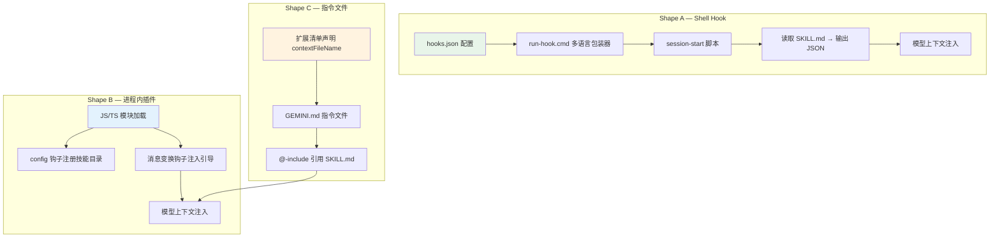
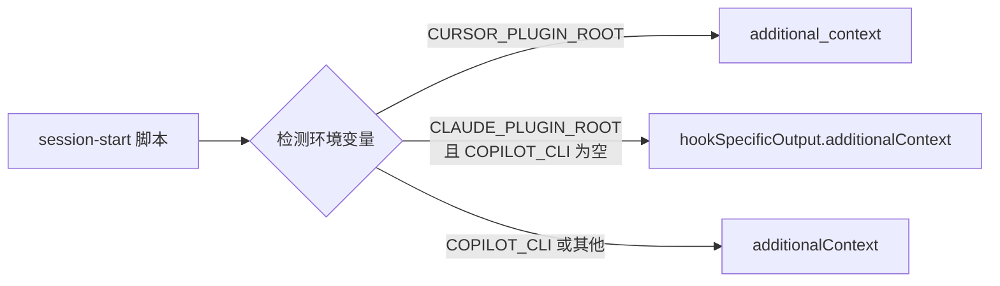
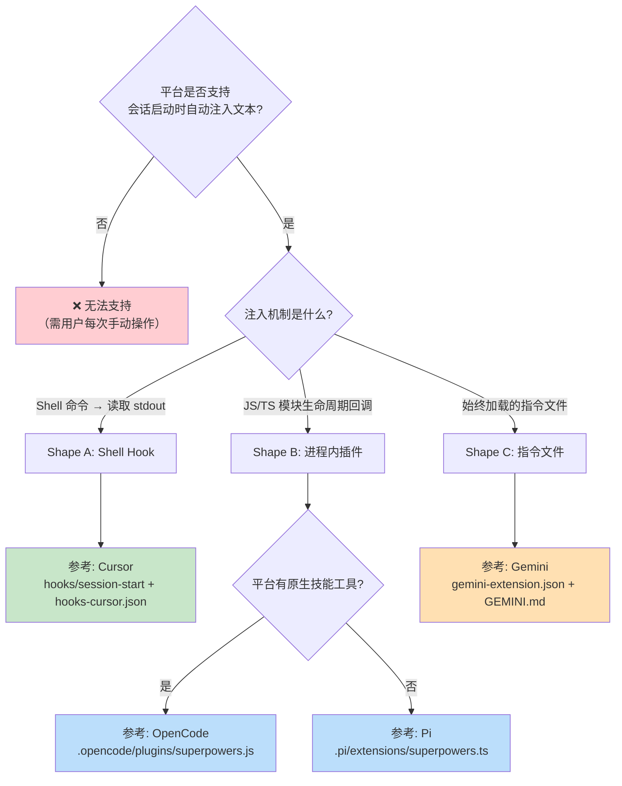

本文档系统梳理 Superpowers 在各 AI 编码代理平台上的插件清单结构、安装方式与引导注入机制。Superpowers 采用"同一技能内容 + 平台适配薄层"的架构——`skills/` 目录是所有平台共享的不可变核心，差异仅在于每个平台如何将引导上下文（bootstrap）注入模型、如何将技能中的动作描述映射为平台原生工具。

---

## 架构总览：三种集成形态

Superpowers 的跨平台适配可归纳为三种结构形态（Shape），区分标准是**引导内容如何到达模型上下文**：



三种形态并非互斥——技能发现机制与引导注入机制可以分别采用不同形态，但两者都必须通过平台的安装机制交付，**绝不能修改用户的全局配置文件**。

Sources: [porting-to-a-new-harness.md](docs/porting-to-a-new-harness.md#L140-L200)

---

## 平台插件清单详表

下表汇总所有已支持平台的清单文件、集成形态与安装命令：

| 平台 | 清单文件 | 集成形态 | 安装命令 | 引导注入方式 |
|------|---------|---------|---------|------------|
| **Claude Code** | `.claude-plugin/plugin.json` | A (Shell Hook) | `/plugin install superpowers@claude-plugins-official` | Hook 脚本输出 JSON |
| **Cursor** | `.cursor-plugin/plugin.json` | A (Shell Hook) | `/add-plugin superpowers` | Hook 脚本输出 JSON |
| **Codex App/CLI** | `.codex-plugin/plugin.json` | 市场分发 + 原生技能 | Codex 侧边栏 `/plugins` 搜索安装 | 原生技能系统，无 Hook |
| **Kimi Code** | `.kimi-plugin/plugin.json` | B (进程内) | `/plugins install` 或 marketplace | `sessionStart.skill` 声明 |
| **OpenCode** | `.opencode/plugins/superpowers.js` | B (进程内) | `opencode.json` 的 `plugin` 数组 | `experimental.chat.messages.transform` |
| **Gemini CLI** | `gemini-extension.json` | C (指令文件) | `gemini extensions install` | `contextFileName` → `GEMINI.md` |
| **Pi** | `package.json` (pi 字段) | B (进程内) | `pi install git:github.com/obra/superpowers` | `context` 事件钩子 |
| **Antigravity** | 复用 Claude Code 清单 | A (Shell Hook) | `agy plugin install <repo-url>` | 运行 session-start hook |
| **Factory Droid** | 复用 Claude Code 清单 | A (Shell Hook) | `droid plugin install superpowers@superpowers` | 运行 session-start hook |
| **GitHub Copilot CLI** | marketplace 分发 | A (Shell Hook) | `copilot plugin install superpowers@superpowers-marketplace` | Hook 脚本输出 JSON |

Sources: [README.md](README.md#L32-L130), [.version-bump.json](.version-bump.json#L1-L22)

---

## Shape A 详解：Shell Hook 平台

### Claude Code

Claude Code 是最早的集成目标，其清单采用**约定优于配置**策略——`.claude-plugin/plugin.json` 中不显式声明 `skills` 或 `hooks` 路径，平台自动发现 `skills/` 目录和 `hooks/hooks.json`。

```json
{
  "name": "superpowers",
  "version": "6.2.0",
  "description": "Core skills library for Claude Code..."
}
```

Hook 配置文件 `hooks/hooks.json` 注册了 `SessionStart` 事件，匹配器为 `startup|clear|compact`，确保在会话启动、清除和压缩时均触发引导注入：

```json
{
  "hooks": {
    "SessionStart": [{
      "matcher": "startup|clear|compact",
      "hooks": [{
        "type": "command",
        "command": "\"${CLAUDE_PLUGIN_ROOT}/hooks/run-hook.cmd\" session-start",
        "shell": "bash",
        "async": false
      }]
    }]
  }
}
```

安装支持两种途径：Anthropic 官方市场（`superpowers@claude-plugins-official`）或 Superpowers 自有市场（`obra/superpowers-marketplace`）。

Sources: [.claude-plugin/plugin.json](.claude-plugin/plugin.json#L1-L21), [hooks/hooks.json](hooks/hooks.json#L1-L18), [.claude-plugin/marketplace.json](.claude-plugin/marketplace.json#L1-L21)

### Cursor

Cursor 的清单显式声明了 `skills` 和 `hooks` 路径，并使用独立的 Hook 配置文件 `hooks/hooks-cursor.json`。与 Claude Code 的关键差异在于 Hook 配置的 schema 完全不同：

```json
{
  "version": 1,
  "hooks": {
    "sessionStart": [{
      "command": "./hooks/run-hook.cmd session-start"
    }]
  }
}
```

| 差异点 | Claude Code | Cursor |
|--------|------------|--------|
| 事件名大小写 | `SessionStart` | `sessionStart` |
| 命令路径 | `${CLAUDE_PLUGIN_ROOT}/hooks/run-hook.cmd` | `./hooks/run-hook.cmd`（相对路径） |
| 额外字段 | `matcher`, `type`, `shell`, `async` | 仅 `command` |
| JSON 输出字段 | `hookSpecificOutput.additionalContext` | `additional_context` |

Sources: [.cursor-plugin/plugin.json](.cursor-plugin/plugin.json#L1-L24), [hooks/hooks-cursor.json](hooks/hooks-cursor.json#L1-L11)

### Hook 输出的平台分叉

`hooks/session-start` 脚本通过环境变量检测当前运行平台，输出不同结构的 JSON。这是一个容易出错的环节——**发错字段名会导致引导不注入或重复注入**：



Claude Code 会同时读取 `additional_context` 和 `hookSpecificOutput` 且不做去重，因此必须精确匹配当前平台的字段。

Sources: [hooks/session-start](hooks/session-start#L28-L50)

### 跨平台 Polyglot 包装器

`hooks/run-hook.cmd` 是一个精心设计的多语言脚本——Windows 的 `cmd.exe` 执行批处理部分查找 Git Bash，Unix shell 将其视为空操作并直接执行 bash 部分。这解决了 Windows 上 Claude Code 自动检测 `.sh` 扩展名并前置 `bash` 命令的干扰问题：

```
: << 'CMDBLOCK'
@echo off
REM Windows: 查找 Git for Windows 的 bash.exe
...
CMDBLOCK
# Unix: 直接执行命名脚本
exec bash "${SCRIPT_DIR}/${SCRIPT_NAME}" "$@"
```

Sources: [hooks/run-hook.cmd](hooks/run-hook.cmd#L1-L47)

### Antigravity 与 Factory Droid

这两个平台直接消费 Claude Code 的插件格式，无需独立的清单文件。Antigravity 通过 `agy plugin install` 从仓库 URL 安装并运行 session-start hook；Factory Droid 通过 `droid plugin install` 从 Superpowers 市场安装。

Sources: [README.md](README.md#L46-L60)

---

## Shape B 详解：进程内插件平台

### OpenCode

OpenCode 集成是 Shape B 的参考实现。插件入口 `.opencode/plugins/superpowers.js` 是一个 ES Module，通过两个生命周期钩子完成集成：

1. **`config` 钩子**：将 Superpowers 的 `skills/` 目录注入 OpenCode 的技能发现路径，无需符号链接或手动配置。
2. **`experimental.chat.messages.transform` 钩子**：在每条消息数组的第一条用户消息前注入引导内容。

选择用户消息而非系统消息的原因：系统消息每轮重复导致 token 膨胀（#750），且多系统消息会破坏 Qwen 等模型（#894）。

安装方式是在 `opencode.json` 中添加 git-backed 包规格：

```json
{
  "plugin": ["superpowers@git+https://github.com/obra/superpowers.git"]
}
```

Sources: [.opencode/plugins/superpowers.js](.opencode/plugins/superpowers.js#L1-L140), [.opencode/INSTALL.md](.opencode/INSTALL.md#L1-L116)

### Kimi Code

Kimi Code 的清单通过 `sessionStart.skill` 字段声明在会话启动时自动加载 `using-superpowers` 技能，并通过 `skillInstructions` 字段内联 Kimi 特有的工具映射：

```json
{
  "skills": "./skills/",
  "sessionStart": {
    "skill": "using-superpowers"
  },
  "skillInstructions": "Kimi Code tool mapping for Superpowers skills..."
}
```

Kimi 的安装支持市场浏览（`/plugins` → Marketplace）和直接仓库 URL 安装两种方式。安装后需通过 `/new` 开启新会话使插件生效。

Sources: [.kimi-plugin/plugin.json](.kimi-plugin/plugin.json#L1-L39), [docs/README.kimi.md](docs/README.kimi.md#L1-L89)

### Pi

Pi 的集成通过根目录 `package.json` 中的 `pi` 字段声明，入口文件 `.pi/extensions/superpowers.ts` 是 TypeScript 模块。Pi 没有原生 `Skill` 工具，因此引导内容中内联了 Pi 专用的工具映射说明。

Pi 扩展使用四个生命周期事件：

| 事件 | 作用 |
|------|------|
| `resources_discover` | 返回技能目录路径 |
| `session_start` | 重置引导注入标志 |
| `session_compact` | 压缩后重新注入引导 |
| `context` | 在消息数组中插入引导内容 |

安装命令：`pi install git:github.com/obra/superpowers`

Sources: [.pi/extensions/superpowers.ts](.pi/extensions/superpowers.ts#L1-L122), [package.json](package.json#L1-L24)

---

## Shape C 详解：指令文件平台

### Gemini CLI

Gemini CLI 既无 Shell Hook 也无进程内插件——其集成完全依赖**扩展声明的指令文件**。清单 `gemini-extension.json` 仅 7 行，核心是 `contextFileName` 字段指向 `GEMINI.md`：

```json
{
  "name": "superpowers",
  "version": "6.2.0",
  "contextFileName": "GEMINI.md"
}
```

`GEMINI.md` 本身仅两行 `@`-include 引用：

```
@./skills/using-superpowers/SKILL.md
@./skills/using-superpowers/references/gemini-tools.md
```

这种方式的限制在于：`@`-include 必须被 Gemini 保证为**内联展开**而非"提示模型可选择读取"。Gemini 衍生平台可能将 `@`-include 视为建议而非强制，此时需要改为内联内容。

Sources: [gemini-extension.json](gemini-extension.json#L1-L7), [GEMINI.md](GEMINI.md#L1-L3)

---

## Codex：原生技能系统的特殊处理

Codex 的清单 `.codex-plugin/plugin.json` 是所有平台中最丰富的——包含完整的 `interface` 元数据（显示名称、描述、品牌色、图标路径、默认提示语等），用于在 Codex 市场中展示。

关键设计决策：`hooks` 字段被显式设为空对象 `{}`，目的是**抑制 Codex 对 `hooks/hooks.json` 的自动发现**。因为 Codex 原生支持技能系统，不需要也不应该运行 session-start hook：

```json
{
  "skills": "./skills/",
  "hooks": {},
  "interface": {
    "displayName": "Superpowers",
    "brandColor": "#F59E0B",
    "composerIcon": "./assets/superpowers-small.svg",
    ...
  }
}
```

Codex 的分发通过 `scripts/sync-to-codex-plugin.sh` 将仓库内容同步到 OpenAI 的 Codex 插件仓库，或 `scripts/package-codex-plugin.sh` 打包为无根目录的归档文件上传至 Codex 门户。打包时排除所有非 Codex 文件（其他平台清单、测试、文档、脚本等）。

Sources: [.codex-plugin/plugin.json](.codex-plugin/plugin.json#L1-L49), [scripts/sync-to-codex-plugin.sh](scripts/sync-to-codex-plugin.sh#L1-L60), [scripts/package-codex-plugin.sh](scripts/package-codex-plugin.sh#L1-L50)

---

## 工具映射对照表

技能内容使用动作描述而非具体工具名。下表展示各平台如何将同一动作映射为不同的原生工具：

| 动作 | Claude Code / Cursor | Codex | Gemini CLI | Kimi Code | OpenCode | Pi | Antigravity |
|------|---------------------|-------|-----------|----------|---------|-----|------------|
| 调用技能 | `Skill` | 原生技能 | `activate_skill` | `Skill` | `skill` | `read` SKILL.md | — |
| 读取文件 | `Read` | `read` | `read_file` | `Read` | `read` | `read` | `read_file` |
| 编辑文件 | `Edit` | `edit` | `replace` | `Edit` | `apply_patch` | `edit` | `replace_file_content` |
| 运行命令 | `Bash` | `shell` | `run_shell_command` | `Bash` | `bash` | `bash` | `run_shell_command` |
| 分派子代理 | `Task` | `spawn_agent` | `invoke_agent` | `Agent` | `task` | 可选 `subagent` | `invoke_subagent` |
| 任务追踪 | `TodoWrite` | — | `write_todos` | `TodoList` | `todowrite` | 可选 / `TODO.md` | 任务 artifact |
| 搜索内容 | `Grep` | `grep` | `grep_search` | `Grep` | `grep` | `grep` | `grep_search` |
| 获取 URL | `FetchURL` | — | `web_fetch` | `FetchURL` | `webfetch` | — | `fetch_url` |

Sources: [skills/using-superpowers/references/gemini-tools.md](skills/using-superpowers/references/gemini-tools.md#L1-L64), [skills/using-superpowers/references/codex-tools.md](skills/using-superpowers/references/codex-tools.md#L1-L40), [skills/using-superpowers/references/antigravity-tools.md](skills/using-superpowers/references/antigravity-tools.md#L1-L24), [skills/using-superpowers/references/pi-tools.md](skills/using-superpowers/references/pi-tools.md#L1-L17), [docs/README.kimi.md](docs/README.kimi.md#L42-L56), [docs/README.opencode.md](docs/README.opencode.md#L85-L100)

---

## 版本同步机制

所有平台的清单版本通过 `.version-bump.json` 统一管理。执行 `scripts/bump-version.sh <version>` 时，脚本会同步更新以下 7 个位置：

| 文件 | 字段路径 |
|------|---------|
| `package.json` | `version` |
| `.claude-plugin/plugin.json` | `version` |
| `.cursor-plugin/plugin.json` | `version` |
| `.codex-plugin/plugin.json` | `version` |
| `.kimi-plugin/plugin.json` | `version` |
| `.claude-plugin/marketplace.json` | `plugins.0.version` |
| `gemini-extension.json` | `version` |

脚本还提供 `--check`（检测版本漂移）和 `--audit`（扫描仓库中未声明的版本字符串）功能。注意：OpenCode、Pi 和 Gemini 的指令文件不包含版本号字段，因此不在自动同步范围内。

Sources: [.version-bump.json](.version-bump.json#L1-L22), [scripts/bump-version.sh](scripts/bump-version.sh#L1-L100)

---

## 跨平台集成决策流

为新平台选择集成形态时，按以下决策流判断：



Sources: [docs/porting-to-a-new-harness.md](docs/porting-to-a-new-harness.md#L140-L200)

---

## 仓库目录结构：平台适配文件索引

```
superpowers/
├── .claude-plugin/          ← Claude Code 清单 + 市场配置
│   ├── plugin.json
│   └── marketplace.json
├── .cursor-plugin/          ← Cursor 清单
│   └── plugin.json
├── .codex-plugin/           ← Codex 清单（含 interface 元数据）
│   └── plugin.json
├── .kimi-plugin/            ← Kimi Code 清单（含 sessionStart）
│   └── plugin.json
├── .opencode/               ← OpenCode 进程内插件
│   ├── INSTALL.md
│   └── plugins/superpowers.js
├── .pi/                     ← Pi 进程内扩展
│   └── extensions/superpowers.ts
├── .agents/plugins/         ← 跨运行时市场配置
│   └── marketplace.json
├── gemini-extension.json    ← Gemini CLI 扩展清单
├── GEMINI.md                ← Gemini 指令文件（@-include）
├── hooks/                   ← Shape A 共享 Hook 基础设施
│   ├── hooks.json           ← Claude Code Hook 配置
│   ├── hooks-cursor.json    ← Cursor Hook 配置
│   ├── run-hook.cmd         ← 跨平台 polyglot 包装器
│   └── session-start        ← 引导注入脚本
├── skills/                  ← 所有平台共享的技能内容
│   └── using-superpowers/
│       ├── SKILL.md         ← 引导技能（所有平台的注入源）
│       └── references/      ← 平台专用工具映射
│           ├── gemini-tools.md
│           ├── codex-tools.md
│           ├── antigravity-tools.md
│           └── pi-tools.md
├── package.json             ← Pi 包元数据 + OpenCode 入口
└── .version-bump.json       ← 跨平台版本同步配置
```

---

## 阅读建议

本文档是"多平台适配架构"部分的最后一篇。建议按以下路径继续阅读：

- **前置知识**：[跨平台架构：技能、工具映射与引导注入三层模型](18-kua-ping-tai-jia-gou-ji-neng-gong-ju-ying-she-yu-yin-dao-zhu-ru-san-ceng-mo-xing) → [引导注入机制：SessionStart Hook 与消息变换](19-yin-dao-zhu-ru-ji-zhi-sessionstart-hook-yu-xiao-xi-bian-huan) → [移植到新平台：集成形状选择与验收测试](20-yi-zhi-dao-xin-ping-tai-ji-cheng-xing-zhuang-xuan-ze-yu-yan-shou-ce-shi)
- **后续深入**：[编写新技能：将 TDD 应用于过程文档](22-bian-xie-xin-ji-neng-jiang-tdd-ying-yong-yu-guo-cheng-wen-dang) — 了解技能内容的编写规范
- **实践验证**：[测试体系：插件集成测试与技能行为评估](26-ce-shi-ti-xi-cha-jian-ji-cheng-ce-shi-yu-ji-neng-xing-wei-ping-gu) — 了解各平台集成的自动化测试方法