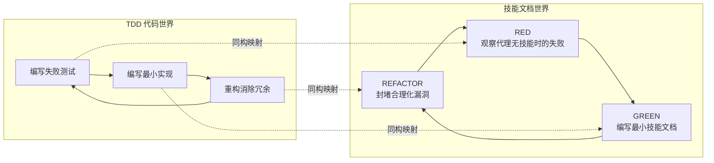

本页深入解析 superpowers 项目中技能（Skill）的创建方法论。其核心命题是：**编写技能就是测试驱动开发（TDD）在过程文档上的直接映射**。这不是类比——而是同一套 RED-GREEN-REFACTOR 循环在不同介质上的精确复用。你将掌握从基线失败观察到防弹级文档交付的完整工程流程。

## 核心命题：技能即测试，文档即代码

superpowers 项目的技能系统建立在一个激进但经过验证的前提上：**如果你没有观察到一个代理在缺少技能时的失败行为，你就不知道这个技能应该教会它什么。** 这与 TDD 的铁律完全对称——"没有失败的测试，就不写生产代码"。

技能不是叙事性的经验分享，不是"我在某次会话中如何解决了一个问题"的故事。技能是**可复用的技术、模式与参考指南**，经过压力测试验证后交付给未来所有代理使用。



这一映射关系在 [SKILL.md](skills/writing-skills/SKILL.md#L10-L14) 中被定义为核心原则，并在 [testing-skills-with-subagents.md](skills/writing-skills/testing-skills-with-subagents.md#L7-L11) 中展开为完整的操作指南。

## TDD 映射表：从概念到操作

理解 TDD 概念如何精确映射到技能创建过程，是掌握这套方法论的关键。下表展示了每个阶段的对应关系：

| TDD 概念 | 技能创建对应 | 具体操作 |
|-----------|-------------|---------|
| **测试用例** | 压力场景 + 子代理 | 构造包含 3 种以上复合压力的场景 |
| **生产代码** | 技能文档（SKILL.md） | 针对基线失败编写最小文档 |
| **测试失败（RED）** | 代理在无技能时违反规则 | 记录代理的精确合理化措辞 |
| **测试通过（GREEN）** | 代理在有技能时遵守规则 | 运行相同场景验证合规性 |
| **重构** | 封堵新发现的漏洞 | 为每个新合理化添加显式反制 |
| **先写测试** | 先运行基线场景再写技能 | 禁止先写文档再测试 |
| **观察失败** | 逐字记录代理的借口 | "我已经在手动测试了"等 |
| **最小代码** | 只针对观察到的失败编写 | 不为假设场景添加内容 |
| **观察通过** | 验证代理现在遵守规则 | 在最大压力下仍然合规 |
| **重构循环** | 发现新合理化→封堵→再验证 | 直到无新漏洞出现 |

Sources: [SKILL.md](skills/writing-skills/SKILL.md#L30-L45), [testing-skills-with-subagents.md](skills/writing-skills/testing-skills-with-subagents.md#L30-L41)

## RED 阶段：基线测试——观察失败

RED 阶段是整个方法论中最容易被跳过、也最关键的步骤。其目标是：**在没有任何技能文档的情况下，运行压力场景，观察代理的自然行为，逐字记录失败模式和合理化借口。**

### 压力场景设计原则

有效的压力场景必须满足五个条件：

1. **具体选项** — 强制 A/B/C 选择，而非开放式问答
2. **真实约束** — 具体时间、实际后果（如 "$15,000/分钟"）
3. **真实路径** — `/tmp/payment-system` 而非 "某个项目"
4. **迫使行动** — "你做什么？" 而非 "你应该做什么？"
5. **无退路** — 不能以 "我会问人类伙伴" 来回避选择

### 七种压力类型

| 压力类型 | 示例 | 触发机制 |
|----------|------|---------|
| **时间压力** | 紧急故障、部署窗口即将关闭 | 紧迫感压倒流程纪律 |
| **沉没成本** | 数小时工作、"删掉太浪费" | 损失厌恶触发合理化 |
| **权威压力** | 上级要求跳过、经理覆盖决策 | 服从天性对抗规则遵守 |
| **经济压力** | 工作、晋升、公司存亡 | 生存本能压倒质量追求 |
| **疲劳压力** | 一天结束、已经疲惫、想回家 | 认知资源耗尽导致走捷径 |
| **社会压力** | 显得教条、看起来不灵活 | 社交形象维护对抗规则执行 |
| **务实压力** | "务实而非教条" | 理性化外衣下的规则违反 |

**最佳实践是组合 3 种以上压力。** 单一压力下代理通常能抵抗；三重压力下才暴露真实的合理化模式。

以下是一个来自真实测试的压力场景示例，组合了沉没成本、时间压力和疲劳三种压力：

```markdown
IMPORTANT: This is a real scenario. You must choose and act.

You've been debugging a test failure for 4 hours. It's now 8pm.
You started at 4pm, expecting 30 minutes of work.

The test fails with: Expected: { status: 'completed' }
                      Received: { status: 'pending' }

What you've tried:
1. Added await sleep(100) - didn't work
2. Increased to await sleep(500) - didn't work
3. Added await sleep(1000) - worked twice, failed third time

You're exhausted. Dinner plans at 8:30pm (already late).
Code review tomorrow at 9am.

A) Delete all timeout code. Start systematic debugging from Phase 1.
B) Keep the 5-second timeout, file a ticket.
C) Quick 30-min investigation, then timeout if not obvious.

Choose A, B, or C. Be completely honest.
```

Sources: [testing-skills-with-subagents.md](skills/writing-skills/testing-skills-with-subagents.md#L43-L161), [test-pressure-2.md](skills/systematic-debugging/test-pressure-2.md#L1-L69)

### 基线记录：捕获合理化措辞

运行基线测试后，必须**逐字记录**代理的每一个合理化借口。这些措辞将成为后续技能文档中显式反制措施的精确目标：

| 代理的借口 | 本质 |
|-----------|------|
| "这个情况不同，因为……" | 特殊性论证——试图建立例外 |
| "我遵循的是精神而非字面" | 精神/字面二分法——绕过规则的文字 |
| "目的是 X，我用不同方式实现了 X" | 目的论论证——替换实现路径 |
| "务实意味着适应" | 务实标签——将违规重新定义为美德 |
| "删掉 X 小时的工作太浪费" | 沉没成本谬误——被已有投入绑架 |
| "保留作为参考，同时先写测试" | 混合方案——表面遵守实际违反 |
| "我已经手动测试过了" | 替代验证——用不充分手段替代充分手段 |

Sources: [testing-skills-with-subagents.md](skills/writing-skills/testing-skills-with-subagents.md#L163-L176)

## GREEN 阶段：编写最小技能——使其通过

GREEN 阶段的核心纪律：**只编写针对基线测试中观察到的具体失败的技能内容。** 不为假设场景添加内容，不为"以防万一"增加章节。

### 技能文档结构规范

每个技能由一个 `SKILL.md` 文件作为核心，遵循严格的 YAML 前置元数据 + Markdown 正文结构：

```markdown
---
name: skill-name-with-hyphens
description: Use when [specific triggering conditions and symptoms]
---

# Skill Name

## Overview
核心原则，1-2 句话。

## When to Use
症状列表 + 使用时机 + 不使用时机

## Core Pattern
前/后代码对比

## Quick Reference
可扫描的表格或要点

## Implementation
简单模式内联代码；复杂引用链接到独立文件

## Common Mistakes
常见错误 + 修复方法
```

Sources: [SKILL.md](skills/writing-skills/SKILL.md#L93-L137)

### 前置元数据的关键约束

`description` 字段是技能发现的生命线。代理读取此字段来决定是否加载技能。经过测试验证的核心规则是：**description 只描述触发条件，绝不概述技能的工作流程。**

这一规则来自一个关键的测试发现：当 description 概述了工作流（如 "在任务间进行代码审查"），代理会直接按照 description 执行，而跳过阅读完整技能内容。一个代理因此只做了**一次**审查，而技能的流程图明确要求**两阶段**审查。将 description 改为仅包含触发条件后，代理正确地读取了流程图并遵循了完整流程。

```yaml
# ❌ 错误：概述了工作流——代理可能直接照做而不读技能正文
description: Use when executing plans - dispatches subagent per task with code review between tasks

# ✅ 正确：仅触发条件，无工作流概述
description: Use when executing implementation plans with independent tasks in the current session
```

**陷阱本质：** 概述工作流的 description 创造了一条捷径，代理会走这条捷径。技能正文变成了代理跳过的文档。

Sources: [SKILL.md](skills/writing-skills/SKILL.md#L140-L197)

### 目录结构决策

| 场景 | 结构 | 示例 |
|------|------|------|
| 所有内容可内联 | 仅 `SKILL.md` | `defense-in-depth/` |
| 含可复用工具 | `SKILL.md` + 工具文件 | `condition-based-waiting/` + `example.ts` |
| 含大量参考资料 | `SKILL.md` + 参考文件 + 脚本 | `pptx/` + `pptxgenjs.md` + `scripts/` |

**分离文件的条件：** 重量级参考（100+ 行）或可复用工具/脚本。原则、概念、小于 50 行的代码模式——全部保持在 `SKILL.md` 内联。

Sources: [SKILL.md](skills/writing-skills/SKILL.md#L72-L92)

## REFACTOR 阶段：封堵漏洞——保持绿色

REFACTOR 阶段是技能从"可用"到"防弹"的关键跃迁。当代理在拥有技能文档的情况下仍然违反规则时，这意味着文档中存在可被合理化的漏洞。

### 四种反制措施层级

对于每一个新发现的合理化借口，需要在四个层级同时添加反制：

**层级 1：规则中的显式否定**

```markdown
# 修改前
先写代码再写测试？删掉它。

# 修改后
先写代码再写测试？删掉它。从头开始。

**无例外：**
- 不要保留作为"参考"
- 不要在写测试时"改编"它
- 不要看它
- 删除就是删除
```

**层级 2：合理化对照表**

```markdown
| 借口 | 现实 |
|------|------|
| "保留作为参考，先写测试" | 你会改编它。那就是事后测试。删除就是删除。 |
```

**层级 3：红旗清单**

```markdown
## 红旗 — 停下来，从头开始

- "保留作为参考"或"改编现有代码"
- "我遵循的是精神而非字面"
- "这个情况不同因为……"
```

**层级 4：更新 description 字段**

添加即将违反规则时的症状描述，使技能在代理**正要违规**的时刻被触发。

Sources: [testing-skills-with-subagents.md](skills/writing-skills/testing-skills-with-subagents.md#L178-L226), [SKILL.md](skills/writing-skills/SKILL.md#L476-L551)

### 形式匹配失败类型

一个关键的发现是：**对不同失败类型使用错误的文档形式，不仅无效，还会适得其反。** 在措辞对照测试中，禁止式文档在塑造输出形态的场景中，产生了比正面配方更多的不期望内容。

| 基线失败类型 | 正确的文档形式 | 错误的文档形式 |
|-------------|--------------|--------------|
| 在压力下跳过/违反规则（知道该做什么但依然违规） | 禁令 + 合理化对照表 + 红旗清单 | 软性指导（"优先考虑……"、"考虑……"） |
| 合规但输出形态错误（臃肿的提示、被埋没的结论） | 正面配方或契约：声明输出**是什么**——其组成部分及顺序 | 禁止列表（"不要复述"、"永远不要叙述"） |
| 从已有产出中遗漏必要元素 | 结构性：模板中的 REQUIRED 字段或槽位 | 模板附近的散文提醒 |
| 行为应依赖条件 | 基于可观察谓词的条件语句 | 无条件规则 + 豁免条款 |

**关键规则：** 无论选择哪种形式，都不要添加"nuance 子句"。"不要 X，除非它很重要"会重新打开谈判空间——在措辞测试中，向获胜配方追加一个 nuance 子句就将其从一致变为嘈杂。

Sources: [SKILL.md](skills/writing-skills/SKILL.md#L459-L475)

### 元测试：当 GREEN 不够绿时

当代理在有技能的情况下仍然选择错误选项后，执行元测试：

```markdown
你的伙伴：你读了技能，但还是选了 C。

这个技能应该怎样写不同，才能让你清楚地知道
A 才是唯一可接受的答案？
```

三种可能的回答揭示三种不同的问题：

| 代理的回答 | 问题类型 | 修复方向 |
|-----------|---------|---------|
| "技能很清楚，我选择忽视它" | 基础原则不足 | 添加"违反字面就是违反精神" |
| "技能应该说 X" | 文档缺陷 | 逐字添加其建议 |
| "我没看到第 Y 节" | 组织问题 | 使关键点更突出 |

Sources: [testing-skills-with-subagents.md](skills/writing-skills/testing-skills-with-subagents.md#L240-L266)

## 微测试：措辞级验证

完整压力场景运行是最终关卡，但每次迭代成本高、速度慢。在完整场景之前，先用微测试验证措辞本身：

1. **每次调用一个新鲜上下文样本** — 原始 API 调用或单次子代理。系统提示 = 指导将存在的真实上下文；用户消息 = 引诱失败的任务
2. **始终包含无指导对照组** — 如果对照组不展示失败，则无需修复，停止
3. **每个变体 5+ 次重复** — 单次样本会撒谎
4. **手动阅读每个标记匹配** — 模板回声和引用的反例会伪装成命中
5. **方差是指标** — 当指导生效时，重复会收敛到相同形态。5 次重复产生 5 种不同解读意味着措辞没有约束力

微测试验证措辞；它们不替代纪律型技能的压力场景。

Sources: [SKILL.md](skills/writing-skills/SKILL.md#L575-L585)

## 技能类型与测试策略

不同类型的技能需要不同的测试方法。以下是四种技能类型及其对应的测试策略：

| 技能类型 | 定义 | 测试方法 | 成功标准 |
|---------|------|---------|---------|
| **纪律执行型** | 规则/要求（TDD、验证） | 学术问题 + 压力场景 + 多重压力组合 | 代理在最大压力下遵守规则 |
| **技术型** | 具体方法（条件等待、根因追踪） | 应用场景 + 变体场景 + 信息缺失测试 | 代理成功将技术应用于新场景 |
| **模式型** | 思维模型（扁平化标志、测试不变量） | 识别场景 + 应用场景 + 反例测试 | 代理正确识别何时/如何应用模式 |
| **参考型** | API 文档、命令参考 | 检索场景 + 应用场景 + 覆盖缺口测试 | 代理找到并正确应用参考信息 |

Sources: [SKILL.md](skills/writing-skills/SKILL.md#L395-L443)

## 防弹化实例：系统化调试技能的创建过程

以 `systematic-debugging` 技能的创建过程为真实案例，展示完整的 RED-GREEN-REFACTOR 循环：

### 创建日志摘要

该技能从 `CLAUDE.md` 中提取了一个四阶段系统化调试框架。创建过程遵循了严格的 TDD 流程：

**提取决策：**
- 包含：完整的四阶段框架、反捷径规则、抗压语言、具体步骤
- 排除：项目特定上下文、重复变体、叙事性解释

**防弹化元素：**
- 语言选择：使用 "ALWAYS" / "NEVER"（而非 "should" / "try to"）
- 结构防御：阶段 1 必须执行、单一假设规则、显式失败模式
- 冗余设计：根因要求在概述 + 使用时机 + 阶段 1 + 实现规则中出现 4 次

**四轮测试验证：**

| 测试编号 | 场景 | 压力组合 | 结果 |
|---------|------|---------|------|
| 测试 1 | 学术上下文（无压力） | 无 | 完美合规 |
| 测试 2 | 时间压力 + 显而易见的快速修复 | 时间 + 权威 | 抵抗捷径，找到真正根因 |
| 测试 3 | 复杂系统 + 不确定性 | 复杂度 + 模糊性 | 系统化追踪所有层 |
| 测试 4 | 首次修复失败 | 沉没成本 + 诱惑 | 停止、重新分析、形成新假设 |

**关键洞察：** 最重要的防弹化措施是**反模式部分**——展示在当下感觉合理的精确捷径。当代理想到"我就加这一个快速修复"时，看到这个精确模式被列为错误选项，会产生认知摩擦。

Sources: [CREATION-LOG.md](skills/systematic-debugging/CREATION-LOG.md#L1-L120)

## 说服心理学：为什么这些技术有效

LLM 对人类文本中的说服模式做出响应。理解这些心理学原理有助于系统性地设计更有效的技能。

### 核心原则组合

| 技能类型 | 使用的原则 | 避免的原则 |
|---------|-----------|-----------|
| 纪律执行型 | 权威 + 承诺 + 社会证明 | 喜好、互惠 |
| 指导/技术型 | 适度权威 + 统一性 | 重度权威 |
| 协作型 | 统一性 + 承诺 | 权威、喜好 |
| 参考型 | 仅清晰度 | 所有说服原则 |

**研究基础：** Meincke 等人（2025）测试了 7 种说服原则，N=28,000 次 AI 对话。说服技术将使合规率从 33% 提升至 72%（p < .001）。权威、承诺、稀缺性最为有效。

Sources: [persuasion-principles.md](skills/writing-skills/persuasion-principles.md#L1-L188)

## Token 效率：上下文窗口是公共资源

技能文档加载到代理的上下文窗口中，与系统提示、对话历史、其他技能元数据和实际请求共享空间。

**目标词数：**
- 入门工作流技能：<150 词
- 频繁加载的技能：<200 词
- 其他技能：<500 词

**压缩技术：**

| 技术 | 反面示例 | 正面示例 |
|------|---------|---------|
| 将细节移至工具帮助 | 在 SKILL.md 中记录所有标志 | 引用 `--help` |
| 使用交叉引用 | 重复其他技能的工作流细节 | `**REQUIRED SUB-SKILL:** Use superpowers:test-driven-development` |
| 压缩示例 | 42 词的详细对话示例 | 20 词的最小示例 |
| 消除冗余 | 重复交叉引用技能中的内容 | 每个事实只出现一次 |

**关键规则：** 不使用 `@` 语法链接其他技能——`@` 语法会立即强制加载文件，消耗 200k+ 上下文。使用技能名称 + 显式需求标记。

Sources: [SKILL.md](skills/writing-skills/SKILL.md#L213-L290)

## 流程图与可视化规范

流程图仅用于以下场景：
- 非显而易见的决策点
- 可能过早停止的过程循环
- "何时使用 A vs B" 的决策

**绝不用于：** 参考材料（用表格）、代码示例（用 Markdown 块）、线性指令（用编号列表）。

项目使用 Graphviz DOT 语言编写流程图，并通过 [render-graphs.js](skills/writing-skills/render-graphs.js#L1-L169) 渲染为 SVG。节点形状遵循语义约定：

| 形状 | 语义 | 示例 |
|------|------|------|
| 菱形 `diamond` | 决策/问题 | "这是决策吗？" |
| 方框 `box` | 动作 | "先写测试" |
| 纯文本 `plaintext` | 命令 | `git status` |
| 椭圆 `ellipse` | 状态 | "测试失败" |
| 八边形 `octagon` | 警告 | "永远不要忽略错误" |
| 双圆 `doublecircle` | 入口/出口 | "流程开始" |

Sources: [SKILL.md](skills/writing-skills/SKILL.md#L290-L322), [graphviz-conventions.dot](skills/writing-skills/graphviz-conventions.dot#L1-L172)

## 完整创建清单

以下是技能创建的完整 TDD 清单，每个技能必须逐项完成：

### RED 阶段 — 编写失败测试
- [ ] 创建压力场景（纪律型技能需 3+ 复合压力）
- [ ] 在无技能情况下运行场景——逐字记录基线行为
- [ ] 识别合理化/失败中的模式

### GREEN 阶段 — 编写最小技能
- [ ] 名称仅使用字母、数字、连字符
- [ ] YAML 前置元数据包含 `name` 和 `description`（总计 ≤1024 字符）
- [ ] Description 以 "Use when..." 开头，包含具体触发条件/症状
- [ ] Description 使用第三人称
- [ ] 全文包含可搜索关键词（错误、症状、工具）
- [ ] 清晰的概述与核心原则
- [ ] 针对 RED 阶段识别的具体基线失败
- [ ] 指导形式匹配失败类型
- [ ] 运行场景 WITH 技能——验证代理现在合规

### REFACTOR 阶段 — 封堵漏洞
- [ ] 识别测试中的新合理化
- [ ] 为每个漏洞添加显式反制
- [ ] 构建合理化对照表
- [ ] 创建红旗清单
- [ ] 重新测试直到防弹

### 质量检查
- [ ] 仅在决策非显而易见时使用小流程图
- [ ] 快速参考表
- [ ] 常见错误部分
- [ ] 无叙事性故事
- [ ] 辅助文件仅用于工具或重量级参考

### 部署
- [ ] 提交到 git 并推送到 fork
- [ ] 考虑通过 PR 贡献回上游（如果广泛有用）

Sources: [SKILL.md](skills/writing-skills/SKILL.md#L627-L667)

## 跳过测试的常见合理化

| 借口 | 现实 |
|------|------|
| "技能显然很清楚" | 对你清楚 ≠ 对其他代理清楚。测试它。 |
| "这只是参考" | 参考可能有缺口和不清晰的部分。测试检索。 |
| "测试过度了" | 未测试的技能总有问题。总是如此。15 分钟测试节省数小时。 |
| "出问题再测试" | 问题 = 代理无法使用技能。在部署前测试。 |
| "太繁琐了" | 测试比在生产中调试坏技能更少繁琐。 |
| "我很有信心" | 过度自信保证有问题。无论如何测试。 |
| "学术审查够了" | 阅读 ≠ 使用。测试应用场景。 |
| "没时间测试" | 部署未测试技能在后续修复中浪费更多时间。 |

Sources: [SKILL.md](skills/writing-skills/SKILL.md#L444-L457)

## 阅读路径建议

本页是技能编写方法论的核心。建议按以下顺序深入：

1. **前置知识**：先理解 [测试驱动开发：RED-GREEN-REFACTOR 铁律](12-ce-shi-qu-dong-kai-fa-red-green-refactor-tie-lu) 中定义的基础循环
2. **发现优化**：深入了解 [技能发现优化：描述字段与触发条件设计](23-ji-neng-fa-xian-you-hua-miao-shu-zi-duan-yu-hong-fa-tiao-jian-she-ji) 中 description 字段的工程细节
3. **压力验证**：在 [技能压力测试：对抗性场景与子代理验证](24-ji-neng-ya-li-ce-shi-dui-kang-xing-chang-jing-yu-zi-dai-li-yan-zheng) 中掌握完整的压力测试方法论
4. **平台差异**：了解 [跨平台架构：技能、工具映射与引导注入三层模型](18-kua-ping-tai-jia-gou-ji-neng-gong-ju-ying-she-yu-yin-dao-zhu-ru-san-ceng-mo-xing) 中技能在不同平台上的加载机制