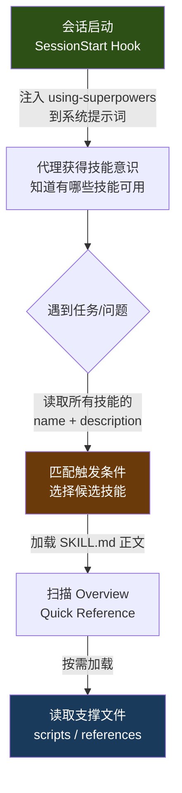
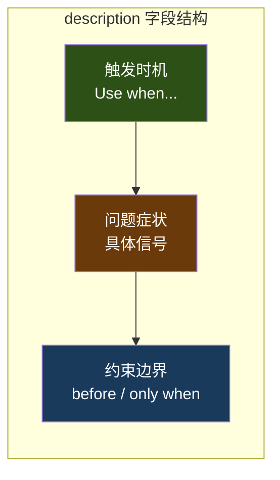
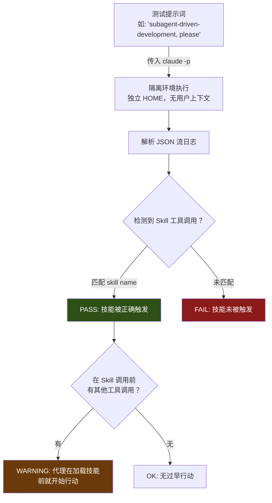
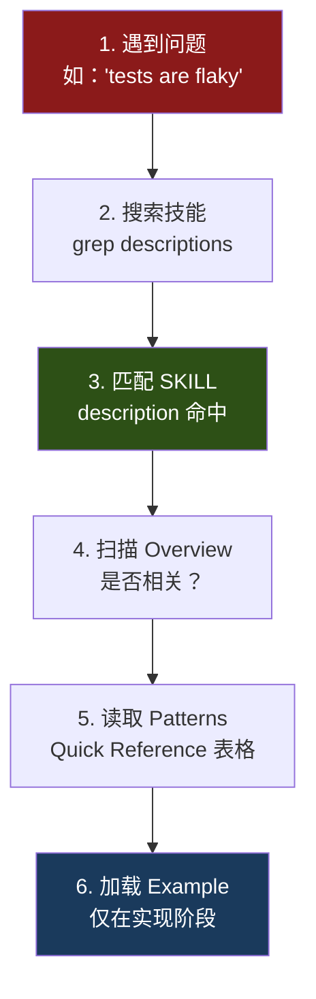

技能系统的价值取决于一个前提——代理能否在正确的时机**找到并加载**正确的技能。本文深入剖析 superpowers 项目中技能发现优化（Skill Discovery Optimization, SDO）的设计哲学，聚焦 `description` 字段的工程化写法和触发条件的精确设计，帮助开发者编写出高命中率、零歧义的技能元数据。

## 技能发现的完整管线

技能发现并非简单的文件查找，而是一个**分层渐进式披露**（Progressive Disclosure）架构。代理在不同阶段消耗不同量的上下文 token，系统通过逐层深入来控制成本。



这个管线有三个关键优化点，每一个都直接影响技能的命中率：

| 阶段 | 加载内容 | Token 成本 | 优化目标 |
|------|---------|-----------|---------|
| **会话启动** | `using-superpowers` 全文注入 | 高（每次会话） | 最小化引导文本体积 |
| **技能选择** | 所有技能的 `name` + `description` | 中（每次决策） | 描述字段精确匹配触发条件 |
| **技能使用** | SKILL.md 正文 + 支撑文件 | 按需 | 渐进式披露，避免一次性加载 |

在会话启动阶段，`session-start` hook 脚本将 `using-superpowers` 技能的完整内容注入到代理的上下文中，建立代理对技能系统的基本认知。该 hook 针对不同平台（Claude Code、Cursor、Copilot CLI）输出不同格式的 JSON 载荷：

Sources: [session-start](hooks/session-start#L1-L50)

```bash
# Claude Code 平台：嵌套格式
printf '{\n  "hookSpecificOutput": {\n    "hookEventName": "SessionStart",\n    "additionalContext": "%s"\n  }\n}\n' "$session_context"

# Cursor 平台：snake_case 顶层字段
printf '{\n  "additional_context": "%s"\n}\n' "$session_context"

# Copilot CLI / SDK 标准：camelCase 顶层字段
printf '{\n  "additionalContext": "%s"\n}\n' "$session_context"
```

Sources: [session-start](hooks/session-start#L30-L46)

代理在接收到引导信息后，通过 `using-superpowers` 技能中定义的规则来驱动后续的技能发现行为——**在任何响应或行动之前，先检查是否有适用的技能**。

Sources: [using-superpowers/SKILL.md](skills/using-superpowers/SKILL.md#L1-L63)

## Description 字段：技能发现的命脉

### 核心设计原则

`description` 字段是技能发现管线中**最关键的单一元素**。它的作用不是描述技能做什么，而是回答一个精确的问题：**"我现在应该读取这个技能吗？"**

superpowers 项目通过大量实测发现了一个反直觉的陷阱：

> **当描述字段总结了技能的工作流程时，代理会直接按照描述行事，而跳过阅读技能正文。**

这是一个典型的"捷径问题"——代理倾向于选择信息密度最高的路径。如果描述字段已经包含了足够的工作流信息，代理就没有动力去加载完整的 SKILL.md。

Sources: [writing-skills/SKILL.md](skills/writing-skills/SKILL.md#L95-L140)

### 工作流泄漏的实证案例

项目中记录了一个具有教学意义的案例。`subagent-driven-development` 技能的早期描述版本包含了工作流摘要：

```yaml
# ❌ 错误示范：描述了工作流——代理会走捷径
description: Use when executing plans - dispatches subagent per task with code review between tasks
```

当使用这个描述时，代理只执行了**一次**代码审查，因为它从描述中读到 "code review between tasks" 就认为理解了流程。然而，技能的完整流程图定义了一个**两阶段审查**过程。

修正后的描述仅包含触发条件：

```yaml
# ✅ 正确示范：仅触发条件，无工作流摘要
description: Use when executing implementation plans with independent tasks in the current session
```

修改后，代理正确地读取了完整流程图并遵循了两阶段审查流程。

Sources: [writing-skills/SKILL.md](skills/writing-skills/SKILL.md#L105-L130)

### 描述字段的正反模式

基于项目积累的 14 个技能的实际 frontmatter，可以提炼出以下模式对照：

| 维度 | ✅ 正确模式 | ❌ 错误模式 |
|------|-----------|-----------|
| **开头** | `Use when...` 直接声明触发条件 | `For async testing` 过于抽象 |
| **内容** | 具体症状、情境、信号 | 工作流摘要或过程描述 |
| **人称** | 第三人称（注入系统提示词） | 第一人称 `I can help you...` |
| **技术** | 技术无关描述问题本质 | 提及不相关的技术细节 |
| **长度** | < 500 字符，精炼 | 冗长，包含实现细节 |

以下是项目中所有 14 个技能的 `description` 字段完整清单，它们均遵循了"仅触发条件"的设计原则：

| 技能名称 | Description |
|----------|-------------|
| `brainstorming` | You MUST use this before any creative work - creating features, building components, adding functionality, or modifying behavior. |
| `dispatching-parallel-agents` | Use when facing 2+ independent tasks that can be worked on without shared state or sequential dependencies |
| `executing-plans` | Use when you have a written implementation plan to execute in a separate session with review checkpoints |
| `finishing-a-development-branch` | Use when implementation is complete, all tests pass, and you need to decide how to integrate the work |
| `receiving-code-review` | Use when receiving code review feedback, before implementing suggestions, especially if feedback seems unclear or technically questionable |
| `requesting-code-review` | Use when completing tasks, implementing major features, or before merging to verify work meets requirements |
| `subagent-driven-development` | Use when executing implementation plans with independent tasks in the current session |
| `systematic-debugging` | Use when encountering any bug, test failure, or unexpected behavior, before proposing fixes |
| `test-driven-development` | Use when implementing any feature or bugfix, before writing implementation code |
| `using-git-worktrees` | Use when starting feature work that needs isolation from current workspace or before executing implementation plans |
| `using-superpowers` | Use when starting any conversation - establishes how to find and use skills |
| `verification-before-completion` | Use when about to claim work is complete, fixed, or passing, before committing or creating PRs |
| `writing-plans` | Use when you have a spec or requirements for a multi-step task, before touching code |
| `writing-skills` | Use when creating new skills, editing existing skills, or verifying skills work before deployment |

Sources: [brainstorming/SKILL.md](skills/brainstorming/SKILL.md#L1-L4), [dispatching-parallel-agents/SKILL.md](skills/dispatching-parallel-agents/SKILL.md#L1-L4), [executing-plans/SKILL.md](skills/executing-plans/SKILL.md#L1-L4), [finishing-a-development-branch/SKILL.md](skills/finishing-a-development-branch/SKILL.md#L1-L4), [receiving-code-review/SKILL.md](skills/receiving-code-review/SKILL.md#L1-L4), [requesting-code-review/SKILL.md](skills/requesting-code-review/SKILL.md#L1-L4), [subagent-driven-development/SKILL.md](skills/subagent-driven-development/SKILL.md#L1-L4), [systematic-debugging/SKILL.md](skills/systematic-debugging/SKILL.md#L1-L4), [test-driven-development/SKILL.md](skills/test-driven-development/SKILL.md#L1-L4), [using-git-worktrees/SKILL.md](skills/using-git-worktrees/SKILL.md#L1-L4), [using-superpowers/SKILL.md](skills/using-superpowers/SKILL.md#L1-L4), [verification-before-completion/SKILL.md](skills/verification-before-completion/SKILL.md#L1-L4), [writing-plans/SKILL.md](skills/writing-plans/SKILL.md#L1-L4), [writing-skills/SKILL.md](skills/writing-skills/SKILL.md#L1-L4)

## 触发条件的工程设计

### 条件结构解剖

一个精心设计的 `description` 字段通常包含三个组成部分：**触发时机**、**问题症状**和**约束边界**。



以 `verification-before-completion` 的描述为例：

```yaml
description: Use when about to claim work is complete, fixed, or passing,  # 触发时机
             before committing or creating PRs                               # 约束边界
             - requires running verification commands and confirming output  # 问题症状
               before making any success claims; evidence before assertions always
```

Sources: [verification-before-completion/SKILL.md](skills/verification-before-completion/SKILL.md#L1-L4)

再看 `receiving-code-review` 的描述——它同时编码了触发条件和反向信号：

```yaml
description: Use when receiving code review feedback,          # 触发时机
             before implementing suggestions,                   # 约束边界
             especially if feedback seems unclear or            # 增强信号
             technically questionable
             - requires technical rigor and verification,       # 问题症状
               not performative agreement or blind implementation
```

Sources: [receiving-code-review/SKILL.md](skills/receiving-code-review/SKILL.md#L1-L4)

### 关键词覆盖策略

代理通过 `description` 字段进行匹配决策时，本质上是在做**关键词相似度判断**。superpowers 项目要求在技能正文中系统性地部署可搜索关键词，以弥补 description 字段的长度限制：

| 关键词类型 | 示例 | 目的 |
|-----------|------|------|
| **错误信息** | `Hook timed out`, `ENOTEMPTY`, `race condition` | 代理搜索具体错误时命中 |
| **症状描述** | `flaky`, `hanging`, `zombie`, `pollution` | 代理识别问题时命中 |
| **同义词覆盖** | `timeout/hang/freeze`, `cleanup/teardown/afterEach` | 不同代理使用不同术语 |
| **工具名称** | 实际命令、库名、文件类型 | 代理搜索工具用法时命中 |

Sources: [writing-skills/SKILL.md](skills/writing-skills/SKILL.md#L142-L155)

### 技术无关 vs 技术特定

描述字段应根据技能本身的适用范围来选择抽象层级：

```yaml
# ❌ 技能本身是技术无关的，但描述提及了特定技术
description: Use when tests use setTimeout/sleep and are flaky

# ✅ 描述问题本质，不绑定实现
description: Use when tests have race conditions, timing dependencies,
             or pass/fail inconsistently

# ✅ 技能本身是技术特定的，在触发条件中明确声明
description: Use when using React Router and handling authentication redirects
```

Sources: [writing-skills/SKILL.md](skills/writing-skills/SKILL.md#L155-L175)

## Frontmatter 规范与约束

### 结构限制

每个 SKILL.md 的 YAML frontmatter 受到严格的规范约束：

| 约束项 | 限制值 | 说明 |
|--------|--------|------|
| **总字符数** | ≤ 1024 | `name` + `description` 合计 |
| **description 建议长度** | < 500 字符 | 超出则信噪比下降 |
| **name 字符集** | 字母、数字、连字符 | 禁止括号和特殊字符 |
| **人称** | 第三人称 | 注入系统提示词，人称不一致会导致发现失败 |

Sources: [writing-skills/SKILL.md](skills/writing-skills/SKILL.md#L76-L95)

### 命名约定

技能名称采用**动名词优先**（gerund form）或**动词优先**（verb-first）的主动语态模式：

```
✅ condition-based-waiting    ❌ async-test-helpers
✅ creating-skills            ❌ skill-creation
✅ root-cause-tracing         ❌ debugging-techniques
✅ flatten-with-flags         ❌ data-structure-refactoring
```

动名词形式（`-ing`）适用于描述过程类技能：`creating-skills`、`testing-skills`、`debugging-with-logs`。

Sources: [writing-skills/SKILL.md](skills/writing-skills/SKILL.md#L176-L200)

## 技能发现的验证体系

### 显式技能请求测试

项目构建了专门的测试套件来验证技能发现管线的可靠性。测试的核心逻辑是：向代理发送一个**明确提及技能名称**的提示，然后验证代理是否通过 Skill 工具正确加载了该技能。



测试脚本通过正则匹配日志中的 Skill 工具调用来判定结果：

```bash
SKILL_PATTERN='"skill":"([^"]*:)?'"${SKILL_NAME}"'"'
if grep -q '"name":"Skill"' "$LOG_FILE" && grep -qE "$SKILL_PATTERN" "$LOG_FILE"; then
    echo "PASS: Skill '$SKILL_NAME' was triggered"
```

Sources: [run-test.sh](tests/explicit-skill-requests/run-test.sh#L75-L85)

### 测试场景矩阵

项目设计了 9 个不同风格的提示词文件，覆盖代理可能遇到技能名称的各种语境：

| 测试场景 | 提示词风格 | 测试目标 |
|----------|-----------|---------|
| **直接请求** | `subagent-driven-development, please` | 最简触发 |
| **动作导向** | `Do subagent-driven development on this - start with Task 1` | 嵌入动作指令 |
| **对话延续** | 包含前序助手消息的上下文 | 多轮对话中的触发 |
| **知识声明** | `I want to use subagent-driven-development... That means: [列表]` | 代理展示对技能的理解时是否仍加载 |
| **时间压力** | `Don't waste time - just read the plan and start dispatching` | 压力下是否跳过技能加载 |
| **隐式请求** | `use systematic-debugging to figure out what's wrong` | 动词 + 技能名组合 |
| **规划后流程** | 完整的规划→执行转换场景 | 工作流衔接点触发 |

Sources: [prompts/](tests/explicit-skill-requests/prompts/)

### 过早行动检测

测试不仅验证技能是否被触发，还检测一个更隐蔽的失败模式——代理在加载技能之前就开始执行工作：

```bash
# 查找第一个 Skill 工具调用的行号
FIRST_SKILL_LINE=$(grep -n '"name":"Skill"' "$LOG_FILE" | head -1 | cut -d: -f1)

# 检查在此之前是否有非规划类工具被调用
PREMATURE_TOOLS=$(head -n "$FIRST_SKILL_LINE" "$LOG_FILE" | \
    grep '"type":"tool_use"' | \
    grep -v '"name":"Skill"' | \
    grep -vE '"name":"(TodoWrite|TaskCreate|TaskUpdate|TaskList|TaskGet)"' || true)
```

这个检测逻辑排除了任务管理工具（`TodoWrite`、`TaskCreate` 等），因为规划行为本身不违反"先加载技能"的原则。

Sources: [run-test.sh](tests/explicit-skill-requests/run-test.sh#L95-L115)

## 技能发现工作流与优化清单

代理发现和使用技能的完整流程如下：



Sources: [writing-skills/SKILL.md](skills/writing-skills/SKILL.md#L665-L680)

针对这个流程，优化清单按阶段组织：

### 创建阶段（GREEN Phase）

- [ ] `name` 仅使用字母、数字、连字符
- [ ] YAML frontmatter 包含 `name` 和 `description`（合计 ≤ 1024 字符）
- [ ] `description` 以 `Use when...` 开头，包含具体触发条件/症状
- [ ] `description` 使用第三人称
- [ ] `description` **不包含**工作流摘要
- [ ] 正文中包含可搜索关键词（错误信息、症状、工具名）

### 验证阶段（REFACTOR Phase）

- [ ] 运行显式技能请求测试，确认触发
- [ ] 运行压力场景测试，确认代理不会走捷径
- [ ] 验证代理在触发后确实读取了完整 SKILL.md

Sources: [writing-skills/SKILL.md](skills/writing-skills/SKILL.md#L630-L665)

## 与 Anthropic 官方指南的对照

superpowers 项目的 SDO 设计与 Anthropic 官方技能编写指南存在一个关键分歧，值得开发者注意：

| 维度 | Anthropic 官方指南 | superpowers 实践 |
|------|-------------------|-----------------|
| **description 定位** | 包含"做什么"和"何时用" | **仅**包含"何时用" |
| **工作流信息** | 允许在描述中概述 | 严格禁止——会导致代理走捷径 |
| **验证方式** | 建议构建评估用例 | 要求 TDD 式的 RED-GREEN-REFACTOR 循环 |
| **关键词策略** | 建议包含关键术语 | 系统性部署同义词覆盖 |

Anthropic 官方示例：
```yaml
description: Extract text and tables from PDF files, fill forms, merge documents. 
             Use when working with PDF files or when the user mentions PDFs.
```

superpowers 实践：
```yaml
description: Use when implementing any feature or bugfix, before writing implementation code
```

Sources: [anthropic-best-practices.md](skills/writing-skills/anthropic-best-practices.md#L155-L200), [writing-skills/SKILL.md](skills/writing-skills/SKILL.md#L95-L140)

这一分歧的根源在于 superpowers 项目的实测发现：当描述字段同时包含"做什么"和"何时用"时，代理倾向于仅凭描述就行动，跳过技能正文的详细内容。对于 superpowers 中大量**纪律执行类**技能（如 TDD、系统化调试），这种捷径行为会导致关键步骤被遗漏。

## 跨平台发现的兼容性考量

技能发现管线在跨平台场景下面临不同的注入机制，但 `description` 字段的设计原则保持一致：

| 平台 | 引导注入方式 | description 消费方式 |
|------|-------------|---------------------|
| **Claude Code** | `hookSpecificOutput.additionalContext`（嵌套） | 通过 Skill 工具匹配 name/description |
| **Cursor** | `additional_context`（snake_case 顶层） | 同上 |
| **Copilot CLI** | `additionalContext`（camelCase 顶层） | 同上 |
| **Codex / Gemini** | 插件 manifest + 文件系统扫描 | 读取 frontmatter 元数据 |

Sources: [session-start](hooks/session-start#L30-L46), [hooks.json](hooks/hooks.json#L1-L18), [run-hook.cmd](hooks/run-hook.cmd#L1-L47)

无论平台如何变化，`description` 字段始终承担同一个职责：**为代理提供足够的信息来判断是否应该加载这个技能**。平台差异仅影响引导信息的传输格式，不影响描述字段本身的设计原则。

## 延伸阅读

本页聚焦于技能发现机制的元数据层设计。以下页面提供了相关的上下文和后续主题：

- **前置知识**：[技能（Skill）机制：自动触发与行为塑造原理](5-ji-neng-skill-ji-zhi-zi-dong-hong-fa-yu-xing-wei-su-zao-yuan-li) — 理解技能系统的整体架构
- **前置知识**：[编写新技能：将 TDD 应用于过程文档](22-bian-xie-xin-ji-neng-jiang-tdd-ying-yong-yu-guo-cheng-wen-dang) — 技能创建的完整 TDD 流程
- **后续阅读**：[技能压力测试：对抗性场景与子代理验证](24-ji-neng-ya-li-ce-shi-dui-kang-xing-chang-jing-yu-zi-dai-li-yan-zheng) — 如何验证技能在对抗性场景下的可靠性
- **相关主题**：[引导注入机制：SessionStart Hook 与消息变换](19-yin-dao-zhu-ru-ji-zhi-sessionstart-hook-yu-xiao-xi-bian-huan) — 技能发现管线的底层传输机制