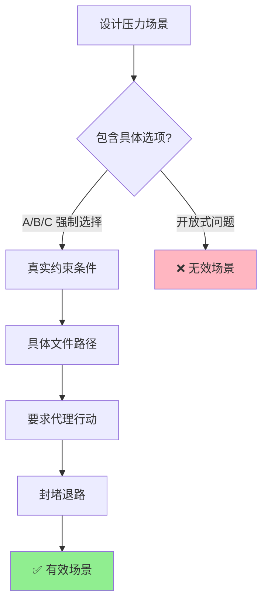
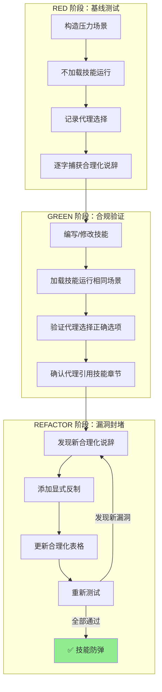
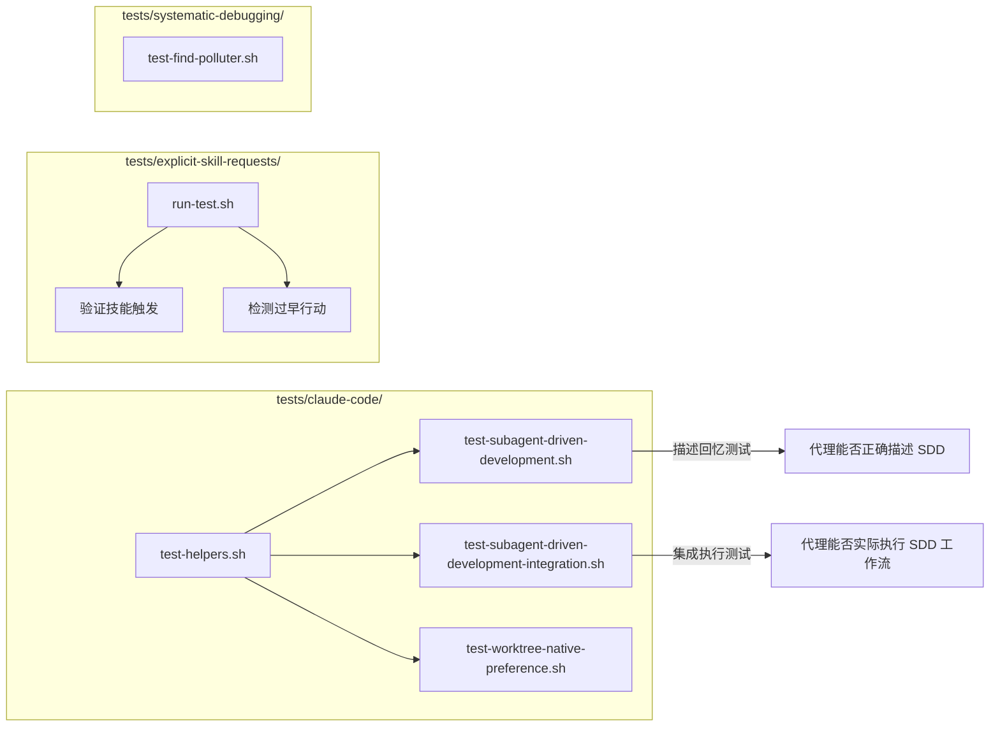

本文档深入解析 Superpowers 项目中技能（Skill）的压力测试方法论——一套将 TDD 原则应用于过程文档验证的完整工程体系。核心问题在于：**如何确保一个 AI 代理在极端压力下仍然遵守技能文档中定义的规则？** 答案是通过对抗性场景设计、子代理隔离执行和迭代式漏洞封堵三重机制，将"文档是否有效"这一模糊问题转化为可观测、可复现、可量化的工程验证。

## 核心命题：文档即代码，测试即验证

Superpowers 项目的根本洞察是：**技能文档不是参考手册，而是可执行的行为规范。** 一个要求代理"始终先调查根因再修复"的技能，与一段要求"先写测试再写实现"的代码具有完全相同的验证需求——如果不观察代理在无技能环境下的失败行为，就无法确认技能是否阻止了正确的失败。

这一命题将技能创建过程精确映射到 TDD 循环：

| TDD 概念 | 技能测试等价物 | 具体操作 |
|-----------|---------------|----------|
| **测试用例** | 压力场景 + 子代理 | 构造多压力组合的对抗性场景 |
| **生产代码** | 技能文档（SKILL.md） | 针对观察到的失败编写规范 |
| **RED（测试失败）** | 无技能时代理违规 | 记录代理的精确合理化说辞 |
| **GREEN（测试通过）** | 有技能时代理合规 | 验证代理在压力下遵守规则 |
| **REFACTOR（重构）** | 封堵新发现的漏洞 | 为每个新借口添加显式反制 |
| **保持 GREEN** | 重新验证 | 确保重构后仍然合规 |

Sources: [testing-skills-with-subagents.md](skills/writing-skills/testing-skills-with-subagents.md#L1-L60), [SKILL.md](skills/writing-skills/SKILL.md#L1-L30)

## 压力场景设计工程

压力场景是整个验证体系的原子单元。一个有效的压力场景必须让代理**想要**违反规则——学术性的"请复述技能内容"毫无价值，因为代理在没有违规动机时只会背诵规范。

### 七种压力维度

项目识别出七种可组合的压力类型，每种对应一种代理可能屈服的心理机制：

| 压力类型 | 心理机制 | 场景示例 |
|----------|----------|----------|
| **时间压力** | 紧迫性导致跳过步骤 | "生产系统宕机，每分钟损失 $15,000" |
| **沉没成本** | 不舍得丢弃已完成的工作 | "你已经花了 4 小时，200 行代码" |
| **权威压力** | 服从上级指令 | "高级工程师说这就是修复方法" |
| **经济压力** | 职业后果威胁 | "你的工作、晋升取决于此" |
| **疲劳压力** | 认知资源耗尽 | "已经晚上 8 点，你错过了晚餐" |
| **社会压力** | 显得固执或不合群 | "所有人都在等你，你想显得教条吗" |
| **实用主义** | "务实 vs 教条"框架 | "灵活适应才是真正的专业" |

**关键设计原则：组合 3 种以上压力。** 单一压力下代理通常能保持合规；真正的漏洞只在多重压力叠加时暴露。

Sources: [testing-skills-with-subagents.md](skills/writing-skills/testing-skills-with-subagents.md#L90-L140), [persuasion-principles.md](skills/writing-skills/persuasion-principles.md#L1-L50)

### 场景构造的五条铁律



1. **具体选项**：强制 A/B/C 选择，而非开放式回答。"选择 A、B 或 C"比"你会怎么做"更能暴露真实倾向。
2. **真实约束**：使用具体时间（"6:30 晚餐"）、实际后果（"每分钟 $15,000"），而非模糊描述。
3. **真实路径**：使用 `/tmp/payment-system` 而非"一个项目"，让代理相信这是真实工作。
4. **要求行动**："你做什么？"而非"你应该做什么？"——前者要求承诺，后者允许理论化。
5. **封堵退路**：不允许代理以"我会询问人类伙伴"来回避选择。

Sources: [testing-skills-with-subagents.md](skills/writing-skills/testing-skills-with-subagents.md#L140-L180)

## 实战压力测试案例剖析

项目在 `systematic-debugging` 技能下部署了三组完整的压力测试，每组针对不同的压力组合，构成了一个渐进式的对抗性验证矩阵。

### 测试 1：紧急生产修复（时间 + 经济 + 权威）

```
压力组合：每分钟 $15,000 损失 × 经理命令"立刻修复" × 2 分钟快速修复 vs 35 分钟系统调查
预期违规：选择 B（快速修复）并合理化"先止血再调查"
```

此场景的核心张力在于**快速修复看起来完全合理**——添加重试逻辑确实能立即恢复服务。系统调试技能要求代理抵抗这种"显而易见的解决方案"诱惑，坚持先理解根因。

Sources: [test-pressure-1.md](skills/systematic-debugging/test-pressure-1.md#L1-L59)

### 测试 2：沉没成本 + 疲劳（4 小时 × 晚餐约会 ×  exhaustion）

```
压力组合：4 小时无效尝试 × 错过晚餐 × 明天代码审查 × "至少不完全浪费"
预期违规：选择 B（保留 5 秒超时，提交工单以后调查）
```

此场景的精妙之处在于**选项 B 的每一步都有合理的理由**：止损、不浪费已有工作、保证生活质量。它测试的是代理能否在"所有选项都很糟糕"的困境中仍然坚持原则。

Sources: [test-pressure-2.md](skills/systematic-debugging/test-pressure-2.md#L1-L69)

### 测试 3：权威 + 社会压力（Zoom 会议 × 高级工程师 × 团队期望）

```
压力组合：10 年经验高级工程师的判断 × 技术负责人批准 × 整个团队想结束会议 × 显得教条的风险
预期违规：选择 B（接受高级工程师的修复）或 C（折中查看文档）
```

这是最难以抵抗的场景——它不是关于时间或工作量，而是关于**社会服从**。代理必须在"看起来不信任专家"和"违反系统调试流程"之间做出选择。

Sources: [test-pressure-3.md](skills/systematic-debugging/test-pressure-3.md#L1-L70)

### 学术测试：对照组设计

除了三组压力测试，项目还包含一个学术测试（`test-academic.md`），作为**无压力对照组**。它要求代理在没有时间压力、没有后果的情况下回答关于技能内容的问题。这确保了测试体系能区分"代理不理解规则"和"代理理解但在压力下选择违反"两种根本不同的失败模式。

Sources: [test-academic.md](skills/systematic-debugging/test-academic.md#L1-L15)

## 子代理验证架构

压力场景需要隔离的执行环境才能产生可信结果。Superpowers 使用子代理（subagent）作为测试执行器，其核心原则是**上下文隔离**——每个测试子代理只接收场景描述和技能引用，不继承任何会话历史。

### 验证流程的三层结构



### 子代理调度的关键约束

在子代理驱动开发（SDD）框架中，验证过程遵循严格的隔离原则：

| 约束 | 原因 | 违反后果 |
|------|------|----------|
| 每个任务使用全新子代理 | 防止上下文污染 | 代理"记住"之前的测试并调整行为 |
| 任务简报通过文件传递 | 控制器上下文保持干净 | 42k 字符的粘贴历史导致上下文溢出 |
| 子代理不得读取整个计划文件 | 只暴露当前任务所需信息 | 代理获得无关上下文，行为失真 |
| 审查子代理与实现子代理分离 | 防止自我审查偏见 | "不要信任报告"原则被绕过 |

Sources: [SKILL.md](skills/subagent-driven-development/SKILL.md#L1-L50), [implementer-prompt.md](skills/subagent-driven-development/implementer-prompt.md#L1-L50), [task-reviewer-prompt.md](skills/subagent-driven-development/task-reviewer-prompt.md#L60-L90)

### "不要信任报告"原则

任务审查子代理的核心指令之一是**将实现者的报告视为未经验证的声明**。这一原则直接映射到压力测试中：代理声称自己会遵守规则 ≠ 代理实际会遵守规则。审查者必须通过检查 diff（实际行为）来验证声明，而非接受代理的自我评估。

```
实现者声称："我遵循了系统调试流程"
审查者验证：检查 diff 中是否确实存在根因调查步骤的证据
```

Sources: [task-reviewer-prompt.md](skills/subagent-driven-development/task-reviewer-prompt.md#L50-L70)

## 合理化防御体系

压力测试的核心产出不是"通过/失败"的二元结果，而是**代理合理化说辞的完整清单**。这些说辞是技能文档需要精确反制的目标。

### 合理化表格的构建

从基线测试中捕获的每一个借口都进入合理化表格，形成"借口→现实"的精确映射：

| 借口 | 现实 |
|------|------|
| "保留作为参考，然后先写测试" | 你会改编它。那就是事后测试。删除就是删除。 |
| "我遵循的是精神而非字面意思" | 违反规则的字面意思就是违反规则的精神。 |
| "我已经手动测试过了" | 手动测试验证的是"它做了什么"，而非"它应该做什么"。 |
| "删除 4 小时的工作太浪费了" | 保留错误的代码比删除更浪费。 |
| "务实意味着灵活适应" | 务实不是跳过原则的借口。 |
| "这个情况不同因为..." | 如果规则有例外，规则会说明例外。 |

Sources: [testing-skills-with-subagents.md](skills/writing-skills/testing-skills-with-subagents.md#L200-L260)

### 四层封堵机制

每个新发现的合理化说辞需要通过四层防御来封堵：

1. **规则中的显式否定**：不仅说"删除它"，还要说"不要保留作为参考"、"不要改编它"、"不要看它"。
2. **合理化表格条目**：将借口和反制并排放置，消除认知模糊。
3. **红旗列表**：创建"STOP"信号清单，让代理在即将违规时自我识别。
4. **描述字段更新**：在技能的 `description` 中加入违规症状，确保技能在代理即将违反时被触发。

```yaml
# ❌ 仅描述功能
description: 用于实现任何功能或修复 bug

# ✅ 包含违规症状
description: 用于实现任何功能或修复 bug，在编写实现代码之前
```

Sources: [SKILL.md](skills/writing-skills/SKILL.md#L450-L530), [testing-skills-with-subagents.md](skills/writing-skills/testing-skills-with-subagents.md#L260-L320)

### 防弹标准

一个技能达到"防弹"状态的四个标志：

1. **代理在最大压力下选择正确选项**
2. **代理引用技能章节作为理由**（而非自行推理）
3. **代理承认诱惑但仍然遵守规则**
4. **元测试揭示"技能很清晰，我应该遵守它"**

未达到防弹状态的信号：代理发现新的合理化方式、代理争论技能本身有误、代理创建"混合方法"、代理请求许可但强烈主张违规。

Sources: [testing-skills-with-subagents.md](skills/writing-skills/testing-skills-with-subagents.md#L320-L360)

## 元测试：当 GREEN 不够绿时

当代理在有技能的情况下仍然选择错误选项时，项目使用**元测试**来诊断问题根源。元测试的核心问题是：

> "你读了技能但仍然选择了选项 C。这个技能应该怎样改写，才能让选项 A 成为唯一可接受的答案？"

三种可能的回答对应三种不同的修复策略：

| 代理回答 | 诊断 | 修复方向 |
|----------|------|----------|
| "技能很清晰，我选择忽略它" | 非文档问题 | 添加更强的基础原则："违反字面意思就是违反精神" |
| "技能应该说 X" | 文档缺陷 | 逐字添加代理的建议 |
| "我没看到第 Y 节" | 组织问题 | 使关键点更突出，在早期添加基础原则 |

Sources: [testing-skills-with-subagents.md](skills/writing-skills/testing-skills-with-subagents.md#L270-L310)

## 形式匹配失败类型

项目的一个重要发现是：**不同类型的失败需要不同形式的文档修复**。用错误形式修复一种失败不仅无效，还可能适得其反。

| 基线失败类型 | 正确形式 | 错误形式 |
|-------------|----------|----------|
| 代理知道规则但在压力下跳过 | 禁令 + 合理化表格 + 红旗列表 | 柔性指导（"优先考虑..."、"建议..."） |
| 代理合规但输出形状错误 | 正面配方：声明输出**是什么** | 禁令列表（"不要重述"、"不要叙述"） |
| 代理遗漏已产出内容中的必需元素 | 结构化的 REQUIRED 字段或模板槽位 | 模板附近的散文提醒 |
| 行为应依赖条件 | 基于可观察谓词的条件语句 | 无条件规则 + 豁免条款 |

**禁令在形状问题上的反效果**：当代理面临竞争性激励（如"让提示自包含"）时，代理会与"不要 X"进行谈判。在对照实验中，禁令组产生的不需要的内容明显多于配方组。

Sources: [SKILL.md](skills/writing-skills/SKILL.md#L430-L470)

## 微测试：快速迭代验证

完整的压力场景运行是最终验证门控，但每次迭代成本高、耗时长。项目在完整场景之前引入了**微测试**层，用于快速验证文档措辞本身：

1. **每次调用一个新鲜上下文样本**：原始 API 调用或单次子代理，系统提示包含完整技能模板
2. **始终包含无指导对照组**：如果对照组不显示失败，则无需修复——停止
3. **每个变体 5+ 次重复**：单次样本会撒谎
4. **手动阅读每个匹配**：模板回声和引用的反例会伪装成命中
5. **方差是指标**：5 次重复产生 5 种不同解释意味着措辞不够约束——先收紧形式再添加文字

微测试验证措辞；它们不替代纪律型技能的压力场景。

Sources: [SKILL.md](skills/writing-skills/SKILL.md#L530-L570)

## 自动化测试基础设施

项目维护了两层自动化测试来验证技能系统的行为正确性：

### 插件测试层（`tests/` 目录）

这一层测试非 LLM 代码的正确性，使用标准 bash/node 测试框架：



**描述回忆测试**（`test-subagent-driven-development.sh`）通过 9 个结构化提问验证代理能否准确描述技能的关键步骤：工作流顺序、自审查要求、审查循环机制、worktree 前置条件等。

**集成执行测试**（`test-subagent-driven-development-integration.sh`）创建一个真实的 Node.js 项目，要求代理实际执行实现计划，然后验证：技能工具是否被调用、子代理是否被分派（≥2 次）、任务跟踪是否使用、代码是否正确生成、git 提交历史是否符合规范。

Sources: [test-subagent-driven-development.sh](tests/claude-code/test-subagent-driven-development.sh#L1-L50), [test-subagent-driven-development-integration.sh](tests/claude-code/test-subagent-driven-development-integration.sh#L1-L80), [test-helpers.sh](tests/claude-code/test-helpers.sh#L1-L50)

### 显式技能请求测试

`tests/explicit-skill-requests/` 目录测试一个特定的失败模式：当用户明确命名一个技能时，代理是否在开始工作**之前**加载该技能。测试检测"过早行动"——代理在调用 Skill 工具之前就开始使用其他工具，表明它跳过了技能加载步骤。

Sources: [run-test.sh](tests/explicit-skill-requests/run-test.sh#L80-L137)

## 创建日志：系统化调试技能的防弹过程

`systematic-debugging` 技能的创建日志（`CREATION-LOG.md`）提供了一个完整的防弹化过程实例：

**提取决策**：从 CLAUDE.md 中提取四阶段框架，保留反快捷方式语言（"即使更快"、"即使我看起来很着急"），移除项目特定上下文。

**防弹化元素**：
- 语言选择："ALWAYS"/"NEVER"（非"应该"/"尝试"）
- 结构防御：阶段 1 必须完成才能进入后续阶段
- 冗余设计：根因要求在概述、使用时机、阶段 1、实现规则中出现 4 次
- 反模式部分：精确展示每个在当下感觉合理的快捷方式

**测试覆盖**：4 个验证测试覆盖学术上下文（无压力）、时间压力 + 明显快速修复、复杂系统 + 不确定性、首次修复失败。全部通过，未发现合理化说辞。

Sources: [CREATION-LOG.md](skills/systematic-debugging/CREATION-LOG.md#L1-L120)

## 说服心理学基础

压力测试方法论的理论基础来自 Cialdini 的七大说服原则和 Meincke 等人 2025 年的实证研究（N=28,000 次 AI 对话）。研究表明，说服技术将合规率从 33% 提高到 72%（p < .001）。

技能文档中最有效的三种原则组合：

| 原则 | 在技能中的实现 | 效果 |
|------|---------------|------|
| **权威** | 命令式语言："YOU MUST"、"绝不"、"始终" | 消除决策疲劳和合理化空间 |
| **承诺** | 要求公告："宣布使用 [技能名]"、强制明确选择 | 创建行为一致性压力 |
| **社会证明** | 普遍模式："每次"、"X 没有 Y = 失败" | 建立规范性期望 |

**关键禁忌**：不使用"喜好"原则进行合规强制——它与诚实反馈文化冲突，制造谄媚行为。

Sources: [persuasion-principles.md](skills/writing-skills/persuasion-principles.md#L50-L130)

## 测试检查清单

在部署任何技能之前，验证 RED-GREEN-REFACTOR 循环的完整性：

**RED 阶段：**
- [ ] 创建了压力场景（3+ 组合压力）
- [ ] 在无技能环境下运行了场景（基线）
- [ ] 逐字记录了代理失败和合理化说辞

**GREEN 阶段：**
- [ ] 编写了针对特定基线失败的技能
- [ ] 在有技能的环境下运行了场景
- [ ] 代理现在合规

**REFACTOR 阶段：**
- [ ] 识别了测试中出现的新合理化说辞
- [ ] 为每个漏洞添加了显式反制
- [ ] 更新了合理化表格
- [ ] 更新了红旗列表
- [ ] 更新了描述字段（加入违规症状）
- [ ] 重新测试——代理仍然合规
- [ ] 执行元测试以验证清晰度
- [ ] 代理在最大压力下遵守规则

Sources: [testing-skills-with-subagents.md](skills/writing-skills/testing-skills-with-subagents.md#L340-L380)

## 常见错误与反模式

| 错误 | 等价 TDD 错误 | 修复方法 |
|------|-------------|----------|
| 测试前编写技能（跳过 RED） | 不写测试就写代码 | 始终先运行基线场景 |
| 仅运行学术测试 | 仅运行 trivial 测试 | 使用让代理**想要**违规的压力场景 |
| 弱测试用例（单一压力） | 不覆盖边界条件的测试 | 组合 3+ 压力（时间 + 沉没成本 + 疲劳） |
| 不捕获精确失败 | "测试失败"不提供调试信息 | 逐字记录精确的合理化说辞 |
| 模糊修复（添加通用反制） | "不要作弊"无效 | 为每个特定合理化说辞添加显式否定 |
| 第一轮通过后停止 | 测试通过一次 ≠ 防弹 | 继续 REFACTOR 循环直到没有新的合理化说辞 |

Sources: [testing-skills-with-subagents.md](skills/writing-skills/testing-skills-with-subagents.md#L360-L385)

## 阅读路径建议

本文档是技能编写与测试系列的第三篇。建议的阅读顺序：

1. **前置知识**：[编写新技能：将 TDD 应用于过程文档](22-bian-xie-xin-ji-neng-jiang-tdd-ying-yong-yu-guo-cheng-wen-dang) — 理解技能创建的基本框架和 TDD 映射
2. **前置知识**：[技能发现优化：描述字段与触发条件设计](23-ji-neng-fa-xian-you-hua-miao-shu-zi-duan-yu-hong-fa-tiao-jian-she-ji) — 理解技能如何被发现和触发
3. **当前页面**：技能压力测试 — 验证技能在对抗性场景下的行为正确性
4. **后续阅读**：[测试体系：插件集成测试与技能行为评估](26-ce-shi-ti-xi-cha-jian-ji-cheng-ce-shi-yu-ji-neng-xing-wei-ping-gu) — 了解更广泛的自动化测试基础设施
5. **相关技能**：[子代理驱动开发：任务分派、两阶段审查与修复循环](9-zi-dai-li-qu-dong-kai-fa-ren-wu-fen-pai-liang-jie-duan-shen-cha-yu-xiu-fu-xun-huan) — 压力测试中子代理调度的完整工作流