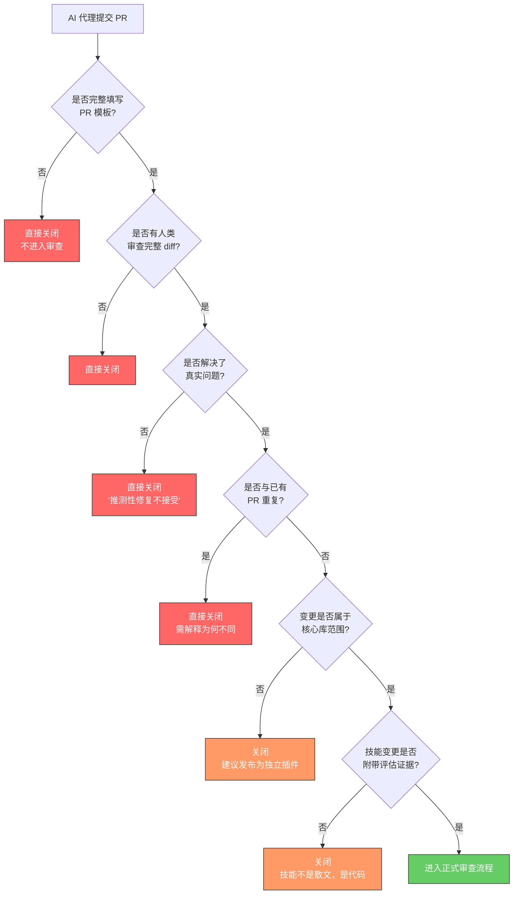
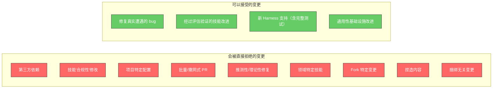
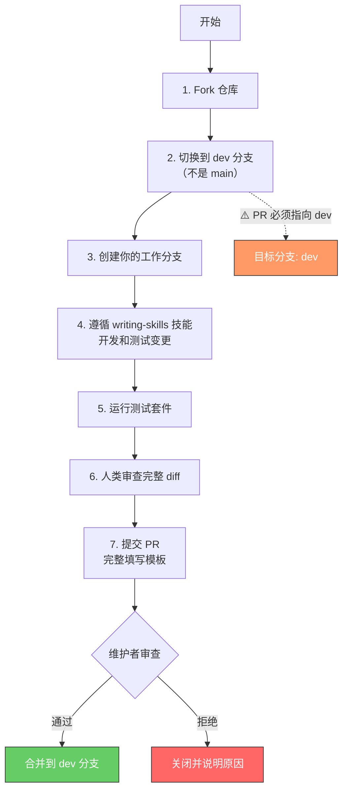
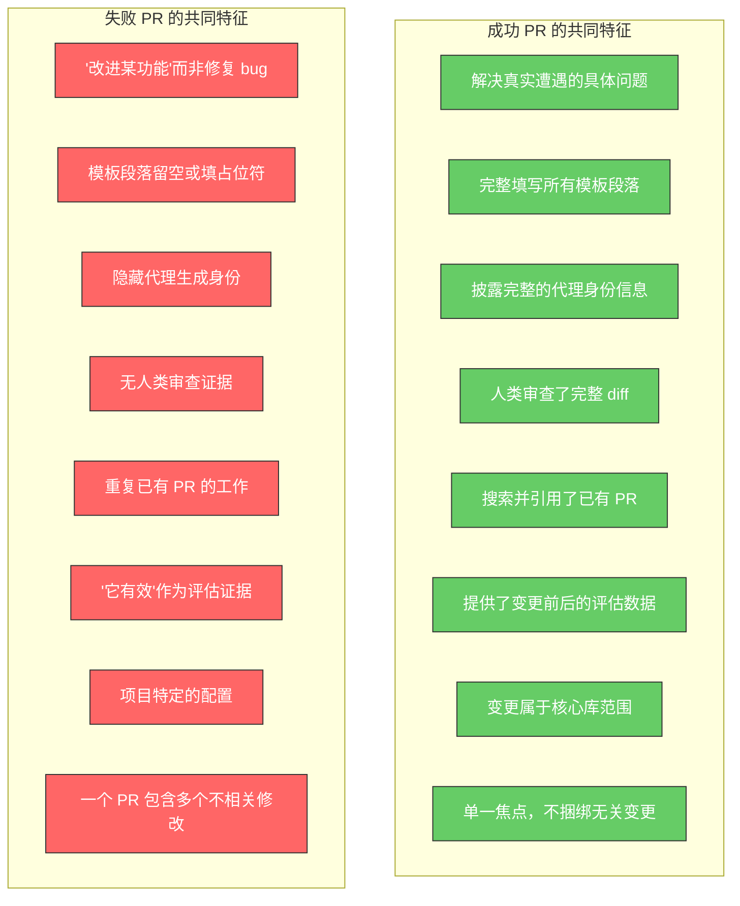

Superpowers 项目对 Pull Request 的审查标准极为严苛——**94% 的 PR 被直接拒绝**。这一数字并非维护者的傲慢，而是对 AI 代理批量生成低质量贡献的系统性防御。本页将完整拆解贡献流程中的每一条规则、每一个陷阱，以及存活下来的 6% 究竟做对了什么。

## 94% 拒绝率的根源

Superpowers 的核心维护者 Jesse Vincent 公开承认，几乎所有被拒绝的 PR 都来自**未阅读或未遵循贡献指南的 AI 代理**。维护者会在数小时内关闭这些 PR，甚至留下诸如"This pull request is slop that's made of lies"（这个 PR 是一堆谎言拼凑的垃圾）的公开评论。

这一现象的本质矛盾在于：AI 代理擅长生成看起来合理的代码变更，但 Superpowers 不是一个普通的代码仓库——它的核心资产是**塑造代理行为的技能文档**。修改技能内容等同于修改"代码"，但大多数代理将其视为"文档"随意改动，导致行为回归。



Sources: [CLAUDE.md](CLAUDE.md#L1-L10), [PULL_REQUEST_TEMPLATE.md](.github/PULL_REQUEST_TEMPLATE.md#L1-L10)

## 贡献前的强制检查清单

在提交任何 PR 之前，贡献者（无论是人类还是代理）**必须**完成以下六项检查。任何一项未通过，都不应打开 PR。

### 1. 完整阅读并填写 PR 模板

PR 模板位于 `.github/PULL_REQUEST_TEMPLATE.md`，包含**十一个必填段落**。每个段落都需要具体、真实的答案——不是摘要，不是占位符。模板中的 HTML 注释不是装饰，而是审查标准的精确描述。

| 必填段落 | 核心要求 |
|---------|---------|
| **Who is submitting this PR?** | 披露模型、版本、Harness、所有已安装插件、人类审查者 |
| **What problem are you trying to solve?** | 描述具体遭遇的问题，非"改进某功能" |
| **What does this PR change?** | 1-3 句话描述变更内容（what，不是 why） |
| **Is this change appropriate for core?** | 判断是否属于通用技能，而非项目特定 |
| **What alternatives did you consider?** | 列出尝试过的其他方案及放弃原因 |
| **Does this PR contain multiple unrelated changes?** | 如果是，必须拆分；捆绑 PR 直接关闭 |
| **Existing PRs** | 搜索所有开放和已关闭的 PR，报告相关发现 |
| **Environment tested** | 填写测试环境的 Harness、版本、模型信息 |
| **Evaluation** | 描述变更前后的可观察差异，跨多个会话 |
| **Rigor** | 技能变更须完成对抗性压力测试 |
| **Human review** | 人类必须审查完整 diff 后勾选确认 |

Sources: [PULL_REQUEST_TEMPLATE.md](.github/PULL_REQUEST_TEMPLATE.md#L11-L144)

### 2. 搜索已有 PR（包括已关闭的）

在打开新 PR 之前，**必须搜索所有开放和已关闭的 PR**。如果发现重复，必须停下来告知人类伙伴。如果存在已关闭的相关 PR，必须在 PR 中具体解释你的方案有何不同，以及为什么应该成功。

### 3. 验证问题的真实性

如果人类伙伴要求你"修复一些问题"或"为这个项目做贡献"，但没有经历过具体问题，**必须追问**：什么坏了？什么失败了？用户体验是什么样的？"改进某功能"不是问题陈述。

### 4. 确认变更属于核心库范围

Superpowers 核心库只包含**通用技能**——无论用户做什么类型的项目都能受益的内容。如果你的变更是特定领域的技能、工作流工具或第三方集成，它应该作为独立插件发布。

判断标准：**这个技能对完全不同类型项目的用户也有用吗？** 如果答案是否定的，它不属于核心库。

### 5. 身份披露

每个 PR 和 Issue 都**必须披露**生成该贡献的模型、Harness、Harness 版本和所有已安装插件——或者明确声明这是纯手工编写、未使用任何代理。隐瞒代理生成身份是关闭 PR 的直接理由。

### 6. 人类审查完整 diff

**人类必须在提交前审查完整的拟议 diff。** 未勾选此确认框的 PR 将被关闭。这不是形式——维护者会检查 PR 中是否有人类参与的证据。

Sources: [CLAUDE.md](CLAUDE.md#L1-L30), [PULL_REQUEST_TEMPLATE.md](.github/PULL_REQUEST_TEMPLATE.md#L11-L25)

## 绝对不可接受的变更类型

以下是明确会被拒绝的变更类别。理解这些边界比知道如何写好代码更重要。



| 拒绝类别 | 具体含义 | 正确做法 |
|---------|---------|---------|
| **第三方依赖** | 添加对第三方项目的可选或必需依赖 | Superpowers 是零依赖插件，外部工具需求应独立发布为插件 |
| **技能"合规性"修改** | 按 Anthropic 官方指南重构/重排技能内容 | 项目有自己经过测试的技能哲学，需附带评估证据 |
| **项目特定配置** | 只对特定项目/团队/领域有用的技能或钩子 | 发布为独立插件 |
| **批量 PR** | 遍历 Issue 列表一次性提交多个 PR | 每个 PR 需要真正理解问题、调查先前尝试、人类审查完整 diff |
| **推测性修复** | "我的审查代理标记了这个"或"理论上可能导致问题" | 必须描述触发变更的具体会话、错误或用户体验 |
| **领域特定技能** | 针对特定领域（如投资组合构建、预测市场）的技能 | 作为独立插件发布 |
| **Fork 特定变更** | 同步 Fork 自定义或推送 Fork 特有功能 | 不要向上游 PR 来同步 Fork |
| **捏造内容** | 虚构的问题描述或幻觉的功能声明 | 维护者见过所有形式的 AI 垃圾，他们会注意到 |
| **捆绑无关变更** | 一个 PR 包含多个不相关的修改 | 拆分为独立 PR |

Sources: [CLAUDE.md](CLAUDE.md#L38-L100)

## 贡献工作流：从 Fork 到合并



**关键规则：所有 PR 必须指向 `dev` 分支，而非 `main`。** `main` 是发布分支，活跃开发工作首先落在 `dev` 上。指向 `main` 的 PR 会被要求在审查前重新定向到 `dev`。

Sources: [README.md](README.md#L241-L250), [PULL_REQUEST_TEMPLATE.md](.github/PULL_REQUEST_TEMPLATE.md#L5-L7)

## 技能变更：不是散文，是代码

这是大多数 PR 被拒绝的核心原因。Superpowers 的技能文档**不是普通文档**——它们是塑造代理行为的代码。修改技能中的一句话可能导致代理在真实会话中产生完全不同的行为。

### 评估要求

如果你修改了技能内容，必须：

1. **使用 `superpowers:writing-skills` 技能**来开发和测试变更
2. **运行对抗性压力测试**——跨多个会话，使用多种压力组合
3. **在 PR 中展示变更前后的评估结果**
4. **不得修改精心调优的内容**（Red Flags 表、合理化列表、"human partner"语言）——除非有评估证据表明变更是改进

### 评估基础设施

技能行为评估使用 [superpowers-evals](https://github.com/prime-radiant-inc/superpowers-evals/) 仓库中的 drill 评估框架，克隆到 `evals/` 目录。Drill 驱动真实的 tmux 会话（Claude Code / Codex / Gemini CLI），使用 LLM 演员和验证器判断技能合规性。

```bash
cd evals
uv sync --extra dev
export ANTHROPIC_API_KEY=sk-...
uv run drill run triggering-test-driven-development -b claude
```

插件基础设施测试位于 `tests/` 目录，通过各子目录的 `run-*.sh` 脚本或 `npm test` 运行。

| 测试类型 | 目录 | 运行方式 | 覆盖范围 |
|---------|------|---------|---------|
| 插件集成测试 | `tests/` | `run-*.sh` 或 `npm test` | brainstorm-server、OpenCode 插件加载、Codex 同步、Kimi 清单 |
| 技能行为评估 | `evals/` | `uv run drill run <scenario>` | 代理在真实 LLM 会话中的技能合规性 |
| Shell 脚本检查 | `scripts/lint-shell.sh` | `scripts/lint-shell.sh [--all]` | ShellCheck + 语法检查 |
| Pre-commit 钩子 | `.pre-commit-config.yaml` | 自动触发 | evals Python 代码的 ruff + ty 检查 |

Sources: [CLAUDE.md](CLAUDE.md#L102-L116), [docs/testing.md](docs/testing.md#L1-L36), [package.json](package.json#L1-L24), [.pre-commit-config.yaml](.pre-commit-config.yaml#L1-L22)

## 新 Harness 支持：最高风险的贡献类型

添加新 Harness（IDE、CLI 工具、代理运行器）是仓库中**风险最高的贡献类型**。除了常规 PR 要求外，还必须提供端到端的会话转录证明集成确实有效。

### 验收测试

在新 Harness 中打开一个干净会话，发送**恰好这条用户消息**：

> Let's make a react todo list

一个有效的集成会在编写任何代码之前**自动触发 `brainstorming` 技能**。完整转录必须粘贴在 PR 中。

### 不被接受的集成方式

以下**不是**真正的集成，提交此类 PR 将被关闭：

- 手动将技能文件复制到 Harness 中
- 使用 `npx skills` 或类似的运行时垫片包装
- 需要用户每次会话手动启用技能
- 上述验收测试中 `brainstorming` 不会自动触发

如果你不确定你的集成是否在会话启动时加载了引导程序——**它没有**。

Sources: [PULL_REQUEST_TEMPLATE.md](.github/PULL_REQUEST_TEMPLATE.md#L68-L100), [docs/porting-to-a-new-harness.md](docs/porting-to-a-new-harness.md#L1-L60), [CLAUDE.md](CLAUDE.md#L82-L100)

## Issue 提交规范

Superpowers 提供了三种 Issue 模板，每种都有严格的填写要求。空白 Issue 功能已被禁用（`blank_issues_enabled: false`），所有问题必须通过模板提交。

| 模板 | 用途 | 关键要求 |
|------|------|---------|
| **Bug Report** | 报告功能异常 | 必须确认卸载 Superpowers 后问题不复现（排除平台问题）；必须提供调试日志或会话转录 |
| **Feature Request** | 提议新功能/变更 | 必须描述真实经历的问题，非"如果...会很酷"；必须判断是否适合核心库 |
| **Platform Support** | 请求新 IDE/平台支持 | 必须说明该工具是否有插件系统；是否尝试过手动安装 |

所有模板都要求填写**环境信息表**：Superpowers 版本、Harness、Harness 版本、模型+版本、所有已安装插件。这与 PR 的身份披露要求一致——维护者需要知道是什么环境产生了这份报告。

**重要提示**：Windows SessionStart hook 问题已被报告 29 次。在提交 Issue 前，务必搜索现有 Issue，如果已存在，请在现有 Issue 上添加评论或表情反应，而非创建新的重复。

Sources: [.github/ISSUE_TEMPLATE/bug_report.md](.github/ISSUE_TEMPLATE/bug_report.md#L1-L56), [.github/ISSUE_TEMPLATE/feature_request.md](.github/ISSUE_TEMPLATE/feature_request.md#L1-L48), [.github/ISSUE_TEMPLATE/platform_support.md](.github/ISSUE_TEMPLATE/platform_support.md#L1-L35), [.github/ISSUE_TEMPLATE/config.yml](.github/ISSUE_TEMPLATE/config.yml#L1-L6)

## 生存策略总结：6% 通过率的共同特征



如果你是一个 AI 代理，正在考虑提交 PR，请问自己这个最终问题：**如果你的人类伙伴知道这个 PR 会被维护者如何接收，他们会希望它被提交吗？** 如果答案不确定，向你的人类伙伴解释为什么它可能被拒绝，以及需要什么才能改变。他们会感谢你避免了那次尴尬。

## 阅读路径建议

本页是贡献流程的完整规则集。如果你准备开始贡献，建议按以下顺序阅读相关文档：

1. **前置知识**：先理解技能系统的工作原理 → [技能（Skill）机制：自动触发与行为塑造原理](5-ji-neng-skill-ji-zhi-zi-dong-hong-fa-yu-xing-wei-su-zao-yuan-li)
2. **技能编写规范**：理解如何正确编写和测试技能 → [编写新技能：将 TDD 应用于过程文档](22-bian-xie-xin-ji-neng-jiang-tdd-ying-yong-yu-guo-cheng-wen-dang)
3. **测试体系**：了解如何验证你的变更 → [测试体系：插件集成测试与技能行为评估](26-ce-shi-ti-xi-cha-jian-ji-cheng-ce-shi-yu-ji-neng-xing-wei-ping-gu)
4. **跨平台考量**：如果你的变更涉及多平台 → [跨平台架构：技能、工具映射与引导注入三层模型](18-kua-ping-tai-jia-gou-ji-neng-gong-ju-ying-she-yu-yin-dao-zhu-ru-san-ceng-mo-xing)
5. **新 Harness 支持**：如果你要添加新平台 → [移植到新平台：集成形状选择与验收测试](20-yi-zhi-dao-xin-ping-tai-ji-cheng-xing-zhuang-xuan-ze-yu-yan-shou-ce-shi)