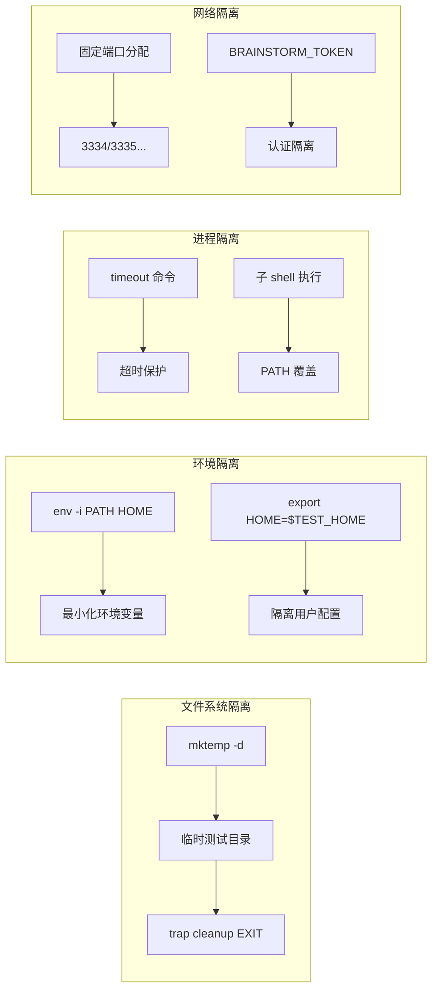

Superpowers 项目的测试体系采用**双层分离架构**：一层验证插件非 LLM 代码的功能正确性（`tests/`），另一层评估 AI 代理在真实 LLM 会话中的行为合规性（`evals/`）。这种分离反映了一个核心设计决策——将确定性逻辑验证与概率性行为评估解耦，使 CI 流水线仅承载快速、确定性的插件测试，而将耗时的 LLM 会话测试留给离线执行。

本文档将系统解析 `tests/` 目录下全部 14 个测试模块的组织逻辑、断言模式与执行机制，帮助中级开发者理解如何在类似的多平台 AI 工具链项目中构建可维护的测试基础设施。

## 测试体系总览：双层架构与分类矩阵

```mermaid
graph TB
    subgraph "tests/ — 插件集成测试（确定性）"
        direction TB
        A[brainstorm-server<br/>Node.js 单元 + 集成] 
        B[claude-code<br/>Bash 技能行为断言]
        C[opencode<br/>Bash 插件加载 + 缓存]
        D[codex / codex-plugin-sync<br/>Python 清单验证]
        E[kimi<br/>Python 清单验证]
        F[hooks<br/>Bash + Node 输出形状验证]
        G[shell-lint<br/>Bash 脚本 lint 验证]
        H[explicit-skill-requests<br/>Bash CLI 流式输出验证]
        I[pi<br/>Node.js ESM 生命周期]
        J[antigravity<br/>Bash 工具映射]
        K[systematic-debugging<br/>Bash 脚本行为]
    end

    subgraph "evals/ — 技能行为评估（概率性）"
        L[Drill 框架<br/>Python + tmux]
        M[scenarios/*.yaml<br/>场景定义]
    end

    A --> N[CI 可运行]
    B --> N
    C --> N
    D --> N
    E --> N
    F --> N
    G --> N
    H --> O[需要 LLM CLI]
    I --> N
    J --> N
    K --> N
    L --> P[离线执行<br/>3-30+ 分钟/场景]
    M --> P
```



整个测试体系按**被测对象**和**依赖条件**分为两大阵营。`tests/` 中的大部分模块仅需 Bash、Node.js 或 Python 运行时即可执行，属于传统集成测试范畴。而 `explicit-skill-requests` 和部分 `claude-code` 测试则需要调用真实的 Claude Code CLI（`claude -p`），处于插件测试与行为评估的灰色地带。`evals/` 则完全依赖真实 LLM 会话，通过 Drill 框架驱动 tmux 中的代理交互。

Sources: [testing.md](docs/testing.md#L1-L36)

## 插件测试模块详解

### 模块分类与覆盖范围

| 测试模块 | 语言/运行时 | 被测对象 | 测试类型 | 外部依赖 |
|---------|-----------|---------|---------|---------|
| `brainstorm-server/` | Node.js + Bash | 头脑风暴服务器 JS 代码 | 单元 + 集成 | `ws` npm 包 |
| `claude-code/` | Bash | Claude Code 技能加载与行为 | 描述召回 + 集成 | Claude Code CLI |
| `opencode/` | Bash + Node.js | OpenCode 插件加载、缓存、工具注册 | 单元 + 集成 | OpenCode（集成测试） |
| `codex/` | Bash + Python | Codex 清单文件 + 打包脚本 | 清单验证 + 归档验证 | Python 3 |
| `codex-plugin-sync/` | Bash | 同步脚本的 Git 操作 | 集成（Git fixture） | Git |
| `kimi/` | Bash + Python | Kimi 插件清单 | 清单验证 | Python 3 |
| `hooks/` | Bash + Node.js | SessionStart hook 输出形状 | 多平台输出验证 | Node.js |
| `shell-lint/` | Bash | `lint-shell.sh` 脚本行为 | 脚本行为验证 | ShellCheck/shfmt（stub） |
| `explicit-skill-requests/` | Bash | 显式技能请求触发 | CLI 流式输出验证 | Claude Code CLI |
| `pi/` | Node.js ESM | Pi 扩展生命周期钩子 | 单元（`node:test`） | 无 |
| `antigravity/` | Bash | Antigravity 工具映射文档 | 静态内容验证 | 无 |
| `systematic-debugging/` | Bash | `find-polluter.sh` 脚本 | 脚本行为验证 | 无 |

### 测试运行器模式

项目采用**分层运行器**设计。每个测试目录包含独立的 `run-*.sh` 入口脚本，提供统一的 CLI 接口：

```
--verbose, -v        显示完整输出
--test, -t NAME      运行指定测试
--timeout SECONDS    设置单测超时（默认 900 秒）
--integration, -i    包含集成测试（默认仅快速测试）
```

以 `tests/claude-code/run-skill-tests.sh` 为例，运行器维护两个测试数组——`tests`（快速测试）和 `integration_tests`（慢速集成测试），通过 `--integration` 标志决定是否合并执行。每个测试文件通过 `timeout` 命令包裹，超时退出码 124 被特殊处理为超时失败。

Sources: [run-skill-tests.sh](tests/claude-code/run-skill-tests.sh#L76-L90), [run-tests.sh](tests/opencode/run-tests.sh#L60-L75)

## 断言基础设施：三套并行的断言范式

项目中存在三套独立演化的断言工具集，分别服务于不同的测试语境。

### 范式一：Bash 函数断言（claude-code 系列）

`tests/claude-code/test-helpers.sh` 提供了面向 LLM 输出验证的专用断言库。其核心设计特征是**大小写不敏感匹配**——因为 LLM 自由变化技能术语的大小写形式（如 "Do Not Trust" vs "spec compliance"），所以 `grep -qi` 成为默认匹配策略。

```
run_claude "prompt" [timeout] [allowed_tools]   # 调用 Claude CLI 无头模式
assert_contains output pattern name              # 模式存在性验证
assert_not_contains output pattern name          # 模式缺席验证
assert_count output pattern count name           # 精确计数验证
assert_order output pattern_a pattern_b name     # 顺序验证（行号比较）
```

`assert_order` 的实现尤其值得注意：它通过 `grep -ni` 获取两个模式首次出现的行号，然后比较数值大小。这种设计直接服务于工作流顺序验证场景——例如确认"规范合规审查"出现在"代码质量审查"之前。

Sources: [test-helpers.sh](tests/claude-code/test-helpers.sh#L1-L129)

### 范式二：Bash pass/fail 计数器（通用脚本测试）

`hooks/test-session-start.sh`、`shell-lint/test-lint-shell.sh`、`systematic-debugging/test-find-polluter.sh` 等模块采用更轻量的模式：局部 `pass()`/`fail()` 函数加全局 `FAILURES` 计数器。每个测试模块自行定义 `assert_contains`、`assert_not_contains` 等辅助函数，通过 `trap cleanup EXIT` 确保临时目录清理。

这种去中心化设计的代价是代码重复——几乎每个测试文件都重新实现了相同的断言原语。但其优势在于零依赖：不需要 source 任何共享文件，每个测试完全自包含。

Sources: [test-session-start.sh](tests/hooks/test-session-start.sh#L9-L24), [test-lint-shell.sh](tests/shell-lint/test-lint-shell.sh#L16-L53), [test-find-polluter.sh](tests/systematic-debugging/test-find-polluter.sh#L8-L35)

### 范式三：Node.js assert 模块（brainstorm-server + pi）

`brainstorm-server/` 的 7 个 `.test.js` 文件和 `pi/test-pi-extension.mjs` 使用 Node.js 内置的 `assert` 模块（或 `node:assert/strict`）。brainstorm-server 测试实现了自定义的微型测试框架——`test(name, fn)` 函数捕获异常并计数，支持 `SkipTest` 异常类实现条件跳过（例如当主机不支持符号链接时）。

`pi/test-pi-extension.mjs` 则直接使用 Node.js 22+ 的 `node:test` 运行器，通过 `import test from 'node:test'` 注册测试用例，是项目中唯一使用标准测试框架的模块。

Sources: [server.test.js](tests/brainstorm-server/server.test.js#L113-L141), [test-pi-extension.mjs](tests/pi/test-pi-extension.mjs#L1-L6), [ws-protocol.test.js](tests/brainstorm-server/ws-protocol.test.js#L31-L45)

## 关键测试场景深度解析

### SessionStart Hook 多平台输出形状验证

`tests/hooks/test-session-start.sh` 是项目中最精密的测试之一。它验证同一个 `hooks/session-start` 脚本在不同平台环境变量下产生正确格式的 JSON 输出。测试通过 `env -i` 创建完全隔离的环境，然后使用内嵌 Node.js 脚本解析 JSON 并验证三种输出形状：

| 平台 | 环境变量触发条件 | 输出形状 | JSON 字段 |
|------|----------------|---------|----------|
| Claude Code | `CLAUDE_PLUGIN_ROOT` | `nested` | `hookSpecificOutput.additionalContext` |
| Cursor | `CURSOR_PLUGIN_ROOT` + `CLAUDE_PLUGIN_ROOT` | `cursor` | `additional_context`（顶层） |
| Copilot CLI / SDK | `COPILOT_CLI=1` | `sdk` | `additionalContext`（顶层） |

测试还验证了注册形状——`hooks.json` 必须声明 `shell: "bash"` 以确保 Windows 上通过 Git Bash 分发，而非 PowerShell/cmd.exe。此外，一个回归测试确认即使存在旧版 `~/.config/superpowers/skills` 目录，输出中也不再包含过时的遗留警告信息。

Sources: [test-session-start.sh](tests/hooks/test-session-start.sh#L33-L142), [hooks.json](hooks/hooks.json#L1-L17)

### Codex 清单与打包验证

`tests/codex/test-marketplace-manifest.sh` 使用内嵌 Python 脚本验证 `.agents/plugins/marketplace.json` 的结构正确性。关键验证点包括：插件源声明为 `{"source": "url", "url": "./"}`（安装整个仓库根目录），策略字段声明安装可用性和按需认证。

一个精妙的验证检查了 `hooks` 字段必须为 `{}`（空对象）而非 `[]`（空数组）或缺失。这是因为 Codex 在清单无 `hooks` 字段时会自动发现 `hooks/hooks.json`（即 Claude Code 的 SessionStart hook），声明空对象 `{}` 是抑制该自动发现的唯一方式。

`tests/codex/test-package-codex-plugin.sh` 则验证打包脚本的输出归档：排除源专有路径（`.claude`、`.cursor`、`tests/`、`docs/`等），保留技能文件和 OpenAI 元数据，规范化 ZIP 时间戳为 `(1980, 1, 1, 0, 0, 0)` 以确保可重现构建。

Sources: [test-marketplace-manifest.sh](tests/codex/test-marketplace-manifest.sh#L55-L73), [test-package-codex-plugin.sh](tests/codex/test-package-codex-plugin.sh#L163-L196)

### 显式技能请求测试

`tests/explicit-skill-requests/` 验证用户直接命名技能时（如 "subagent-driven-development, please"），Claude 是否正确触发 Skill 工具调用。测试通过 `--output-format stream-json` 获取 Claude 的结构化输出流，然后使用 `grep` 在 JSON 日志中查找 `"name":"Skill"` 和 `"skill":"subagent-driven-development"` 模式。

更精妙的是**过早行动检测**：测试检查在第一个 Skill 工具调用之前是否存在非规划类工具调用（排除 `TodoWrite`、`TaskCreate` 等），以捕获"代理在加载技能前就开始工作"这一失败模式。

多轮测试（`run-multiturn-test.sh`）进一步验证在经历规划对话后，代理仍能在第三轮正确响应显式技能请求——这针对的是长对话中技能触发退化的问题。

Sources: [run-test.sh](tests/explicit-skill-requests/run-test.sh#L82-L121), [run-multiturn-test.sh](tests/explicit-skill-requests/run-multiturn-test.sh#L46-L83)

### Brainstorm 服务器安全测试

`tests/brainstorm-server/auth.test.js` 实现了完整的安全测试套件，验证每会话密钥机制。测试覆盖：无密钥请求返回 403、错误密钥返回 403、错误密钥 + 有效 cookie 仍返回 403（显式错误查询参数不可回退到 cookie 认证）、安全响应头验证（`referrer-policy: no-referrer`、`cache-control: no-store`、`x-frame-options: DENY`、`content-security-policy: frame-ancestors 'none'`、`cross-origin-resource-policy: same-origin`）。

引导脚本测试验证了即使 `sessionStorage` 写入失败（如浏览器隐私模式），密钥剥离重定向仍能正常工作。

Sources: [auth.test.js](tests/brainstorm-server/auth.test.js#L1-L95), [server.test.js](tests/brainstorm-server/server.test.js#L1-L112)

## 测试隔离策略



项目采用多层隔离策略确保测试可重复性和并行安全性：

**文件系统隔离**：几乎所有 Bash 测试使用 `mktemp -d` 创建临时目录，通过 `trap cleanup EXIT` 确保清理。`tests/opencode/setup.sh` 更进一步——创建完整的模拟安装布局（`$OPENCODE_CONFIG_DIR/superpowers/`），包含符号链接注册、个人测试技能和项目级测试技能 fixture。

**环境隔离**：`test-session-start.sh` 使用 `env -i` 从空白环境开始，仅注入 `PATH` 和 `HOME`。`explicit-skill-requests/run-test.sh` 创建隔离的项目目录并复制 prompt 文件到输出目录以供事后分析。

**网络隔离**：brainstorm-server 测试为每个测试文件分配固定端口（`server.test.js` 使用 3334，`auth.test.js` 使用 3335），通过 `BRAINSTORM_TOKEN` 环境变量注入认证令牌，确保测试间不冲突。

Sources: [setup.sh](tests/opencode/setup.sh#L1-L89), [test-session-start.sh](tests/hooks/test-session-start.sh#L26-L31), [server.test.js](tests/brainstorm-server/server.test.js#L18-L26)

## 技能行为测试：描述召回 vs 实际行为

`tests/claude-code/` 中的测试遵循一个明确的设计边界：**测试技能的描述召回能力，而非实际执行行为**。

以 `test-subagent-driven-development.sh` 为例，它通过 9 个 prompt 询问 Claude 关于 SDD 技能的内容——工作流顺序、自审查要求、计划读取效率、审查者心态、循环机制等——然后使用 `assert_contains` 和 `assert_order` 验证回答中包含预期关键词。测试文件头部的注释明确说明："Drill scenarios test behavior (real subagent dispatch, plan-following, review loops), not description-recall. Kept by design."

这种分工的合理性在于：描述召回测试快速（~2 分钟）、确定性高、不消耗 LLM API 额度；而行为测试（由 `evals/` 中的 Drill 场景覆盖）需要 3-30+ 分钟且结果具有概率性。

`test-worktree-native-preference.sh` 则采用 RED-GREEN-REFACTOR 模式验证技能文档的演进：RED 阶段验证无 Step 1a 时代理使用 `git worktree add`，GREEN 阶段验证有 Step 1a 时代理使用原生 `EnterWorktree` 工具，PRESSURE 阶段在紧迫性框架下重复 GREEN 验证。

Sources: [test-subagent-driven-development.sh](tests/claude-code/test-subagent-driven-development.sh#L1-L9), [README.md](tests/claude-code/README.md#L82-L125), [test-worktree-path-policy.sh](tests/claude-code/test-worktree-path-policy.sh#L1-L70)

## SDD 工作区脚本测试

`tests/claude-code/test-sdd-workspace.sh` 是项目中工程化程度最高的纯 Bash 测试之一。它验证 `skills/subagent-driven-development/scripts/` 下的三个脚本（`sdd-workspace`、`task-brief`、`review-package`）的行为：

- **参数验证**：无参数调用和不存在计划文件调用均返回退出码 2
- **路径解析**：每个计划文件解析为 `<repo-root>/.superpowers/sdd/<plan-basename>` 的唯一目录
- **Git 不可见性**：自动创建的 `.gitignore`（内容为 `*`）确保工作区对 `git status` 和 `git add -A` 不可见
- **Worktree 隔离**：链接的 Git worktree 解析出自己独立的工作区目录，不与主仓库冲突

Sources: [test-sdd-workspace.sh](tests/claude-code/test-sdd-workspace.sh#L1-L200)

## 静态内容验证测试

部分测试采用纯粹的静态文件内容检查，无需执行任何代码：

`tests/claude-code/test-worktree-path-policy.sh` 验证技能文档中不再引用旧的全局 worktree 路径 `~/.config/superpowers/worktrees`，同时确认新策略（默认 `.worktrees/` 在项目根目录）已正确记录。它同时检查 `using-git-worktrees/SKILL.md`、`finishing-a-development-branch/SKILL.md` 以及相关设计规范和计划文档。

`tests/antigravity/test-antigravity-tools.sh` 验证 Antigravity 平台工具映射文档（`antigravity-tools.md`）包含核心工具名（`write_to_file`、`replace_file_content`、`invoke_subagent`）、子代理类型（`self`、`research`）和任务追踪机制（`task` artifact），并且 `SKILL.md` 的平台适配部分正确引用了该映射文件。

Sources: [test-worktree-path-policy.sh](tests/claude-code/test-worktree-path-policy.sh#L47-L60), [test-antigravity-tools.sh](tests/antigravity/test-antigravity-tools.sh#L1-L47)

## 技能行为评估（evals/）

`evals/` 目录承载了基于 **Drill 框架**的技能行为评估系统。与 `tests/` 的确定性断言不同，evals 通过真实 LLM 会话验证代理是否正确遵循技能指令。场景定义以 YAML 文件形式存放在 `evals/scenarios/` 中。

执行流程为：安装 Python 依赖（`uv sync --extra dev`）→ 设置 API 密钥 → 运行 `uv run drill run <scenario-name> -b <backend>`。每个场景耗时 3-30+ 分钟，目前不纳入 CI 流水线。

`.pre-commit-config.yaml` 中配置了 evals 目录的 Python 代码质量检查：`ruff check`（lint）、`ruff format --check`（格式）、`ty check`（类型检查），确保评估框架代码本身的质量。

Sources: [testing.md](docs/testing.md#L24-L36), [.pre-commit-config.yaml](.pre-commit-config.yaml#L1-L22)

## 测试执行速查表

| 目标 | 命令 | 预计耗时 |
|------|------|---------|
| 全部快速插件测试 | 各目录 `run-*.sh` 或 `npm test`（brainstorm-server） | 1-5 分钟 |
| Claude Code 技能测试 | `tests/claude-code/run-skill-tests.sh` | ~2 分钟 |
| Claude Code 集成测试 | `tests/claude-code/run-skill-tests.sh --integration` | 10-30 分钟 |
| OpenCode 插件测试 | `tests/opencode/run-tests.sh` | <1 分钟 |
| OpenCode 集成测试 | `tests/opencode/run-tests.sh --integration` | 需要 OpenCode |
| Brainstorm 服务器测试 | `cd tests/brainstorm-server && npm test` | 1-2 分钟 |
| 显式技能请求测试 | `tests/explicit-skill-requests/run-all.sh` | 需要 Claude CLI |
| 技能行为评估 | `cd evals && uv run drill run <scenario> -b claude` | 3-30+ 分钟/场景 |

## 架构洞察：测试体系的设计权衡

Superpowers 的测试体系体现了三个核心设计决策：

**第一，确定性优先于覆盖率。** 项目明确将 LLM 行为评估排除在 CI 之外，仅运行确定性测试。这不是技术限制的妥协，而是对"不可重复测试不应阻塞合并"这一原则的坚守。

**第二，去中心化优于统一框架。** 每个测试模块独立实现断言原语和运行逻辑，没有引入 pytest、Jest 或 Bats 等统一框架（`pi/` 模块除外）。这增加了代码重复，但消除了跨模块依赖——任何一个测试模块的改动不会影响其他模块。

**第三，文档即测试对象。** 多个测试（`test-worktree-path-policy.sh`、`test-antigravity-tools.sh`、`test-subagent-driven-development.sh`）直接验证 Markdown 文档的内容。在技能系统中，文档是代理行为的唯一来源，因此文档内容测试等价于行为契约测试。

---

**继续阅读建议**：

- 了解技能如何被编写和测试 → [编写新技能：将 TDD 应用于过程文档](22-bian-xie-xin-ji-neng-jiang-tdd-ying-yong-yu-guo-cheng-wen-dang)
- 深入了解技能压力测试方法 → [技能压力测试：对抗性场景与子代理验证](24-ji-neng-ya-li-ce-shi-dui-kang-xing-chang-jing-yu-zi-dai-li-yan-zheng)
- 了解版本发布流程中的测试角色 → [版本发布与变更日志解读](27-ban-ben-fa-bu-yu-bian-geng-ri-zhi-jie-du)