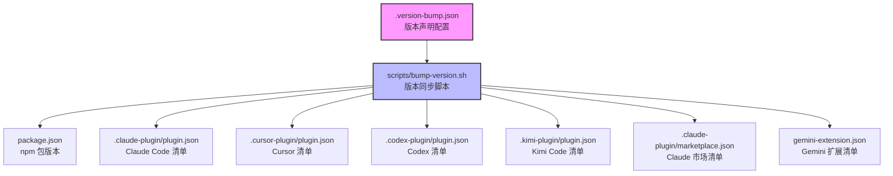
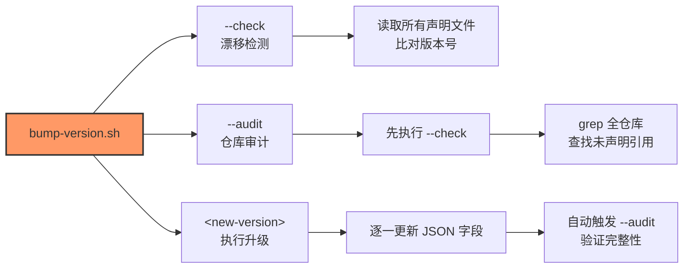
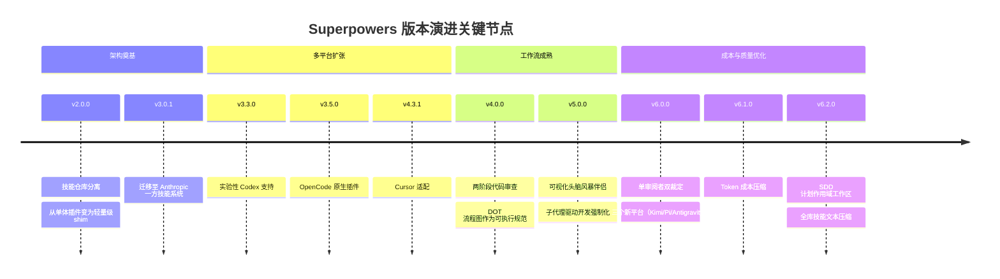

本页系统解析 Superpowers 项目的版本管理架构——从多平台清单的版本同步机制，到变更日志的结构化写作规范，再到发布脚本的自动化流程。理解这套体系，能帮助你在升级时精准评估影响范围，在贡献时正确标注变更。

## 版本标识与语义化规范

Superpowers 采用**语义化版本（SemVer）**的三段式编号 `MAJOR.MINOR.PATCH`，但每个段位承载的含义比常规项目更为严格：

| 段位 | 触发条件 | 典型内容 | 历史案例 |
|------|---------|---------|---------|
| **MAJOR** | 破坏性架构变更 | 技能目录重组、平台集成方式重写、默认工作流强制变更 | v5→v6：SDD 审查流程重写，三个新平台接入 |
| **MINOR** | 功能性新增 | 新技能、新平台支持、工作流增强 | v6.1→v6.2：SDD 计划作用域工作区、技能压缩 |
| **PATCH** | 缺陷修复 | 跨平台兼容性修复、脚本错误修正、测试稳定性 | v6.0.0→v6.0.1：Codex 版本显示回退、同步脚本排除规则 |

从 [RELEASE-NOTES.md](RELEASE-NOTES.md#L1-L50) 可以观察到，v4→v5 的跃迁引入了可视化头脑风暴伴侣和文档审查系统；v5→v6 则将子代理驱动开发（SDD）的审查从双审阅者合并为单审阅者双裁定，同时新增三个平台适配。每次大版本升级都伴随着需要用户迁移的破坏性变更。

Sources: [RELEASE-NOTES.md](RELEASE-NOTES.md#L1-L50), [package.json](package.json#L1-L24)

## 多平台清单的版本同步机制

Superpowers 同时服务于六个平台，每个平台拥有独立的清单文件，但所有清单的 `version` 字段必须保持严格同步。这种"单源多发布"的架构通过配置文件和脚本的协作来保障一致性。



`.version-bump.json` 声明了所有需要同步版本号的清单文件及其 JSON 字段路径。值得注意的是，marketplace.json 使用嵌套路径 `plugins.0.version` 定位到数组中第一个插件对象的版本字段——这体现了不同清单结构的异构性。

```json
{
  "files": [
    { "path": "package.json", "field": "version" },
    { "path": ".claude-plugin/plugin.json", "field": "version" },
    { "path": ".claude-plugin/marketplace.json", "field": "plugins.0.version" }
  ]
}
```

当前所有清单统一锁定在 `6.2.0`。任何版本漂移——比如只更新了 `package.json` 而遗漏了某个平台清单——都会被检测脚本捕获。

Sources: [.version-bump.json](.version-bump.json#L1-L22), [.claude-plugin/plugin.json](.claude-plugin/plugin.json#L1-L21), [.codex-plugin/plugin.json](.codex-plugin/plugin.json#L1-L49)

## 版本同步脚本：三级防护

`scripts/bump-version.sh` 提供三种操作模式，构成版本一致性的三级防护体系：



**`--check` 模式**读取所有声明文件中的版本号，比较是否存在差异。如果发现漂移（例如 6 个文件显示 `6.2.0`，1 个显示 `6.1.0`），脚本会报告不一致并返回非零退出码。

**`--audit` 模式**在漂移检测的基础上，用 `grep` 扫描整个仓库，查找包含当前版本字符串但未在 `.version-bump.json` 中声明的文件。这能发现"遗漏的清单"——比如新增了一个平台适配但没有将其加入版本同步配置。审计排除列表（`audit.exclude`）允许将 `RELEASE-NOTES.md`、`CHANGELOG.md` 等自然包含版本号的文本文件排除在外。

**`<new-version>` 模式**执行实际的版本号升级：依次更新每个声明文件的 JSON 字段，然后自动运行 `--audit` 确认没有遗漏。脚本通过 `jq` 处理 JSON 的读写，支持点分路径（如 `plugins.0.version`）转换为 `jq` 的数组索引语法。

Sources: [scripts/bump-version.sh](scripts/bump-version.sh#L1-L221)

## 变更日志的结构化写作

`RELEASE-NOTES.md` 是项目唯一的变更日志源（早期存在的 `CHANGELOG.md` 已在 v5.1.0 中作为"遗留文件"移除）。这份 1362 行的文档覆盖从 v2.0.0 到 v6.2.0 的完整历史，其结构遵循严格的分层模式。

### 条目层级

每个版本条目按以下层级组织：

| 层级 | 格式 | 用途 |
|------|------|------|
| **版本标题** | `## vX.Y.Z (YYYY-MM-DD)` | 版本号与发布日期 |
| **主题分组** | `### 主题名称` | 按功能域聚合变更（如 "Subagent-Driven Development"、"Windows"） |
| **变更条目** | `- **粗体摘要。** 详细说明` | 每条以粗体短语开头，后接完整描述 |

这种结构的关键设计决策是**按功能域分组而非按变更类型分组**。你不会看到 "Added"、"Changed"、"Fixed" 这样的传统分类（v5.x 之前的早期版本曾使用过），而是看到 "Skills"、"Windows"、"Harness Support"、"Brainstorming Visual Companion" 等面向用户场景的分组。这反映了项目的核心理念：用户关心的是"我使用的哪个功能变了"，而非"这是哪种类型的变更"。

### 条目写作范式

观察 v6.2.0 的条目，可以提炼出一致的写作模式：

- **粗体短语作为锚点**：`**The workspace is now plan-scoped.**` — 一句话概括变更的本质
- **因果链叙述**：先描述问题（"a follow-up plan could read the previous plan's ledger"），再描述解决方案
- **证据引用**：关键决策附带评估数据（如 "control 8/10 → treatment 5/10"）
- **Issue/PR 关联**：修复类条目标注 issue 编号（如 "#2008, #2011"）
- **贡献者署名**：外部贡献在版本末尾的 "Contributors" 段落集中致谢

Sources: [RELEASE-NOTES.md](RELEASE-NOTES.md#L1-L100), [RELEASE-NOTES.md](RELEASE-NOTES.md#L270-L280)

## 版本演进的关键转折点

从变更日志中可以识别出项目架构的几次重大转折，每次转折都定义了后续版本的发展方向：



**v2.0.0** 的"技能仓库分离"是第一次架构断裂——所有技能从插件迁移到独立仓库，插件本身变为纯运行时。这一决策在后续版本中被回滚（技能重新合并到主仓库），但其引入的 git 分支工作流理念延续至今。

**v5.0.0** 是功能密度最高的版本：可视化伴侣、文档审查系统、架构指导贯穿技能管线、子代理状态协议。它确立了"技能即过程文档"的核心范式。

**v6.0.0** 转向成本优化——评估数据显示，双审阅者流程在相似质量下消耗近两倍的 token。单审阅者重构配合文件传递（而非上下文粘贴）的 diff 机制，使 Claude Code 和 Codex 在评估中以约一半的 token 消耗产出相似质量的结果。

Sources: [RELEASE-NOTES.md](RELEASE-NOTES.md#L598-L800), [RELEASE-NOTES.md](RELEASE-NOTES.md#L1200-L1362)

## 发布打包与分发

不同平台的分发机制各异，项目通过专用脚本处理每个平台的打包需求。

### Codex 门户打包

`scripts/package-codex-plugin.sh` 负责生成 Codex 门户上传所需的无根目录归档。其设计有几个值得关注的工程决策：

| 决策 | 原因 |
|------|------|
| 归档无根目录 | `.codex-plugin/`、`assets/`、`skills/` 直接位于归档根级 |
| 确定性构建 | 归一化文件时间戳，保留可执行模式位，相同输入产生字节级一致的输出 |
| 元数据种子 | 从前一个官方包中提取 `skills/*/agents/openai.yaml`（OpenAI 拥有的元数据不在源码仓库中） |
| 格式灵活 | 默认 `.zip`，可选 `.tar.gz`，根据输出路径扩展名自动推断 |
| 安全默认 | 拒绝脏工作区（除非 `--allow-dirty`），校验 git ref 有效性 |

### Codex 仓库同步

`scripts/sync-to-codex-plugin.sh` 执行另一条分发路径：将源码仓库的内容同步到 `prime-ranti-inc/openai-codex-plugins` 分叉仓库，自动创建 PR。排除列表精确控制哪些文件进入 Codex 插件——所有其他平台的清单（`.claude-plugin/`、`.cursor-plugin/`、`.kimi-plugin/`）、测试、文档、脚本目录都被排除。路径模式使用 `/` 前缀锚定到仓库根目录，避免误排除 `skills/brainstorming/scripts/` 这样的合法嵌套目录。

Sources: [scripts/package-codex-plugin.sh](scripts/package-codex-plugin.sh#L1-L200), [scripts/sync-to-codex-plugin.sh](scripts/sync-to-codex-plugin.sh#L1-L200)

## 提交约定与发布流程

从 git 历史可以观察到项目采用**约定式提交（Conventional Commits）**规范：

```
feat(sdd): plan-scoped durable progress — ledger names its plan
fix(hooks): dispatch the SessionStart hook via Git Bash on Windows
refactor(skills): fold TDD Why Order Matters rebuttals into rationalization table
eval(sdd): RED baseline — 25/25 controllers refuse stale ledgers
docs(plans): SDD fix-loop redesign implementation plan
```

类型前缀包括 `feat`（新功能）、`fix`（修复）、`refactor`（重构）、`docs`（文档）、`eval`（评估）、`test`（测试）、`chore`（杂务）。作用域标注（括号内）精确指向受影响的子系统。

发布流程的典型序列是：
1. 在 `dev` 分支上累积变更（PR 目标分支为 `dev` 而非 `main`）
2. 运行 `bump-version.sh --check` 确认版本一致性
3. 运行 `bump-version.sh <new-version>` 执行版本号升级
4. 编写 `RELEASE-NOTES.md` 的新版本段落
5. 以 `Release vX.Y.Z: <摘要>` 格式创建合并提交

Sources: [RELEASE-NOTES.md](RELEASE-NOTES.md#L1-L5), [scripts/bump-version.sh](scripts/bump-version.sh#L160-L200)

## 升级影响评估指南

面对一个新版本，以下是系统化的影响评估路径：

| 步骤 | 操作 | 关注点 |
|------|------|--------|
| 1 | 定位当前版本号 | 检查你安装的 `plugin.json` 中的 `version` 字段 |
| 2 | 跳跃检测 | 如果跨越了 MAJOR 版本，必须阅读 "Breaking Changes" 段落 |
| 3 | 平台相关性过滤 | 按你使用的平台（Claude Code/Codex/Cursor/Kimi/OpenCode/Pi/Antigravity）过滤 "Harness Support" 和 "Windows" 段落 |
| 4 | 技能影响评估 | 如果你直接引用了技能文件路径（如 `spec-reviewer-prompt.md`），检查 "Skills" 段落中的重命名和删除 |
| 5 | 工作流变更确认 | 关注 SDD、头脑风暴、计划编写等核心工作流的行为变更 |

v6.0.0 的变更日志是一个典型的复杂升级案例：它同时包含破坏性变更（审阅者提示文件合并、遗留 worktree 目录移除）、新平台支持（三个新平台）、以及核心工作流重写（SDD 审查流程）。对于从 v5.x 升级的用户，需要特别注意 `spec-reviewer-prompt.md` 和 `code-quality-reviewer-prompt.md` 已被 `task-reviewer-prompt.md` 替代。

Sources: [RELEASE-NOTES.md](RELEASE-NOTES.md#L50-L100), [RELEASE-NOTES.md](RELEASE-NOTES.md#L100-L200)

## 下一步阅读

如果你已理解版本发布机制，以下路径将深化你对项目运作方式的认识：

- 了解版本同步所依赖的跨平台架构：[跨平台架构：技能、工具映射与引导注入三层模型](18-kua-ping-tai-jia-gou-ji-neng-gong-ju-ying-she-yu-yin-dao-zhu-ru-san-ceng-mo-xing)
- 理解各平台清单的具体安装机制差异：[各平台插件清单与安装机制对照](21-ge-ping-tai-cha-jian-qing-dan-yu-an-zhuang-ji-zhi-dui-zhao)
- 深入贡献流程中的 PR 规范：[贡献指南：PR 要求与 94% 拒绝率的生存法则](25-gong-xian-zhi-nan-pr-yao-qiu-yu-94-ju-jue-lu-de-sheng-cun-fa-ze)