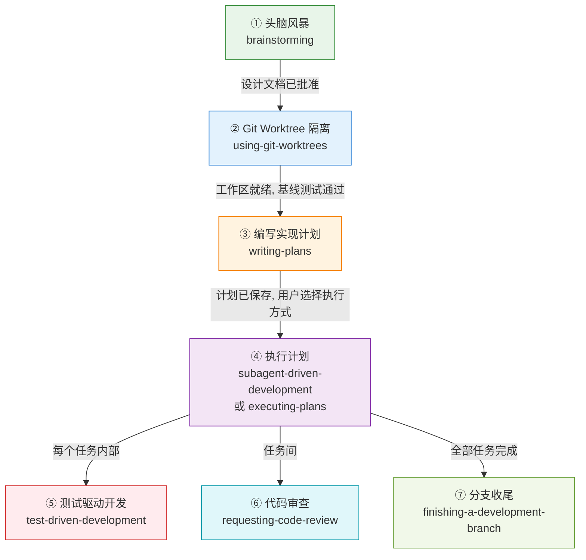
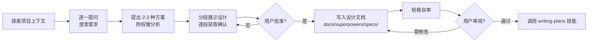
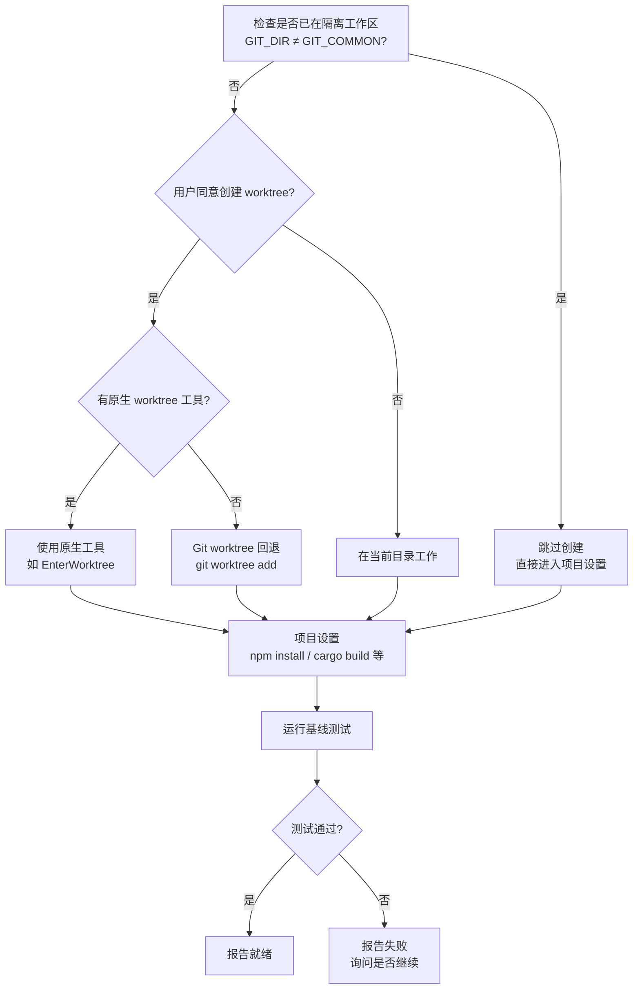
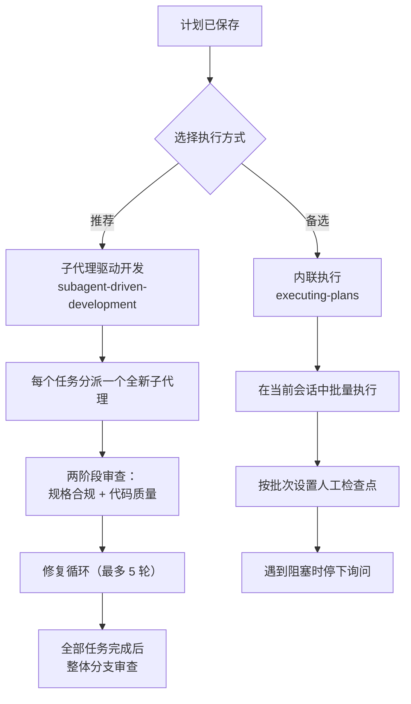
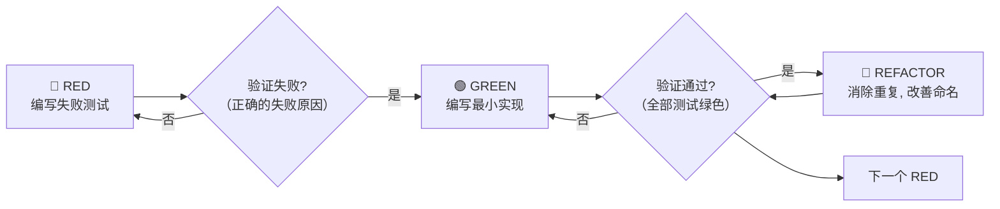
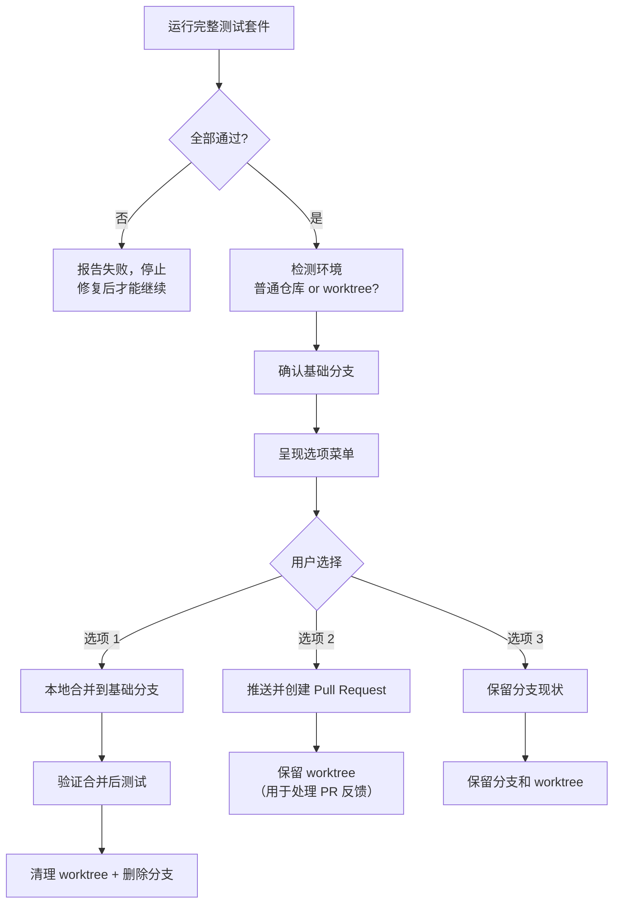
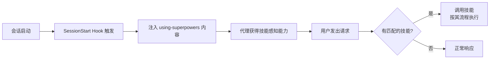

本文档梳理 Superpowers 的核心开发方法论——一条从模糊想法到可交付代码的完整路径。Superpowers 不是一个需要手动调用的工具箱，而是一套**自动触发的强制工作流**：当 AI 编码代理启动会话时，系统通过引导注入机制将技能规则植入上下文，使代理在每一个开发阶段自动遵循正确流程。

理解这七个步骤，是掌握整个 Superpowers 体系的关键入口。

## 全局架构：七步流水线总览

Superpowers 的工作流是一条**有向无环图**（DAG）——每个步骤都有明确的触发条件、输入产出和出口门控。代理不能跳过任何步骤，也不能在未完成当前步骤时进入下一步。



### 七步速查对照表

| 步骤 | 技能名称 | 触发时机 | 核心产出 | 门控条件 |
|------|----------|----------|----------|----------|
| ① | [brainstorming](skills/brainstorming/SKILL.md) | 任何创造性工作之前 | 设计规格文档 | 用户批准设计 |
| ② | [using-git-worktrees](skills/using-git-worktrees/SKILL.md) | 设计批准后 | 隔离工作区 | 基线测试全部通过 |
| ③ | [writing-plans](skills/writing-plans/SKILL.md) | 拥有已批准的设计时 | 实现计划文档 | 计划自检完成，用户选择执行方式 |
| ④ | [subagent-driven-development](skills/subagent-driven-development/SKILL.md) 或 [executing-plans](skills/executing-plans/SKILL.md) | 计划就绪时 | 已实现的代码 | 全部任务完成并通过审查 |
| ⑤ | [test-driven-development](skills/test-driven-development/SKILL.md) | 实现每个功能时（嵌入步骤④内部） | 测试 + 实现代码 | RED-GREEN-REFACTOR 循环完成 |
| ⑥ | [requesting-code-review](skills/requesting-code-review/SKILL.md) | 任务间 / 主要功能完成后 | 审查报告 | 无 Critical/Important 问题 |
| ⑦ | [finishing-a-development-branch](skills/finishing-a-development-branch/SKILL.md) | 全部任务完成时 | 合并/PR/保留分支 | 测试套件全绿 |

Sources: [README.md](README.md#L196-L212), [using-superpowers/SKILL.md](skills/using-superpowers/SKILL.md#L18-L28)

## 步骤①：头脑风暴 — 苏格拉底式协作设计

**核心原则：在写出任何代码之前，先弄清楚你到底要构建什么。**

当你对代理说"让我们做一个 XX"时，代理不会立刻动手写代码。相反，`brainstorming` 技能会**强制拦截**，将对话拉入设计阶段。这是一个硬性门控（HARD-GATE）——无论项目看起来多简单，都必须经过设计流程。

### 内部流程



### 关键约束

- **每条消息只问一个问题**——优先使用选择题而非开放题
- **YAGNI 原则贯穿始终**——从每个方案中无情地砍掉不必要的功能
- **设计文档必须持久化**——保存到 `docs/superpowers/specs/YYYY-MM-DD-<topic>-design.md` 并提交到 Git
- **唯一出口是 `writing-plans`**——不允许调用任何其他实现技能

这个步骤的核心价值在于：它防止代理在理解不充分时就开始编码，避免了"写了三天发现方向错了"的浪费。

Sources: [brainstorming/SKILL.md](skills/brainstorming/SKILL.md#L1-L152)

## 步骤②：Git Worktree 隔离 — 安全的工作空间

**核心原则：检测现有隔离 → 使用原生工具 → 回退到 Git worktree。永远不要与宿主环境对抗。**

设计获批后，代理在动手写代码之前，必须建立一个**隔离的工作空间**。这确保你的主分支不会受到实验性代码的污染。

### 决策流



### 工作区优先级

| 优先级 | 条件 | 行为 |
|--------|------|------|
| 1 | 已在链接 worktree 中 | 跳过创建，直接使用 |
| 2 | 有原生工具（如 `EnterWorktree`） | 使用原生工具 |
| 3 | 存在 `.worktrees/` 目录 | 使用该目录（需验证已被 gitignore） |
| 4 | 存在 `worktrees/` 目录 | 使用该目录 |
| 5 | 以上均不满足 | 默认创建 `.worktrees/` |

Sources: [using-git-worktrees/SKILL.md](skills/using-git-worktrees/SKILL.md#L1-L168)

## 步骤③：编写实现计划 — 零上下文工程师指南

**核心原则：计划要详细到"一个没有项目上下文、品味可疑、不爱写测试的热情初级工程师"也能照做。**

`writing-plans` 技能将设计规格转化为**极度细粒度的实现计划**。每个任务被拆解为 2-5 分钟的单一操作步骤，包含精确的文件路径、完整的代码片段和验证命令。

### 计划文档结构

```
# [功能名] 实现计划

> **目标：** [一句话描述]
> **架构：** [2-3 句话说明方案]
> **技术栈：** [关键技术/库]

## 全局约束
[从规格中逐字复制的项目级要求]

---

### Task 1: [组件名]
**Files:** 精确路径（创建/修改/测试）
**Interfaces:** 消费什么、产出什么（精确签名）
- [ ] Step 1: 编写失败测试（含完整代码）
- [ ] Step 2: 运行测试确认失败
- [ ] Step 3: 编写最小实现代码（含完整代码）
- [ ] Step 4: 运行测试确认通过
- [ ] Step 5: 提交
```

### 零容忍规则

| 禁止出现的占位符 | 正确做法 |
|------------------|----------|
| "TBD"、"TODO"、"稍后实现" | 写出完整内容 |
| "添加适当的错误处理" | 给出具体的错误处理代码 |
| "编写上述代码的测试" | 给出完整的测试代码 |
| "类似于 Task N" | 重复完整代码——工程师可能乱序阅读 |
| 只描述做什么但不展示如何做 | 代码步骤必须包含代码块 |

计划完成后执行**自审**：检查规格覆盖率、占位符扫描、类型一致性。然后提供给用户两种执行选择。

Sources: [writing-plans/SKILL.md](skills/writing-plans/SKILL.md#L1-L169)

## 步骤④：执行计划 — 两条路径，一个目标

计划就绪后，用户选择执行方式。这是整个工作流中**唯一需要用户做架构决策**的节点。

### 路径选择



### 两种路径对比

| 维度 | 子代理驱动开发（推荐） | 内联执行 |
|------|------------------------|----------|
| **上下文隔离** | 每个任务全新子代理，无上下文污染 | 共享当前会话上下文 |
| **审查机制** | 每任务两阶段审查 + 最终整体审查 | 检查点人工审查 |
| **修复能力** | 5 轮自动修复循环，逐步升级模型 | 遇到阻塞停下等人 |
| **适用场景** | 任务相互独立，可自动迭代 | 任务紧密耦合，需人工介入 |
| **自主运行时间** | 可持续数小时不偏离 | 需要更多人工检查 |
| **平台要求** | 需要支持子代理的平台 | 任何平台均可 |

### 子代理驱动开发的核心机制

**任务循环**是步骤④的心脏。每个任务经历以下阶段：

1. **分派实现者** — 将任务简报（brief）文件路径、接口信息和全局约束传递给全新子代理
2. **处理报告** — 实现者返回四种状态之一：`DONE`、`DONE_WITH_CONCERNS`、`NEEDS_CONTEXT`、`BLOCKED`
3. **审查任务** — 分派审查子代理，输入为差异文件（diff file）+ 简报 + 报告
4. **修复循环** — 第 1-3 轮恢复原实现者；第 4-5 轮分派更强模型的全新实现者
5. **断路器** — 第 5 轮仍有未解决问题时，由控制器裁决每个发现

Sources: [subagent-driven-development/SKILL.md](skills/subagent-driven-development/SKILL.md#L1-L200), [executing-plans/SKILL.md](skills/executing-plans/SKILL.md#L1-L65)

## 步骤⑤：测试驱动开发 — 嵌入实现过程的铁律

**核心原则：没有失败的测试，就不写生产代码。违反字面规则就是违反精神规则。**

TDD 不是一个独立阶段，而是**嵌入在步骤④的每个任务内部**持续运行的纪律。无论使用哪条执行路径，每个功能实现都必须遵循 RED-GREEN-REFACTOR 循环。

### RED-GREEN-REFACTOR 循环



### 铁律与红线

| 铁律 | 违反行为 | 后果 |
|------|----------|------|
| **先写失败测试，再写生产代码** | 先写代码再补测试 | 删除代码，从头开始 |
| **必须观察测试失败** | 跳过验证直接写实现 | 你不知道测试是否在测正确的东西 |
| **最小实现原则** | 添加计划外的功能、参数 | YAGNI — 你不需要它 |
| **删除 = 删除** | "保留作为参考"、"改编" | 不允许。删掉就是删掉 |

### 计划中的 TDD 步骤模板

每个计划任务中的步骤已经预编排了 TDD 循环：

| 步骤 | 动作 | 预期结果 |
|------|------|----------|
| Step 1 | 编写失败测试（含完整代码） | 测试文件已创建 |
| Step 2 | 运行测试 | FAIL — 因为功能缺失（不是因为拼写错误） |
| Step 3 | 编写最小实现代码（含完整代码） | 实现文件已创建/修改 |
| Step 4 | 运行测试 | PASS — 全部测试绿色 |
| Step 5 | 提交 | Git commit 记录 |

Sources: [test-driven-development/SKILL.md](skills/test-driven-development/SKILL.md#L1-L321)

## 步骤⑥：代码审查 — 任务间的质量门控

**核心原则：早审查，勤审查。审查子代理获取的是精心构建的上下文，而不是你的会话历史。**

代码审查在两个层面发生：**任务间审查**（每个任务完成后）和**最终整体审查**（全部任务完成后）。审查通过分派独立的审查子代理执行，确保审查者不受实现过程的偏见影响。

### 审查触发时机

| 场景 | 是否必须 |
|------|----------|
| 子代理开发中每个任务完成后 | ✅ 必须 |
| 完成主要功能后 | ✅ 必须 |
| 合并到主分支前 | ✅ 必须 |
| 卡住时需要新视角 | 可选但推荐 |
| 重构前的基线检查 | 可选但推荐 |

### 审查反馈处理

| 严重级别 | 处理方式 |
|----------|----------|
| **Critical（严重）** | 立即修复，阻塞后续工作 |
| **Important（重要）** | 继续前必须修复 |
| **Minor（次要）** | 记录到进度台账，最终审查时分类处理 |

### 常见误区

| 借口 | 现实 |
|------|------|
| "我自己看看差异就行了" | 你是协调者——内联审查会消耗你驱动工作所需的上下文窗口 |
| "审查者需要我的完整会话历史" | 传递精心构建的上下文，而不是会话历史 |
| "太简单了不用审查" | 简单的东西也会出错 |

Sources: [requesting-code-review/SKILL.md](skills/requesting-code-review/SKILL.md#L1-L96)

## 步骤⑦：分支收尾 — 合并、PR 或保留

**核心原则：验证测试 → 检测环境 → 呈现选项 → 执行选择 → 清理工作区。**

当所有任务完成且通过审查后，`finishing-a-development-branch` 技能接管。它不会假设用户想要什么——而是呈现一个**固定菜单**，将集成决策权交给你。

### 收尾决策流



### 选项菜单

| 选项 | 合并 | 推送 | 保留 Worktree | 清理分支 |
|------|------|------|---------------|----------|
| 1. 本地合并 | ✅ | — | — | ✅ |
| 2. 创建 PR | — | ✅ | ✅ | — |
| 3. 保持现状 | — | — | ✅ | — |

> **注意**：丢弃工作只在用户**明确要求**时才会发生，且需要输入精确的 `discard` 确认词。代理永远不会主动建议丢弃。

Sources: [finishing-a-development-branch/SKILL.md](skills/finishing-a-development-branch/SKILL.md#L1-L202)

## 工作流的引擎：自动触发机制

这七个步骤之所以能自动运行，依赖于 Superpowers 的**引导注入机制**。当会话启动时，`SessionStart` hook 将 `using-superpowers` 技能的内容注入代理的上下文，建立一条铁律：

> **在执行任何操作之前——包括澄清问题、浏览代码库、检查文件——必须先调用相关技能。**



这意味着你不需要记住调用哪个技能、在什么顺序下调用。系统会自动在正确的时机触发正确的流程。你只需要专注于描述你想构建什么。

Sources: [hooks/session-start](hooks/session-start#L1-L50), [hooks/hooks.json](hooks/hooks.json#L1-L18), [using-superpowers/SKILL.md](skills/using-superpowers/SKILL.md#L33-L51)

## 贯穿全程的横切关注点

除了七个主步骤，还有两个技能**在所有步骤中持续生效**：

### 完成前验证（verification-before-completion）

**铁律：没有新鲜的验证证据，就不能声称工作已完成。**

| 声称 | 需要的证据 | 不够的证据 |
|------|-----------|-----------|
| 测试通过 | 测试命令输出：0 失败 | 之前的运行结果、"应该能通过" |
| 构建成功 | 构建命令：exit 0 | Linter 通过、日志看起来没问题 |
| Bug 已修复 | 原始症状的测试：通过 | 代码已修改、假设已修复 |

### 并行代理调度（dispatching-parallel-agents）

当面对多个独立问题时（如 3 个不同测试文件失败），系统会**为每个问题域分派一个代理**并发处理，而非串行浪费时间。

Sources: [verification-before-completion/SKILL.md](skills/verification-before-completion/SKILL.md#L1-L121), [dispatching-parallel-agents/SKILL.md](skills/dispatching-parallel-agents/SKILL.md#L1-L168)

## 下一步阅读

你现在已经理解了 Superpowers 的完整工作流骨架。建议按以下顺序深入每个环节：

1. **理解技能如何自动工作** → [技能（Skill）机制：自动触发与行为塑造原理](5-ji-neng-skill-ji-zhi-zi-dong-hong-fa-yu-xing-wei-su-zao-yuan-li)
2. **深入设计阶段** → [头脑风暴：苏格拉底式协作设计](6-tou-nao-feng-bao-su-ge-la-di-shi-xie-zuo-she-ji)
3. **深入计划阶段** → [编写实现计划：零上下文工程师指南](7-bian-xie-shi-xian-ji-hua-ling-shang-xia-wen-gong-cheng-shi-zhi-nan)
4. **深入执行阶段** → [子代理驱动开发：任务分派、两阶段审查与修复循环](9-zi-dai-li-qu-dong-kai-fa-ren-wu-fen-pai-liang-jie-duan-shen-cha-yu-xiu-fu-xun-huan)
5. **理解设计哲学** → [设计哲学：TDD、系统化与证据优先](4-she-ji-zhe-xue-tdd-xi-tong-hua-yu-zheng-ju-you-xian)