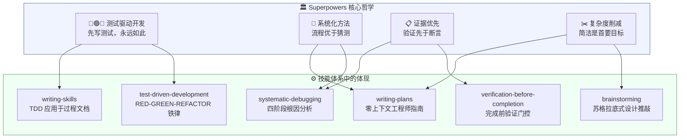
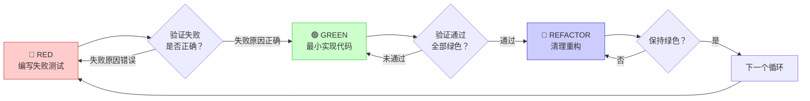
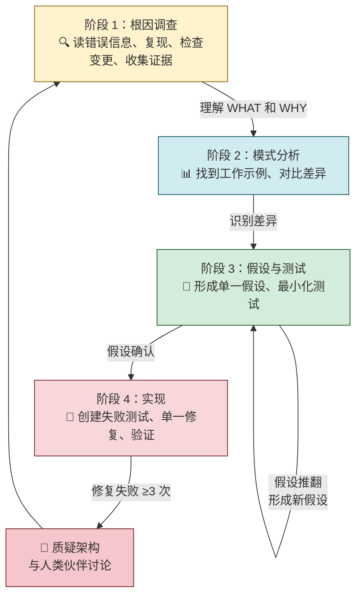
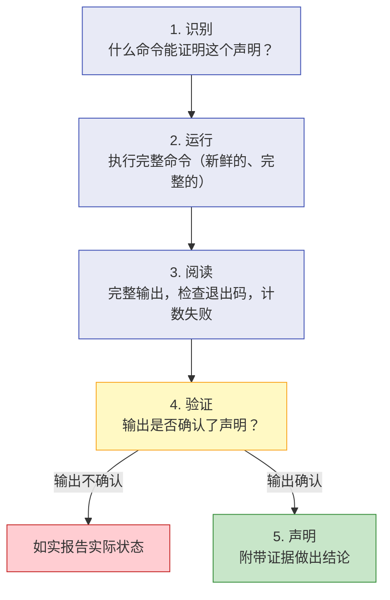
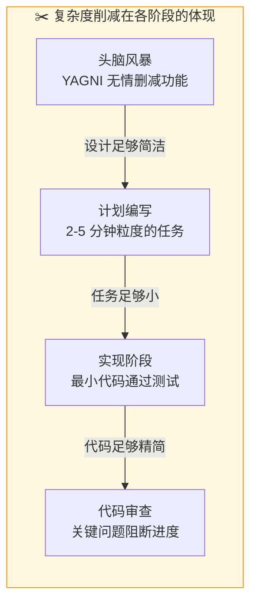
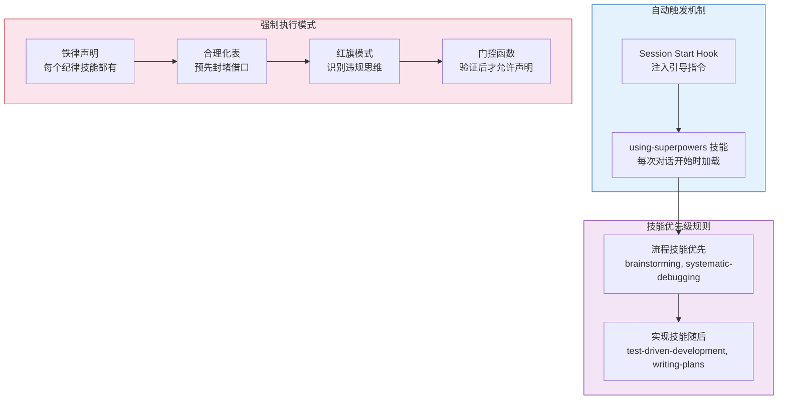

Superpowers 不仅仅是一组 AI 编码技能的集合——它是一套**完整的软件开发方法论**，建立在三个不可动摇的核心原则之上。理解这些原则，是理解整个系统为何如此运作的关键。本章将带你深入 Superpowers 的设计哲学，帮助你理解每一个技能背后的「为什么」。



## 四大支柱：从 README 到代码

Superpowers 在 [README.md](README.md#L240-L246) 中明确列出了四条设计哲学：

| 哲学原则 | 英文原文 | 核心含义 |
|----------|---------|---------|
| **测试驱动开发** | Test-Driven Development — Write tests first, always | 任何生产代码之前必须有失败的测试 |
| **系统化优于随意** | Systematic over ad-hoc — Process over guessing | 用流程替代猜测，用方法替代直觉 |
| **复杂度削减** | Complexity reduction — Simplicity as primary goal | 简洁是首要设计目标，YAGNI 原则 |
| **证据优于断言** | Evidence over claims — Verify before declaring success | 运行验证命令，用输出证明结论 |

这四条原则并非独立的口号，而是相互咬合的齿轮——它们共同驱动着 Superpowers 中每一个技能的设计与运作。

Sources: [README.md](README.md#L240-L246)

## 第一支柱：TDD——超越测试的方法论

### 铁律：没有失败的测试，就没有生产代码

TDD 在 Superpowers 中的地位远超「一种测试策略」。它是一条**铁律**（Iron Law），被写入了多个技能的核心：

```
NO PRODUCTION CODE WITHOUT A FAILING TEST FIRST
```

这条规则没有例外。如果你在测试之前写了代码？**删除它。从头来过。** 不要保留作为「参考」，不要「改编」它，不要看它。删除就是删除。

这个严格程度来自一个深刻的认知：**如果你没有看到测试失败，你就不知道它是否在测试正确的东西。**



### RED-GREEN-REFACTOR 循环的严格性

TDD 技能中定义的循环（[SKILL.md](skills/test-driven-development/SKILL.md#L47-L69)）要求每个阶段都必须**显式验证**：

| 阶段 | 必须做什么 | 必须验证什么 |
|------|-----------|-------------|
| **RED** | 编写一个最小测试，展示期望行为 | 测试失败（不是报错），失败原因是功能缺失 |
| **GREEN** | 编写最简单的代码让测试通过 | 测试通过，其他测试仍然通过，输出无错误 |
| **REFACTOR** | 去除重复，改善命名 | 所有测试保持绿色，不添加新行为 |

关键细节：每个验证步骤都标注为 **MANDATORY（强制）**，永远不可跳过。

Sources: [SKILL.md](skills/test-driven-development/SKILL.md#L31-L45)

### TDD 的自反性：应用于过程文档本身

Superpowers 最具独创性的设计之一是：**TDD 不仅用于代码，还用于技能文档本身的编写**。

在 [writing-skills/SKILL.md](skills/writing-skills/SKILL.md#L10-L14) 中明确写道：

> **Writing skills IS Test-Driven Development applied to process documentation.**

这意味着创建新技能的过程完全映射了 TDD 循环：

| TDD 概念 | 技能创建中的对应 |
|----------|----------------|
| 测试用例 | 用子代理运行的压力场景 |
| 生产代码 | 技能文档（SKILL.md） |
| 测试失败（RED） | 没有技能时，代理违反规则（基线） |
| 测试通过（GREEN） | 有了技能后，代理遵守规则 |
| 重构 | 堵住漏洞，同时保持合规 |

如果你没有看到一个代理在没有技能的情况下失败，你就不知道这个技能是否教了正确的东西。

Sources: [SKILL.md](skills/writing-skills/SKILL.md#L10-L46), [testing-skills-with-subagents.md](skills/writing-skills/testing-skills-with-subagents.md#L1-L42)

## 第二支柱：系统化——流程优于猜测

### 四阶段调试法：不允许跳过的流程

系统化哲学的最集中体现是 [systematic-debugging](skills/systematic-debugging/SKILL.md) 技能。它的铁律同样毫不妥协：

```
NO FIXES WITHOUT ROOT CAUSE INVESTIGATION FIRST
```

如果你没有完成第一阶段（根因调查），你就**不能**提出修复方案。这条规则在以下情况尤其重要：

- 时间紧迫时（紧急情况让猜测变得诱人）
- 「快速修复」看起来很明显时
- 你已经尝试了多次修复时



### 纵深防御：让 Bug 在结构上不可能

系统化方法的另一个关键体现是**纵深防御**（Defense-in-Depth）策略。当你修复一个由无效数据引起的 Bug 时，不要只在一个地方添加验证——在数据经过的**每一层**都添加验证：

| 层级 | 目的 | 示例 |
|------|------|------|
| **第 1 层：入口验证** | 在 API 边界拒绝明显无效的输入 | `createProject()` 验证目录非空、存在、可写 |
| **第 2 层：业务逻辑验证** | 确保数据对当前操作有意义 | `initializeWorkspace()` 验证 projectDir 非空 |
| **第 3 层：环境守卫** | 在特定上下文中阻止危险操作 | 测试环境下拒绝在临时目录外执行 `git init` |
| **第 4 层：调试埋点** | 为事后分析捕获上下文 | 在危险操作前记录堆栈跟踪 |

单一验证说的是「我们修复了 Bug」；多层验证说的是「我们让 Bug **不可能**再发生」。

Sources: [defense-in-depth.md](skills/systematic-debugging/defense-in-depth.md#L1-L123), [root-cause-tracing.md](skills/systematic-debugging/root-cause-tracing.md#L1-L170)

### 条件等待：用证据替代猜测

条件等待（Condition-Based Waiting）是系统化哲学的又一个缩影。核心原则：**等待你真正关心的条件，而不是猜测它需要多长时间。**

```typescript
// ❌ 之前：猜测时间
await new Promise(r => setTimeout(r, 50));
const result = getResult();
expect(result).toBeDefined();

// ✅ 之后：等待条件
await waitFor(() => getResult() !== undefined);
const result = getResult();
expect(result).toBeDefined();
```

这不是一个编码技巧——它是一种思维方式的体现：**用可观测的证据替代主观的猜测**。

Sources: [condition-based-waiting.md](skills/systematic-debugging/condition-based-waiting.md#L1-L50)

## 第三支柱：证据优先——验证先于断言

### 完成前验证门控

[verification-before-completion](skills/verification-before-completion/SKILL.md) 技能可能是 Superpowers 中最具防御性的设计。它的铁律：

```
NO COMPLETION CLAIMS WITHOUT FRESH VERIFICATION EVIDENCE
```

如果你没有在当前消息中运行验证命令，你就**不能**声称它通过了。

这个门控函数要求在任何完成声明之前执行五个步骤：



### 证据优先的具体要求

| 声明 | 需要什么证据 | 什么不够 |
|------|------------|---------|
| 测试通过 | 测试命令输出：0 失败 | 之前的运行结果、「应该通过」 |
| Linter 干净 | Linter 输出：0 错误 | 部分检查、推断 |
| 构建成功 | 构建命令：exit 0 | Linter 通过、日志看起来好 |
| Bug 已修复 | 测试原始症状：通过 | 代码已更改、假设已修复 |
| 代理完成 | VCS diff 显示变更 | 代理报告「成功」 |

注意最后一行——即使是子代理的成功报告也不能直接信任，必须独立验证。这体现了 Superpowers 对「证据」的极致追求：**任何二手信息都不算证据**。

Sources: [SKILL.md](skills/verification-before-completion/SKILL.md#L1-L121)

## 第四支柱：复杂度削减——YAGNI 贯穿始终

### 从设计到实现的简洁性约束

复杂度削减原则在多个技能中以不同形式体现：

**在头脑风暴中**——YAGNI（You Aren't Gonna Need It）被无情地应用于每个方案设计。[brainstorming/SKILL.md](skills/brainstorming/SKILL.md#L80) 明确要求：「YAGNI ruthlessly — remove unnecessary features from every approach and design.」

**在计划编写中**——每个任务被限制为 2-5 分钟的单一动作。计划假设执行者是「一个有热情但品味不佳、没有判断力、没有项目上下文、且厌恶测试的初级工程师」。这种极端假设迫使计划编写者消除所有隐含知识，将复杂度降到最低。

**在 TDD 中**——GREEN 阶段要求写「最简单的代码让测试通过」。不要添加功能，不要重构其他代码，不要超出测试范围进行「改进」。



Sources: [brainstorming/SKILL.md](skills/brainstorming/SKILL.md#L80), [writing-plans/SKILL.md](skills/writing-plans/SKILL.md#L46-L52), [SKILL.md](skills/test-driven-development/SKILL.md#L130-L167)

## 反合理化：对抗 AI 代理的自我欺骗

Superpowers 设计中最独特的一个模式是**反合理化表**（Rationalization Tables）。这些表格预见并预先反驳了 AI 代理可能用来绕过规则的所有借口。

以 TDD 技能中的合理化表为例：

| 借口 | 现实 |
|------|------|
| 「太简单不需要测试」 | 简单代码也会出错。测试只需 30 秒。 |
| 「我之后再测试」 | 后写的测试立即通过——这什么也没证明。 |
| 「已经手动测试过了」 | 手动测试是临时的：没有覆盖记录，无法重新运行。 |
| 「删除 X 小时的工作太浪费」 | 沉没成本谬误——保留你无法信任的代码才是浪费。 |
| 「TDD 会拖慢我」 | TDD **就是**务实的路径：在提交前捕获 Bug，防止回归。 |

这种设计的深层洞察是：**AI 代理和人类一样，会在压力下合理化地绕过规则**。Superpowers 不是简单地告诉代理「要做什么」，而是预先封堵了所有「为什么不做的借口」。

这个模式贯穿所有纪律性技能——TDD、系统化调试、完成前验证都有各自的合理化表。

Sources: [SKILL.md](skills/test-driven-development/SKILL.md#L212-L244), [SKILL.md](skills/systematic-debugging/SKILL.md#L244-L256), [SKILL.md](skills/verification-before-completion/SKILL.md#L61-L73)

## 红旗模式：何时必须停下来

三个核心技能都定义了**红旗**（Red Flags）——当你发现自己有以下想法时，必须立即停止当前行为，回到正确的流程：

| 技能 | 红旗思维 | 正确做法 |
|------|---------|---------|
| **TDD** | 「就这一次跳过 TDD」 | 那是合理化。删除代码，从头用 TDD。 |
| **TDD** | 「先探索一下再写测试」 | 可以探索。然后丢弃探索代码，用 TDD 重新开始。 |
| **调试** | 「先快速修一下，之后再调查」 | 第一次修复就设定了模式。从一开始就做对。 |
| **调试** | 「我不完全理解但这可能有效」 | 停下来。回到阶段 1。 |
| **验证** | 「应该可以了」 | 运行验证命令。 |
| **验证** | 「我有信心」 | 信心 ≠ 证据。 |

Sources: [SKILL.md](skills/test-driven-development/SKILL.md#L228-L244), [SKILL.md](skills/systematic-debugging/SKILL.md#L214-L231), [SKILL.md](skills/verification-before-completion/SKILL.md#L50-L59)

## 哲学如何塑造技能系统

这些哲学原则不仅体现在单个技能中，还决定了整个技能系统的架构方式：



**关键设计决策**：技能是**自动触发**的，不是可选的建议。[using-superpowers/SKILL.md](skills/using-superpowers/SKILL.md#L10-L16) 中用 `<EXTREMELY-IMPORTANT>` 标签强调：「如果一个技能适用于你的任务，你没有选择权。你必须使用它。」

这意味着哲学原则的执行不依赖于代理的「自觉性」——系统通过自动触发、优先级排序和门控函数来**强制执行**这些原则。

Sources: [SKILL.md](skills/using-superpowers/SKILL.md#L1-L63), [README.md](README.md#L212)

## 测试体系：哲学的一致性验证

Superpowers 的测试体系本身也反映了其设计哲学。如 [docs/testing.md](docs/testing.md#L1-L36) 所述，测试分为两个截然不同的类别：

| 测试类型 | 目录 | 验证什么 | 方法论 |
|----------|------|---------|--------|
| **插件测试** | `tests/` | 插件的非 LLM 代码是否工作 | Bash + Node + Python 集成测试 |
| **技能行为评估** | `evals/` | 代理在真实 LLM 会话中是否行为正确 | Python 工具驱动真实 tmux 会话，LLM 验证器评判合规性 |

这种双层测试结构体现了「证据优先」原则：不仅测试代码是否运行正确，还测试代理是否**行为**正确——用真实的 LLM 会话作为证据。

Sources: [testing.md](docs/testing.md#L1-L36)

## 总结：一个自洽的方法论体系

Superpowers 的设计哲学不是四条独立的规则，而是一个**自洽的方法论体系**：

- **TDD** 提供了「先证明失败，再实现成功」的认知框架
- **系统化** 提供了「流程优于直觉」的行为模式
- **证据优先** 提供了「运行验证，而非声称成功」的质量门控
- **复杂度削减** 提供了「简洁即正确」的设计方向

这四个原则通过铁律声明、合理化表、红旗模式和门控函数形成了一个闭环系统——它们不仅告诉代理「做什么」，还预先封堵了「为什么不做」的所有借口，并在每个关键节点设置了强制验证。

## 推荐阅读路径

如果你已经理解了 Superpowers 的设计哲学，下一步可以深入了解这些哲学如何具体落地：

1. **了解技能如何自动触发** → [技能（Skill）机制：自动触发与行为塑造原理](5-ji-neng-skill-ji-zhi-zi-dong-hong-fa-yu-xing-wei-su-zao-yuan-li)
2. **深入 TDD 铁律** → [测试驱动开发：RED-GREEN-REFACTOR 铁律](12-ce-shi-qu-dong-kai-fa-red-green-refactor-tie-lu)
3. **掌握系统化调试** → [系统化调试：四阶段根因分析法](13-xi-tong-hua-diao-shi-si-jie-duan-gen-yin-fen-xi-fa)
4. **理解证据门控** → [完成前验证：证据先于断言](15-wan-cheng-qian-yan-zheng-zheng-ju-xian-yu-duan-yan)
5. **了解哲学如何应用于技能编写** → [编写新技能：将 TDD 应用于过程文档](22-bian-xie-xin-ji-neng-jiang-tdd-ying-yong-yu-guo-cheng-wen-dang)