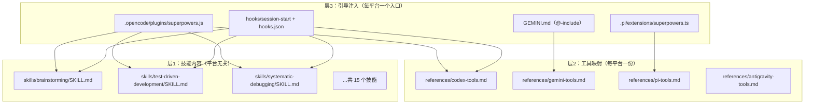
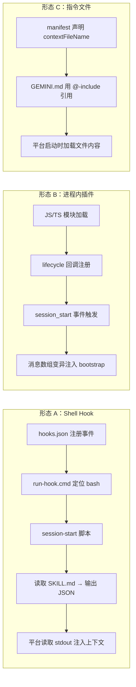
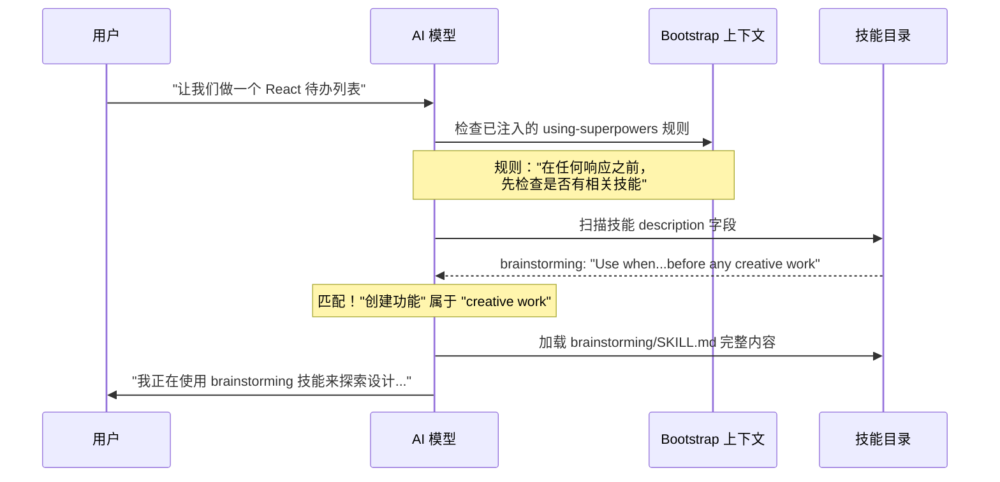
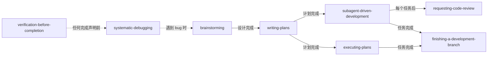

本文深入剖析 Superpowers 技能系统的内部运作机制——从技能文件的物理结构，到会话启动时的引导注入，再到代理行为的运行时塑造。理解这些原理，是有效使用、编写和调试技能的前提。

## 核心架构：三层模型

Superpowers 的设计遵循一个关键洞察：**技能内容与平台适配完全解耦**。同一套 `skills/` 目录下的 Markdown 文件，在 Claude Code、Codex、Gemini CLI、Cursor、OpenCode、Pi 等六个平台上无修改运行。这依赖三个正交层次：



**层1** 是纯内容——所有技能以 `SKILL.md` 文件形式存在，用自然语言描述动作（"调度子代理"、"读取文件"），从不提及任何特定平台的工具名。**层2** 是翻译表——将抽象动作映射到具体工具调用。**层3** 是启动引擎——确保每次会话开始时，模型都知道技能系统的存在并遵循其规则。

Sources: [docs/porting-to-a-new-harness.md](docs/porting-to-a-new-harness.md#L1-L100), [skills/using-superpowers/SKILL.md](skills/using-superpowers/SKILL.md#L1-L63)

## 技能文件的物理结构

每个技能是一个目录，包含一个必需的 `SKILL.md` 和可选的辅助文件：

```
skills/
  brainstorming/
    SKILL.md              ← 主文件（必需）
    visual-companion.md   ← 辅助参考
    scripts/              ← 可执行工具
  test-driven-development/
    SKILL.md              ← 自包含，无辅助文件
    writing-good-tests.md ← 补充参考
```

### YAML 前置元数据

每个 `SKILL.md` 以 YAML 前置元数据开头，包含两个必填字段：

```yaml
---
name: systematic-debugging
description: Use when encountering any bug, test failure, or unexpected behavior, before proposing fixes
---
```

| 字段 | 约束 | 作用 |
|------|------|------|
| `name` | 仅字母、数字、连字符；最长 1024 字符（含 description） | 技能的唯一标识符，用于跨引用（如 `superpowers:systematic-debugging`） |
| `description` | 以 "Use when..." 开头；第三人称；仅描述**触发条件**，不描述流程 | 代理据此判断是否加载该技能——这是自动触发的核心 |

`description` 字段的设计是精心调优的结果。测试表明，当 description 包含流程摘要时，代理会走捷径——直接按摘要执行而不读取完整技能内容。例如，`description: Use when executing plans - dispatches subagent per task with code review between tasks` 导致代理只做一次审查，而技能流程图要求两阶段审查。将 description 改为纯触发条件后，代理正确读取了完整流程图。

Sources: [skills/writing-skills/SKILL.md](skills/writing-skills/SKILL.md#L86-L160), [skills/systematic-debugging/SKILL.md](skills/systematic-debugging/SKILL.md#L1-L5)

### 技能正文的行为塑造模式

技能正文不是普通文档——它是**塑造代理行为的可执行规范**。项目维护者将其视为"经过精心调优的行为塑造代码"（[CLAUDE.md](CLAUDE.md#L100-L106)）。每个技能遵循一致的结构模式：

| 结构元素 | 目的 | 示例 |
|----------|------|------|
| **Iron Law（铁律）** | 不可违反的核心规则，用代码块强调 | `NO PRODUCTION CODE WITHOUT A FAILING TEST FIRST` |
| **Red Flags 表** | 列出代理可能产生的合理化借口及其反驳 | `"This is just a simple question"` → `Questions are tasks. Check for skills.` |
| **Checklist（检查清单）** | 强制按序执行的步骤列表 | brainstorming 的 9 步清单 |
| **流程图（Graphviz dot）** | 非显而易见的决策点和循环 | TDD 的 RED-GREEN-REFACTOR 循环图 |
| **HARD-GATE 标记** | 阻止代理跳过关键步骤 | `<HARD-GATE>Do NOT invoke any implementation skill...until design approved</HARD-GATE>` |

Sources: [skills/test-driven-development/SKILL.md](skills/test-driven-development/SKILL.md#L1-L80), [skills/brainstorming/SKILL.md](skills/brainstorming/SKILL.md#L1-L152), [skills/using-superpowers/SKILL.md](skills/using-superpowers/SKILL.md#L25-L55)

## 引导注入：技能系统的启动引擎

技能文件存在于磁盘上但**完全 inert（惰性）**——除非在每次会话开始时将 `using-superpowers` 技能注入模型的上下文。这个引导过程是整个集成的核心。

### 引导注入的内容

所有平台注入的内容本质相同：

```
<EXTREMELY_IMPORTANT>
You have superpowers.

[using-superpowers/SKILL.md 的完整内容]

[平台特定的工具映射表]
</EXTREMELY_IMPORTANT>
```

`<EXTREMELY_IMPORTANT>` 标签是关键——它告诉模型这些指令具有最高优先级。注入的内容教会模型两件事：

1. **技能系统的存在**：模型知道自己拥有技能，并应在行动前检查相关技能
2. **技能优先规则**：在任何响应之前（包括澄清问题），先检查并调用相关技能

Sources: [hooks/session-start](hooks/session-start#L1-L50), [skills/using-superpowers/SKILL.md](skills/using-superpowers/SKILL.md#L14-L25)

### 三种集成形态

不同平台提供不同的会话启动注入机制，Superpowers 适配了三种结构形态：



| 形态 | 机制 | 参考实现 | 适用平台 |
|------|------|----------|----------|
| **A：Shell Hook** | 会话启动时执行 shell 命令，读取 stdout 的 JSON | `hooks/session-start` + `hooks/hooks.json` | Claude Code, Cursor, Copilot CLI |
| **B：进程内插件** | JS/TS 模块暴露生命周期回调，在代码中变异消息数组 | `.opencode/plugins/superpowers.js`, `.pi/extensions/superpowers.ts` | OpenCode, Pi |
| **C：指令文件** | 扩展自带的上下文文件，由 manifest 声明 | `gemini-extension.json` + `GEMINI.md` | Gemini CLI |

**形态 A 的细节**：`hooks/session-start` 脚本读取 `using-superpowers/SKILL.md`，将其转义为 JSON 安全字符串，然后根据平台环境变量输出不同格式的 JSON。Claude Code 需要 `hookSpecificOutput.additionalContext`，Cursor 需要 `additional_context`，Copilot CLI 需要 `additionalContext`。

**形态 B 的细节**：OpenCode 插件通过 `experimental.chat.messages.transform` 钩子将 bootstrap 插入第一条用户消息的头部。Pi 扩展通过 `context` 事件回调实现类似效果，并在 `agent_end` 后重置注入标志。

**形态 C 的细节**：Gemini 的 `gemini-extension.json` 声明 `contextFileName: "GEMINI.md"`，该文件使用 `@`-include 语法引用 bootstrap 技能和工具映射文件。

Sources: [hooks/session-start](hooks/session-start#L28-L50), [hooks/hooks.json](hooks/hooks.json#L1-L18), [hooks/hooks-cursor.json](hooks/hooks-cursor.json#L1-L11), [.opencode/plugins/superpowers.js](.opencode/plugins/superpowers.js#L90-L140), [.pi/extensions/superpowers.ts](.pi/extensions/superpowers.ts#L20-L60), [GEMINI.md](GEMINI.md#L1-L3), [gemini-extension.json](gemini-extension.json#L1-L7)

### 跨平台 Polyglot Hook 包装器

Windows 支持需要特殊处理。`hooks/run-hook.cmd` 是一个**多语言混合脚本**（polyglot）——同一段代码在 cmd.exe 中被解释为批处理命令，在 bash 中被解释为 shell 脚本：

- **Windows 路径**：cmd.exe 执行批处理部分，搜索 Git for Windows 的 bash.exe，然后调用目标脚本
- **Unix 路径**：`: ` 在 bash 中是空操作（no-op），脚本直接 `exec bash` 执行目标

这种设计避免了文件扩展名问题——Claude Code 的 Windows 自动检测会对 `.sh` 文件自动添加 `bash` 前缀，因此 hook 脚本使用无扩展名文件名。

Sources: [hooks/run-hook.cmd](hooks/run-hook.cmd#L1-L47)

## 自动触发机制：从用户意图到技能加载

自动触发是 Superpowers 最核心的行为模式。其运作不依赖正则匹配或关键词路由——而是通过**引导注入建立的元规则**驱动模型自主决策。

### 触发链路



触发过程分为三个阶段：

**阶段一：元规则激活**。引导注入的 `using-superpowers` 技能建立了一条不可协商的元规则——"在任何响应或行动之前调用相关技能"。这条规则附带一张"红旗表"（Red Flags），预先反驳代理可能产生的跳过技能的借口。

**阶段二：Description 匹配**。模型扫描所有可用技能的 `description` 字段，寻找与当前任务匹配的触发条件。这就是为什么 description 必须精确描述触发症状而非流程摘要。

**阶段三：完整加载与执行**。匹配后，模型加载完整的 `SKILL.md` 内容并遵循其指令——包括检查清单、流程图、铁律等所有行为塑造元素。

Sources: [skills/using-superpowers/SKILL.md](skills/using-superpowers/SKILL.md#L14-L63), [CLAUDE.md](CLAUDE.md#L84-L94)

### 技能优先级与链式调用

当多个技能同时适用时，`using-superpowers` 定义了明确的优先级规则：

| 优先级 | 技能类型 | 示例 |
|--------|----------|------|
| **最高** | 流程技能（Process Skills） | brainstorming, systematic-debugging |
| **次高** | 实现技能（Implementation Skills） | test-driven-development, writing-plans |
| **基础** | 质量保障技能 | verification-before-completion, requesting-code-review |

技能之间存在**链式调用**关系，形成开发工作流的有向图：



关键约束：brainstorming 的**唯一**出口是 writing-plans——不允许直接跳转到实现技能。这种确定性链式结构防止代理跳过设计阶段。

Sources: [skills/brainstorming/SKILL.md](skills/brainstorming/SKILL.md#L130-L152), [skills/using-superpowers/SKILL.md](skills/using-superpowers/SKILL.md#L27-L38), [skills/subagent-driven-development/SKILL.md](skills/subagent-driven-development/SKILL.md#L1-L80)

## 工具映射：抽象动作到具体调用

技能正文使用抽象动作词汇（"调度子代理"、"创建待办"），不提及任何具体工具名。每个平台需要一个映射层将这些动作翻译为实际的工具调用。

| 抽象动作 | Claude Code | Gemini CLI | OpenCode | Pi | Antigravity |
|----------|-------------|------------|----------|----|-------------|
| 调度子代理 | `Task` | `invoke_agent` | `task` | 无原生支持 | `invoke_subagent` |
| 创建待办 | `TodoWrite` | `write_todos` | `todowrite` | 文件回退 | Task artifact |
| 读取文件 | `Read` | `read_file` | `read` | `read` | `read_file` |
| 调用技能 | `Skill` | `activate_skill` | `skill` | 原生 skill 系统 | — |
| 运行命令 | `Bash` | `run_shell_command` | `bash` | `bash` | `run_shell_command` |

映射信息通过两种方式传递：
1. **引用文件**：`skills/using-superpowers/references/<harness>-tools.md` 提供完整的映射表
2. **引导内联**：在 bootstrap 注入时直接嵌入精简版映射

Sources: [skills/using-superpowers/references/gemini-tools.md](skills/using-superpowers/references/gemini-tools.md#L1-L50), [skills/using-superpowers/references/codex-tools.md](skills/using-superpowers/references/codex-tools.md#L1-L40), [skills/using-superpowers/references/antigravity-tools.md](skills/using-superpowers/references/antigravity-tools.md#L1-L24), [.opencode/plugins/superpowers.js](.opencode/plugins/superpowers.js#L55-L70)

## 技能发现优化（SDO）

技能的 `description` 字段不仅是元数据——它是代理的**搜索索引**。技能发现优化（Skill Discovery Optimization）确保代理能在正确的时刻找到正确的技能。

### 发现工作流

代理发现技能遵循以下路径：

1. **遇到问题**（"测试不稳定"）
2. **扫描 description**（grep 匹配触发条件关键词）
3. **找到 SKILL**（description 匹配症状）
4. **扫描 Overview**（是否相关？）
5. **读取 Quick Reference**（快速参考表）
6. **加载示例**（仅在实现时）

### Description 设计原则

| 原则 | 正确示例 | 错误示例 |
|------|----------|----------|
| 以 "Use when..." 开头 | `Use when tests have race conditions, timing dependencies` | `For async testing` |
| 描述问题而非工具 | `Use when tests pass/fail inconsistently` | `Use when tests use setTimeout` |
| 仅描述触发条件 | `Use when implementing any feature, before writing code` | `Use for TDD - write test first, watch it fail, refactor` |
| 第三人称 | `Use when encountering any bug` | `I can help with bugs` |
| 包含搜索关键词 | 错误消息、症状词、工具名 | 抽象术语 |

Sources: [skills/writing-skills/SKILL.md](skills/writing-skills/SKILL.md#L86-L200), [skills/writing-skills/SKILL.md](skills/writing-skills/SKILL.md#L600-L680)

## 全部技能清单与触发条件

以下是 Superpowers 包含的 15 个技能及其精确触发条件：

| 技能名称 | 触发条件（description 摘要） | 类别 |
|----------|------------------------------|------|
| `using-superpowers` | 每次会话开始时——建立技能查找与使用规则 | 引导 |
| `brainstorming` | 任何创造性工作之前——创建功能、构建组件、修改行为 | 设计 |
| `writing-plans` | 有规格或需求用于多步骤任务时，在写代码之前 | 设计 |
| `test-driven-development` | 实现任何功能或修复 bug 时，在写实现代码之前 | 执行 |
| `subagent-driven-development` | 执行包含独立任务的实现计划时 | 执行 |
| `executing-plans` | 有书面实现计划需要在单独会话中执行时 | 执行 |
| `dispatching-parallel-agents` | 面对 2+ 个可并行处理的独立任务时 | 执行 |
| `systematic-debugging` | 遇到任何 bug、测试失败或意外行为时，在提出修复之前 | 质量 |
| `verification-before-completion` | 即将声称工作完成之前，需要运行验证命令 | 质量 |
| `requesting-code-review` | 完成任务、实现主要功能或合并前 | 质量 |
| `receiving-code-review` | 收到代码审查反馈时，在实施建议之前 | 质量 |
| `using-git-worktrees` | 开始需要隔离的功能工作时 | 基础设施 |
| `finishing-a-development-branch` | 实现完成、所有测试通过后，需要决定如何集成时 | 基础设施 |
| `writing-skills` | 创建新技能、编辑现有技能或验证技能时 | 元技能 |

Sources: [skills/](skills/) 目录下各 `SKILL.md` 的 frontmatter

## 行为塑造的心理学基础

Superpowers 的技能不是被动的参考文档——它们使用经过验证的说服心理学原理来塑造代理行为。这些技术包括：

**权威锚定**：`<EXTREMELY_IMPORTANT>` 和 `<HARD-GATE>` 标签建立不可协商的权威层级。

**承诺一致性**：检查清单（Checklist）要求代理逐项创建任务并标记完成，利用"已投入 N 步，不能跳过"的承诺效应。

**合理化预反驳**：红旗表预先列举代理可能产生的每个借口并提供反驳。这消除了代理在压力下"谈判"的空间。

**精神与文字统一**：`Violating the letter of the rules is violating the spirit of the rules` 这一基础原则切断了整类"我在遵循精神"的合理化论证。

Sources: [skills/writing-skills/SKILL.md](skills/writing-skills/SKILL.md#L460-L560), [skills/writing-skills/persuasion-principles.md](skills/writing-skills/persuasion-principles.md), [skills/using-superpowers/SKILL.md](skills/using-superpowers/SKILL.md#L39-L55)

## 平台插件清单

每个平台通过各自的 manifest 文件声明插件元数据和集成配置：

| 平台 | Manifest 文件 | 技能发现 | Hook 配置 |
|------|---------------|----------|-----------|
| Claude Code | `.claude-plugin/plugin.json` | 自动发现 `skills/` | 自动发现 `hooks/hooks.json` |
| Cursor | `.cursor-plugin/plugin.json` | `"skills": "./skills/"` | `"hooks": "./hooks/hooks-cursor.json"` |
| Codex | `.codex-plugin/plugin.json` | `"skills": "./skills/"` | `"hooks": {}`（抑制 hook 自动发现） |
| Gemini | `gemini-extension.json` | 通过 `GEMINI.md` @-include | `contextFileName` 声明 |
| OpenCode | `.opencode/plugins/superpowers.js` | 通过 config hook 注入路径 | 消息变换钩子 |
| Pi | `.pi/extensions/superpowers.ts` | `resources_discover` 事件 | `context` 事件回调 |
| Kimi | `.kimi-plugin/plugin.json` | `"skills": "./skills/"` | `sessionStart.skill` 声明 |

Sources: [.claude-plugin/plugin.json](.claude-plugin/plugin.json#L1-L21), [.cursor-plugin/plugin.json](.cursor-plugin/plugin.json#L1-L24), [.codex-plugin/plugin.json](.codex-plugin/plugin.json#L1-L49), [gemini-extension.json](gemini-extension.json#L1-L7), [.kimi-plugin/plugin.json](.kimi-plugin/plugin.json#L1-L39), [package.json](package.json#L1-L24)

## 阅读路径建议

本页建立了技能系统的架构基础。建议按以下顺序深入：

1. **理解设计哲学** → [设计哲学：TDD、系统化与证据优先](4-she-ji-zhe-xue-tdd-xi-tong-hua-yu-zheng-ju-you-xian)
2. **体验核心技能** → [头脑风暴：苏格拉底式协作设计](6-tou-nao-feng-bao-su-ge-la-di-shi-xie-zuo-she-ji) — 最常用的入口技能
3. **理解跨平台机制** → [跨平台架构：技能、工具映射与引导注入三层模型](18-kua-ping-tai-jia-gou-ji-neng-gong-ju-ying-she-yu-yin-dao-zhu-ru-san-ceng-mo-xing)
4. **学习编写技能** → [编写新技能：将 TDD 应用于过程文档](22-bian-xie-xin-ji-neng-jiang-tdd-ying-yong-yu-guo-cheng-wen-dang)
5. **理解引导注入细节** → [引导注入机制：SessionStart Hook 与消息变换](19-yin-dao-zhu-ru-ji-zhi-sessionstart-hook-yu-xiao-xi-bian-huan)