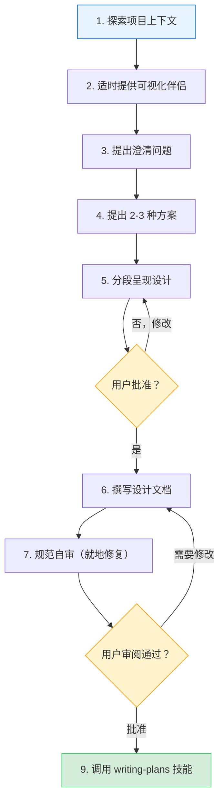
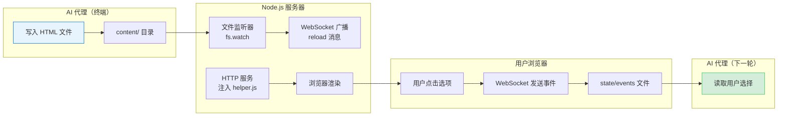
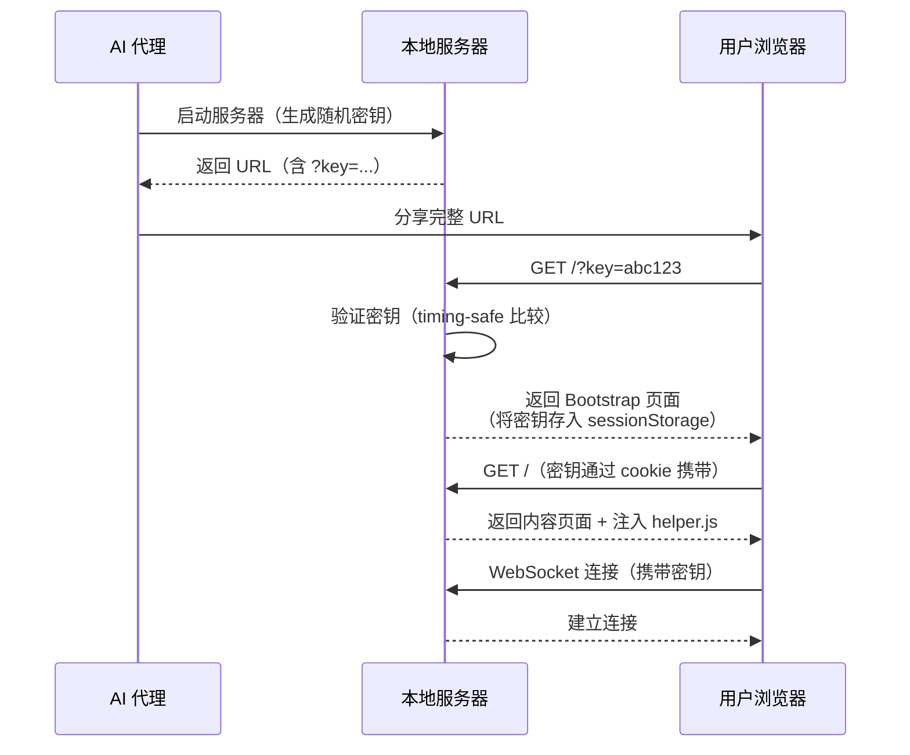
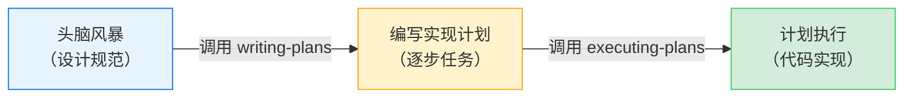

本页详细解析 Superpowers 项目中的**头脑风暴（Brainstorming）技能**——一个将模糊想法转化为可执行设计规范的苏格拉底式协作流程。无论你是第一次使用 AI 辅助开发，还是希望理解这套方法论的内在逻辑，本文都将从原理到实现逐层展开。

---

## 为什么需要"先设计再编码"？

在 AI 辅助开发中，最常见的失败模式不是代码写错了，而是**从一开始就构建了错误的东西**。当用户说"帮我做一个 XX"时，AI 代理往往急于动手——创建文件、搭建脚手架、编写代码。但未经审视的假设会在后续造成大量返工。

头脑风暴技能的核心信念是：**每个项目都需要设计阶段，无论它看起来多简单**。一个待办列表、一个单函数工具、一次配置变更——全部如此。"简单"项目恰恰是未经审视的假设造成最多浪费的地方。

该技能通过一个**硬门禁（Hard Gate）**来强制执行这一原则：

> 在你呈现设计方案并获得用户批准之前，**不得**调用任何实现技能、编写任何代码、搭建任何项目。这适用于**每一个项目**，无论其感知上多么简单。

Sources: [SKILL.md](skills/brainstorming/SKILL.md#L14-L20)

---

## 核心工作流：九步检查清单

头脑风暴技能定义了一个严格的九步检查清单，每一步都必须按顺序完成。这不是建议，而是**强制流程**：

| 步骤 | 名称 | 核心动作 |
|------|------|----------|
| 1 | 探索项目上下文 | 检查文件、文档、近期提交 |
| 2 | 适时提供可视化伴侣 | 仅在某个问题"展示比描述更清楚"时才提供 |
| 3 | 提出澄清问题 | 每次一个，理解目的/约束/成功标准 |
| 4 | 提出 2-3 种方案 | 附带权衡分析和推荐意见 |
| 5 | 分段呈现设计 | 按复杂度缩放每个章节，逐段获取用户批准 |
| 6 | 撰写设计文档 | 保存到 `docs/superpowers/specs/YYYY-MM-DD-<topic>-design.md` 并提交 |
| 7 | 规范自审 | 检查占位符、矛盾、歧义、范围 |
| 8 | 用户审阅书面规范 | 等待用户确认后才继续 |
| 9 | 过渡到实现 | 调用 [编写实现计划](7-bian-xie-shi-xian-ji-hua-ling-shang-xia-wen-gong-cheng-shi-zhi-nan) 技能 |

Sources: [SKILL.md](skills/brainstorming/SKILL.md#L26-L36)

这个流程可以用以下有向图来理解其分支逻辑：



**终态是调用 writing-plans 技能。** 头脑风暴之后**唯一**可以调用的技能就是 writing-plans，不得调用前端设计、MCP 构建器或任何其他实现技能。

Sources: [SKILL.md](skills/brainstorming/SKILL.md#L52-L56)

---

## 苏格拉底式对话：提问的艺术

### 一次一个问题

头脑风暴的核心方法是**苏格拉底式提问**——通过一系列精心设计的问题引导用户从模糊想法走向清晰设计。关键规则：

- **每条消息只问一个问题**——如果一个主题需要更多探索，将其拆分为多个问题
- **优先使用选择题**，但开放式问题也可以接受
- 聚焦于理解：**目的、约束、成功标准**

### 范围评估优先

在深入细节问题之前，代理首先需要评估范围。如果请求描述了多个独立子系统（例如"构建一个包含聊天、文件存储、计费和分析的平台"），应**立即标记**。不要在需要先行分解的项目上浪费问题来打磨细节。

对于过大的项目，流程变为：
1. 帮助用户分解为子项目：独立的部分是什么？它们如何关联？构建顺序是什么？
2. 每个子项目获得自己的 **规范 → 计划 → 实现** 流程
3. 先对第一个子项目走正常的设计流程

Sources: [SKILL.md](skills/brainstorming/SKILL.md#L60-L73)

### 方案探索与 YAGNI 原则

当代理对需求有了足够理解后，需要提出 **2-3 种不同方案**，并附带权衡分析：

- 以**推荐方案**开头，解释推荐理由
- 以对话方式呈现选项，而非干巴巴的列表
- **无情地执行 YAGNI**（You Aren't Gonna Need It）——从每个方案和设计中去掉不必要的功能

Sources: [SKILL.md](skills/brainstorming/SKILL.md#L78-L83)

### 设计隔离原则

设计中强调将系统拆分为更小的单元，每个单元：
- 有一个**明确的单一目的**
- 通过**定义良好的接口**通信
- 可以**独立理解和测试**

对于每个单元，代理必须能回答：它做什么？如何使用它？它依赖什么？

Sources: [SKILL.md](skills/brainstorming/SKILL.md#L93-L100)

---

## 可视化伴侣系统

头脑风暴技能包含一个**浏览器端的可视化伴侣**——这不是一个独立模式，而是一个按需调用的工具。它允许代理在对话过程中向用户展示原型图、布局对比、架构图等视觉内容。

### 何时提供：即时触发，而非预先提供

一个关键设计决策是：**不要一开始就提供可视化伴侣**。等待到某个问题"展示比描述更清楚"时，才作为独立消息提供：

> "下一个问题如果我展示给你看可能更直观——我可以在浏览器标签页中制作原型图、图表和对比。它还是新功能，可能会消耗较多 token。要我打开吗？"

这个提供**必须是独立消息**——不包含其他澄清问题、总结或内容。

Sources: [SKILL.md](skills/brainstorming/SKILL.md#L117-L125)

### 逐问题决策

即使用户接受了可视化伴侣，代理仍需**对每个问题单独判断**是使用浏览器还是终端：

| 使用浏览器 | 使用终端 |
|-----------|---------|
| UI 原型图、线框图、布局对比 | 需求与范围问题 |
| 架构图、系统组件关系图 | 概念性 A/B/C 选择 |
| 并排视觉对比（两种配色、两种布局） | 权衡列表、 pros/cons |
| 空间关系（状态机、流程图、实体关系） | 技术决策（API 设计、数据建模） |

**判断标准：用户通过"看"能比通过"读"更好地理解吗？** 一个关于 UI 话题的问题不自动成为视觉问题。"这个场景中'个性化'是什么意思？"是概念问题——用终端。"哪种向导布局更好？"是视觉问题——用浏览器。

Sources: [visual-companion.md](skills/brainstorming/visual-companion.md#L5-L28)

### 可视化伴侣架构

可视化伴侣的技术架构是一个精巧的零依赖本地服务器系统：



**核心组件：**

| 组件 | 文件 | 职责 |
|------|------|------|
| 服务器核心 | [server.cjs](skills/brainstorming/scripts/server.cjs#L1-L724) | 零依赖 HTTP + WebSocket 服务器，监听文件变化并推送更新 |
| 客户端助手 | [helper.js](skills/brainstorming/scripts/helper.js#L1-L168) | 浏览器端 WebSocket 连接、事件捕获、自动重连 |
| 框架模板 | [frame-template.html](skills/brainstorming/scripts/frame-template.html#L1-L214) | CSS 主题、布局组件、交互基础设施 |
| 启动脚本 | [start-server.sh](skills/brainstorming/scripts/start-server.sh#L1-L210) | 会话管理、端口分配、跨平台后台运行 |
| 停止脚本 | [stop-server.sh](skills/brainstorming/scripts/stop-server.sh#L1-L121) | 优雅关闭、PID 验证、临时文件清理 |

Sources: [visual-companion.md](skills/brainstorming/visual-companion.md#L30-L60)

### 内容片段 vs 完整文档

代理写入的 HTML 有两种模式：

- **内容片段**（推荐）：只写内容部分，服务器自动包裹框架模板——添加头部、CSS 主题、连接状态和所有交互基础设施
- **完整文档**：以 `<!DOCTYPE` 或 `<html` 开头，服务器原样提供（仅注入 helper.js）

框架模板提供丰富的预定义 CSS 类：

| CSS 类 | 用途 | 典型场景 |
|--------|------|----------|
| `.options` + `.option` | A/B/C 选择题 | 方案对比、布局选择 |
| `.cards` + `.card` | 卡片式视觉设计展示 | 原型图、组件设计 |
| `.mockup` | 模拟容器（带标题栏） | UI 预览 |
| `.split` | 并排对比视图 | 两种设计方案对比 |
| `.pros-cons` | 优缺点双栏 | 方案权衡分析 |
| `.mock-nav` / `.mock-sidebar` / `.mock-button` | 线框图构建块 | 快速布局原型 |

Sources: [visual-companion.md](skills/brainstorming/visual-companion.md#L80-L160)

### 交互事件循环

当用户在浏览器中点击选项时，交互事件被记录到 `state/events` 文件：

```jsonl
{"type":"click","choice":"a","text":"Option A - Simple Layout","timestamp":1706000101}
{"type":"click","choice":"c","text":"Option C - Complex Grid","timestamp":1706000108}
{"type":"click","choice":"b","text":"Option B - Hybrid","timestamp":1706000115}
```

完整的事件流展示了用户的探索路径——他们可能在最终确定之前点击多个选项。最后一个 `choice` 事件通常是最终选择，但点击模式可以揭示犹豫或偏好。

Sources: [visual-companion.md](skills/brainstorming/visual-companion.md#L240-L260)

---

## 安全模型：会话密钥认证

可视化伴侣服务器运行在本地回环地址上，这意味着**任何本地浏览器标签页**都可以访问它。当绑定到非回环地址时（远程/容器化环境），任何能路由到它的主机都可以访问。因此，一个**每会话密钥**机制被用来保护所有端点。

### 认证流程



安全机制的关键设计：

| 安全措施 | 实现方式 | 防御目标 |
|----------|----------|----------|
| 会话密钥 | 32 字节随机 hex，通过 `?key=` 或 cookie 传递 | 防止未授权访问 |
| 时序安全比较 | `crypto.timingSafeEqual()` | 防止时序攻击 |
| Bootstrap 页面 | 密钥 URL 返回 JS 页面，将密钥存入 sessionStorage 后跳转到裸 URL | 防止密钥泄露到浏览器历史 |
| HttpOnly Cookie | `SameSite=Strict` | 防止跨站请求伪造 |
| 安全响应头 | `X-Frame-Options: DENY`, `CSP: frame-ancestors 'none'`, `Referrer-Policy: no-referrer` | 防止点击劫持和信息泄露 |
| WebSocket Origin 检查 | 验证 Origin 与 Host 匹配 | 防止跨域 WebSocket 注入 |

Sources: [server.cjs](skills/brainstorming/scripts/server.cjs#L280-L380), [auth.test.js](tests/brainstorm-server/auth.test.js#L1-L50)

---

## 服务器生命周期管理

### 启动与端口策略

服务器采用智能端口选择策略：

1. 优先使用环境变量 `BRAINSTORM_PORT` 指定的端口
2. 其次使用上次会话绑定的端口（通过端口文件持久化），使已打开的浏览器标签页可以重连
3. 最后使用随机高端口（49152-65534）

如果首选端口被占用（`EADDRINUSE`），服务器会**自动回退到随机端口一次**，而不是直接失败。

Sources: [server.cjs](skills/brainstorming/scripts/server.cjs#L85-L105)

### 自动关闭机制

服务器有两个自动关闭触发器：

- **所有者进程监控**：定期检查启动它的代理进程是否还活着。如果代理退出，服务器自动关闭
- **空闲超时**：默认 4 小时无活动后自动关闭（可通过 `--idle-timeout-minutes` 配置）

关闭时会优雅地关闭所有 WebSocket 连接、删除 `server-info` 文件、写入 `server-stopped` 标记。

Sources: [server.cjs](skills/brainstorming/scripts/server.cjs#L620-L660)

### 跨平台适配

启动脚本针对不同平台做了特殊处理：

| 平台 | 行为 |
|------|------|
| **Claude Code** | 默认模式，脚本自动后台化 |
| **Windows / Git Bash** | 自动检测并切换到前台模式（因为 Windows 会杀死后台进程） |
| **Codex** | 检测 `CODEX_CI` 环境变量，自动切换到前台模式 |
| **Gemini CLI** | 使用 `--foreground` 配合 `is_background: true` |
| **远程/容器环境** | 使用 `--host 0.0.0.0 --url-host localhost` 绑定非回环地址 |

Sources: [start-server.sh](skills/brainstorming/scripts/start-server.sh#L60-L100)

---

## 规范自审与用户审阅

### 四维度自审

设计文档写入后，代理需要以"新鲜的眼光"进行自审，检查四个维度：

| 维度 | 检查内容 | 修复方式 |
|------|----------|----------|
| **占位符扫描** | TBD、TODO、不完整章节、模糊需求 | 就地修复 |
| **内部一致性** | 章节间是否矛盾？架构描述与功能描述是否匹配？ | 就地修复 |
| **范围检查** | 是否足够聚焦，可以放入单个实现计划？ | 必要时分解 |
| **歧义检查** | 是否有需求可以被两种不同方式解读？ | 选定一种并明确写出 |

修复后无需重新审阅——直接修复并继续。

Sources: [SKILL.md](skills/brainstorming/SKILL.md#L130-L140)

### 子代理审阅模板

对于更严格的质量保证，项目提供了一个**规范文档审阅子代理模板**。该子代理按照以下标准评估规范：

| 类别 | 检查内容 |
|------|----------|
| 完整性 | TODO、占位符、"TBD"、不完整章节 |
| 一致性 | 内部矛盾、冲突的需求 |
| 清晰度 | 模糊到可能导致构建错误产品的需求 |
| 范围 | 是否足够聚焦，可以放入单个计划 |
| YAGNI | 未被请求的功能、过度工程 |

审阅者的校准标准是：**只标记会在实现计划阶段造成实际问题的事项**。措辞改进、风格偏好不属于阻塞问题。

Sources: [spec-document-reviewer-prompt.md](skills/brainstorming/spec-document-reviewer-prompt.md#L1-L50)

---

## 在已有代码库中工作

头脑风暴技能对在已有代码库中工作有明确的指导：

1. **先探索当前结构**，再提出变更——遵循已有模式
2. 当现有代码存在影响当前工作的问题时（如文件过大、边界不清、职责纠缠），将**有针对性的改进**纳入设计
3. **不要提议无关的重构**——保持聚焦于服务当前目标

Sources: [SKILL.md](skills/brainstorming/SKILL.md#L102-L110)

---

## 从设计到实现的桥梁

头脑风暴技能的**唯一出口**是调用 [编写实现计划](7-bian-xie-shi-xian-ji-hua-ling-shang-xia-wen-gong-cheng-shi-zhi-nan) 技能。这个技能会将批准的设计规范转化为详细的、逐步的实现计划——假设执行的工程师对代码库零上下文。



这个严格的链式调用确保了：**设计不会被跳过，计划不会被省略，实现不会偏离规范。**

---

## 阅读路径建议

如果你正在理解 Superpowers 的完整开发方法论，建议按以下顺序阅读：

1. **前置知识**：[核心工作流：从构思到交付的七步流程](3-he-xin-gong-zuo-liu-cong-gou-si-dao-jiao-fu-de-qi-bu-liu-cheng) — 了解头脑风暴在整个流程中的位置
2. **当前页面**：你正在阅读的内容 — 深入理解设计阶段的原理与机制
3. **下一步**：[编写实现计划：零上下文工程师指南](7-bian-xie-shi-xian-ji-hua-ling-shang-xia-wen-gong-cheng-shi-zhi-nan) — 理解设计规范如何转化为可执行计划
4. **可视化深入**：[可视化伴侣：浏览器端原型与图表协作](8-ke-shi-hua-ban-lu-liu-lan-qi-duan-yuan-xing-yu-tu-biao-xie-zuo) — 可视化伴侣系统的更详细技术文档
5. **质量保证**：[技能编写与测试](22-bian-xie-xin-ji-neng-jiang-tdd-ying-yong-yu-guo-cheng-wen-dang) — 了解这类技能本身是如何被开发和测试的