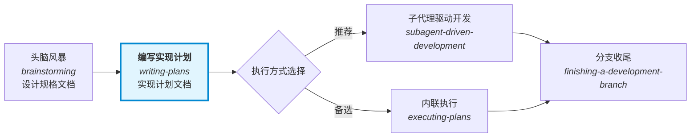
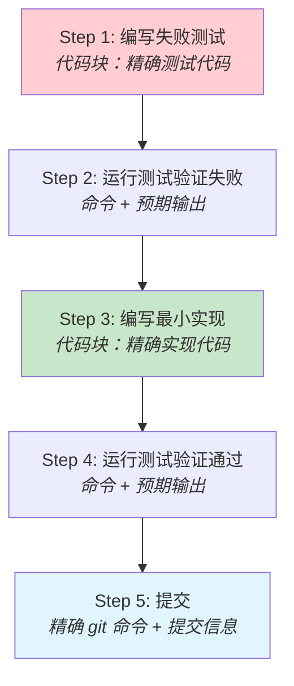
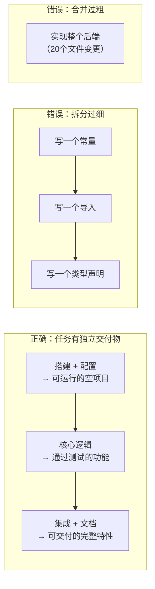
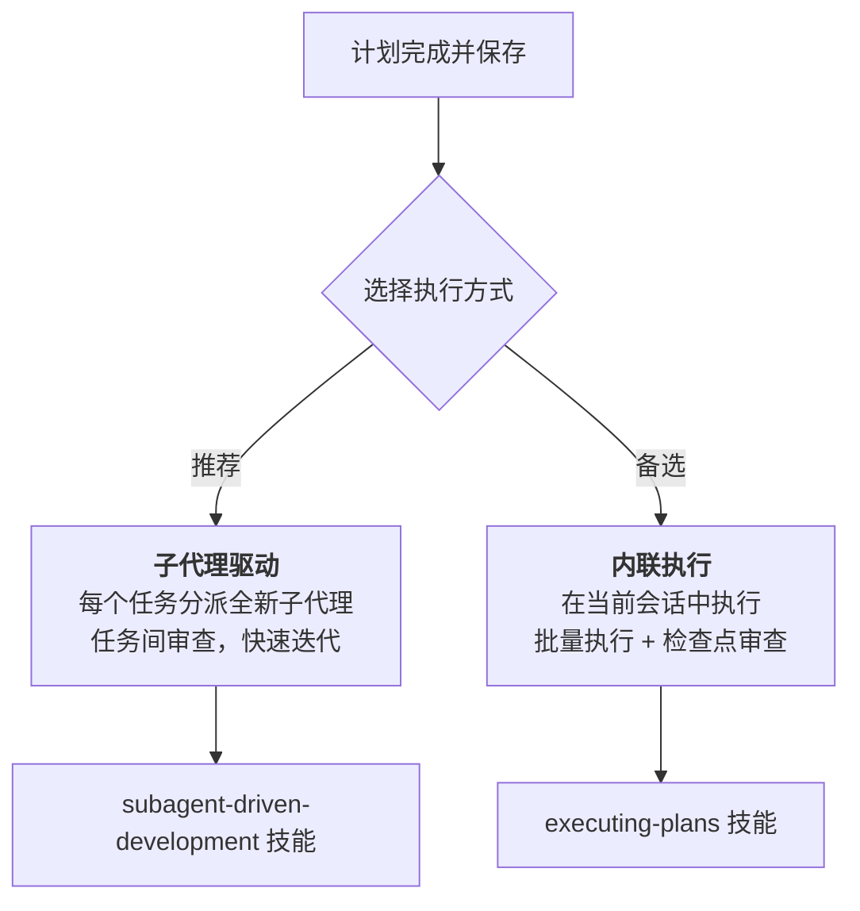

本文档深入解析 Superpowers 项目中 `writing-plans` 技能的设计哲学、文档结构与质量保障机制。该技能是将设计规格（spec）转化为可执行实现计划的核心桥梁——其产出文档必须让一个对项目毫无了解的工程师（或子代理）能够独立、正确地完成每一个开发任务。

## 在工作流中的定位

`writing-plans` 不是孤立存在的技能，而是 Superpowers 核心工作流中承上启下的关键节点。它接收头脑风暴阶段的产出（设计规格文档），并为下游的执行阶段提供精确的施工蓝图。



这个位置决定了一个核心约束：**计划文档必须是自包含的**。下游的子代理以隔离上下文启动——它们只看到自己被分派的那一个任务，而非整个会话历史。如果计划中有任何隐含假设或未声明的接口，执行者就会卡住或产出错误代码。

Sources: [SKILL.md](skills/writing-plans/SKILL.md#L1-L19), [brainstorming/SKILL.md](skills/brainstorming/SKILL.md#L129-L132)

## 核心设计哲学：零上下文假设

计划的目标读者被精确定义为：**一个技能熟练但对当前代码库几乎一无所知的开发者，且在测试设计方面品味存疑**。

这个假设驱动了三个设计决策：

**完全自包含**。每个任务必须携带执行所需的全部信息——文件路径、代码片段、测试命令、预期输出。不允许出现"类似任务 N"这样的引用，因为执行者可能乱序阅读任务。

**显式接口声明**。任务之间通过 `Interfaces` 块连接——Consumes 声明依赖前序任务的哪些精确签名，Produces 声明后续任务将依赖的函数名、参数类型和返回值。这是跨任务类型一致性的唯一保障。

**TDD 步骤内嵌**。每个任务的标准步骤序列遵循 RED-GREEN-REFACTOR 铁律：写失败测试 → 验证失败 → 写最小实现 → 验证通过 → 提交。这不仅是开发方法论，更是对"测试品味存疑"读者的保护机制。

Sources: [SKILL.md](skills/writing-plans/SKILL.md#L10-L12), [SKILL.md](skills/writing-plans/SKILL.md#L46-L53)

## 计划文档解剖

一份合格的实现计划由五个结构层组成，每层解决不同的信息需求：

### 文档头：全局上下文

```markdown
# [Feature Name] Implementation Plan

> **For agentic workers:** REQUIRED SUB-SKILL: Use
> superpowers:subagent-driven-development (recommended) or
> superpowers:executing-plans to implement this plan task-by-task.

**Goal:** [一句话描述构建目标]
**Architecture:** [2-3 句话描述技术方案]
**Tech Stack:** [关键技术/库]

## Global Constraints
[项目级约束——版本下限、依赖限制、命名规则、平台要求]
```

文档头解决的是"我们在做什么、为什么这样做、有什么限制"。`Global Constraints` 块的内容从设计规格中逐字复制，每个任务的 requirements 隐式继承这些约束。

Sources: [SKILL.md](skills/writing-plans/SKILL.md#L54-L77)

### 文件结构图：分解决策的锁定

在定义任何任务之前，计划必须先映射出所有将被创建或修改的文件及其职责。这是分解决策被固化的位置：

| 原则 | 含义 |
|------|------|
| **单一职责** | 每个文件有且仅有一个存在的理由 |
| **按职责拆分** | 而非按技术层拆分——共同变更的文件应共处一地 |
| **小文件优先** | 代理对能一次放入上下文的代码推理效果最佳 |
| **尊重既有模式** | 在现有代码库中遵循已有惯例，不单方面重构 |

Sources: [SKILL.md](skills/writing-plans/SKILL.md#L26-L34)

### 任务结构：可独立交付的最小单元

每个任务是一个完整的交付闭环——携带自己的测试周期，且值得一次独立审查门控。任务结构的标准模板如下：

````markdown
### Task N: [Component Name]

**Files:**
- Create: `exact/path/to/file.py`
- Modify: `exact/path/to/existing.py:123-145`
- Test: `tests/exact/path/to/test.py`

**Interfaces:**
- Consumes: [本任务使用前序任务的什么——精确签名]
- Produces: [后续任务依赖的——函数名、参数与返回类型]

- [ ] **Step 1: Write the failing test**
- [ ] **Step 2: Run test to verify it fails**
- [ ] **Step 3: Write minimal implementation**
- [ ] **Step 4: Run test to verify it passes**
- [ ] **Step 5: Commit**
````

`Interfaces` 块是跨任务通信的唯一通道。一个任务的实现者只看到自己的任务文本——这个块告诉他们相邻任务使用的名称和类型。

Sources: [SKILL.md](skills/writing-plans/SKILL.md#L79-L126)

### 步骤粒度：2-5 分钟的原子操作

计划中的每个步骤是一个可在 2-5 分钟内完成的单一动作。这不是建议，而是硬性约束——因为执行者可能是上下文窗口有限的子代理。



Sources: [SKILL.md](skills/writing-plans/SKILL.md#L46-L53)

## 零容忍规则：禁止占位符

计划中最危险的敌人是模糊性。以下模式被明确定义为**计划失败**——永远不允许出现在计划文档中：

| 禁止模式 | 为什么有害 | 正确做法 |
|----------|-----------|---------|
| `"TBD"`, `"TODO"`, `"implement later"` | 执行者无信息可执行 | 提供完整内容 |
| `"Add appropriate error handling"` | "适当"是主观判断 | 写出具体的错误处理代码 |
| `"Write tests for the above"` | 没有给出测试代码 | 提供精确的测试代码块 |
| `"Similar to Task N"` | 执行者可能乱序阅读 | 重复完整代码 |
| 描述做什么但不展示怎么做 | 缺少代码块的代码步骤 | 每个代码步骤必须有代码块 |
| 引用未在任何任务中定义的类型/函数 | 类型不一致导致编译失败 | 所有接口在 Interfaces 块中声明 |

这条规则的底层逻辑是：**计划中的模糊性在执行时不会消失，只会转化为错误代码或阻塞**。

Sources: [SKILL.md](skills/writing-plans/SKILL.md#L128-L137)

## 任务右尺寸化

任务边界划定是一门精度艺术。核心标准是：**任务是能携带自己测试周期的最小单元，且值得一次新审查者的门控**。



折叠规则：搭建、配置、脚手架和文档步骤应**折叠进其交付物需要它们的任务中**。只有当审查者能有意义地拒绝一个任务而批准其邻居时，才进行拆分。

Sources: [SKILL.md](skills/writing-plans/SKILL.md#L37-L44)

## 质量保障：双重验证机制

### 第一层：自审清单

计划写完后，作者必须以"新鲜的眼光"对照规格文档执行三项检查：

| 检查项 | 方法 | 修复策略 |
|--------|------|---------|
| **规格覆盖** | 逐条扫描规格的每个需求，指向实现它的任务 | 发现缺口则添加任务 |
| **占位符扫描** | 搜索"禁止占位符"部分列出的所有红旗模式 | 就地修复 |
| **类型一致性** | 检查后续任务中的类型、方法签名、属性名是否与前面定义的一致 | 就地修复——`clearLayers()` 与 `clearFullLayers()` 不一致就是 bug |

自审是计划作者自己运行的检查清单，不是子代理分派。发现问题直接修复，无需重新审查。

Sources: [SKILL.md](skills/writing-plans/SKILL.md#L139-L148)

### 第二层：计划文档审查子代理

对于需要额外验证的场景，可以分派一个独立的计划文档审查子代理。审查者验证四个维度：

| 维度 | 审查内容 |
|------|---------|
| **完整性** | TODO、占位符、不完整任务、缺失步骤 |
| **规格对齐** | 计划覆盖规格需求，无重大范围蔓延 |
| **任务分解** | 任务有清晰边界，步骤可操作 |
| **可构建性** | 工程师能否按此计划执行而不卡住？ |

审查者的校准标准至关重要：**只标记会在实现过程中造成真实问题的事项**。措辞偏好和改进建议不阻塞批准——缺失需求、矛盾步骤、占位符内容或模糊到无法执行的任务才会。

Sources: [plan-document-reviewer-prompt.md](skills/writing-plans/plan-document-reviewer-prompt.md#L1-L50)

## 执行交接

计划保存后，提供两种执行路径选择：



**子代理驱动**（推荐）：每个任务启动一个隔离上下文的子代理，任务间进行两阶段审查（规格合规 + 代码质量），适合任务大部分独立的场景。

**内联执行**：在当前会话中按批次执行任务，设置检查点供人工审查，适合需要紧密协调的场景。

Sources: [SKILL.md](skills/writing-plans/SKILL.md#L150-L169)

## 实战案例：从零依赖服务器计划

以仓库中的 `2026-03-11-zero-dep-brainstorm-server.md` 计划为例，可以看到上述原则的完整应用：

| 结构要素 | 实际表现 |
|----------|---------|
| **文档头** | 目标一句话（替换 vendored node_modules 为零依赖 server.js）、架构两句话（WebSocket 协议 + HTTP 服务器 + 文件监听）、技术栈精确（Node.js 内置模块列表） |
| **文件地图** | 精确到行号——Create `server.js`、Modify `start-server.sh:94,100`、Delete 整个 `node_modules/`（714 个文件） |
| **任务分解** | 3 个任务按功能层分块：WebSocket 协议层 → HTTP 服务器 + 应用逻辑 → 交换与清理 |
| **步骤粒度** | 每个步骤包含完整代码块——如 `encodeFrame` 函数的三种长度编码实现全部展开 |
| **接口声明** | Task 1 的 `module.exports = { computeAcceptKey, encodeFrame, decodeFrame, OPCODES }` 是后续任务的 Consumes 来源 |
| **无占位符** | 480 行计划中无一处 "TBD" 或 "implement later" |

Sources: [2026-03-11-zero-dep-brainstorm-server.md](docs/superpowers/plans/2026-03-11-zero-dep-brainstorm-server.md#L1-L480)

## 范围检查：何时拆分计划

如果设计规格覆盖多个独立子系统，应在头脑风暴阶段就拆分为子项目规格。如果遗漏了这一步，`writing-plans` 技能要求在开始编写前建议拆分——每个计划应独立产出可运行、可测试的软件。

判断标准：**一个计划中的任务是否全部服务于一个可独立验证的交付目标？** 如果答案是否，则需要拆分。

Sources: [SKILL.md](skills/writing-plans/SKILL.md#L21-L23)

## 与其他技能的关系矩阵

| 上游/下游 | 技能 | 关系 |
|-----------|------|------|
| **上游** | [头脑风暴](6-tou-nao-feng-bao-su-ge-la-di-shi-xie-zuo-she-ji) | 产出设计规格作为计划输入 |
| **上游** | [测试驱动开发](12-ce-shi-qu-dong-kai-fa-red-green-refactor-tie-lu) | 步骤模板内嵌 RED-GREEN-REFACTOR 循环 |
| **下游** | [子代理驱动开发](9-zi-dai-li-qu-dong-kai-fa-ren-wu-fen-pai-liang-jie-duan-shen-cha-yu-xiu-fu-xun-huan) | 推荐执行路径——每任务一个子代理 |
| **下游** | [计划执行](10-ji-hua-zhi-xing-pi-liang-ren-wu-yu-ren-gong-jian-cha-dian) | 备选执行路径——批量 + 检查点 |
| **并行** | [并行代理调度](11-bing-xing-dai-li-diao-du-du-li-wen-ti-yu-de-bing-fa-chu-li) | 独立任务可并行分派 |
| **下游** | [分支收尾](17-kai-fa-fen-zhi-shou-wei-he-bing-pr-yu-qing-li-jue-ce-liu) | 所有任务完成后的合并与清理 |

## 阅读路径建议

如果你正在深入理解 Superpowers 的计划编写机制，建议按以下顺序阅读：

1. **当前页面**（你在这里）——理解计划编写的完整方法论
2. → [计划执行：批量任务与人工检查点](10-ji-hua-zhi-xing-pi-liang-ren-wu-yu-ren-gong-jian-cha-dian)——了解计划如何被消费
3. → [子代理驱动开发](9-zi-dai-li-qu-dong-kai-fa-ren-wu-fen-pai-liang-jie-duan-shen-cha-yu-xiu-fu-xun-huan)——理解推荐执行路径的子代理分派机制
4. → [编写新技能：将 TDD 应用于过程文档](22-bian-xie-xin-ji-neng-jiang-tdd-ying-yong-yu-guo-cheng-wen-dang)——如果你想扩展或修改计划编写技能本身