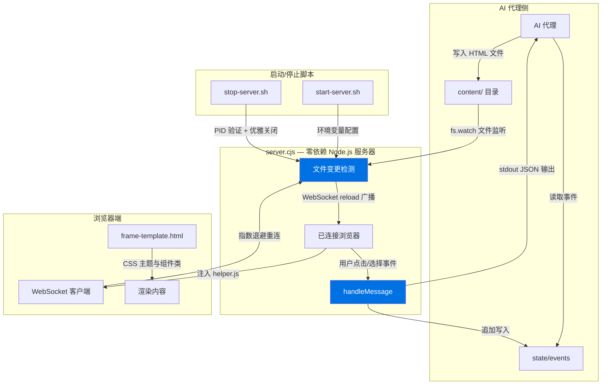
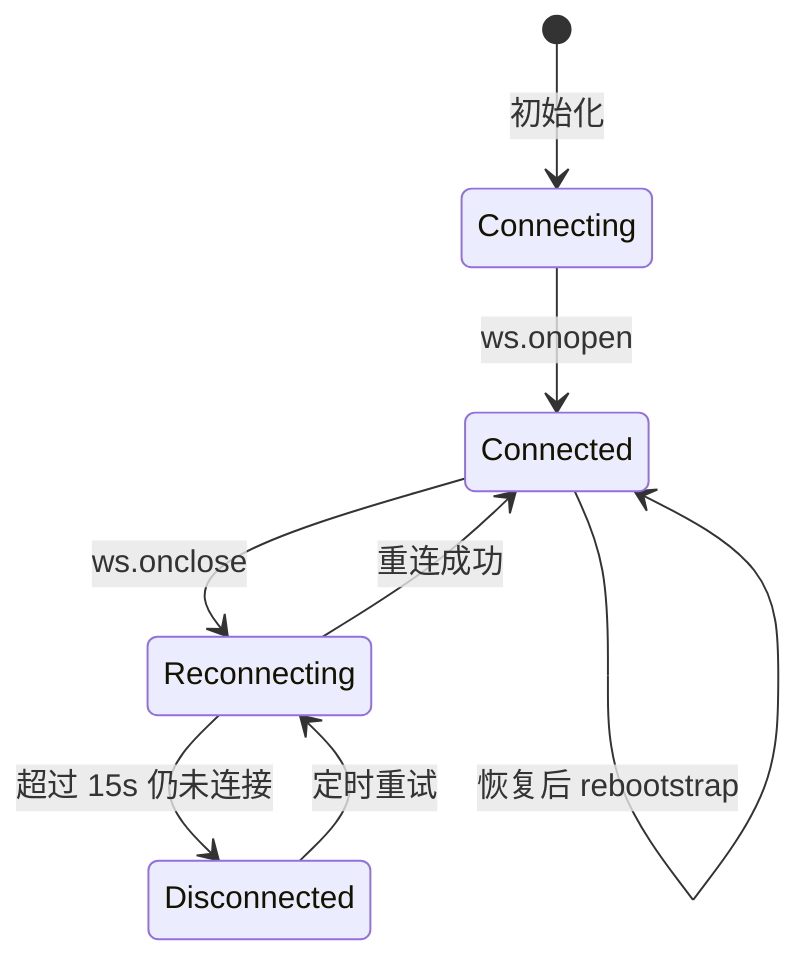
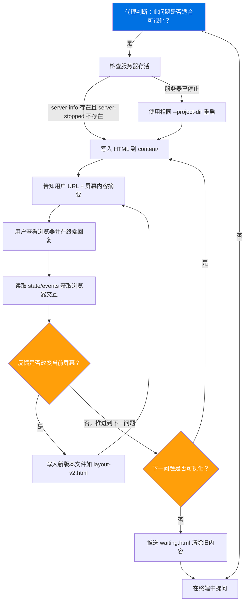
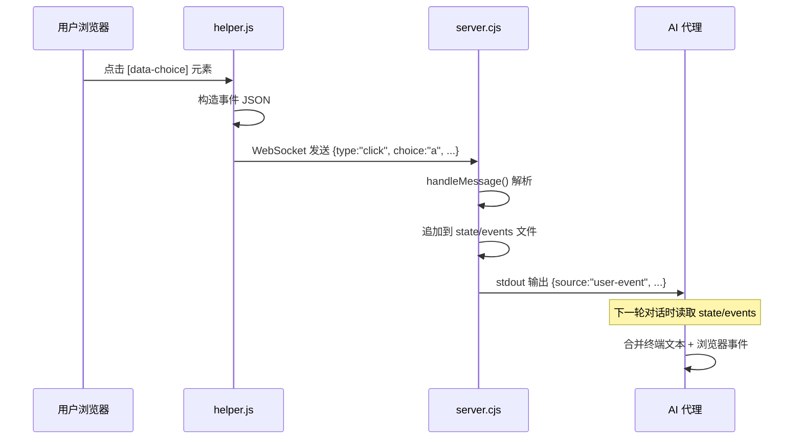

本文档深入解析 Superpowers 项目中可视化伴侣（Visual Companion）的架构设计与实现细节。该系统为头脑风暴阶段提供了一个浏览器端的实时协作界面，使 AI 代理能够向用户展示 UI 原型、架构图表与可视化选项，并通过 WebSocket 双向通信收集用户反馈。

---

## 系统定位与设计哲学

可视化伴侣并非一个独立的可视化平台，而是嵌入在 [头脑风暴技能](6-tou-nao-feng-bao-su-ge-la-di-shi-xie-zuo-she-ji) 工作流中的**按需工具**。其核心设计原则是**逐问题决策**（per-question decision）——即使在整个会话中启用了浏览器协作，每个具体问题仍需判断：用户是「看到它」更好，还是「读到它」更好。

**使用浏览器的场景**：UI 线框图、布局对比、架构图表、视觉风格选择等**内容本身即为视觉**的问题。

**使用终端的场景**：需求澄清、概念性 A/B/C 选择、权衡列表、技术决策等**答案为文字而非视觉偏好**的问题。

这一判断标准被精确表述为：**用户通过「看」是否比通过「读」更好地理解这个问题？**

Sources: [visual-companion.md](skills/brainstorming/visual-companion.md#L5-L24), [SKILL.md](skills/brainstorming/SKILL.md#L119-L140)

---

## 整体架构

系统由五个核心组件构成，形成一条从代理写入 HTML 到用户浏览器渲染、再到事件回传的完整数据流。



**关键架构决策**：服务器完全**零外部依赖**——WebSocket 协议（RFC 6455）由 `server.cjs` 手工实现，包括帧编码/解码、握手计算、Ping/Pong 处理。这消除了 `npm install` 步骤，使服务器可以在任何安装了 Node.js 的环境中直接运行。

Sources: [server.cjs](skills/brainstorming/scripts/server.cjs#L1-L90), [server.cjs](skills/brainstorming/scripts/server.cjs#L440-L510)

---

## 核心组件详解

### 服务器：server.cjs

`server.cjs` 是一个约 724 行的零依赖 Node.js 服务器，承担 HTTP 服务、WebSocket 协议处理、文件监听、安全认证与生命周期管理五大职责。

#### 通信协议栈

| 层级 | 实现 | 职责 |
|------|------|------|
| HTTP | `http.createServer` | 页面服务、静态文件分发、认证门控 |
| WebSocket | 手工 RFC 6455 实现 | 双向实时通信、事件中继、reload 广播 |
| 文件监听 | `fs.watch` + 防抖 | 检测新 HTML 文件，触发浏览器刷新 |
| 认证 | 会话密钥 + Cookie | 防止未授权访问与 DNS 重绑定攻击 |

#### 内容服务模式

服务器支持两种内容输入模式，根据 HTML 文件的首行内容自动判断：

- **内容片段**（Content Fragment）：不以 `<!DOCTYPE` 或 `<html` 开头的文件，自动包裹在 `frame-template.html` 提供的框架中——包括头部品牌标识、CSS 主题、连接状态指示器和所有交互基础设施。
- **完整文档**（Full Document）：以 `<!DOCTYPE` 或 `<html` 开头的文件，原样提供（仅注入 `helper.js` 脚本），适用于需要完全控制页面结构的场景。

无论哪种模式，`helper.js` 都会在 `</body>` 前注入，确保 WebSocket 连接、事件捕获和选择跟踪功能始终可用。

Sources: [server.cjs](skills/brainstorming/scripts/server.cjs#L400-L435)

#### 文件监听与新屏幕检测

服务器通过 `fs.watch` 监听 `content/` 目录。由于 macOS 的 `fs.watch` 对「新文件」和「文件覆盖」均报告 `rename` 事件，服务器维护一个 `knownFiles` 集合来区分两者：

- **新文件**（不在 `knownFiles` 中）：清除 `state/events` 文件，输出 `screen-added` 事件，可能触发浏览器自动打开。
- **已知文件更新**：输出 `screen-updated` 事件。

两种情况都会向所有已连接的浏览器广播 `{ type: 'reload' }` 消息。所有文件事件均经过 100ms 防抖处理。

Sources: [server.cjs](skills/brainstorming/scripts/server.cjs#L590-L630)

### 客户端：helper.js

`helper.js` 是一个约 168 行的浏览器端脚本，被服务器自动注入到每个页面的 `</body>` 前。它实现了 WebSocket 连接管理、事件捕获和用户交互跟踪。

#### 连接状态机



重连策略采用**指数退避**：初始延迟 500ms，每次翻倍，上限 30s。当断开连接超过 15 秒（`TOMBSTONE_AFTER_MS`），页面会显示一个全屏的「Companion paused」覆盖层，告知用户伴侣已暂停。

Sources: [helper.js](skills/brainstorming/scripts/helper.js#L1-L50), [helper.js](skills/brainstorming/scripts/helper.js#L60-L120)

#### 事件捕获机制

`helper.js` 自动捕获所有对 `[data-choice]` 元素的点击事件，并通过 WebSocket 发送结构化事件：

```json
{
  "type": "click",
  "text": "选项 A - 简洁布局",
  "choice": "a",
  "id": null,
  "timestamp": 1706000101
}
```

同时暴露 `window.brainstorm` API 供显式调用：`brainstorm.send(event)` 和 `brainstorm.choice(value, metadata)`。选择跟踪支持单选（默认）和多选（`data-multiselect` 属性）两种模式。

Sources: [helper.js](skills/brainstorming/scripts/helper.js#L120-L168)

### 框架模板：frame-template.html

`frame-template.html` 提供了一套完整的 CSS 设计系统，支持操作系统级别的亮/暗主题自动切换。

#### 可用的 CSS 组件类

| 类名 | 用途 | 典型场景 |
|------|------|----------|
| `.options` / `.option` | A/B/C 选项列表 | 概念选择、方案对比 |
| `.cards` / `.card` | 卡片网格布局 | 设计稿展示、视觉方案对比 |
| `.mockup` | 模拟容器（带标题栏） | UI 原型展示 |
| `.split` | 双栏并排对比 | 两个方案的视觉对比 |
| `.pros-cons` | 优缺点双栏 | 方案权衡分析 |
| `.mock-nav` / `.mock-sidebar` / `.mock-content` | 线框图元素 | 快速搭建页面骨架 |
| `.mock-button` / `.mock-input` / `.placeholder` | 表单与占位元素 | 交互元素模拟 |
| `.subtitle` / `.section` / `.label` | 排版辅助 | 内容层次组织 |

主题变量覆盖了背景色（三级）、文本色（三级）、边框色、强调色、成功/警告/错误色以及选中态样式，在 `@media (prefers-color-scheme: dark)` 中完整定义了暗色主题映射。

Sources: [frame-template.html](skills/brainstorming/scripts/frame-template.html#L1-L214)

---

## 安全架构

可视化伴侣运行在本地回环地址上，理论上可被同一台机器上的任何浏览器标签页访问。当绑定到非回环地址（远程/容器化环境）时，暴露面更大。系统通过多层安全机制应对这些威胁。

### 会话密钥认证

每次启动生成一个 32 字节的随机令牌（`crypto.randomBytes(32).toString('hex')`），作为 URL 查询参数 `?key=...` 传递给浏览器。认证逻辑支持两种凭证：

1. **查询参数** `?key=<token>`：首次加载时使用，触发 bootstrap 流程。
2. **HttpOnly Cookie** `brainstorm-key-<port>=<token>`：bootstrap 脚本将密钥存入 `sessionStorage` 后，通过 `Set-Cookie` 设置，后续请求和 WebSocket 连接自动携带。

所有密钥比较均使用 `crypto.timingSafeEqual` 进行**常量时间比较**，防止时序攻击。当查询参数中出现明确的错误密钥时，即使 Cookie 有效也会返回 403——防止 Cookie 回退绕过。

### Bootstrap 流程

携带有效 `?key=` 的首次请求不会直接返回屏幕内容，而是返回一个极简的 bootstrap 页面：将密钥存入 `sessionStorage`，然后通过 `location.replace('/')` 重定向到无参数的根路径。这确保密钥不会残留在浏览器地址栏或历史记录中。

### 安全响应头

所有响应（包括 403 页面）均附带以下安全头：

| 头部 | 值 | 防护目标 |
|------|-----|----------|
| `Referrer-Policy` | `no-referrer` | 防止 URL 中的密钥通过 Referer 泄露 |
| `Cache-Control` | `no-store` | 禁止缓存含密钥的页面 |
| `X-Frame-Options` | `DENY` | 防止点击劫持 |
| `Content-Security-Policy` | `frame-ancestors 'none'` | CSP 层面的框架嵌套禁止 |
| `Cross-Origin-Resource-Policy` | `same-origin` | 阻止跨域资源加载 |

### WebSocket 安全

WebSocket 升级请求同样需要通过密钥认证，并额外验证 `Origin` 头——确保连接来自同源页面，阻止跨域 localhost 注入攻击。

Sources: [server.cjs](skills/brainstorming/scripts/server.cjs#L310-L400), [auth.test.js](tests/brainstorm-server/auth.test.js#L1-L313)

---

## 生命周期管理

服务器的生命周期由三个机制共同保障：

### 所有者进程监控

启动时，`start-server.sh` 解析调用者（harness）的 PID 并通过 `BRAINSTORM_OWNER_PID` 环境变量传递给服务器。服务器每 60 秒（可配置）通过 `process.kill(ownerPid, 0)` 检测所有者进程是否存活。一旦所有者退出，服务器自动关闭。

在 Windows/MSYS2 环境下，由于 Node.js 无法验证来自 MSYS2 命名空间的 POSIX PID，该监控被自动禁用，转而依赖空闲超时作为唯一的关闭触发器。

### 空闲超时

默认 4 小时的空闲超时（`IDLE_TIMEOUT_MS`），可通过 `--idle-timeout-minutes` 参数调整。空闲定义为：无认证 HTTP 请求且无 WebSocket 消息。超时触发时，服务器会先销毁所有 WebSocket 连接（避免进程因活跃套接字而无法退出），然后优雅关闭。

### 端口持久化与重启恢复

使用 `--project-dir` 时，服务器将绑定的端口和令牌分别写入 `.last-port` 和 `.last-token` 文件。重启时优先读取这些文件，确保已打开的浏览器标签页可以通过相同的 URL 和 Cookie 自动重连。如果首选端口被占用（`EADDRINUSE`），服务器会回退到随机高端口一次，但不会持久化回退端口——避免覆盖另一个会话的配置。

Sources: [server.cjs](skills/brainstorming/scripts/server.cjs#L630-L724), [start-server.sh](skills/brainstorming/scripts/start-server.sh#L1-L210)

---

## 协作循环：代理交互流程

以下是代理在一次可视化协作中的完整交互循环：



**关键规则**：

1. **永不复用文件名**——每个屏幕都是新文件（`layout.html` → `layout-v2.html` → `layout-v3.html`），服务器按修改时间选择最新文件。
2. **每步都提醒 URL**——不仅仅是第一次，而是每次推送新屏幕时。
3. **终端消息为主，浏览器事件为辅**——用户的文字反馈是主要输入，`state/events` 提供结构化的交互数据（点击路径、最终选择）。
4. **返回终端时推送等待页面**——防止用户盯着已过时的视觉内容。

Sources: [visual-companion.md](skills/brainstorming/visual-companion.md#L26-L80)

---

## 平台适配策略

可视化伴侣需要在多种 AI 代理平台上运行，每个平台的后台进程管理策略不同：

| 平台 | 后台机制 | 启动方式 | 特殊处理 |
|------|----------|----------|----------|
| Claude Code | 脚本自行后台化 | 直接运行 `start-server.sh` | 默认模式即可 |
| Codex | 回收后台进程 | 检测 `CODEX_CI` 环境变量，自动切换前台模式 | 无需额外标志 |
| Gemini CLI | 需要 `is_background: true` | `--foreground` + 工具的后台执行标志 | 进程跨轮次存活 |
| Copilot CLI | 需要 `mode: "async"` | `--foreground` + 异步 bash 工具 | 捕获 `shellId` 用于后续交互 |
| Windows | 回收 nohup 后台进程 | 自动检测并切换前台模式 | 使用 `run_in_background: true` |

`start-server.sh` 通过 `is_windows_like_shell()` 函数检测 MSYS2/Cygwin/MinGW 环境，自动启用前台模式并清除 `BRAINSTORM_OWNER_PID`（因为跨命名空间 PID 不可验证）。

Sources: [start-server.sh](skills/brainstorming/scripts/start-server.sh#L80-L115), [visual-companion.md](skills/brainstorming/visual-companion.md#L48-L78)

---

## 事件数据流

用户在浏览器中的交互通过以下路径回传给代理：



`state/events` 文件采用 JSONL 格式（每行一个 JSON 对象），在推送新屏幕时自动清除。事件流记录了用户的完整探索路径——他们可能在最终选择前点击多个选项，这种犹豫模式本身也是有价值的反馈信号。

Sources: [server.cjs](skills/brainstorming/scripts/server.cjs#L510-L530), [visual-companion.md](skills/brainstorming/visual-companion.md#L240-L260)

---

## 测试体系

可视化伴侣拥有覆盖全部核心组件的测试套件，共 9 个测试文件：

| 测试文件 | 测试目标 | 测试类型 |
|----------|----------|----------|
| `ws-protocol.test.js` | WebSocket 帧编码/解码、握手计算 | 单元测试 |
| `helper.test.js` | 浏览器客户端：退避重连、状态机、tombstone | 单元 + 模拟 DOM |
| `browser-launcher.test.js` | 跨平台浏览器启动器安全性 | 单元测试 |
| `auth.test.js` | 会话密钥认证、安全头、bootstrap 流程 | 集成测试 |
| `branding.test.js` | 品牌标识、版本显示、遥测控制 | 集成测试 |
| `server.test.js` | HTTP 服务、WebSocket 中继、文件监听 | 集成测试 |
| `lifecycle.test.js` | 空闲超时、优雅关闭、端口持久化 | 集成测试 |
| `start-server.test.sh` | Shell 脚本平台检测、参数传递 | Shell 测试 |
| `stop-server.test.sh` | PID 验证、优雅/强制终止 | Shell 测试 |

`helper.test.js` 的测试方法尤为精巧：由于 `helper.js` 是浏览器代码，测试通过 `new Function()` 在 CommonJS 沙箱中执行源码——当 `window` 不存在时仅导出纯函数（如 `nextReconnectDelay`），而完整的浏览器行为测试则通过构造模拟的 DOM、WebSocket、Timer 和 Clock 环境来驱动。

Sources: [package.json](tests/brainstorm-server/package.json#L1-L11), [helper.test.js](tests/brainstorm-server/helper.test.js#L1-L198), [ws-protocol.test.js](tests/brainstorm-server/ws-protocol.test.js#L1-L408)

---

## 会话清理

会话结束时，通过 `stop-server.sh` 执行清理：

```bash
scripts/stop-server.sh $SESSION_DIR
```

停止脚本会验证 PID 文件中的进程确实是本次会话的服务器（通过 `--brainstorm-server-id` 参数匹配），防止向 PID 回收后的无关进程发送信号。清理行为取决于会话目录的位置：

- **`/tmp` 下的临时会话**：完全删除目录。
- **`.superpowers/brainstorm/` 下的持久会话**：仅停止服务器，保留 HTML 文件供后续参考。

Sources: [stop-server.sh](skills/brainstorming/scripts/stop-server.sh#L1-L121), [visual-companion.md](skills/brainstorming/visual-companion.md#L280-L290)

---

## 继续阅读

本页覆盖了可视化伴侣的完整技术架构。建议按以下顺序继续探索：

1. **上游流程**：理解可视化伴侣在头脑风暴中的触发时机 → [头脑风暴：苏格拉底式协作设计](6-tou-nao-feng-bao-su-ge-la-di-shi-xie-zuo-she-ji)
2. **下游流程**：设计确认后如何转化为实施计划 → [编写实现计划：零上下文工程师指南](7-bian-xie-shi-xian-ji-hua-ling-shang-xia-wen-gong-cheng-shi-zhi-nan)
3. **平台适配全景**：理解跨平台架构的三层模型 → [跨平台架构：技能、工具映射与引导注入三层模型](18-kua-ping-tai-jia-gou-ji-neng-gong-ju-ying-she-yu-yin-dao-zhu-ru-san-ceng-mo-xing)
4. **引导注入细节**：理解 `session-start` hook 如何注入技能上下文 → [引导注入机制：SessionStart Hook 与消息变换](19-yin-dao-zhu-ru-ji-zhi-sessionstart-hook-yu-xiao-xi-bian-huan)