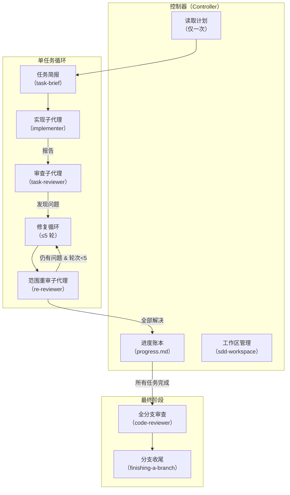
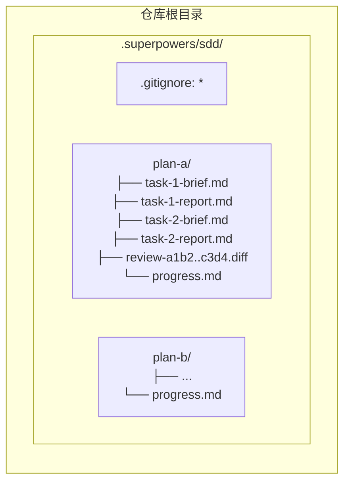
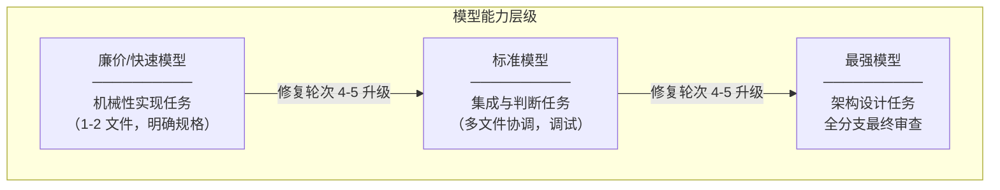
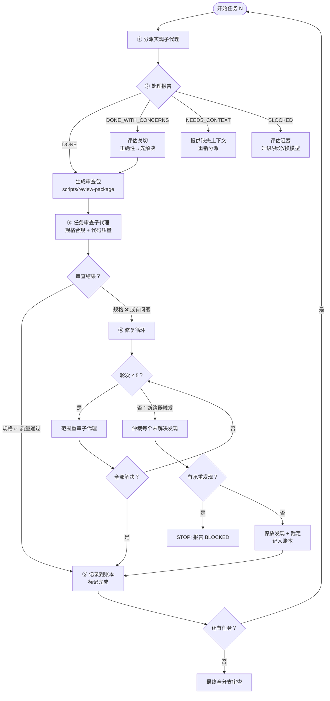
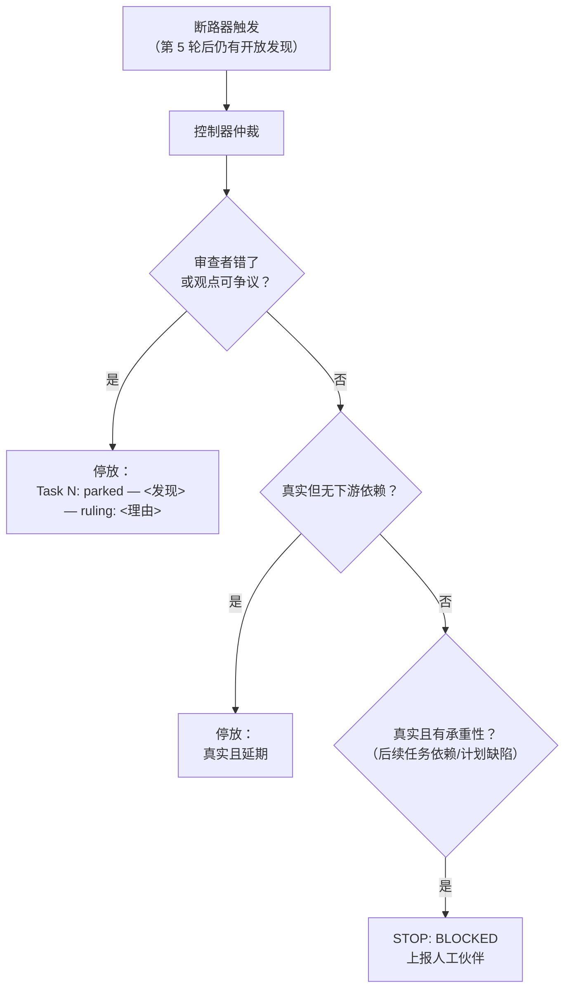
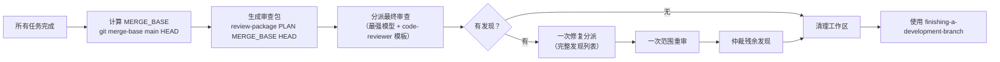
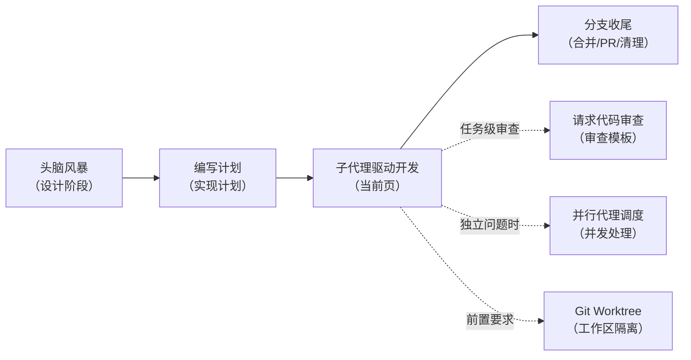

子代理驱动开发（Subagent-Driven Development, SDD）是 Superpowers 技能体系中的核心执行引擎。它将实现计划分解为独立任务，为每个任务分派一个上下文隔离的子代理实现者，随后通过独立的审查子代理进行**规格合规性**与**代码质量**的双重门控，并在发现问题时进入最多五轮的修复循环。整个流程由控制器（controller）协调，控制器自身不执行任何实现代码，仅负责上下文构造、状态追踪与决策仲裁。

Sources: [SKILL.md](skills/subagent-driven-development/SKILL.md#L1-L18)

## 架构总览

SDD 的设计遵循一个核心原则：**每个任务一个全新子代理 + 任务级审查（规格 + 质量）+ 最终全分支审查 = 高质量、快速迭代**。控制器与会话历史隔离——它精确构造每个子代理所需的上下文，而非将会话上下文直接传递。



Sources: [SKILL.md](skills/subagent-driven-development/SKILL.md#L6-L12), [SKILL.md](skills/subagent-driven-development/SKILL.md#L47-L107)

## 适用场景判定

SDD 并非万能工具。其触发条件由三个决策维度确定：是否拥有实现计划、任务是否大部分独立、是否在同一会话中执行。

| 条件 | 选择 SDD | 选择其他技能 |
|------|----------|-------------|
| 有实现计划 + 任务独立 + 同会话 | ✅ **SDD** | — |
| 有实现计划 + 任务独立 + 跨会话 | — | [计划执行](10-ji-hua-zhi-xing-pi-liang-ren-wu-yu-ren-gong-jian-cha-dian) |
| 有实现计划 + 任务紧耦合 | — | 手动执行或先头脑风暴 |
| 无实现计划 | — | [头脑风暴](6-tou-nao-feng-bao-su-ge-la-di-shi-xie-zuo-she-ji) 先行 |

与「计划执行」技能的关键区别在于：SDD 在同一会话内运行（无上下文切换），每个任务使用全新子代理（无上下文污染），任务间无需人工确认即可连续执行。

Sources: [SKILL.md](skills/subagent-driven-development/SKILL.md#L19-L43)

## 文件结构与工具链

SDD 技能由三类文件组成：主技能定义、三个提示词模板、三个辅助脚本。

```
skills/subagent-driven-development/
├── SKILL.md                  # 主技能定义：流程、规则、模型选择
├── implementer-prompt.md     # 实现子代理提示词模板
├── task-reviewer-prompt.md   # 任务审查子代理提示词模板
├── re-review-prompt.md       # 范围重审子代理提示词模板
└── scripts/
    ├── sdd-workspace         # 解析并创建计划专属工作区目录
    ├── task-brief            # 从计划中提取单个任务的完整文本
    └── review-package        # 生成审查包（提交列表 + diff + 统计）
```

### 工作区隔离机制

每个计划拥有独立的工作区目录 `<repo-root>/.superpowers/sdd/<plan-basename>/`，存放该计划的全部临时制品：任务简报、实现报告、审查包和进度账本。工作区通过自忽略的 `.gitignore`（内容为 `*`）从 `git status` 中隐藏，避免被意外提交。



三个脚本的职责边界清晰：

| 脚本 | 输入 | 输出 | 关键约束 |
|------|------|------|---------|
| `sdd-workspace PLAN_FILE` | 计划文件路径 | 工作区绝对路径 | 每个计划一个目录，自动创建 `.gitignore` |
| `task-brief PLAN_FILE N` | 计划文件 + 任务编号 | 任务简报文件路径 | 用 awk 提取 `# Task N` 标题下的完整文本 |
| `review-package PLAN_FILE BASE HEAD` | 计划文件 + 提交范围 | diff 文件路径 | 包含 `git log --oneline`、`git diff --stat`、`git diff -U10` |

Sources: [sdd-workspace](skills/subagent-driven-development/scripts/sdd-workspace#L1-L41), [task-brief](skills/subagent-driven-development/scripts/task-brief#L1-L42), [review-package](skills/subagent-driven-development/scripts/review-package#L1-L47)

## 模型选择策略

SDD 采用分层模型选择机制，以成本效率为导向：**使用能胜任各角色的最低能力模型**。



关键规则：

- **分派子代理时必须显式指定模型**——省略模型会继承会话默认模型（通常是最昂贵的），静默地破坏成本优化
- **轮次计数优先于 token 单价**：最廉价模型在多步骤任务上通常需要 2-3 倍的轮次，总成本反而更高。审查者和基于散文描述的实现者，以中档模型为底线
- **当计划文本包含要编写的完整代码时**，实现退化为转录加测试，此时使用最廉价层级

| 任务复杂度信号 | 模型选择 |
|---------------|---------|
| 涉及 1-2 个文件，规格完整 | 廉价模型 |
| 涉及多文件，有集成关注点 | 标准模型 |
| 需要设计判断或广泛的代码库理解 | 最强模型 |
| 小修复 diff 的范围重审 | 廉价至中档 |
| 修复循环第 4-5 轮 | 至少比卡住的实现者高一档 |

Sources: [SKILL.md](skills/subagent-driven-development/SKILL.md#L157-L193)

## 任务循环：五步核心流程

任务循环是 SDD 的心脏。每个任务经历五个阶段：分派实现者 → 处理报告 → 审查任务 → 修复循环 → 完成任务。



Sources: [SKILL.md](skills/subagent-driven-development/SKILL.md#L194-L389)

### 第一步：分派实现子代理

分派前，控制器记录 `BASE`（`git rev-parse HEAD`），供后续审查包和修复 diff 使用。然后通过 `scripts/task-brief PLAN_FILE N` 提取任务简报文件。

分派提示词的构造遵循**最小上下文原则**：

1. **一行项目定位**：此任务在项目中的位置
2. **简报文件路径**：作为需求的唯一来源，标注为"先读这个——这是你的需求"
3. **前序任务的接口与决策**：任务简报无法知晓的跨任务信息
4. **歧义消解**：控制器在简报中发现的任何歧义的解决方案
5. **报告文件路径与报告契约**

**绝对禁止**：将累积的前序任务摘要粘贴到后续分派中。一个真实会话的分派曾达到 42k 字符，其中 99% 是粘贴的历史。全新子代理只需要它的任务、它触及的接口和全局约束。

Sources: [SKILL.md](skills/subagent-driven-development/SKILL.md#L200-L232), [implementer-prompt.md](skills/subagent-driven-development/implementer-prompt.md#L1-L143)

### 第二步：处理四种报告状态

实现子代理返回四种状态之一，控制器必须按规则处理：

| 状态 | 含义 | 控制器动作 |
|------|------|-----------|
| **DONE** | 任务完成 | 生成审查包，分派任务审查 |
| **DONE_WITH_CONCERNS** | 完成但有疑虑 | 先评估关切：正确性/范围问题→先解决再审查；观察性关切→记录后继续 |
| **NEEDS_CONTEXT** | 缺少信息 | 提供缺失上下文，重新分派 |
| **BLOCKED** | 无法完成 | 按层级处理：上下文问题→补充上下文；推理不足→更强模型；任务过大→拆分；计划错误→上报人工 |

**铁律**：永远不要忽略升级或在无变更的情况下强制同一模型重试。

Sources: [SKILL.md](skills/subagent-driven-development/SKILL.md#L234-L254)

### 第三步：任务审查（双重门控）

任务审查是**任务级门控**，而非合并审查。审查子代理接收三个文件路径——任务简报、实现报告和审查包——以及约束该任务的全局约束。

审查分为两个不可分割的部分：

**Part 1: 规格合规性**
- **缺失**：跳过的、遗漏的、声称已实现但实际未实现的需求
- **多余**：未被要求的功能、过度工程、不需要的"锦上添花"
- **误解**：正确的功能用错误的方式构建，解决了错误的问题

**Part 2: 代码质量**
- 关注点分离、错误处理、DRY 而不 premature abstraction
- 测试验证真实行为而非 mock
- 文件结构是否符合计划定义
- 是否创建了已经很大的新文件，或显著增长了现有文件

审查子代理的核心态度是**"不要信任报告"**——将实现者的报告视为关于代码的未验证声明。设计理由（"按 YAGNI 保留"、"故意保持简单"）也是实现者给自己的评分，不能降低发现的严重性。

**关键约束**：
- 永远不要在控制器自己的上下文中粘贴 diff——通过文件传递
- 永远不要指示审查者"不要标记"某个问题——这是预判
- 审查者的"⚠️ 无法从 diff 验证"项目不阻塞审查，但控制器必须在标记任务完成前自行解决

Sources: [SKILL.md](skills/subagent-driven-development/SKILL.md#L256-L300), [task-reviewer-prompt.md](skills/subagent-driven-development/task-reviewer-prompt.md#L1-L186)

### 第四步：修复循环

修复循环在以下条件触发：规格审查 ❌、任何 Critical 或 Important 发现、或控制器确认为真实缺口的 ⚠️ 项目。

**循环前的两条快速退出路径**：
- **Minor 发现**：直接记入进度账本（`Task N: minor (deferred): <一行描述>`），由最终全分支审查分流。Minor 发现永远不进入循环。
- **计划强制的发现**：与计划文本要求冲突的发现，呈现给人工伙伴决定哪个优先。

**循环内的升级策略**：

| 轮次 | 策略 | 原理 |
|------|------|------|
| 1-3 | **恢复原始实现者**：发送未解决的发现原文 | 它的上下文完好：知道任务、代码和自身选择 |
| 4-5 | **分派全新实现者 + 更强模型** | 三轮后仍未解决通常意味着实现者看不到自身问题——需要新鲜视角和能力提升 |

每一轮，实现者修复、重新运行覆盖修改代码的测试、将修复报告追加到同一报告文件。重新分派审查前，确认修复报告包含：覆盖测试、运行命令和输出。

**重审是范围限定的**：使用 `scripts/review-package PLAN_FILE FIX_BASE HEAD`（FIX_BASE 是上一次审查看到的 HEAD），仅验证发现列表中的项目和修复 diff 中的新破坏。

Sources: [SKILL.md](skills/subagent-driven-development/SKILL.md#L302-L376), [re-review-prompt.md](skills/subagent-driven-development/re-review-prompt.md#L1-L107)

### 断路器与仲裁

当第 5 轮重审仍有未解决的发现时，**停止分派**。控制器自行仲裁每个未解决的发现：



**仲裁铁律**：
- 仅在断路器触发时仲裁——提前仲裁是以不同名义的预判
- 每次仲裁都是账本条目——**静默丢弃是被禁止的**
- 停放承重性失败会让每个依赖任务在其上构建，最终审查也无法修复

Sources: [SKILL.md](skills/subagent-driven-development/SKILL.md#L358-L389)

## 进度账本：对抗上下文压缩的生命线

会话记忆在上下文压缩（compaction）后不会存活。在真实会话中，丢失位置的控制器曾重新分派了整个已完成的任务序列——这是观察到的**最高成本失败**。

账本文件 `<workspace>/progress.md` 是恢复地图：

```markdown
# SDD ledger — plan: docs/superpowers/plans/feature-plan.md
Task 1: complete (commits a1b2c3d..d4e5f6a, review clean)
Task 2: fix round 1/5 (2 addressed, 0 open; commits d4e5f6a..b7c8d9e)
Task 2: complete (commits d4e5f6a..b7c8d9e, review clean)
Task 3: minor (deferred): progress indicator could use color
```

**恢复规则**：
- 账本第一行命名当前计划文件 → 有 `Task N: complete` 行的任务已完成，从第一个未完成任务恢复
- 最后一行是修复轮次的任务处于循环中 → 从下一轮恢复
- 账本第一行命名不同计划文件 → 这是另一个计划的进度，启动自己的新账本
- 压缩后，信任账本和 `git log` 而非自己的记忆

Sources: [SKILL.md](skills/subagent-driven-development/SKILL.md#L110-L155)

## 最终全分支审查

所有任务完成后，执行一次全分支审查。这是整个流程中唯一需要最强模型的环节。



**关键约束**：
- 最终审查返回发现时，分派**一个**修复子代理携带完整发现列表——不是每个发现一个修复者。真实会话中，按发现分派的修复波成本超过了所有任务的总和。
- 然后执行**恰好一次**范围重审。没有第二波修复——残余的承重性发现在分支收尾时呈现给人工。
- 将账本中的延期 Minor 和停放行指向最终审查者，供其分流哪些必须在合并前修复。

Sources: [SKILL.md](skills/subagent-driven-development/SKILL.md#L391-L424)

## 常见合理化借口与现实

SDD 技能文档显式列出了控制器可能用来跳过流程步骤的借口及其现实：

| 借口 | 现实 |
|------|------|
| "规格合规性差不多了" | 审查者发现规格缺口 = 未完成。修复或触发断路器后仲裁——只有这两条出口。 |
| "我自己修吧，分派太麻烦" | 控制器修复污染你的上下文且跳过审查。恢复实现者。 |
| "再来一轮就会收敛" | 过了断路器，轮次不会收敛——失败是结构性的。仲裁并路由。 |
| "审查者总会找到新问题" | 范围重审验证修复；它们不会漫游。未触及代码的新发现记入账本，不进入循环。 |
| "这个发现明显错了，我跳过" | 你仅在断路器触发时仲裁，且每次裁定都是账本条目。 |
| "修复很小，跳过重审" | 未审查的修复是回归着陆的方式。每轮以范围重审结束。 |
| "账本记录太麻烦" | 账本是压缩后存活的东西。没有账本的控制器重新分派了整个已完成的任务序列。 |

Sources: [SKILL.md](skills/subagent-driven-development/SKILL.md#L425-L436)

## 完整工作流示例

以下展示了一个两任务计划从启动到收尾的完整执行轨迹：

```
控制器：我正在使用子代理驱动开发来执行此计划。

[设置：验证 worktree]
[读取计划文件一次：docs/superpowers/plans/feature-plan.md]
[解析工作区：scripts/sdd-workspace → .superpowers/sdd/feature-plan/]
[为所有任务创建 todo]

任务 1：Hook 安装脚本

[运行 task-brief；分派实现者 + 简报路径 + 报告路径 + 上下文]
实现者："开始之前——hook 应该安装在用户级还是系统级？"
控制器："用户级（~/.config/superpowers/hooks/）"
实现者：已实现 install-hook 命令，5/5 测试通过，自审发现遗漏 --force 标志并补充，已提交。

[运行 review-package；分派任务审查者]
审查者：规格 ✅ 全部需求满足，无多余。质量：Approved。

[账本：Task 1: complete (commits a1b2c3d..d4e5f6a, review clean)]

任务 2：恢复模式

[运行 task-brief；分派实现者]
实现者：已添加 verify/repair 模式，8/8 测试通过，已提交。

[运行 review-package；分派任务审查者]
审查者：规格 ❌ 缺失进度报告（规格要求"每 100 项报告"）。
         问题（Important）：魔术数字（100）。

[修复轮次 1：恢复实现者，发送两个发现]
实现者：已添加进度报告，提取 PROGRESS_INTERVAL 常量。
        重新运行 test/recovery.test.js — 10/10 通过。

[运行 review-package FIX_BASE HEAD；分派范围重审]
重审者：缺失进度报告 — ADDRESSED。魔术数字 — ADDRESSED。新破坏：无。
        裁定：全部发现已解决。

[账本：Task 2: fix round 1/5 (2 addressed, 0 open)]
[账本：Task 2: complete (commits d4e5f6a..b7c8d9e, review clean)]

...

[所有任务完成后]
[运行 review-package PLAN MERGE_BASE HEAD；分派最终审查者（最强模型）]
最终审查者：所有需求满足。延期 Minor 分流：无阻塞合并项。

[删除此计划的工作区]

完成！使用 finishing-a-development-branch 技能。
```

Sources: [SKILL.md](skills/subagent-driven-development/SKILL.md#L438-L503)

## 与其他技能的关系

SDD 处于技能链的中间位置，上游接收计划，下游交付分支：



SDD 与并行代理调度的关键区别：SDD **永不并行分派多个实现子代理**（会产生冲突），而并行调度用于独立问题域的并发处理。

Sources: [SKILL.md](skills/subagent-driven-development/SKILL.md#L230-L231), [dispatching-parallel-agents/SKILL.md](skills/dispatching-parallel-agents/SKILL.md#L1-L168)

## 下一步阅读

- **上游**：[编写实现计划：零上下文工程师指南](7-bian-xie-shi-xian-ji-hua-ling-shang-xia-wen-gong-cheng-shi-zhi-nan) — 理解 SDD 消费的输入
- **并行替代**：[并行代理调度：独立问题域的并发处理](11-bing-xing-dai-li-diao-du-du-li-wen-ti-yu-de-bing-fa-chu-li) — 当问题域真正独立时的并发方案
- **下游**：[开发分支收尾：合并、PR 与清理决策流](17-kai-fa-fen-zhi-shou-wei-he-bing-pr-yu-qing-li-jue-ce-liu) — SDD 完成后的集成路径
- **质量保障**：[测试驱动开发：RED-GREEN-REFACTOR 铁律](12-ce-shi-qu-dong-kai-fa-red-green-refactor-tie-lu) — 实现者子代理内部遵循的测试方法论